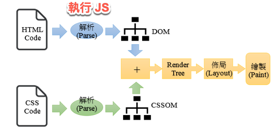
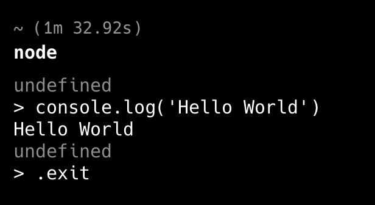
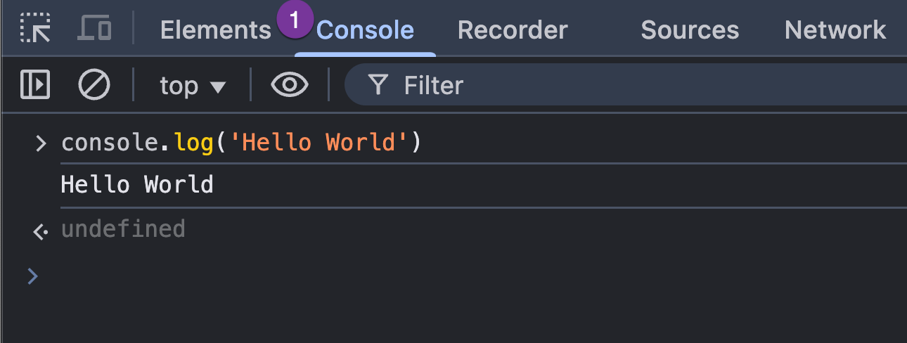

---
export_on_save:
  html: true
puppeteer: 
    displayHeaderFooter: true
    margin:
      top: '15mm'
      bottom: '15mm'
---

# Ch1 認識 JavaScript

## JavaScript 特色與用途

### 特色 

- 直譯式 (Interpret) 的描述語言
- 跨平台、物件導向、輕量
- 主要應用於 Web 開發, 製作動態網頁
  - 也可用於後端開發 (Node.js)
- 採用 ECMAScript 標準 (如 ES5、ES6、ES9)

### 用途

- 操作 HTML DOM
- 開發網頁遊戲
- HTML5 前端資料儲存
- Node.js 後端開發


## 設置 JavaScript 開發環境

## JavaScript 運行環境

- 瀏覽器：在 Browser 中執行(用戶端)
- Node.js：讓 JavaScript 也能在後端 (伺服器端) 執行

### 核心組成

- **ECMAScript**：定義語法、流程控制、物件、函數、錯誤處理
- **DOM API**：操作網頁文件結構與內容、事件處理
- **WEB API**：操作瀏覽器功能, 如網路請求、計時器、地理位置、用戶端儲存

### JavaScript 在用戶端執行

1. HTML 與 CSS 交給渲染引擎處理
2. HTML 解析並建構 DOM 樹
3. CSS 解析並建構 CSSOM 樹
4. 組合成渲染樹 (Render Tree)
5. 透過 Layout() 方法安排版面
6. Paint() 方法繪製網頁



### JavaScript 在後端執行

- **Node.js** 採用 Google V8 引擎
- 官方網站: [Node.js](https://nodejs.org/en/)
- LTS (Long Term Support) 版本較穩定
- 提供 REPL 交互式開發環境
  - REPL: Read-Eval-Print Loop


### REPL 交互式開發環境

1. 在 CMD 輸入 `node` 進入 REPL
2. 輸入 `console.log("Hello World")`
3. 退出方式：
   - `Ctrl+D`
   - 輸入 `.exit`




## 瀏覽器主控台 Console

- 在用戶端執行 JavaScript, 不需要安裝 Node.js
- 瀏覽器開發工具 `Console`
- 可用於 Debug 與測試 JavaScript
- **開啟方式**:
  - Chrome: `F12` 開啟 DevTools
  - `console.log("測試輸出")`




## Console 常用方法

### 基本輸出

- 一般訊息
```
console.log("一般訊息");
```
- 錯誤訊息 `console.error()`
```
console.error("錯誤訊息");
```
- 警告訊息 `console.warn()`
```
console.warn("警告訊息");
```

### 清除輸出

- 清除輸出 `console.clear()`
```
console.clear();
```


## 設置開發環境

### 安裝 Node.js、VSCode 和 Quokka.js 插件

Node.js 是一個 JavaScript 運行時，允許您在瀏覽器外運行 JavaScript 代碼。
- 下載並安裝 [Node.js](https://nodejs.org/en/)

Visual Studio Code (VSCode) 是目前最受歡迎的代碼編輯器之一。
- 下載並安裝 [Visual Studio Code (VSCode) for windows](https://code.visualstudio.com/download)

Quokka.js 是一個 VSCode 插件，允許輸入 JavaScript 代碼時立即查看結果。


### 在 VSCode 中安裝 Quokka.js 擴展

在 VSCode Extensions 中搜索 Quokka.js 並安裝它


### 使用 Quokka 查看執行結果

Quokka 快捷鍵：
* Cmd/Ctrl+K,Q：在現有文件上啟動/重啟 Quokka。
* Cmd/Ctrl+K,J：打開一個新的 Quokka JavaScript 文件。


啟動 Quokka 以在輸入 JavaScript 代碼時立即查看結果。


`console.log` 的輸出顯示在該行的右側， 圖中的藍色字。

## 將 JavaScript 添加到網頁

### 加入 JavaScript 到 HTML 的三種方式

有三種方式將 JavaScript 添加到網頁：

1. 行內(Inline) JavaScript：將 JavaScript 代碼直接添加到 HTML 元素的屬性中。
2. 內部（直接）JavaScript：在 HTML 文件中的 `<script>` 標籤內添加 JavaScript 代碼。
3. 外部 JavaScript：將 JavaScript 代碼寫在外部木檔案，再將其鏈接到 HTML 文件。


### 何時使用哪一種方式？（決策思考）

####  行內 (Inline) JavaScript

**適合情境：**
- 非常簡單、一次性的事件處理（例如教學初期示範按鈕點擊）。
- 快速測試某個小功能。

```js
<button onclick="alert('Hello World!')">Click me</button>
```
**不建議使用的原因：**

- 將 HTML 結構與 JavaScript 行為混在一起，違反「結構與行為分離」原則。
- 不易維護與除錯。
- 不利於團隊合作與程式重用。


####  內部 (Internal) JavaScript

**適合情境：**

- 單一頁面的小型專案。
- 範例教學、練習題。
- 需要快速撰寫並測試多行 JavaScript 程式碼。

**優點：**

- 程式碼集中在同一個 HTML 檔案，方便教學與理解。
- 比 Inline 更清楚區分 HTML 與 JavaScript。

**限制：**
- 無法在多個頁面之間重用程式碼。
- 當程式變大時，HTML 檔案會變得冗長。

```js
<html>
  <head>
    <title>Hello World</title>
  </head>
  <body>

    <script>
      alert('Hello World!');
    </script>

    <h1>Hello World</h1>
    <p>Welcome to my first web page!</p>

    <script>
      alert('Hello World! 2');
    </script>
  </body>
</html>
```


#### 3️⃣ 外部 (External) JavaScript

**適合情境：**
- 真實專案開發。
- 多頁面網站。
- 需要模組化與重複使用程式碼。

**優點：**
- HTML 與 JavaScript 完全分離（結構 vs 行為）。
- 可重用、可維護、可測試。
- 有利於版本控制與團隊開發。
- 瀏覽器可快取 (cache) JS 檔案，提高效能。

**可能缺點：**
- 需要管理檔案路徑。
- 初學者可能不熟悉專案結構。

```html
<html>
  <head>
    <title>Hello World</title>
  </head>
  <body>
    <h1>Hello World</h1>
    <p>Welcome to my first web page!</p>

    <script src="your_script.js"></script>
  </body>
</html>
```


### 簡單決策原則

| 情境 | 建議方式 |
|------|----------|
| 示範單一按鈕事件 | Inline（僅示範） |
| 單頁小練習 | Internal |
| 多頁網站 / 真實專案 | ✅ External |


## JavaScript 執行順序

- JavaScript 代碼的執行順序是從上到下。
- 瀏覽器在遇到 `<script>` 標籤時執行 JavaScript 代碼。
- `alert()` 是一個函數, 用對話框顯示訊息。
- 當頁面載入時，瀏覽器會顯示帶有 "Hello World!" 消息的對話框。
    - 然後，它會渲染頁面的 HTML 內容。
    - 之後, 會再次顯示帶有 "Hello World! 2" 訊息的對話框。

```html
<!DOCTYPE html>
<html>
  <head>
    <title>Hello World</title>
  </head>
  <body>

    <script>
      alert('Hello World!');
    </script>

    <h1>Hello World</h1>
    <p>Welcome to my first web page!</p>

    <script>
      alert('Hello World! 2');
    </script>
  </body>
</html>
```


## 控制瀏覽器何時提取和執行 JavaScript 代碼 (進階閱讀)

### 為何要控制

- JavaScript 代碼執行時會阻止頁面渲染，導致用戶需要等待 JavaScript 加載和執行完成後才能看到頁面內容。
- 如果 JavaScript 代碼很大或網路慢，使用者會一直看到空白頁面，直到 JavaScript 加載完成。
- 這會影響用戶的體驗，增加跳出率。
- 可控制執行時機，使得用戶先看到頁面內容，並在背景加載 JavaScript，優化頁面加載速度和改善用戶體驗。

### 如何控制

使用 `<script>` 標籤中的 `defer` 和 `async` 屬性來控制瀏覽器何時提取和執行 JavaScript 代碼。


圖中：

- Green: 渲染 HTML（HTML 解析器 parser）
- Red: JavaScript 代碼的抓取 (fetch)
- Blue: 執行 JavaScript 代碼(execution)

控制的方式

`<script>`: 預設情況下，會阻止頁面的渲染，直到抓取並執行 JavaScript 完成後，再繼續渲染 HTML 內容。

`<script defer>`：瀏覽器在渲染 HTML 內容時同時抓取 JavaScript 代碼。但它在 HTML 內容渲染完成後再執行 JavaScript code。
  - 簡單說，JS 在 HTML 內容渲染完成後才執行。

`<script async>`：瀏覽器在渲染 HTML 內容時同時抓取 JavaScript 代碼。抓取完成，中斷 HTML 內容渲染，立即執行 JavaScript code (非同步執行), 之後再繼續渲染 HTML 內容。
後立即執行 JavaScript code，之後再繼續解析 HTML 內容。

`<script type="module">`: 
  - module 是 ES6 引入的 JavaScript 模組系統，允許開發者將 JavaScript 代碼分割成多個文件，並在需要時進行導入和使用。
  - 使用 `<script type="module">` 會一次抓取多個模組，並在所有模組都抓取完成後才執行 JS 代碼。

`<script type="module" async>`: 
  - 結合了 module 和 async 的特性，會一次抓取多個模組，並在所有模組都抓取完成後立即執行 JS 代碼。
  - 與 `<script async>` 類似，JS 抓取完成後立即執行。


## 引用外部 JavaScript 文件的細節

使用 `<script>` 標籤的 `src` 屬性來鏈接外部 JavaScript 文件到 HTML 文件。

```html
<script type="text/javascript" src="your_script.js"></script>
```

注意:
- 檔案名稱區分大小寫。
- 指定文件的相對或絕對路徑。

Example: 
- [Code Samples](https://github.com/PacktPublishing/JavaScript-from-Beginner-to-Professional/tree/main/Chapter%2001/Code%20Samples)


## Lab 1

[Lab_01_01](lecture_notes/ch1/lab_01_01.md)

## 總結

- JavaScript 可以用於前端 (瀏覽器) 和後端 (Node.js)的程式語言
- 可以在 瀏覽器 Console 中執行 JavaScript 代碼
- 可以在 Node.js REPL 中執行 JavaScript 代碼
- 三種方式將 JavaScript 添加到網頁：內部(internal)、外部(external)、行內(inline)


## 複習問題

### 一、觀念理解與比較

1.	為什麼在真實專案中通常不建議使用 Inline JavaScript？請從「維護性」與「結構分離」的角度說明。
2.	Internal JavaScript 與 External JavaScript 在「可重用性」上的差異為何？在什麼情境下這個差異會變得重要？
3.	如果一個網站只有單一頁面且功能簡單，你會選擇哪一種方式加入 JavaScript？為什麼？
4.	如果是一個包含 10 個頁面的公司形象網站，你會選擇哪一種方式？請說明理由。


### 二、執行時機與效能思考

5.	為什麼預設的 `<script>` 會阻塞 (block) HTML 解析？這對使用者體驗有什麼影響？
6.	在什麼情境下適合使用 `<script defer>`？請舉例說明。
7.	在什麼情境下適合使用 `<script async>`？為什麼它不適合用在依賴 DOM 結構的程式？
8.	如果你的 JavaScript 需要操作 DOM 元素（例如 document.querySelector()），你會選擇：

  - A. `<script>` 放在 `<head>`
  - B. `<script>` 放在 `</body>` 前
  - C. `<script defer>`

請說明你的選擇與理由。


### 三、環境選擇與工具決策

9.	在什麼情況下適合使用瀏覽器 Console 測試程式？什麼情況下應該改用 Node.js？
10.	REPL 適合用來解決哪種類型的問題？是否適合開發大型專案？為什麼？
11.	為什麼在課程後期應該鼓勵學生使用 External JavaScript？這與「專案規模」有什麼關係？


### 四、情境決策題（思考題）

12.	你正在設計一個教學範例，只需要示範按鈕點擊顯示 alert，時間只有 5 分鐘。你會選擇哪一種方式？為什麼？
13.	你正在開發一個購物網站，其中多個頁面都需要驗證使用者輸入。你會如何安排 JavaScript 檔案？是否會使用 External？為什麼？
14.	如果 JavaScript 檔案非常大（例如 1MB），你會考慮使用 defer 還是 async？請說明你的判斷依據。
15.	當專案需要多人協作與版本控制時，哪一種加入 JavaScript 的方式最合適？請從 Git 管理與維護角度說明。

<script src="../js/h1_numbering.js"></script>