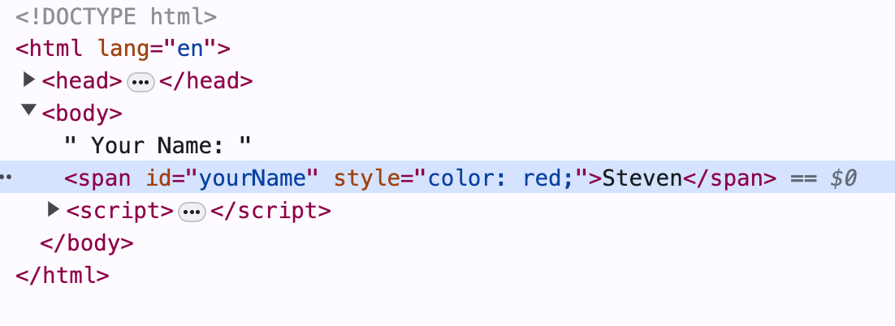

# Lab01: 你的第一個 JavaScript 程式

撰寫一個 HTML 頁面，在使用者輸入名字後，將名字顯示為紅色。

假設 HTML 頁面有一個 `span` 元素，id 為 `yourName`。

完成實驗的步驟概述：
1. 當頁面加載時，顯示一個對話框提示使用者輸入名字，並將名字存儲在變量中。
2. 獲取 id 為 `yourName` 的 `span` 元素。
3. 修改 `span` 元素的內容以顯示使用者輸入的名字。
4. 將 CSS 樣式應用於 `span` 元素，使名字顯示為紅色。

詳細步驟：

步驟 0: 創建一個 HTML 文件：

```html
<!DOCTYPE html>
<html>
  <head>
    <title>Lab01: 你的第一個 JavaScript 程式</title>
  </head>
  <body>
    <span id="yourName"></span>
    <script>
        // 你的 JavaScript 程式碼在這裡
    </script>
  </body>
```

步驟 1: 顯示一個對話框提示使用者輸入名字，並將其保存到變數中。

使用 `window.prompt()` 函數顯示對話框。

```javascript
var name = prompt('請輸入你的名字:');
```

步驟 2: 取得 id 為 `yourName` 的 `span` 元素。

使用 `document.getElementById()` 函數藉由 `id` 屬性獲取 `span` 元素。

```javascript
var span = document.getElementById('yourName');
```

步驟 3: 修改 `span` 元素的內容。

使用 `innerHTML` 屬性修改 `span` 元素的內容。

```javascript
span.innerHTML = name;
```

步驟 4: 將 CSS 樣式應用於 `span` 元素。

設置 `style.color` 屬性為紅色。這相當於應用行內 CSS 樣式 `color: red;`。

```javascript
// <span style="color: red;"></span>
span.style.color = 'red';
```

渲染後的頁面：



步驟 5: 建立一個 hello.js 檔案。輸入以下內容:

```javascript
document.write('<h1>Hello, World!</h1>');
```
此代碼會在頁面上顯示 `Hello, World!`。

步驟 6: 在 HTML 文件中添加一個 `<script>` 標籤，並將 `src` 屬性設置為 `hello.js`。

```html
<script src="hello.js"></script>
```

步驟 7: 重新加載頁面，應該會看到 `Hello, World!`。

**概念澄清**: HTML 元素的屬性(attribute)是什麼？
- 屬性在 HTML 標記中定義。（你可以將它們視為靜態屬性。）
- 它們反映了元素的初始狀態。
- 類型總是字符。
- 使用 `element.getAttribute()` 和 `element.setAttribute()` 取得和修改。

**概念澄清**: HTML 元素的特性(property)是什麼？
- 特性屬於 DOM 物件。
- 特性有不同的資料型態。
- 它們反映了元素物件的當前狀態。
- 使用 `element.<propertyName>` 取得與修改。


