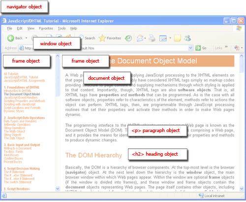
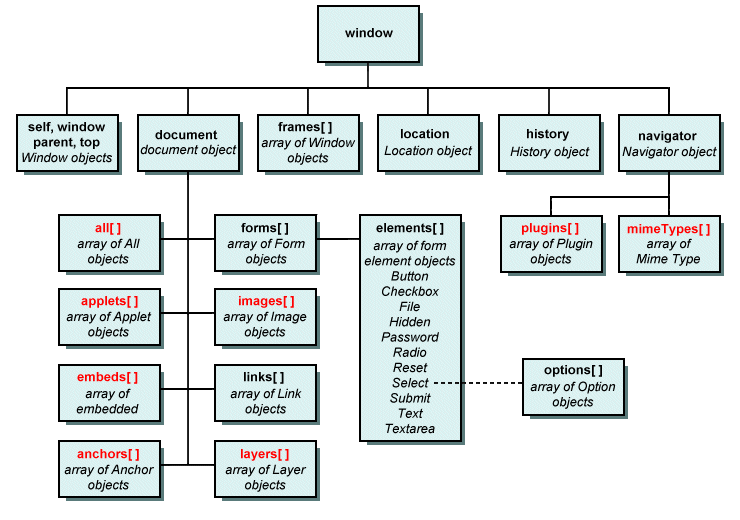
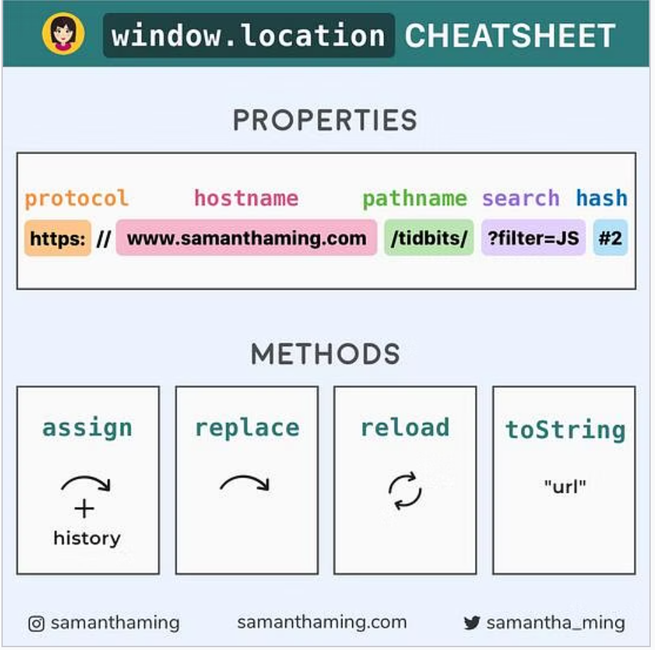
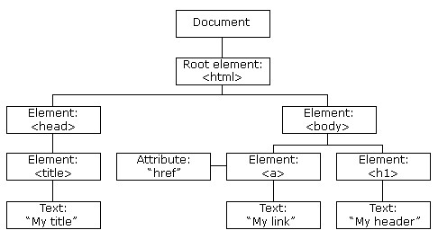
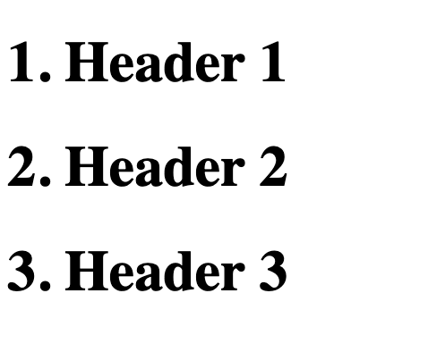
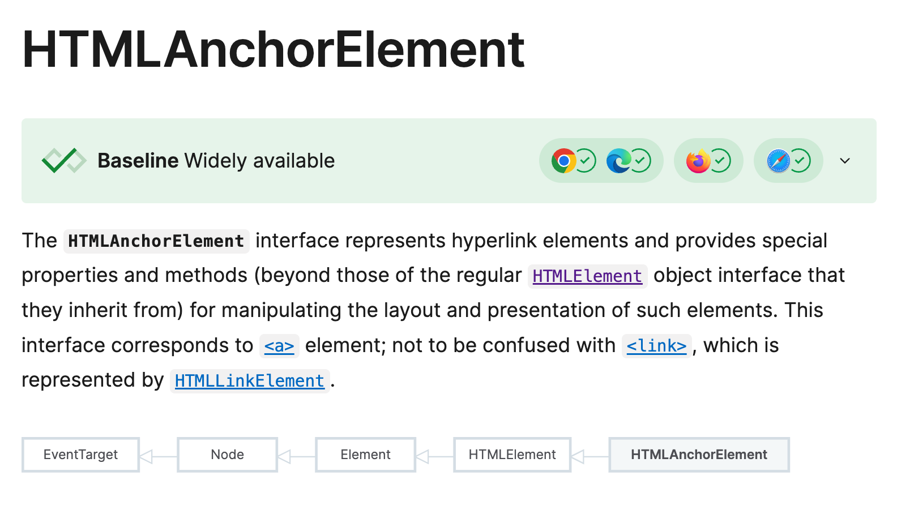
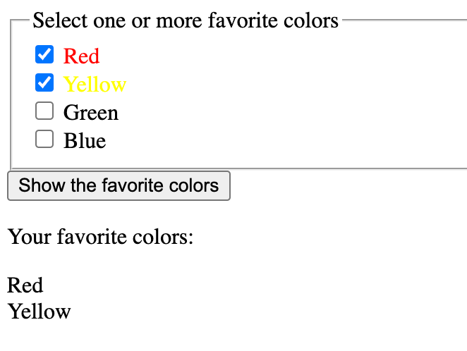
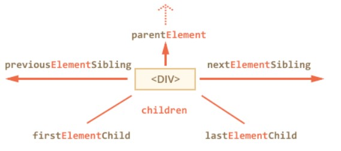
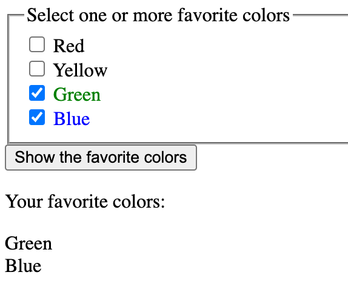
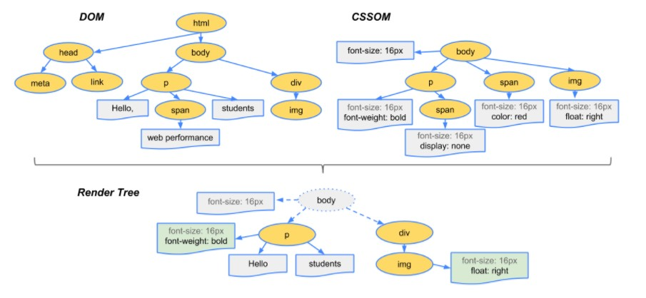

<!-- Note: 英文版中的 ch_09 -->
<style>
    .columns {
    display: flex;
  }
  .column {
    flex: 1;
    padding: 10px;
  }
  .column.large{
    flex: 2;
  }
  .small-font {
    font-size: 0.8em;
  }

  section > header,
section > footer {
  position: absolute;
  left: auto;
  right: 90px;
  height: 20px;
}

header {
  top: 30px;
}

footer {
  bottom: 30px;
}

</style>


# Chapter 12 文件物件模型(Document Object Model, DOM) 

## 大綱

- 瀏覽器物件模型(Browser Object Model, BOM)
  - window, history, location, navigator 物件
- 文件物件模型(Document Object Model, DOM)
- 選取網頁中的 HTML 元素
- 瀏覽 DOM 中的元素


## 瀏覽器物件模型(Browser Object Model, BOM) 

- BOM 是一個代表瀏覽器視窗及其組件的物件層級結構。
  - 提供與瀏覽器互動的方式。
  - BOM 的頂層物件是 `window` 物件。


<!-- Source: https://itwebtutorials.mga.edu/js/chp1/browser-object-model.aspx -->

### BOM 的層級結構




<!-- Source: https://medium.com/@reettikgoswami97/document-object-model-dom-c19d66abd235 -->


BOM 中重要的第物件有:
- `window`：頂層物件
- `document`：載入在瀏覽器視窗中的 HTML 文件
- `history`：允許操作瀏覽器的歷史紀錄
- `location`：讀取和操作瀏覽器地址列中的 URL
- `navigator`：有關瀏覽器的資訊

## 視窗物件

- `window` 視窗物件代表了瀏覽器視窗或分頁。
- 視窗物件是 JavaScript 的全域物件，也是預設物件。
  - 任何沒有修飾物件名稱的方法或屬性都會被視為 `window` 物件的屬性或方法。
  - e.g. `var x = 10;` 相當於 `window.x = 10;`
    - 但是，`let` 和 `const` 宣告的變數不會成為 `window` 物件的屬性。
  - e.g. `alert('Hello, World!');` 相當於 `window.alert('Hello, World!');`


### `window` 物件可以做什麼?


- `window` 物件提供方供讓我們與瀏覽器視窗互動. 
- 提供的方法包括:
  - 開啟、關閉和調整視窗大小
  - 滾動內容 (Scrolling viewport)
  - 提示(prompt)、警告(alert)、確認(confirm)對話框
  - 其他方法...

參考 [Window - Web APIs | MDN](https://developer.mozilla.org/en-US/docs/Web/API/Window) 獲取更多資訊.

### 範例: 開啟一個新的視窗，並指定大小和位置

- 使用 `window.open()` 方法開啟一個新的視窗並回傳視窗物件。
- 使用視窗物件的 `resizeTo()` 和 `moveTo()` 方法來調整視窗大小和位置。
- 使用 `window.screen` 物件來獲取螢幕的大小和位置資訊。

```html
<script>
    // show a new window with the URL "https://example.com" 
    let exampleWin = window.open("https://example.com", "_default", "resizable");
    // Resize the pop-up window to 500 pixels wide and 500 pixels high 
    // and set the window title to "Example Window" and position it to the center of the screen.
    exampleWin.resizeTo(500, 500);
    // the window.screen object contains information about the user's screen
    exampleWin.moveTo((screen.width - 500) / 2, (screen.height - 500) / 2);
</script>
```
---


在上面的程式碼中:
- `window.open()` 方法的第二個參數是要載入資源的瀏覽環境(一個分頁、一個視窗或一個 `<iframe>` )的名稱。
  - 瀏覽環境(browsing context) 是一個可以顯示網頁的環境。


`window.open()` syntax:
```javascript
open()
open(url)
open(url, target)
open(url, target, windowFeatures)
```

See: [Window: open() method - Web APIs | MDN](https://developer.mozilla.org/en-US/docs/Web/API/Window/open#target)

### Lab 12_01: Open a url to a iframe

參考 [Lab 12-1: 在 iframe 中開啟一個 URL](lab_12_01.md) 的內容. 


## 歷史物件 (History Object)

- `history` 物件提供了一個介面來操作瀏覽器的歷史紀錄。
  - 參考 [`History` object](https://developer.mozilla.org/en-US/docs/Web/API/History)
- 使用 `window.history` 屬性來取得 `History` 物件。
- 使用 `back()` 和 `forward()` 方法以程式化的方式瀏覽歷史紀錄。


### 範例: 呼叫 `history.back()` 方法來回到上一頁

1. 開啟一個網頁，然後導航到另一個網頁。
2. 在瀏覽器的控制台中輸入以下程式碼來回到上一頁。

```javascript
history.back();
```

## 瀏覽器地址列物件 (Location Object)

- `location` 物件提供了一個介面來讀取和操作瀏覽器地址列中的 URL。
- 使用 `window.location` 屬性或者 直接使用 `location` 來取得 `location` 物件。
- `location` 物件提供了許多屬性和方法來讀取和操作 URL。
  - 例如: `location.href` 屬性可以取得當前頁面的完整 URL。
  - 例如: `location.hostname` 屬性可以取得伺服器的網域名稱。

### Location 物件屬性與方法速查表

Location 物件的方法：

- `assign(url)`：導航到指定的 URL。
- `reload()`：重新載入當前頁面。
- `replace(url)`：用新頁面取代當前文件。
  - 導向提供的 URL；被取代的頁面不會儲存在會話歷史中。
- `toString()`：返回當前頁面的完整 URL。



### 範例: 導航到指定的 URL

開啟瀏覽器的控制台，然後輸入以下程式碼來讓視窗顯示指定的 URL。

```javascript
location.assign("https://example.com");
```

當你執行上面的程式碼時，瀏覽器會導航到指定的 URL。

<!-- Source: https://www.samanthaming.com/tidbits/86-window-location-cheatsheet/ -->


<!-- You can find more information at [window.location Cheatsheet | SamanthaMing.com](https://www.samanthaming.com/tidbits/86-window-location-cheatsheet/) or [Location - Web APIs | MDN](https://developer.mozilla.org/en-US/docs/Web/API/Location). -->

## 瀏覽器 (Navigator Object)

- `Navigator` 物件表示用戶瀏覽器(user ageng)的狀態與身份。
- 使用 `window.navigator` 屬性來存取 `Navigator` 物件。

典型的使用情境包括：
- 透過檢查 `navigator.userAgent` 屬性來偵測瀏覽器的類型與版本。
- 使用 `navigator.geolocation` 屬性來取得使用者的地理位置。


### 範例 9-3: 在控制台中顯示用戶使用的瀏覽器器資訊

開啟瀏覽器的控制台，輸入以下程式碼以顯示使用者代理字串。

```javascript
console.log(navigator.userAgent);
```

如果有興趣，可以參考 [Window: navigator property - Web APIs | MDN](https://developer.mozilla.org/en-US/docs/Web/API/Window/navigator) 來了解如何偵測使用者的瀏覽器。

### Lab 12_03: 印出 `navigator` 物件的鍵和值

開啟瀏覽器的控制台，輸入以下程式碼以遍歷並列印 `navigator` 物件的鍵和值。

```javascript
for (let key in window.navigator){
  console.log(`${key}: ${window.navigator[key]}`)
}
```

---

接下來，我們將討論文件物件模型 (Document Object Model, DOM)。  
DOM 允許我們透過 JavaScript 與 HTML 文件進行互動。

## 文件物件模型 (Document Object Model, DOM)

- `Document` 物件代表載入在瀏覽器視窗中的 HTML 文件。
- 每當我們修改 DOM 時，瀏覽器會重新渲染網頁。
  - 例如：新增一個元素到 DOM 中會使瀏覽器在網頁上顯示該新元素，或
  - 對某個元素應用新的 CSS 樣式會使瀏覽器更新該元素的外觀。
- 使用 `window.document` 屬性來存取 `Document` 物件。
### DOM 的結構:

- DOM 是一個樹狀結構，用來表示 HTML 文件。
- DOM 由節點 (NODE) 物件組成。
- `node.nodeType` 屬性用於指示節點的類型 [2]。
- 常見的節點類型：
  - 文件節點(document node) (nodeType = 9): HTML 文件的根節點
  - 元素節點(element node) (nodeType = 1)
    - 元素的屬性節點(attribute node) (nodeType = 2)
    - 元素的文字節點(text node) (nodeType = 3)
  - 註解節點(comment node) (nodeType = 8)

### 以 DOM 表示 HTML 文件

考慮以下的 HTML 文件:

```html
<!DOCTYPE html>
<html lang="en">
<head>
    <title>My title</title>
</head>
<body>
    <a href="">My link</a>
    <h1>My Header</h1>
</body>
</html>
```
---

上述 HTML 文件的 DOM 表示如下:



可以到 [Live DOM viewer [11]](http://software.hixie.ch/utilities/js/live-dom-viewer/) 來產生 HTML 文件的 DOM 樹狀結構。

## 選取網頁元素

我們必須先取得 DOM 中元素的參考(reference)才能操作這些元素。

`document` 物件提供了多種 `getElement...` 方法來選取 DOM 中的元素的參考。

方法上:
- 可以透過 `id` 屬性、`name` 屬性、`class name`、`tag name` 或 CSS `selector` 來選取一個或多個元素。
- 不同方法的回傳資料型態也不同，使用上要留意。

### 選取 DOM 中元素的方法列表

<div style="font-size: 0.8em;">
  

| **方法**                          | **描述**                                                                 | **回傳型態**          |
|-----------------------------------|--------------------------------------------------------------------------|-----------------------|
| `document.getElementById(id)`     | 選取具有指定 `id` 的單一元素。                                            | `Element`            |
| `document.getElementsByName(name)`| 選取具有指定 `name` 屬性的所有元素                      | `NodeList`           |
| `document.getElementsByTagName(tag)` | 選取具有指定標籤名稱的所有元素                         | `HTMLCollection`     |
| `document.getElementsByClassName(class)` | 選取具有指定 class 名稱的所有元素                     | `HTMLCollection`     |
| `document.querySelector(selector)` | 選取符合指定 CSS 選擇器的第一個元素。                                  | `Element`            |
| `document.querySelectorAll(selector)` | 選取符合指定 CSS 選擇器的所有元素。                     | `NodeList`           |

</div>


### 透過 id 選取 **(單一)** 元素

- `document.getElementById(your_id)`
- 回傳具有指定 id 的 HTML 元素 (Element 物件)。
- 回傳型態: `Element` 物件

### 透過 name 選取 **所有** 元素

- `document.getElementsByName(“your_name”)`：
  - 回傳具有指定 name 屬性的元素集合，為類陣列物件 (NodeList)。
  - 回傳型態: `NodeList` 物件, 是一個 Node 物件的集合
    - 屬於一個類陣列物件(Array-like object)
    - 可使用 `Array.from()` 方法轉換為陣列物件(Array object), 以使用陣列物件提供的方法
  - 例如: `document.getElementsByName("flavor")` 會回傳所有 name 屬性為 "flavor" 的元素集合。


### 透過 tag name 選取 **所有** 元素 

- `document.getElementsByTagName(“your_tag_name”)`
  - 回傳符合指定 tag name 的元素集合，為類陣列物件 (HTMLCollection)。
  - 回傳型態: `HTMLCollection` 物件, 是一個 HTML Element 物件的集合
  - 屬於一個類陣列物件(Array-like object)
  
### 透過 CSS class name 選取 **所有** 元素

- `document.getElementsByClassName(“your_class_name”)`
  - 回傳符合指定 class name 的元素集合，為類陣列物件 (HTMLCollection)。
  - 回傳型態: `HTMLCollection` 物件, 是一個 HTML Element 物件的集合
  - 屬於一個類陣列物件(Array-like object)


### 透過 CSS 選擇器選取 **第一個** 元素

- `document.querySelector(“your_css_selector”)`
  - 回傳符合指定 CSS 選擇器的第一個元素 (Element 物件)。
  - 回傳型態: `Element` 物件

### 透過 CSS 選擇器選取 **所有** 元素

- `document.querySelectorAll(“your_css_selector”)`
  - 回傳符合指定 CSS 選擇器的所有元素集合，為類陣列物件 (NodeList)。
  - 回傳型態: `NodeList` 物件, 是一個 Node 物件的集合

### Lab 12_04: 選取 DOM 中的元素

參考 [Lab 12-4: 選取 DOM 中的元素](lab_12_04.md) 的內容. 
開啟瀏覽器的控制台, 輸入能夠完成以下三個任務的程式碼:

1. 選取所有 name 為 "flavor" 的元素
2. 選取第一個 name 為 "flavor" 的元素
3. 選取所有 h1 元素


### Lab 09_05: 為 h1 元素編號

考慮以下的 HTML 文件。撰寫一段 JS，將文件中出現的 h1 元素按順序從 1 到 n 進行編號。




參考 [Lab 12-5: 為 h1 元素編號](lab_12_05_guided.md) 的內容.


## Q: 元素(Element)和節點(Node)物件兩者間的差異?

- `Element` 物件是 `Node` 物件的子類別。
- `Element` 物件是所有 HTML 元素(HTML Element)的基礎物件
- 其他特定的 HTML 元素繼承自 `Element` 物件，例如 `HTMLDivElement`、[`HTMLAnchorElement`](https://developer.mozilla.org/en-US/docs/Web/API/HTMLAnchorElement)、`HTMLInputElement` 等等。

- e.g. `HTMLDivElement` 的繼承結構如下:
  - `Node` <- `Element` <- `HTMLElement` <- `HTMLDivElement` (或其他特定的 HTML 元素)

### 範例: `HTMLAnchorElement` 物件的繼承結構




<!-- source: https://developer.mozilla.org/en-US/docs/Web/API/HTMLAnchorElement -->


### 範例: 顯示最愛的顏色

完成 `showColors()` 函數, 在 id 為 "display" 的段落元素`<p id="display></p>` 中顯示使用者選擇的最愛顏色。



--- 

HTML 文件的內容如下:
```html
<!DOCTYPE html>
<html>
    <head>
    <title> Show the favorite colors </title>
    </head>
    <body>
        <!-- Checkbox group showing a list of colors -->
       <fieldset>
            <legend>Select one or more favorite colors</legend>
            <input type="checkbox" name="color" value="Red"/> <label for="Red">Red</label><br>
            <input type="checkbox" name="color" value="Yellow"/> <label for="Yellow">Yellow</label><br>
            <input type="checkbox" name="color" value="Green"/> <label for="Green">Green</label><br>
            <input type="checkbox" name="color" value="Blue"/> <label for="Blue">Blue</label><br>
        </fieldset>
        <button onclick="showColors()">Show the favorite colors</button>
        <p>Your favorite colors:</p>
        <p id="display" ></p>
    </body>
    <script>
        function showColors(){
           //TBD
        }
    </script> 
</html>
```


---

`showColors()` 函數的步驟如下：

1. 使用 `document.getElementsByName()` 方法選取所有名稱為 "color" 的核取方塊。
   - 該方法會回傳一個 `NodeList` 物件，這是一個類陣列物件。
   - NodeList 物件包含所有名稱為 "color" 的核取方塊 (`HtmlInputElement` 物件)。

2. 遍歷 NodeList 物件以取得已勾選核取方塊的值。
   - `HtmlInputElement` 物件的 `checked` 屬性表示核取方塊是否被勾選。
   - `HtmlInputElement` 物件的 `value` 屬性回傳核取方塊的值。

3. 將已勾選核取方塊的值附加到 id 為 "display" 的段落`<p>`中。
   - 使用段落的 `innerHTML` 屬性設定包含 HTML 標籤的內容。

---

完成的程式碼： 

```javascript
function showColors(){
            // Get all the checkboxes
            let checkboxes = document.getElementsByName("color");  // NodeList<HtmlElement>
            // Get the display element and clear it
            const displayElement = document.getElementById("display");
            displayElement.innerHTML = "";
                // Iterate the checkboxes
            checkboxes.forEach(checkbox => {
                // If the checkbox is checked
                console.log(checkbox);
                if(checkbox.checked){
                    // Display the value of the checkbox
                    displayElement.innerHTML += checkbox.value + "<br>";
                }
            });
        }
```

## 導航 DOM 的節點 (Navigating the DOM)

某些時候，我們需要訪問特定元素的父元素(parent)、子元素(child)或兄弟元素(sibling)。



<!-- Source: https://javascript.info/dom-navigation#element-only-navigation -->

Element 物件提供了多種方法來完成這個任務。

### Element 物件提供的元素導航屬性


找某個元素的父元素(parent element)及所有子元素(children elements):
- `element.parentElement`: returns the parent element of the element.
- `element.children`: returns a `HTMLCollection` of child elements of the element.
- 可用於上下方向的導航

找某個元素的第一個子元素(first child)及最後一個子元素(last child):
- `element.firstElementChild`: returns the first child node of the element.
- `element.lastElementChild`: returns the last child node of the element.
- 可用於上下方向的導航

--- 

找某個元素的前一個兄弟元素(previous sibling)及下一個兄弟元素(next sibling):
- `element.previousElementSibling`: returns the previous sibling node of the element.
- `element.nextElementSibling`: returns the next sibling node of the element.
- 可用於左右方向的導航

### 範例: 導航到特定元素的應用

- 修改前述的範例。
- 除了顯示使用者選擇的最愛顏色外，還要套用行內樣式(inline style), 使得 check box 的標籤文字顯示為所選顏色。
  - 例如: 如果使用者選擇 "Red" 的核取方塊，則標籤的文字應顯示為紅色。




---

挑戰與分析:
- 如何取得 Checkbox 的標籤元素 `<label>`?
- 由於 `<label>` 標籤是 `<input>` 標籤的兄弟元素，因此可以使用 `nextElementSibling` 屬性來取得它。

```html
<fieldset>
  <legend>Select one or more favorite colors</legend>
  <input type="checkbox" name="color" value="Red"/> <label for="Red">Red</label><br>
  <input type="checkbox" name="color" value="Yellow"/> <label for="Yellow">Yellow</label><br>
  <input type="checkbox" name="color" value="Green"/> <label for="Green">Green</label><br>
  <input type="checkbox" name="color" value="Blue"/> <label for="Blue">Blue</label><br>
</fieldset>
```

---

解決方案的想法如下：
- 在遍歷核取方塊的 NodeList 時，可以使用每個核取方塊的 `nextElementSibling` 屬性來取得其對應的標籤元素。
- 對於已選中的核取方塊:
  - 更改標籤的文字顏色，可以將標籤元素的 `style.color` 屬性設置為核取方塊的值。
    - `style.color` 屬性回傳元素的行內 color 屬性。
- 對於未選中的核取方塊：
  - 將其標籤的文字顏色設置為黑色。

---

修改後的 `forEach()` 方法內的箭頭函數如下:

```javascript
checkboxes.forEach(checkbox => {
                // If the checkbox is checked
                console.log(checkbox);
                if(checkbox.checked){
                    // Display the value of the checkbox
                    displayElement.innerHTML += checkbox.value + "<br>";
                    // Apply the inline style to the checkbox
                    const colorName = checkbox.value.toLowerCase();
                    const labelElement = checkbox.nextElementSibling;
                    labelElement.style.color = colorName;
                } else {
                  // set the the text color of the label next to the checkbox to black
                    checkbox.nextElementSibling.style.color = "black";
                }
            });
```


## 幕後秘密: 瀏覽器載入網頁時發生了什麼事?

1. 瀏覽器解析(parse) HTML 內容  
2. 接著，建立文件物件模型 (DOM) 和 CSS 物件模型 (CSS Object Model,  CSSOM)。  
3. 最後，將 DOM 和 CSS 物件模型 (CSSOM) 合併以建立渲染樹 (Render Tree)。  
4. 瀏覽器使用渲染樹來渲染網頁 [1]  
 


---

執行的細節如下: 

S1. 瀏覽器向伺服器請求並解析 HTML 文件。

S2. 瀏覽器向伺服器請求資源，例如圖片、CSS 文件和 JavaScript 文件。

S3. 瀏覽器通過結合 HTML 內容和資源來構建以下模型：
- 文件物件模型 (Document Object Model, DOM)：基於 HTML 內容的樹狀模型，用於瀏覽器渲染網頁。
- CSS 物件模型 (CSS Object Model, CSSOM)：基於 CSS 內容的樹狀模型，用於瀏覽器渲染網頁。
- 渲染樹 (Rendering Tree)：DOM 和 CSSOM 的結合體。瀏覽器使用渲染樹來渲染網頁，包括 DOM 中需要顯示的節點、每個節點的位置和大小，以及每個節點的計算樣式。

S4. 瀏覽器根據渲染樹來渲染網頁。

---


參考以下影片以了解更多：[構建渲染樹的過程 (Youtube 3:04)](https://www.youtube.com/watch?v=lvb06W_VKVE)


## 本章總結 

- 瀏覽器物件模型 (Browser Object Model, BOM) 提供與瀏覽器互動的物件。
- `window` 物件是 BOM 中的頂層物件。
- BOM 中其他重要的物件包括 `History`、`Location` 和 `Navigator` 物件。
- 文件物件模型 (Document Object Model, DOM) 代表載入在瀏覽器視窗中的 HTML 文件。
- `document` 物件提供了多種方法來選取 DOM 中的元素。
- 可以透過 id、name、class name、tag name 或 CSS 選擇器來選取元素。


## References 

[1] https://developers.google.com/web/fundamentals/performance/critical-rendering-path/constructing-the-object-model?hl=zh-tw

[2] Node.nodeType, https://developer.mozilla.org/en-US/docs/Web/API/Node/nodeType


<script>
    // add the following script at the end of your marp slide file.
    const h2s = document.querySelectorAll('h2');
    h2s.forEach(function(h2, idx){
        h2.innerHTML = `<span class="small-font">${idx + 1}</span> ${h2.innerHTML}`
    })
</script>