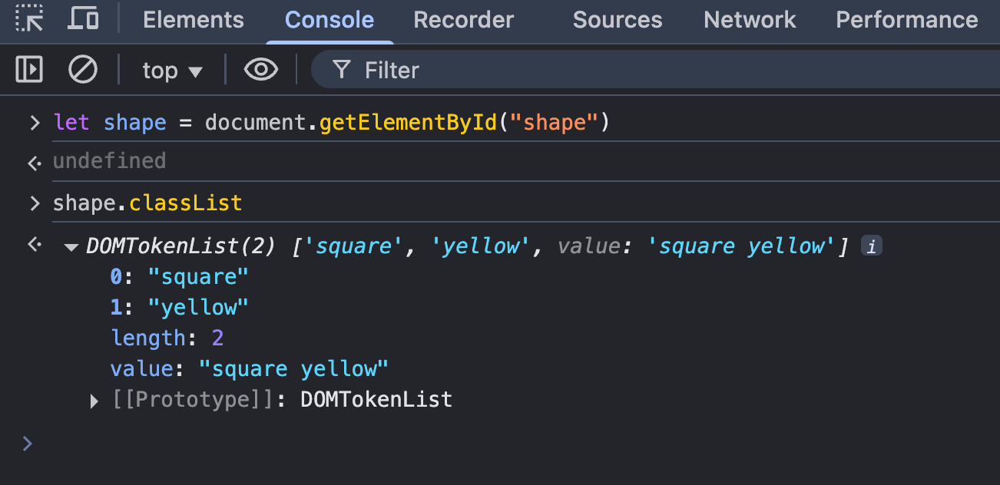
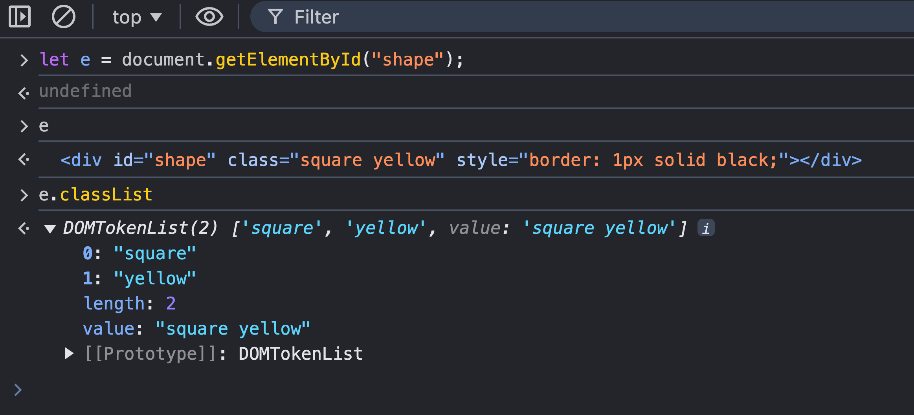
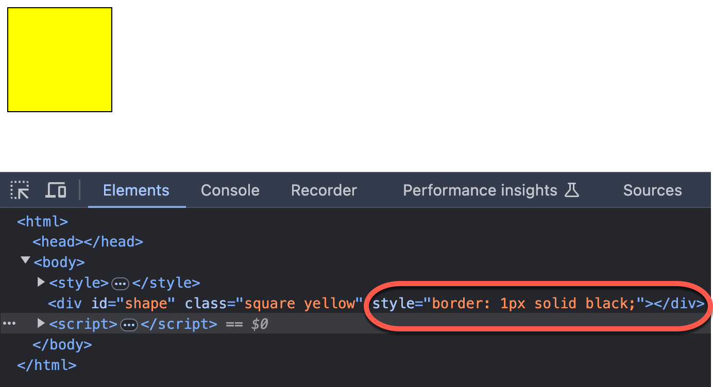
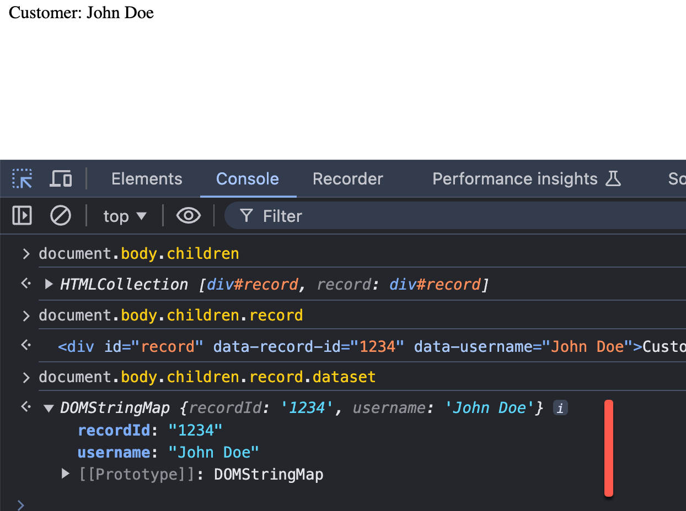
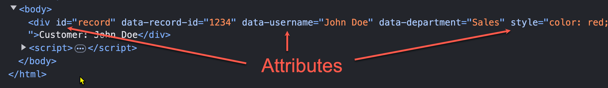
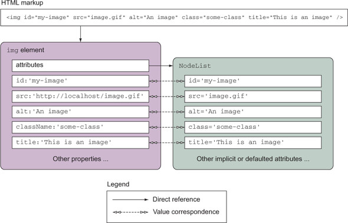
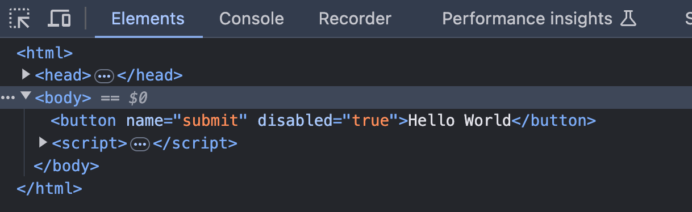
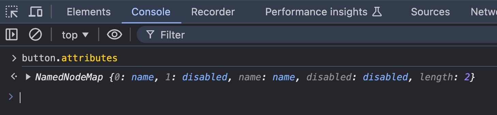
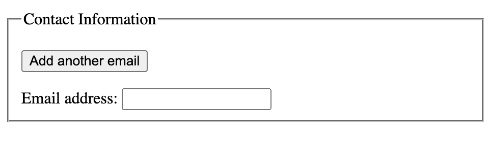
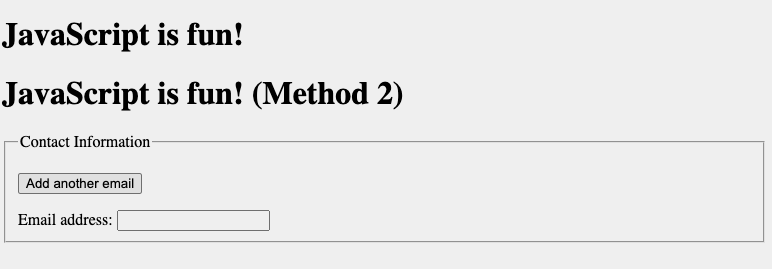

<style>
    .columns {
    display: flex;
  }
  .column {
    flex: 1;
    padding: 10px;
  }
  .column.large{
    flex: 2;
  }
  .small-font {
    font-size: 0.8em;
  }

  section > header,
section > footer {
  position: absolute;
  left: auto;
  right: 90px;
  height: 20px;
}

header {
  top: 30px;
}

footer {
  bottom: 30px;
}

</style>

# Chapter 10 Part 2: 使用 DOM 動態操作元素


## 本章的主題

1. 修改元素物件的特性
2. 修改元素物件的樣式
3. 元素的自訂資料屬性
4. 修改 HTML 標籤的屬性
5. 加入新的元素到 DOM 


## 基本 DOM 元素的走訪(traversing) - 回顧

### 範例 10-1: 取得 DOM 中的元素

考慮以下的 HTML 程式碼. 若你己取得 `<H1>` 標籤的 HTML 元素物件，請問如何取得 `<div id="forest">` 標籤的 HTML 元素物件?

```html
  <body>
    <h1>Let's find the treasure</h1>
    <div id="forest">
      <div id="tree1">
        <div id="squirrel"> Squirrel </div>
        <div id="flower"> Flower </div>
      </div>
      <div id="tree2">
        <div id="shrubbery">
          <div id="treasure"> Treasure </div>
        </div>
        <div id="mushroom">
          <div id="bug"> Bug </div>
        </div>
      </div>
    </div>
  </body>
```

--- 

方法 1: 走訪到 h1 的父元素，再使用 HTMLElement 的 querySelector 方法

```javascript
let h1 = document.getElementsByTagName("h1")[0];
// 找到 h1 的父元素，再找到其下 id 為 forest 的元素
let forest = h1.parentElement.querySelector("#forest");
```

方法 2: 直接走訪到 h1 的兄弟元素，

```javascript
let h1 = document.getElementsByTagName("h1")[0]; 
// 找到 h1 的兄弟元素，再找到其下 id 為 forest 的元素
let forest = h1.nextElementSibling
```


## 修改元素物件的 CSS 樣式

### HTMLElement 的 `classList` 屬性 

- 使用 HTMLElement 物件的 `classList` 特性取得 `DOMTokenList` 物件來修改元素的 CSS 樣式

- `classList` 特性(property)
  - 回傳一個即時的 `DOMTokenList` 物件，內含該元素的所有 class 名稱
  - 修改後, 會即時更新到 HTML 標籤的 class 屬性



### `DOMTokenList` 物件

- 使用 `DOMTokenList` 物件的 `add`, `remove`, `toggle` (切換), 和 `contains` 方法來增加、刪除、切換、檢查 class 屬性
- 底下舉例說明

  
### 加入 CSS class


考慮以下的 HTML 程式碼 (完整程式碼請參考 [`ch12/ex_12p2_02.html`](ex_12p2_02.html))。  
我們希望將 `blue` 類別套用到 `shape` 元素上。

```html
<body>
    <style>
      .blue {
        background-color: blue;} 
    </style>
    <div id="shape" class="square" ></div>
```

---

步驟：
1. 使用 id 取得 shape 元素。
2. 從 `classList` 屬性中取得 shape 元素的 `DOMTokenList` 物件。
3. 將 `blue` css class 新增到 shape 元素。
   - 使用 `DOMTokenList` 物件的 `add` 方法。

```javascript
let shape = document.getElementById("shape");
shape.classList.add("blue");
```



### 移除 CSS class

使用 `DOMTokenList` 物件的 `remove` 方法來移除 CSS 類別。

```javascript
shape.classList.remove("blue");
```

### 切換 CSS class

`toggle` 方法會在元素的 class 名稱列表中新增一個 class（如果該 class 尚未存在），或者移除該 class（如果該 class 已存在）。
- 如果操作後該 class 存在於列表中，則回傳 `true`，否則回傳 `false`。

目前的 `<div id="shape" class="square" ></div>` 並沒有 `hide` 類別。

執行以下程式碼後：
```javascript
shape.classList.toggle("hide");
```

- 類別 `hide` 將會被新增到 shape 元素, 並回傳 `true`。
- 如果再次執行該程式碼，類別 `hide` 將會被移除，並回傳 `false`。

## 操作元素物件的行內樣式 (in-line style)

<!-- Recall that `element.classList` expose the class attributes of an element. -->
 
- 使用 `htmlElement.style` 特性取得元素的行內樣式
  - `htmlElement.style` 屬性回傳一個即時的 `CSSStyleDeclaration` 物件，該物件包含元素的行內樣式屬性。
  - "即時" 表示修改後會即時更新 DOM 的內容
- 使用 `htmlElement.style.<attribute_name>` 來取得或設定元素的行內樣式屬性
  - `<attribute_name>` 是 CSS 樣式屬性的名稱，使用駝峰式命名法 (camelCase)。
  - 例如 `backgroundColor`、`fontSize`、`borderWidth` 等等


### 範例: 設定 `shape` 的行內樣式

設定 `shape` 的邊框為 `1px solid red`:


```javascript
shape.style.border = "1px solid red";
```



## 元素的自訂資料屬性: data-*

有時我們需要在 HTML 元素中儲存資料，例如存放記錄的主鍵(primary key)。
- 當使用者進行操作時，我們會將這些自訂資料送至後端或在前端中使用。


使用元素的 `data-*` 屬性來儲存額外的資料。
- `*` 是自訂的資料屬性的名稱。
- e.g. `data-record-id`, `data-user-name`, `data-department` 等。

### 範例 3: 使用 `data-*` 屬性儲存記錄和使用者資訊

在 `record` 元素中加入兩個自訂資料屬性: `record-id` 和 `user-name`，分別儲存記錄的主鍵和使用者名稱。
- `record-id=1234`
- `user-name="John Doe"`

```html
<!DOCTYPE html>
<html>
  <body>
    <div id="record" data-record-id="1234" data-user-name="John Doe"></div>
  </body>
</html>
```

<!-- Note 
- the `data-` prefix is removed from the key name in the `dataset` property and 
- the key name is converted to the **camelCase**. -->


### 取得與修改元素的自訂資料屬性

- 使用元素的 `dataset` 屬性來取得和修改元素的自訂資料屬性。
- 該屬性回傳一個 `DOMStringMap` 物件，該物件包含所有的 `data-*` 屬性。

- `DOMStringMap` 物件內含有所有自訂資料的屬性名稱及值
  - 以 Map 的資料結構存放
  - key 為自訂資料的屬性名稱
  - value 為字串型態

### `DOMStringMap` 物件的 key 名稱的規則

- 由 標籤屬性上的 `Data-*` 轉換至 `DOMStringMap` 的 key 名稱的規則
  - 以`-` 區分單字，以 camelCase的方式組合成 key 的名稱
- 例如, 在標籤屬性上的 
  - `data-record-id` 會變成 `recordId` 
  - `data-user-name` 會變成 `userName`

- 由 `DOMStringMap` 的 key 轉換成 `Data-*` 時的規則
  - 以 camelCase 拆解單字，之後以 `-` 連接，再加上 `Data-*` 前綴
- 例如, 在 `DOMStringMap` 中的 key 值
  - `userName` 變成 `Data-user-name`




## 範例: 取得元素的 `data-record-id` 的自訂屬性的值

有以下的元素:

```html
<body>
    <div id="record" data-record-id="1234" data-user-name="John Doe"></div>
</body>
```

取得 id 為 `record` 的 `<div>` 的 `data-record-id` 的程式：

```javascript
let record = document.getElementById("record");
let recordId = record.dataset.recordId;
```

注意: 元素的自訂資料屬性名稱和 `DOMStringMap` 內的鍵值名稱的轉換。

### 在程式中加入新的自訂資料屬性

- 直接指派一個值到 `dataset` 所參考的 `DOMStringMap` 物件即可。
- 例如，增加一個 `phoneNumber` 屬性:

```javascript
record.dataset.phoneNumber = "9999-888-777";
```

在 `<div id='record'>` 上新增的資料屬性為:

```html
<div id="record" 
  data-record-id="1234" 
  data-user-name="John Doe" 
  data-phone-number="9999-888-777"></div>
```

### 檢查和刪除自定資料屬性

檢查 `dataset` 物件中是否存在某個鍵值  
- 使用 `object.hasOwn(element.dataset, key)` 方法來檢查  
  - 因為 `dataset` 所指向的 `DOMStringMap` 是物件  

  
以下範例展示如何檢查 `phoneNumber` 自訂資料屬性是否存在於元素中：

```javascript
let record = document.getElementById("record");
// 檢查是否存在 phoneNumber 屬性
if (Object.hasOwn(record.dataset, "phoneNumber")) {
  console.log("phoneNumber exists:", record.dataset.phoneNumber);
} else {
  console.log("phoneNumber does not exist.");
}
```

---

從 `dataset` 物件中刪除一個鍵值對  
- 使用 `delete` 運算子: `delete element.dataset.keyname`

範例:
```js
delete record.dataset.phoneNumber;
```

如需更多詳細資訊，請參考 [HTMLElement: dataset 屬性 - Web APIs | MDN](https://developer.mozilla.org/en-US/docs/Web/API/HTMLElement/dataset)。

## Lab 01: 對元素套用行內樣式並新增自訂資料屬性

```js
<body>
  <div id="record" data-record-id="1234" data-userName="John Doe">
    客戶: John Doe
  </div>
  <script>
    // 1. 將 record 元素的文字顏色改為紅色。
    // 2. 為 record 元素新增一個名為 department，值為 "Sales" 的自訂資料屬性。
    // 3. 將 department 自訂資料屬性的值輸出到控制台。
  </script>
  </body>   
```
檔案: [lab_12p2_01.html](lab_12p2_01.html)


## 修改 HTML 標籤屬性: 使用 `setAttribute`, `getAttribute`, and `removeAttribute` 

HTMLElement 的:
- `setAttribute`, `getAttribute`, and `removeAttribute` 

方法用也可以動態地修改 HTML 標籤的屬性。

但 attribute(屬性) 和 property(特性) 兩者的差別是什麼？

### HTML 標籤屬性 (attribute) 與 DOM 元素特性(property) 間的差別

<!-- Before introducing the `setAttribute` and `getAttribute` methods, let's clarify the difference between the HTML element attributes and the DOM element properties. -->

<!-- Q: HTML 標籤的屬性(attribute)和 DOM 元素(property)屬性兩者的差別?  -->

- Attribute: 在 HTML 文件中的 HTML 標籤上的屬性
- Property: 在 DOM 物件的元素物件的特性




### HTML 標籤與 DOM 元素物件之間的關係: 雙向與單向綁定

- 瀏覽器會為文件中的每個 HTML 標籤建立一個 DOM 元素物件。
- 大部的情況兩者是雙向綁定的: attribute <-> property
  - 修改任一個, 另一個就會隨之更改. 
- 但少部份的 attribute 和 property 間是單向綁定: attribute -> property
  - 修改 attribute 會影響 property
  - 但是, 反方向不會
  - 例如 `<input>` 的 `value` 屬性就是單向綁定
    - 參考 [getAttribute() versus Element object properties?](https://stackoverflow.com/questions/10280250/getattribute-versus-element-object-properties)

### 使用 Element 的 `xxxAttribute()` 方法的時機 

所以, 使用 `setAttribute`, `getAttribute`, and `removeAttribute` 的時機:
- 處理單向綁定的屬性
- 處理自訂的非標準的標籤屬性(custom tag attribute)
  
### 範例: 標準標籤屬性的處理 

例如，對於以下的 `img` 標籤：

```html

```

瀏覽器會為 `` 元素創建一個 [HTMLImageElement 物件](https://developer.mozilla.org/en-US/docs/Web/API/HTMLImageElement)。

<div class="columns">

<div class="column large">



</div>

<div class="column">

- 修改 NodeList 中的 `title` 特性, img 標籤內的 `title` 屬性也會隨之更改. 
- 兩者雙向綁定


<!-- Fig Source: https://livebook.manning.com/book/jquery-in-action-third-edition/chapter-4/20 -->

### 範例: 非標準標籤屬性的處理

但對於 底下的 `my-info` 非標準的屬性, 就要使用 `xxxAttribute()` 方法處理
- 因為 相對應的 DOM 元素沒有提供對應的 property
  
```html
</div>

</div>
```

### setAttribute() 的語法

- 用來設定 HTML 標籤的屬性的值
- 語法:

```javascript
element.setAttribute(name, value);
```

- 如果屬性已經存在，則更新其值；
- 否則，會新增一個具有指定名稱和值的新屬性。

### getAttribute() 和 removeAttribute() 的語法

`getAttribute` 方法用來取得 HTML 標籤的屬性的值

```javascript
element.getAttribute(attributeName);
```

- `removeAttribute` 方法用來刪除 HTML 標籤的屬性

```javascript
element.removeAttribute(attributeName);
```

### 範例 4: 使用 setAttribute, getAttribute, and removeAttribute 方法修改元素的屬性

使用以下的 HTML 程式碼，設定按鈕元素的 `name` 和 `disabled` 屬性：
- `name="submit"`
- `disabled="true"`

```html
<html>
    <button>Hello World</button>
</html>
```

---

使用 HTMLElement 的 `setAttribute` 方法來設定按鈕元素的 `name` 和 `disabled` 屬性:

```javascript
let button = document.querySelector("button"); 
button.setAttribute("name", "submit");
button.setAttribute("disabled", "true");
```



---

因為這兩個為標準屬性，所以也可以使用 DOM 元素的 `name` 和 `disabled` 屬性來設定:

```javascript
let button = document.querySelector("button"); 
button.name = "submit";
button.disabled = true;
```


### 取得標籤的所有屬性

- 使用 `element.attributes` 屬性來取得元素的所有屬性
  - 回傳一個 `NamedNodeMap` 物件，該物件是一個類陣列的物件



### 回顧問題

1. HTML 標籤屬性(attribute)與 DOM 元素物件特性(property)之間的關係是什麼？
2. 當你想要為一個元素新增 `font-size: 16px` 行內的樣式時，有哪些選項可以使用？
   <!-- - Use the `style` property of the HTMLElement object.
   - Use the `setAttribute` method to set the `style` attribute of the element. -->

3. 當你想要為一個元素新增 `data-record-id` 的屬性時，有哪些選項可以使用？

<details>
<summary>Answer</summary>

Q1. 
- HTML 標籤屬性(attribute)是 HTML 文件中的標籤上的屬性，而 DOM 元素物件特性(property)是瀏覽器為每個 HTML 標籤創建的 DOM 元素物件上的屬性。兩者之間有雙向或者單向綁定的關係。

Q2.
- 使用 `style` 屬性來設定行內樣式。
- 使用 `setAttribute` 方法來設定 `style` 屬性。

```js
element.style.fontSize = "16px";
element.setAttribute("style", "font-size: 16px");
```

Q3. 
- 使用 `setAttribute` 方法來設定 `data-record-id` 屬性。
- 使用 `dataset` 屬性來設定 `data-record-id` 屬性。

```js
element.setAttribute("data-record-id", "1234");
element.dataset.recordId = "1234";
```

</details>


## 在 DOM 中新增元素

- 除了修改 DOM 內的元素，我們也可以新增元素到某個節點下
- 如此，開發者可以依操作條件，增加不同的欄位
- 例如: 新增手機欄位，除了原有的工作電話欄位外。
  
### 新增元素並加入 DOM 的程序

1. 使用 `document.createElement` 方法創建一個新元素。
2. 使用 `setAttribute` 方法或 `HTMLElement` 的屬性來設定新元素的屬性。
3. 找到要新增該元素的父元素。
4. 使用父元素的 `appendChild` 方法將新元素加入到 DOM 中。

### 範例 5: 當使用者點擊 "Add Email" 按鈕時，新增一個 email 輸入欄位到表單中

當點擊 "Add another email" 按鈕時，新增一個 email 輸入欄位到表單中。
- 這需要使用 JavaScript 來動態地新增一個 email 輸入欄位到表單中。

```html 
<fieldset>
        <legend>Contact Information</legend>
        <p> <button onclick="addEmail()">Add another email</button> </p>
        <form>
            <div id="emailList">
                <label for="email1">Email address:</label>
                <input type="email" id="email1" name="email1" />
            </div>
        </form>
</fieldset>
```



<!-- When a user click the "Add another email" button, the `addEmail()` function will be executed to add a new email input element to the form. -->

#### 程式邏輯步驟

1. 取得目前表單中 email 輸入欄位的數量，以便為新的 email 輸入欄位指定唯一的 id。
2. 找到要新增 email 輸入欄位的父元素。
3. 建立一個新的 label 元素，並將其 `for` 屬性設置為新 email 輸入欄位的 id。
4. 建立一個新的 email 輸入欄位，並設置其 `type`、`id` 和 `name` 屬性。
5. 將新的 label 和 email 輸入欄位附加到父元素中。


#### Step 1: 取得目前 email 輸入欄位的數量

- 使用 `document.querySelectorAll` 方法來取得所有的 email 輸入欄位。
  - 回傳型態為 NodeList 物件 
- 使用 `length` 屬性來取得目前 email 輸入欄位的數量。

```javascript
// Use the css selector to get all email input elements
// Select all input elements with the type of email whose parent is the emailList div element.
let emailList = document.querySelectorAll("#emailList > input[type=email]");
let emailCount = emailList.length;
```

#### Step 2: 找到要新增 email 輸入欄位的父元素

- 需要找到 `emailList` 的父元素，以便將新的 email 輸入欄位附加到該元素中。
- 使用 HTMLElement 的 `parentElement` 屬性來取得父元素。

```javascript
let parentElement = emailList.parentElement;
```

#### Step 3: 建立新的 label 元素並設定其 `for` 屬性

- 使用 `document.createElement` 方法來創建一個新的 label 元素。
- 元素的 `htmlFor` 特性對應到 `<label>` 標籤的 `for` 屬性。
- `innerHTML` 屬性用來設定 label 元素的內容。

```javascript
let newLabel = document.createElement("label");
newLabel.htmlFor = "email" + (emailCount + 1);
// or newLabel.setAttribute("for", "email" + (emailCount + 1));
newLabel.innerHTML = "<br/> Email address " + (emailCount + 1) + ":";
```


#### Step 4: 建立新的 email 輸入欄位並設定其 `type`、`id` 和 `name` 屬性


```javascript
let newEmail = document.createElement("input");
newEmail.type = "email"; 
newEmail.id = "email" + (emailCount + 1);
newEmail.name = "email" + (emailCount + 1);
//or newEmail.setAttribute("type", "email");
```

#### Step 5: 將新的 label 和 email 輸入欄位附加到父元素中

使用父元素的 `appendChild` 方法將新的 label 和 email 輸入欄位附加到父元素中。

```javascript
parentElement.appendChild(newLabel);
parentElement.appendChild(newEmail);
```


### 完整的程式碼

The complete code:

```javascript
<script>
        function addEmail() {
            // Step 1. Get the total email inputs
            let emailList = document.querySelectorAll("#emailList > input[type=email]");
            let emailCount = emailList.length;

            // Step 2 Find the parent element where we want to add the new email input element.
            let parentElement = document.getElementById("emailList");

            // Step 3 Create the label for the new email input field
            let newLabel = document.createElement("label");
            // Set the label attributes
            newLabel.htmlFor = "email" + (emailCount + 1);
            newLabel.innerHTML = "<br/> Email address " + (emailCount + 1) + ":";
            
            // Step 4 Create the email input field
            let newEmail = document.createElement("input");
            // set element attributes
            newEmail.type = "email";
            newEmail.id = "email" + (emailCount + 1);
            newEmail.name = "email" + (emailCount + 1);
            
            // Step 5 Append the new label and email input field to the emailList
            document.getElementById("emailList").appendChild(newLabel);
            document.getElementById("emailList").appendChild(newEmail);
        }
    </script>
```

See the full code in [`ch12/ex_12p2_05.html`](ex_12p2_05.html).

## Lab 02: 在 DOM 中的特定位置插入新元素

根據範例 05，撰寫 JS 程式碼來建立一個帶有文字 "JavaScript is fun!" 的 `h1` 元素，並將其插入到 `fieldset` 元素之前。



參考檔案 [lab_12p2_02.md](lab_12p2_02.md)


## 總結 

在本章中，我們學習了以下內容：
- 使用 `classList` 屬性為元素新增和移除類別。
- 使用 `style` 屬性修改元素的行內樣式。
- 使用 `dataset` 屬性存取和修改元素的自訂資料屬性。
- 使用 `setAttribute`、`getAttribute` 和 `removeAttribute` 方法修改元素的屬性。
- 建立新元素並將其新增到 DOM 中。


<script>
    // add the following script at the end of your marp slide file.
    const h2s = document.querySelectorAll('h2');
    h2s.forEach(function(h2, idx){
        h2.innerHTML = `<span class="small-font">${idx + 1}</span> ${h2.innerHTML}`
    })
</script>


