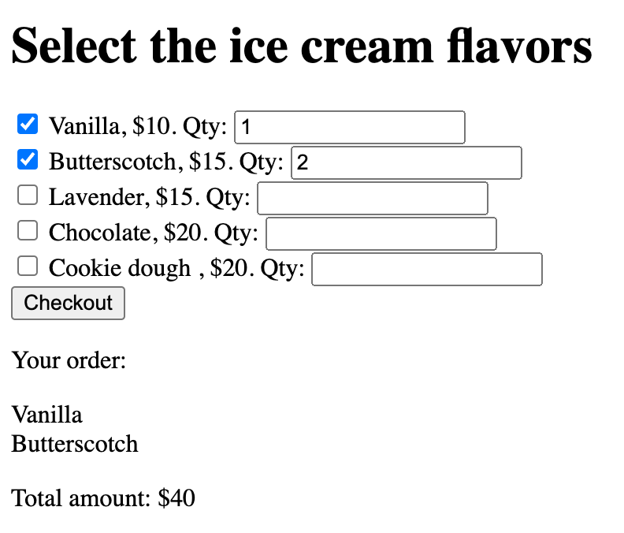
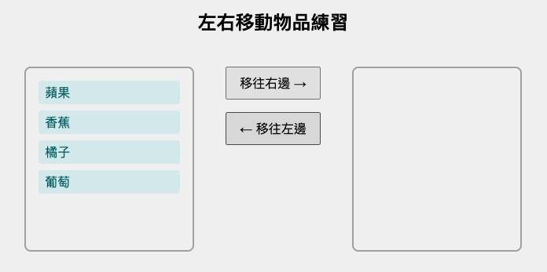
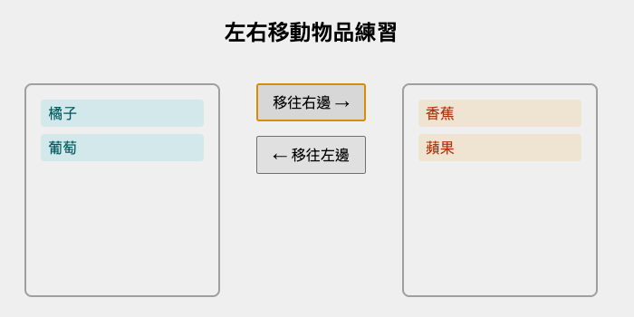

# 第12章練習

## 練習 12.1

考慮以下 HTML 代碼：

```html
<html>
<head>
   <title> lab_03_02 </title>
</head>
<body>
    <div id="divBegin" style="color: red;" >
     Begin
        <ul id="ul1">
            <li>item 1</li>
            <li>item 2</li>
            <li>item 3 (#1) </li>
        </ul>

        <p id="par1">A
            <b> paragraph </b>
        </p>

        <ul>
            <li>Information (#2) </li>
        </ul>

        <div>End (#3) </div>
    </div>
</body>

</html>
```

撰寫 JavaScript 代碼來回答以下問題：

1. 在控制台輸出標記為 `#1` 的元素內容，包括 HTML 標籤。輸出應為 `item 3 <span style="color: red;"> (#1) </span>`。
2. 在控制台輸出標記為 `#2` 的元素內容。輸出應為 `Information (#2)`。
3. 在控制台輸出標記為 `#3` 的元素內容。輸出應為 `End (#3)`。

注意：您不能修改 HTML 代碼。只能撰寫 JavaScript 代碼來存取這些元素。

範例輸出：

```
Q1: item 3 <span style="color: red;"> (#1) </span> 
Q2: Information (#2)
Q3: End (#3) 
```

## 練習 12.2

你被要求建立一個簡單的網頁，顯示所選擇的口味並計算其總金額。

給定的 HTML 頁面如下：

```html
<!DOCTYPE html>
<html lang="en">
<head>
    <meta charset="UTF-8">
    <meta name="viewport" content="width=device-width, initial-scale=1.0">
    <meta http-equiv="X-UA-Compatible" content="ie=edge">
    <title>選擇口味</title>
</head>
<body>
    <h1>選擇冰淇淋口味</h1>
    <div id="flavor-list">
        <input type="checkbox" name="flavor" id="f1" value="10"/> <span>香草</span>, $10. 數量: <input type="text" value="1" /> <br>
        <input type="checkbox" name="flavor" id="f2" value="15"/> <span>奶油糖</span>, $15. 數量: <input type="text" value="1"/> <br>
        <input type="checkbox" name="flavor" id="f3" value="15"> <span>薰衣草</span>, $15. 數量: <input type="text" value="1"/> <br>
        <input type="checkbox" name="flavor" id="f4" value="20"> <span>巧克力</span>, $20. 數量: <input type="text" value="1"/> <br>
        <input type="checkbox" name="flavor" id="f5" value="20"> <span>餅乾麵團</span> , $20. 數量: <input type="text" value="1"/> <br>
    </div>
    <input type="button" value="結帳" onclick="checkout()"/>
    <div>
        <p>您的訂單：</p>
        <p id="flavors"></p>
        <p id="total_amount"></p>
    </div>
</body>

<script>
// 撰寫 checkout 函數
function checkout(){
    // 在此撰寫您的代碼
}

</script>

</html>
```

你不能修改 HTML 代碼。在此限制下，撰寫 `checkout` 函數以完成以下任務：
1. 在 id 為 `flavors` 的 `<p>` 中顯示所選口味，每個口味應該換行顯示。
2. 計算所選口味的總金額，並顯示在 id 為 `total_amount` 的 `<p>` 中。每種口味的小計為價格與數量的乘積。

範例輸出：



## 練習 12.3

考慮以下 HTML 代碼：

```html
<html lang="en">
<head>
    <title>我的標題</title>
    <style>
    h1 {
      text-transform: uppercase;
    }
  </style>
</head>
<body>
    <a href="">我的連結</a>
    Lorem Ipsum 是印刷和排版行業的虛擬文本。
    <h1>我的標題</h1>
    <script>
        console.log('Hello World');
    </script>
</body>
</html>
```

1. 描述此 HTML 代碼的 DOM 樹結構。
2. 使用上述 HTML 代碼，解釋並說明 `nextSibling` 和 `nextElementSibling` 屬性的區別。
3. 使用上述 HTML 代碼，解釋並說明 `body.textContent`、`body.innerHTML`、`body.outerHTML`、`body.innerText` 和 `body.outerText` 屬性在 `body` HTML 元素對象中的區別。

## 練習 12.4

頁面中有兩個區域。區域中有 2 個按鈕。
左邊區域有 4 樣物品。
第一個按鈕是 「移往右邊」，會將左側的第一個物品移到右側的第一個位置，其它物品依序往下移。
第二個按鈕是 「移往左邊」，會將右側的第一個物品移到左側的第一個位置，其它物品依序往下移。
在左側時，物件套用 `left` 樣式，並在右側時套用 `right` 樣式。

請參考以下 HTML 代碼，並撰寫 JavaScript 代碼來完成這個任務：

```html
<!DOCTYPE html>
<html lang="zh-TW">
<head>
    <meta charset="UTF-8">
    <title>左右移動物品練習</title>
    <style>
        .container {
            display: flex;
            justify-content: center;
            align-items: flex-start;
            gap: 40px;
            margin-top: 40px;
        }
        .area {
            width: 180px;
            min-height: 200px;
            border: 2px solid #aaa;
            padding: 16px;
            border-radius: 8px;
        }
        .left {
            background: #e0f7fa;
            color: #006064;
            margin-bottom: 8px;
            padding: 4px 8px;
            border-radius: 4px;
        }
        .right {
            background: #fff3e0;
            color: #bf360c;
            margin-bottom: 8px;
            padding: 4px 8px;
            border-radius: 4px;
        }
        .btns {
            display: flex;
            flex-direction: column;
            gap: 16px;
            justify-content: center;
        }
        button {
            padding: 8px 16px;
            font-size: 16px;
        }
        h2 {
            text-align: center;
        }
    </style>
</head>
<body>
    <h2>左右移動物品練習</h2>
    <div class="container">
        <div class="area" id="leftArea">
            <div class="left">蘋果</div>
            <div class="left">香蕉</div>
            <div class="left">橘子</div>
            <div class="left">葡萄</div>
        </div>
        <div class="btns">
            <button id="toRight">移往右邊 &rarr;</button>
            <button id="toLeft">&larr; 移往左邊</button>
        </div>
        <div class="area" id="rightArea">
            <!-- 右側初始為空 -->
        </div>
    </div>
    <script>
        // 撰寫 JavaScript 代碼
    </script>
</body>
</html>
```

範例輸出 





