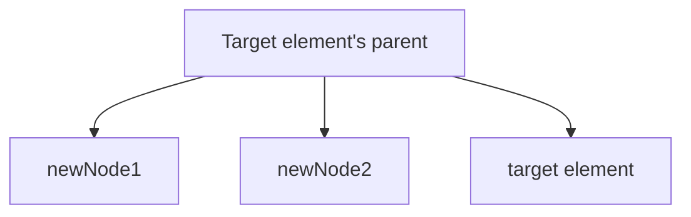
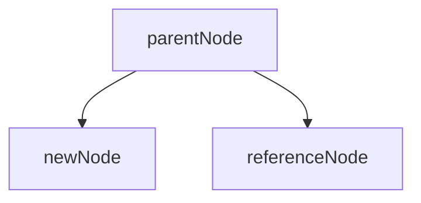

# Lab 02: 在 DOM 中的特定位置插入新元素

根據範例 5，撰寫 JS 程式碼來建立一個帶有文字 "JavaScript is fun!" 的 `h1` 元素，並將其插入到 `fieldset` 元素之前。

使用檔案 [lab_12p2_02.html](lab_12p2_02.html) 來完成這個練習。

選擇以下其中一種方法來完成。

## 方法 1

- 針對目標元素(target element)做操作, `before()` 會自動找到 target element 的父元素。
- 使用 `Element` 的 `before(node1, node2,..., nodeN)` 方法一次插入多個元素到 Element 的前面。
- `node1, node2,..., nodeN` 是要插入的元素。
- `Element` 和 `node1, node2,..., nodeN` 會是相同的父元素。

`targetElement.before(newNode1, newNode2)`:

步驟: 
- 建立一個新的 `h1` 元素，並將其文字內容設置為 "JavaScript is fun!"。
- 取得 `fieldset` 元素。
- 使用 Element 的 `before()` 方法將新的 `h1` 元素插入到 `fieldset` 元素之前。
  - 參考 [MDN Web Docs](https://developer.mozilla.org/zh-TW/docs/Web/API/Element/before) 中的 `Node` 物件的 `before` 方法以獲取更多幫助。

## 方法 2

- 針對某個父節點(parent node)做操作
- 使用 parent node 的 `insertBefore(newNode, referenceNode)` 方法將新元素插入到參考節點之前。
- `newNode` 是要插入的元素, 成為 parent node 下的子元素。
- `referenceNode` 是要插入到其前面的元素，原本就是 parent node 的子元素。

`parentNode.insertBefore(newNode, referenceNode)`:

- 手動取得 `fieldset` 元素的父元素，即`body` 元素。
- 然後使用 `body` 的 `insertBefore` 方法將新元素插入到 `fieldset` 元素之前。
  - 參考 [MDN Web Docs](https://developer.mozilla.org/zh-TW/docs/Web/API/Node/insertBefore) 中的 `Node` 物件的 `insertBefore` 方法以獲取更多幫助。
