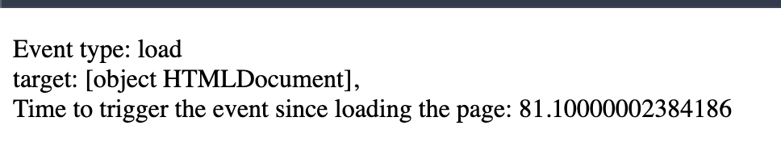
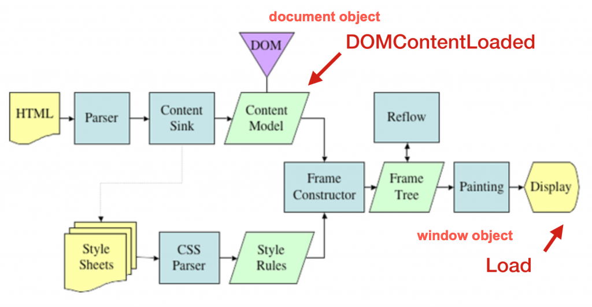
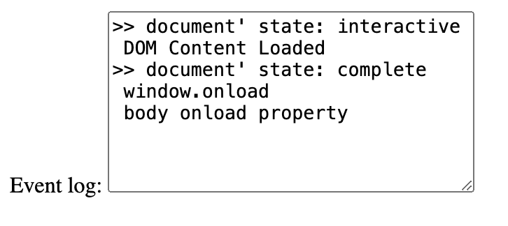
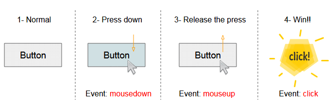
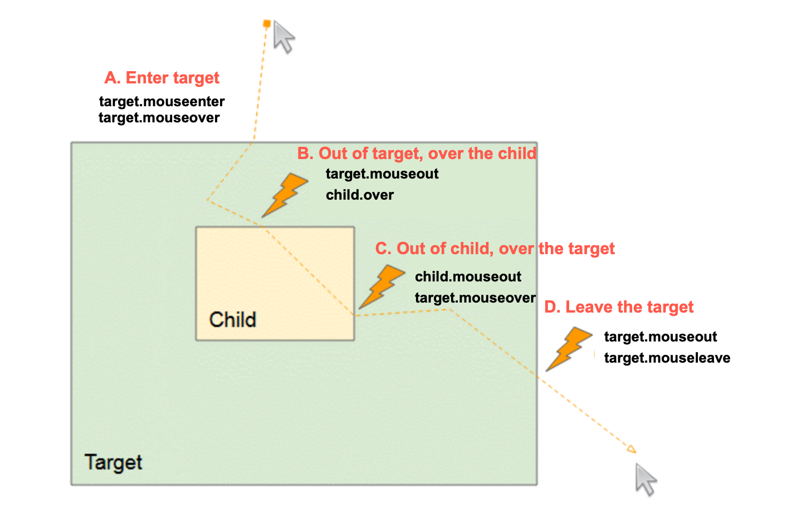
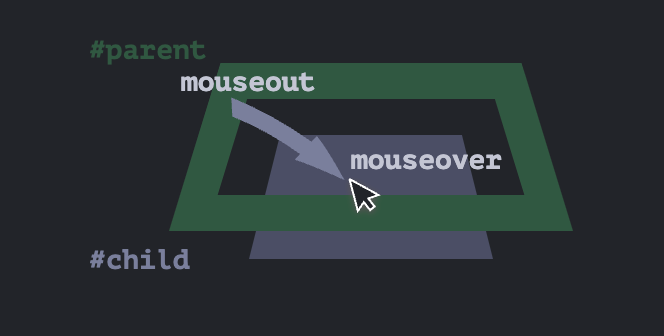
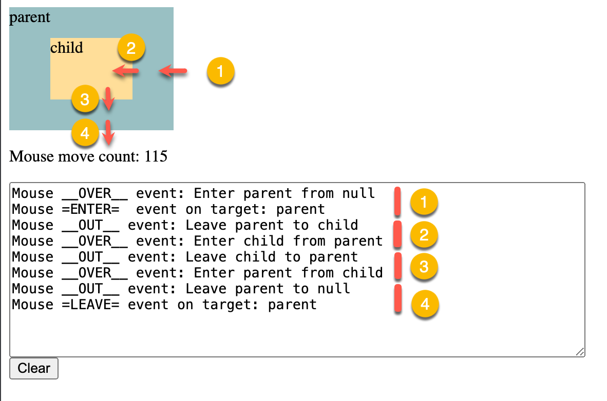
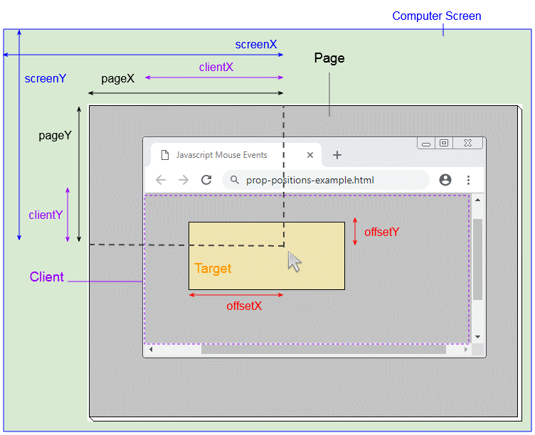

<style>
    .columns {
    display: flex;
  }
  .column {
    flex: 1;
    padding: 10px;
  }
  .column.large{
    flex: 2;
  }
  .small-font {
    font-size: 0.8em;
  }

  section > header,
section > footer {
  position: absolute;
  left: auto;
  right: 90px;
  height: 20px;
}

header {
  top: 30px;
}

footer {
  bottom: 30px;
}
</style>

#  Chapter 13 互動式內容與事件監聽器

## 大綱

本章將探討各種瀏覽器事件，用於建立互動式網頁，包括：

- Part 1:
  - 視窗事件、滑鼠事件
- Part 2
  - DOM 事件的流向(DOM event flow)
- Part 3
  - 拖放事件(Drag and drop events)
- Part 4
  - 元素的 onchange 和 onblur 事件、鍵盤事件、表單提交(Form submission)


## 事件

### 什麼是事件(Event)?

事件是一個信號，表示瀏覽器中發生了某些事情。

有兩種主要的事件類型：
- 視窗(window)及文件(document)事件：當用戶與瀏覽器視窗或文件互動時發生
- API事件：當開發人員與瀏覽器 API 互動或者 API 完成非同步操作時發生。

### 事件監聽器

有三種方式來註冊事件監聽器：
- 行內事件處理器
  - 設定標籤的 `onXxx` 屬性
- 設定 DOM 元素的 `onxxx` 屬性
- 呼叫元素的 `addEventListener()` 方法

## 視窗事件 (Window Events)

Window 物件會產生多種類型的事件來通知開發者流覽器狀態的變化，
- 目的是讓開發者能夠與瀏覽器視窗及文件進行互動。

這些事件類型包括：
- 視窗的 `load` 和 `beforeunload` 事件：當瀏覽器載入頁面，或使用者即將關閉或離開目前頁面時觸發
- `clipboard` 事件：當使用者執行複製、剪下、貼上等操作時觸發
- `network` 事件：當瀏覽器離線或連線時觸發
- `focus` 事件：當元素獲得或失去焦點時觸發
- 以及更多，詳見 [Window - Web APIs | MDN](https://developer.mozilla.org/en-US/docs/Web/API/Window#events)

以下將介紹 `load` 和 `DOMContentLoaded` 事件。

### window 物件的載入事件: load event 

當瀏覽器完成整個頁面的載入（包括所有圖片、腳本及其他資源）時，window 會觸發 `load` 事件。
- 此時保證頁面中的所有元素都已載入完成，可以安全地進行操作 DOM。

注意: 在 `load` 事件觸發之前, 如果你嘗試操作 DOM 元素，可能會導致意外的結果
- 例如獲得 `null` 或 `undefined` 值，因為 DOM 尚未完全載入。

---


<!-- Source: [Understanding Page Load Time](https://docs.newrelic.com/docs/browser/new-relic-browser/page-load-timing-resources/page-load-timing-process/) -->


### 監聽 window 物件的載入事件

由於 `window` 物件沒有對應的 HTML 標籤，因此只能透過下列方式註冊監聽函式：
- 設定 `window` 物件的 `onload` 屬性，或
- 呼叫 `window` 物件的 `addEventListener()` 方法。

以下是註冊 `window` 物件 `load` 事件監聽函式的程式碼範例：
```javascript
window.addEventListener("load", (event) => {});
// or
window.onload = (event) => {...};
```

### 範例 1: 初始化頁面內容

```html
<body>
    <script>
        function initPage(event){
            let message = `Event type: ${event.type} 
                <br/> target: ${event.target}, 
                <br/> Time to trigger the event 
                since loading the page (milliseconds): ${event.timeStamp} milliseconds`;
                
            document.getElementById("display").innerHTML = message;
            console.log(event);
        }
        window.onload = initPage;
    </script>

     <p id="display"></p>
</body>
```

---

Outputs:



程式碼說明:
- `event.timeStamp`: 回傳從時間原點（time origin）到事件被建立時所經過的毫秒數。
  - 以 `load` 事件為例，時間原點是瀏覽器開始載入頁面的時間。

See the complete example in [ex_13_01.html](ex_13_01.html)


### 文件物件(document object)的 DOMContentLoaded 事件
 
`document` 物件的 `DOMContentLoaded` 事件會在 `window` 物件的 `load` 事件之前觸發。
- 當 HTML 文件已經完全載入並解析完成時就會觸發，**不會等待樣式表(stylesheets)、圖片(images)和子框架(sub-frames)等資源載入完成**。




### `DOMContentLoaded` 和 `load` 事件的觸發順序

- `document.DOMContentLoaded` 先觸發，之後再 `window.load` (or its alias: `document.body load event`)
  - `window.load` 事件的別名是 `document.body.load` 事件。


ref: [HTMLElement: load event - Web APIs | MDN](https://developer.mozilla.org/en-US/docs/Web/API/HTMLElement/load_event)

<!-- Src: [重新認識 JavaScript 番外篇 (6) - 網頁的生命週期 - iT 邦幫忙::一起幫忙解決難題，拯救 IT 人的一天](https://ithelp.ithome.com.tw/articles/10197335) -->


### 監聽 `document` 物件的 `DOMContentLoaded` 事件

由於 `document` 物件沒有 `DOMContentLoaded` 特性, 所以只能透過 `addEventListener()` 方法來註冊監聽函式。

```js
document.addEventListener("DOMContentLoaded", yourCallbackFunction);
```

### 範例 2: 註冊 `DOMContentLoaded` 事件的監聽函式


```html
<script>
    const eventLog = document.getElementById('eventLog');
    // monitor the window's load event 
    window.addEventListener('load', (e) => {
        eventLog.value += " window.onload \n";
        console.log(e);
    });

    // Monitor the DOM content state of the document
    document.addEventListener('DOMContentLoaded', (e) => {
        eventLog.value += " DOM Content Loaded \n";
    })
</script>
```

---

Result:



完整範例在 [ex_13_2.html](ex_13_02.html)

### 回顧問題

當 DOM 內容載入完成，但尚未等待樣式表、圖片和子框架載入時，會觸發哪個事件？

  A. `window` 物件的 `load` 事件  
  B. `document` 物件的 `DOMContentLoaded` 事件  
  C. `document.body` 物件的 `load` 事件  

<details>
<summary>Answer</summary>
B. `document` 物件的 `DOMContentLoaded` 事件
</details>

## 滑鼠事件模型 (Mouse Events model)

滑鼠事件模型分成:
- 滑鼠點擊事件 (Mouse click events)
- 滑鼠移動事件 (Mouse movement events)

### 滑鼠點擊事件 (Mouse click events )：單次點擊

滑鼠按鈕點擊時觸發事件的順序如下：
1. `mousedown`：按下滑鼠按鈕但尚未放開
2. `mouseup`：放開滑鼠按鈕
3. `click`：使用者完成一次點擊動作



### `dblclick` 事件 (雙擊事件)

對於 `dblclick` 事件，瀏覽器需要經歷兩次 `mousedown`、`mouseup` 和 `click` 事件的循環，才會觸發 `dblclick` 事件。

Source: [Javascript MouseEvent Tutorial with Examples | o7planning.org](https://o7planning.org/12293/javascript-mouseevent)

### 滑鼠移動事件 (Mouse movement events)

假設 Target Element (target) 是註冊事件的元素，並且有一個子元素 Child Element (child)。

Case A. 當游標由外進入 Target Element 時，會觸發:
- `target.mouseenter` 事件: 游標進入目標元素
- `target.mouseover` 事件: 游標在目標元素或其子元素上的可視範圍上移動

Case B. 當游標進入子元素時，會觸發:
- `target.mouseout` 事件: 游標移出目標元素或其子元素的可視範圍
- `child.mouseover` 事件: 滑鼠在子元素的可視範圍上移動
  - 因為 子元素上沒有註冊監聽器，所以不會觸發 `child.mouseenter` 事件。

---

Case C. 當游標離開子元素時並進入目標元素時，會觸發:
- `child.mouseout` 事件: 游標移出子元素的可視範圍
  - 因為 子元素上沒有註冊監聽器，所以不會觸發 `child.mouseleave` 事件。
- `target.mouseover` 事件: 游標在目標元素的可視範圍上移動

Case D. 當游標完全離開目標元素時:
- `target.mouseout` 事件: 游標離開目標元素的可視範圍
- `target.mouseleave` 事件: 游標離開目標元素

--- 



### Mouse event 總結

- `mouseenter` events: 進入 **target** element 觸發 (不考慮其子元素)
  - 只會觸發一次，當游標進入目標元素時。
- `mouseleave` events: 離開 **target** element 觸發 (不考慮其子元素)
  - 只會觸發一次，當游標離開目標元素時。
- `mouseover` events: 滑鼠在 **target** element 或其 **children** 上的可視範圍上移動
  - 只會觸發一次，當游標進入目標元素或其子元素的可視範圍時。
  - 事件會浮升至父元素
- `mouseout` events: 滑鼠移出 **target** element 或其 **children** 的可視範圍
  - 只會觸發一次，當游標離開目標元素或其子元素的可視範圍時。
  - 事件會浮升至父元素
  
<!--  -->


<!-- The sequence of the mouse events when the mouse moves over the target and its child elements:

 -->

### Demo: 滑鼠事件的差異

- `mouseover` 和 `mouseenter` 事件的差異
  - [Mouseout when leaving for a child](https://javascript.info/mousemove-mouseover-mouseout-mouseenter-mouseleave#mouseout-when-leaving-for-a-child)

- `mouseenter` 和 `mouseleave` 事件的差異
  - [Events mouseenter and mouseleave](https://javascript.info/mousemove-mouseover-mouseout-mouseenter-mouseleave#events-mouseenter-and-mouseleave)

- 也可參考整合範例 [ex_13_03.html](ex_13_03.html)


### 滑鼠座標: 不同的座標系統

四種座標系統:
- 針對: 目標元素、視窗可視範圍(window viewport)、整個頁面(可捲動的頁面)、螢幕(screen)等
- 前綴: offset、client、page、screen



---

滑鼠事件提供四種座標來表示滑鼠的位置：
- offsetX 和 offsetY：滑鼠相對於**目標元素**左上角的位置
- clientX 和 clientY：滑鼠相對於瀏覽器**視窗可視區域**左上角的位置
- pageX 和 pageY：滑鼠相對於整個**可捲動頁面**左上角的位置
- screenX 和 screenY：滑鼠相對於**螢幕**左上角的位置


<!-- <figcaption>  Page, client, and screen coordinates for mouse position. <br/> -->

<!-- source: https://o7planning.org/12293/javascript-mouseevent  -->

### Lab 01

參考 [Lab 13-1](lab_13_01.md)


## 本章重點摘要

- 事件是瀏覽器中發生某些事情的信號，分為視窗/文件事件與 API 事件。
- 註冊事件監聽器有三種方式：行內、設定屬性、addEventListener。
- `window` 的 `load` 事件於所有資源載入後觸發，`document` 的 `DOMContentLoaded` 事件於 DOM 結構解析完成時觸發。
- 滑鼠事件分為點擊事件（mousedown、mouseup、click、dblclick）與移動事件（mouseenter、mouseleave、mouseover、mouseout）。
- 滑鼠事件有多種座標系統（offset、client、page、screen），分別對應不同的參考點。
- 熟悉事件監聽與事件流向，有助於建立互動式網頁。


<script>
    // add the following script at the end of your marp slide file.
    const h2s = document.querySelectorAll('h2');
    h2s.forEach(function(h2, idx){
        h2.innerHTML = `<span class="small-font">${idx + 1}</span> ${h2.innerHTML}`
    })
</script>