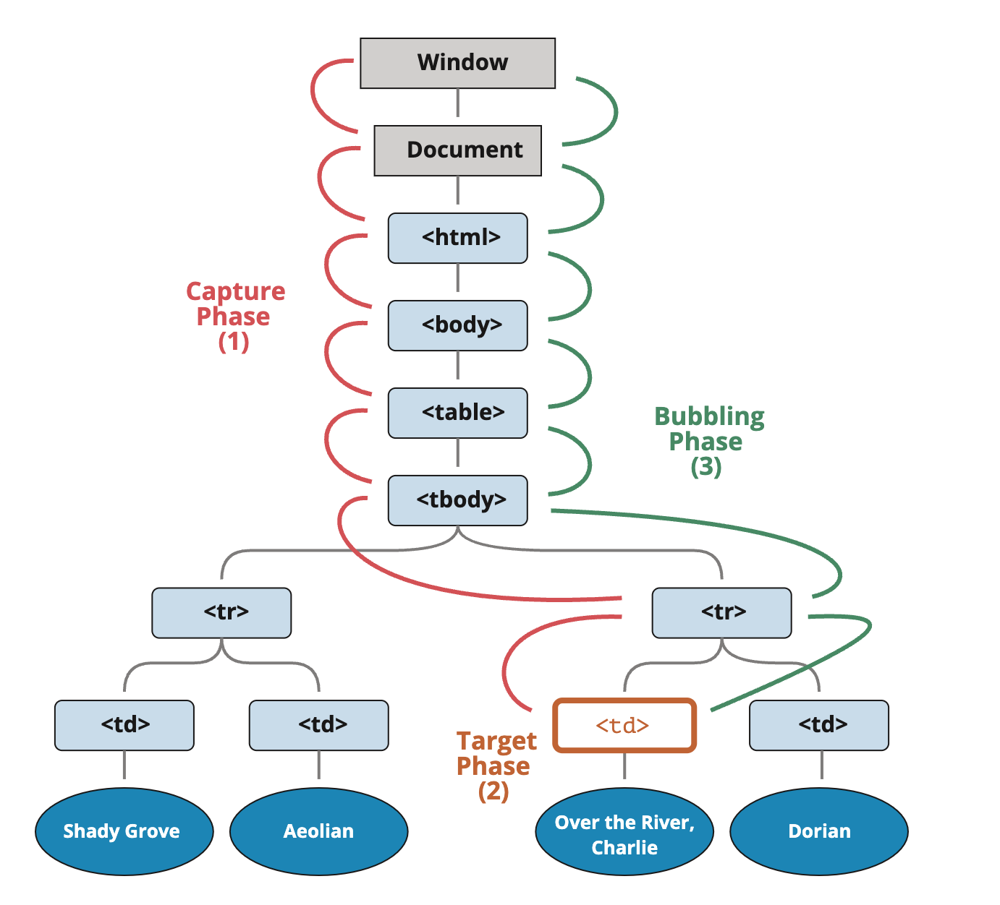
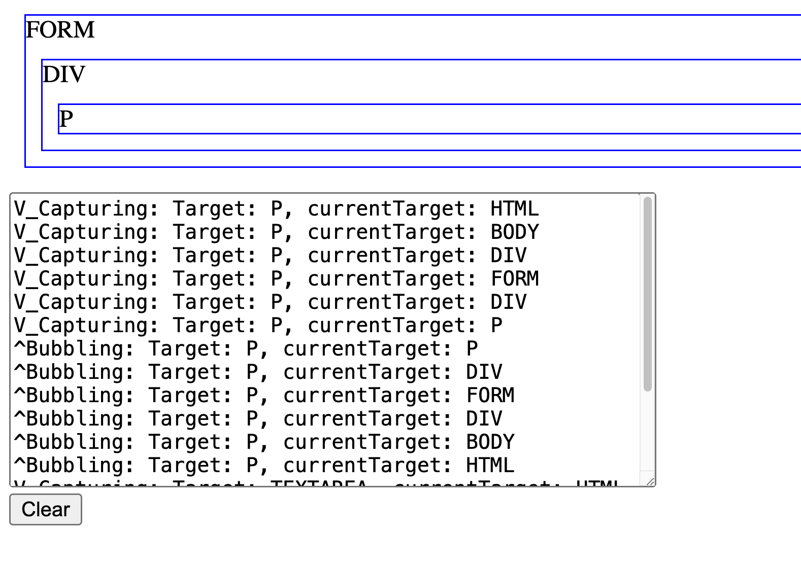

<style>
    .columns {
    display: flex;
  }
  .column {
    flex: 1;
    padding: 10px;
  }
  .column.large{
    flex: 2;
  }
  .small-font {
    font-size: 0.8em;
  }

  section > header,
section > footer {
  position: absolute;
  left: auto;
  right: 90px;
  height: 20px;
}

header {
  top: 30px;
}

footer {
  bottom: 30px;
}
</style>

# Chapter 13 互動式內容與事件監聽器 Part 2

## DOM 事件流向 (DOM Event Flow)

本節將介紹 DOM 事件流的重要概念：
- event propagation（事件傳遞）
- event bubbling（事件浮昇）
- event capturing（事件捕獲）
- event delegation（事件委派）

### 為什麼這些概念很重要？

- 理解瀏覽器在事件被觸發時是如何處理的
- 幫助你決定在階層式的元素架構下，要在**哪裡**註冊事件監聽器來處理事件:
  - 目標元素（target element）、其祖先元素（ancestors）、或其後代元素（descendants）
- 允許你在事件到達目標元素之前或離開目標元素之後處理事件, 例如:
  - 防止事件的預設行為（prevent the default behavior，例如點擊連結時不跳轉）
  - 或停止事件傳遞, 以禁止目標元素執行其監聽器。

## DOM 中的事件傳遞 (Event Propagation in the DOM)

事件會從頂層往下傳遞到目標元素（target element），然後再從底層冒泡回頂層。
- 因為 DOM 是一個樹狀結構，

事件的傳遞分依序成三個階段:
- 捕獲(capturing)
- 到達目標元素(target)
- 浮昇(bubbling)



---

1. **Capturing（捕獲階段）**  
   - 瀏覽器會從根元素（window 物件）開始，將事件往下傳遞到目標元素。
   - 在這個過程中，瀏覽器會依序觸發目標元素祖先的事件處理器。

2. **Target（目標階段）**  
   - 第二階段，瀏覽器會觸發目標元素本身的事件處理器。

3. **Bubbling（冒泡階段）**  
   - 事件會從目標元素往上傳遞回根元素（window 物件）。

<!-- source: [Bubbling and capturing](https://javascript.info/bubbling-and-capturing) -->

### 範例 10-4：展示事件傳遞：捕獲、目標、冒泡

HTML 結構如下：

```html
<div id="eventPropagate">
    <form class="listener">FORM
        <div >DIV
            <p>P</p>
        </div>
    </form>
</div>
```

---

當你點擊 form 內的 <p> 元素時，事件傳遞順序如下：

1. 捕獲階段：HTML > BODY > DIV > FORM > DIV > P（由上到目標）
2. 目標階段：P（目標元素）
3. 冒泡階段：P > DIV > FORM > DIV > BODY > HTML（由目標回到上層）

完整範例請見 ex_11_4.html



##  事件委派模式 (Event Delegation pattern): 事件浮昇的應用

- 實作 **事件委派（Event Delegation）** 模式：
  - 只需在父元素上註冊一個事件監聽器，即可處理所有子元素的事件。

- 優點：節省程式碼行數並提升網頁效能。
  - 只需在共同的祖先元素上設置一個事件處理器，而不必為每個子元素分別設置。

### 使用事件委派模式的情境

請參考 [Event delegation, javascript.info](https://javascript.info/event-delegation) 的以下範例：

- 假設你有一個包含三個按鈕的選單：Save、Load 和 Search。
- 你需要幾個事件監聽器來處理這三個按鈕的點擊事件？

```html
  <div id="menu">
    <button data-action="save">Save</button>
    <button data-action="load">Load</button>
    <button data-action="search">Search</button>
  </div>
```
  [ex_11_5.html](ex_11_05.html)

---

- 使用事件委派模式：只需一個事件監聽器
- 在父元素 `menu` 上註冊一個事件監聽器，即可處理其三個子元素的點擊事件。

- 完整範例請參見 [ex_11_5.html](ex_11_05.html)。
- 你也可以閱讀文章 [Event delegation, javascript.info](https://javascript.info/event-delegation) 以了解更多細節。


## Lab 02

[Lab 13-2: 攔截並阻止元素的監聽器的執行](lab_13_02.md) 
- 事件補獲的應用


### 本章重點回顧

- 了解 DOM 事件流的三個階段：捕獲（capturing）、目標（target）、冒泡（bubbling）
- 掌握事件傳遞的順序與瀏覽器處理事件的方式
- 學會如何在不同階段註冊事件監聽器，並根據需求選擇適當的處理時機
- 熟悉事件委派（event delegation）模式，提升程式碼效率與維護性
- 能夠阻止事件的預設行為與傳遞，靈活控制互動效果
- 實作練習：事件傳遞、事件委派與阻止預設行為

<script src="../h2_numbering.js"></script>

