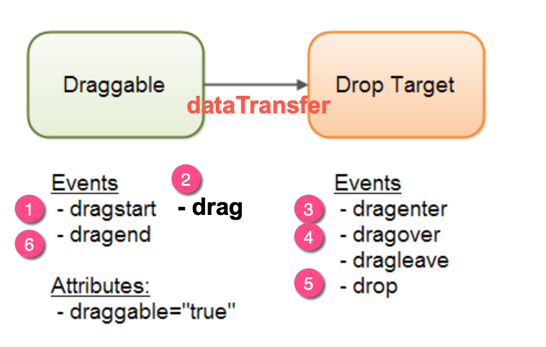
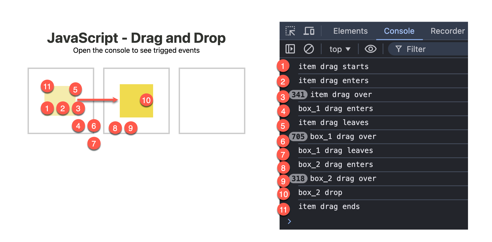
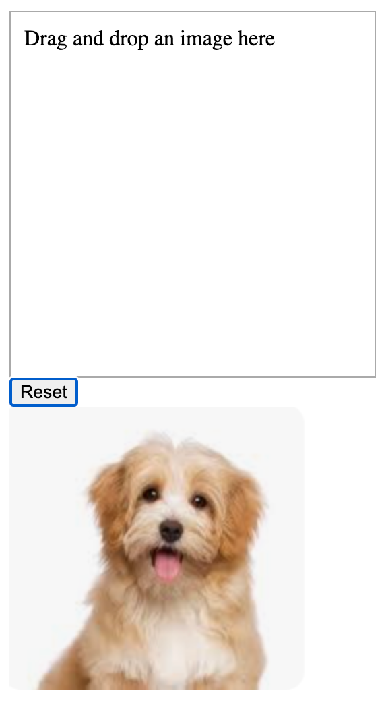
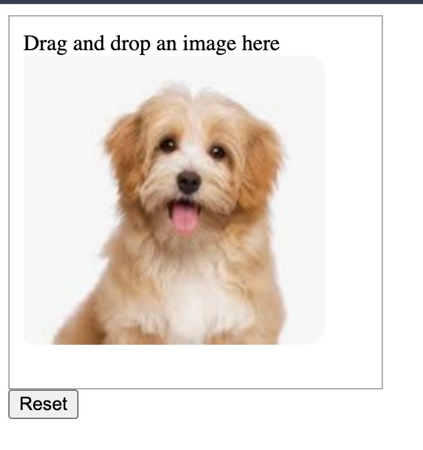

<style>
    .columns {
    display: flex;
  }
  .column {
    flex: 1;
    padding: 10px;
  }
  .column.large{
    flex: 2;
  }
  .small-font {
    font-size: 0.8em;
  }

  section > header,
section > footer {
  position: absolute;
  left: auto;
  right: 90px;
  height: 20px;
}

header {
  top: 30px;
}

footer {
  bottom: 30px;
}

table {
  font-size: 0.8em; 
}


</style>

# Chapter 13 互動式內容與事件監聽器 Part 3

## 拖放事件 (Drag and Drop Events) 

本節介紹 HTML5 的拖放事件 (Drag and Drop Events)，這些事件可以讓使用者將一個元素拖到另一個元素上，並在放開滑鼠按鍵時觸發事件。

## 拖放事件模型

### 事件的觸發及順序

假設有一個 HTML 元素, source, 是可以被拖動的(draggable)
另有一個 HTML 元素, target, 是可以被放置的(droppable)

當 source 被拖動到 target 上時, 會觸發一系列的事件:

| Source | Target | 說明
| --- | --- | ---
| dragstart | - | 當 source 開始被拖動時觸發
| drag | - | 當 source 被拖動時觸發
| - | dragenter | 當 source 進入 target 的邊界時觸發
| - | dragover | 當 source 在 target 上方可視範圍時觸發
| - | dragleave | 當 source 離開 target 的邊界時觸發
| - | drop | 當 source 被放置在 target 上時觸發
| dragend | - | 當結束拖動時觸發。 (放開滑鼠按鍵或按下 ESC 鍵)

---



<!-- Source: https://jenkov.com/tutorials/html5/drag-and-drop.html -->

### 資料的傳遞

在拖放事件中, 將資料放入 [DataTransfer object](https://developer.mozilla.org/en-US/docs/Web/API/DataTransfer) 物件, 傳遞資料給目標元素。

`dataTransfer` 物件提供以下操作方法:
- `setData(format, data)`: 設定要傳遞的資料
  - format: 資料的格式, 例如: text/plain, text/html, text/uri-list
- `getData(format)`: 取得傳遞的資料
- `clearData(format)`: 清除傳遞的資料

#### 何時使用這些方法

- 通常在 `source.dragstart` 事件中使用 `setData()` 方法來設定要傳遞的資料, 
- 在 `target.drop` 事件中使用 `getData()` 方法來取得傳遞的資料。

### 拖放事件的使用步驟

1.設定 source 元素為可拖曳 (draggable)
  - 將 HTML 元素的 `draggable` 屬性設為 `true`。

2.監聽 source 元素的拖曳(drag)相關事件: `dragstart`、`dragend`
  
- 拖曳開始時，瀏覽器會在被拖曳元素上觸發 `dragstart` 事件。
  - 在 `dragstart` 事件的 `dataTransfer` 物件中準備要傳遞的資料。
  - 使用 `dataTransfer.setData()` 設定資料。
- 拖曳結束時，瀏覽器會在被拖曳元素上觸發 `dragend` 事件。
  - 如有需要，可在拖曳結束後修改被拖曳元素。

---

3.監聽 target 拖曳事件: `dragenter`、`dragover`、`dragleave`、`drop`
    - 當被拖曳元素進入可放置元素時，瀏覽器會在該元素上依序觸發 `dragenter`、`dragover`、`dragleave` 事件。

3.1 在 `dragover` handler 中:
- 使用 `event.preventDefault()` 以確保 `drop` 事件能夠被觸發。
    - 預設行為是禁止放置
    - 當被拖曳元素被放下時，會在 target 元素上觸發 `drop` 事件。

3.2 在 drop handler 中:
- 使用 `event.preventDefault()` 來防止瀏覽器的預設行為。
  - 預設行為是禁止放置。
- `dataTransfer.getData()` 取得資料並執行相應操作。

---

4.成為放置目標的條件
- 元素必須監聽 `dragover` 和 `drop` 事件，才能成為有效的放置目標 (drop target)。

### Demo: The series of drag and drop events



下載及查看 [demo_drag_and_drop.html](demo_drag_drop_events.html)


## Example 10: 拖放圖片實作

使用者可以將狗狗圖片拖曳到頁面上方的放置區域。

當圖片被放到放置區域時，該圖片會顯示在放置區域內。

<div class="columns">
<div class="column">
Before dropping:



</div>

<div class="column">
After dropping:


</div>
</div>

### HTML 結構

有以下的 HTML 結構:

```html
<body>
<div class="drop-zone" id="drop-zone">
    Drag and drop an image here
</div>
<button onclick="reset()">Reset</button>

<div id="sourceImg">
    
</div>
```

### 步驟總覽

實作拖放操作的步驟如下：

S1. 設定圖片的 `draggable` 屬性為 `true`，使其可被拖曳。

S2. 讓放置區 `<div id="drop-zone">` 成為有效的放置目標，需監聽 `dragover` 和 `drop` 事件。
  - 當發生 `drop` 事件時，取得被拖曳圖片的 id，並將該圖片作為子元素加入放置區。
  - 當發生 `dragover` 事件時，需呼叫 `preventDefault()` 以允許 `drop` 事件觸發。
      - `dragover` 事件的預設行為是不允許放置。

S3. 在 `dragstart` 事件中，將被拖曳圖片 `` 的 id 設定到 `dataTransfer` 物件中。
  - 在 `dragstart` 事件的處理函式中，將圖片的 id 設定到 `dataTransfer` 物件。

### 步驟 1：讓圖片可拖曳

將圖片元素的 `draggable` 屬性設為 `true`，使其可以被拖曳：

```html
<div id="sourceImg">
    
</div>
```

### 步驟 2：讓放置區 `<div id="drop-zone">` 成為有效的放置目標

分別註冊 `dragover` 和 `drop` 事件的處理函式到目標元素：

```javascript
const dropZone = document.getElementById("drop-zone");
dropZone.ondragover = function (event) {
    // 瀏覽器每隔幾百毫秒會觸發 dragover 事件
    // 需呼叫 preventDefault() 以允許 drop 事件觸發
    event.preventDefault();
    console.log('dragover');
};
// 註冊 drop 事件的處理函式
dropZone.ondrop = function (event) {
    event.preventDefault(); // 防止瀏覽器的預設行為
    console.log('drop');
    // 從 dataTransfer 物件取得被拖曳的資料
    const data = event.dataTransfer.getData("text/plain");
    // 取得被拖曳的元素
    const draggedElement = document.getElementById(data);
    // 將被拖曳的元素加入放置區
    dropZone.appendChild(draggedElement);
};
```

### 步驟 3：將被拖曳圖片的 id 設定到 `dataTransfer` 物件

註冊 `source.dragstart` 事件的處理函式到圖片元素：

```javascript
// 註冊 dragstart 事件的處理函式，準備要傳遞的資料
const dogImg = document.getElementById("dogImg");
dogImg.ondragstart = function (event) {
    // 設定要傳遞的資料
    console.log('dragstart: ', event.target.id);
    event.dataTransfer.setData("text/plain", event.target.id);
};
```

完整範例請參考 [ex_13_10.html](ex_13_10.html)


## 本章重點回顧

- 了解 HTML5 拖放事件 (Drag and Drop Events) 的基本流程與事件順序。
- 熟悉 `dataTransfer` 物件的使用方法，包括 `setData()`、`getData()`、`clearData()`。
- 實作拖放功能時，需將拖曳元素設為 `draggable`，並於 `dragstart` 事件設定資料。
- 放置目標需監聽 `dragover` 及 `drop` 事件，並於 `dragover` 事件中呼叫 `preventDefault()` 以允許放置。
- 實際操作時，要能夠將拖曳的元素動態加入目標區域，完成互動式內容設計。

<script src="../h2_numbering.js"></script>