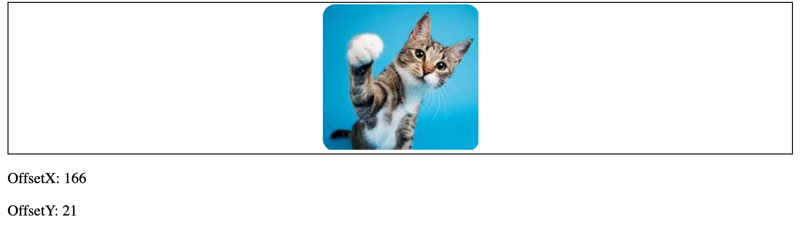
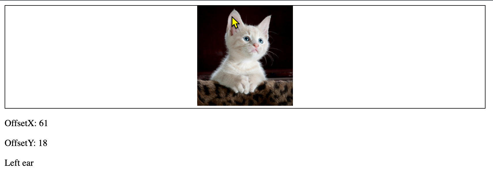

# Labe 01: 滑鼠游標事件實驗
 

在本實驗中，你將學習如何使用 JavaScript 與 HTML 元素互動。
你會在滑鼠進入與離開方框時更換圖片來源，顯示滑鼠的 offset 座標，並偵測滑鼠是否位於特定圖片區域。





## 步驟 1：建立 HTML 結構

請確認你的 HTML 結構正確。你應該有一個 class 為 box 的 div，裡面包含一個 img 元素，還有另一個 div 用來顯示 offset 座標與訊息。

```html
<!DOCTYPE html>
<html lang="en">
<head>
    <meta charset="UTF-8">
    <meta name="viewport" content="width=device-width, initial-scale=1.0">
    <title>Mouse Events Lab</title>
</head>
<body>
    <div class="box">
        
    </div>
    <div>
        <p>OffsetX: <span id="OffsetX"></span></p>
        <p>OffsetY: <span id="OffsetY"></span></p>
        <p id="message"></p>
    </div>
    <script>
        // JavaScript 程式碼將寫在這裡
    </script>
</body>
</html>
```

## 步驟 2：滑鼠進入與離開時更換圖片

加入事件監聽器，當滑鼠進入與離開 box 時更換圖片來源。

```js
let imgBox = document.querySelector('.box');

imgBox.addEventListener('mouseenter', function() {
    console.log('mouse enter');
    imgBox.firstElementChild.src = 'assets/pexels-pixabay-45201.jpg';
});

imgBox.addEventListener('mouseleave', function() {
    console.log('mouse leave');
    imgBox.firstElementChild.src = 'assets/cat_2.jpg';
});
```
這些圖片都在 `assets` 資料夾中。

## 步驟 3：顯示滑鼠 offset 座標

在圖片上加入事件監聽器，當滑鼠移動時顯示 offset 座標。

```js
let img = document.querySelector('img');
img.addEventListener('mousemove', function(e) {
    document.getElementById('OffsetX').innerText = e.offsetX;
    document.getElementById('OffsetY').innerText = e.offsetY;
})
```

## 步驟 4：偵測滑鼠是否在特定區域

加入事件監聽器，偵測滑鼠是否在貓咪左耳（座標 (50,5) 到 (75,30)）區域。

```js
img.addEventListener('mousemove', function(e) {
    let message = document.getElementById('message');
    if (e.offsetX >= 50 && e.offsetX <= 75 && e.offsetY >= 5 && e.offsetY <= 30) {
        message.innerText = '滑鼠在左耳上！';
    } else {
        message.innerText = '';
    }
});
```

## 步驟 5：整合所有 JavaScript 程式碼

請確保所有 JavaScript 程式碼都放在 HTML 檔案的 `<script>` 標籤內。

## 複習問題

1. 當滑鼠進入 box、移動到貓咪圖片上、離開 box 時，會發生哪些事件？
2. 你如何判斷滑鼠是否在圖片的特定區域？使用的是哪一種座標？
3. 若要偵測滑鼠是否在貓咪左耳上，應該使用哪一個事件？
