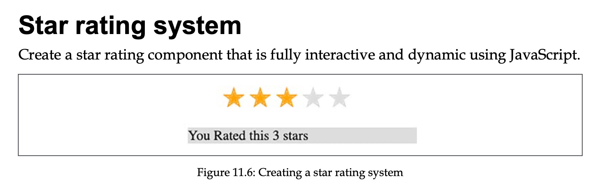
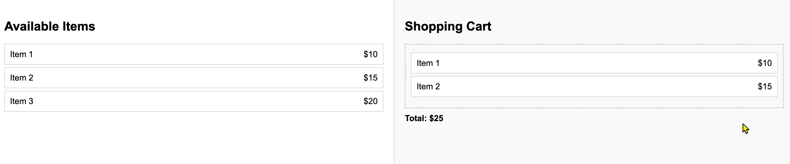

# 第13章練習題

## 練習 13.1 

建立一個星級評分元件。



請建立一個可以顯示星級評分的元件。  
當使用者點擊某顆星時，該星星以及其之前的所有星星都應該被填色。

例如，若使用者點擊第3顆星，則前3顆星都會被填色。

此外，元件應顯示訊息：「你給了 {rating} 顆星」。

你可以使用以下 HTML 和 CSS 作為起始範本：

```html
<head>
  <meta charset="UTF-8">
  <meta name="viewport" content="width=device-width, initial-scale=1.0">
  <title>星級評分</title>
  <style>
    .stars ul {
      list-style-type: none;
      padding: 0;
    }

    .star {
      font-size: 2em;
      color: #ddd;
      display: inline-block;
    }

    .orange {
      color: orange;
    }

    .output {
      background-color: #ddd;
    }
  </style>
</head>

<body>
  <ul class="stars">
    <li class="star">&#10029;</li>
    <li class="star">&#10029;</li>
    <li class="star">&#10029;</li>
    <li class="star">&#10029;</li>
    <li class="star">&#10029;</li>
  </ul>
  <div class="output"></div>
  <script>
  </script>
</body>

</html>
```

## 練習 13.2 拖曳購物項目

在頁面上建立兩個區域。左側區域顯示商品及其價格，右側區域為購物車。



使用者應能將左側的商品拖曳到右側購物車。當商品被放入購物車時，總價應即時更新。

使用者也可以將商品從購物車拖曳出去以移除，總價也要隨之更新。

HTML 範本：

```html
<!DOCTYPE html>
<html lang="zh-Hant">
<head>
  <meta charset="UTF-8">
  <meta name="viewport" content="width=device-width, initial-scale=1.0">
  <title>購物車</title>
  <style>
  body {
    font-family: Arial, sans-serif;
    display: flex;
    margin: 0;
    padding: 0;
    height: 100vh;
  }
  .container {
    display: flex;
    width: 100%;
  }
  .left-area, .right-area {
    flex: 1;
    padding: 20px;
    overflow-y: auto;
  }
  .left-area {
    border-right: 1px solid #ccc;
  }
  .right-area {
    background-color: #f9f9f9;
  }
  .item {
    display: flex;
    justify-content: space-between;
    padding: 10px;
    margin: 5px 0;
    border: 1px solid #ccc;
    background-color: #fff;
    cursor: grab;
  }
  .item.dragging {
    opacity: 0.5;
  }
  .cart {
    border: 2px dashed #ccc;
    min-height: 100px;
    padding: 10px;
  }
  .cart-item {
    margin: 5px 0;
  }
  .total {
    font-weight: bold;
    margin-top: 10px;
  }
  </style>
</head>
<body>
  <div class="container">
  <div class="left-area">
    <h2>可選商品</h2>
    <div class="item" draggable="true" data-price="10">商品 1 <span>$10</span></div>
    <div class="item" draggable="true" data-price="15">商品 2 <span>$15</span></div>
    <div class="item" draggable="true" data-price="20">商品 3 <span>$20</span></div>
  </div>

  <div class="right-area">
    <h2>購物車</h2>
    <div class="cart"></div>
    <div class="total">總計：$0</div>
  </div>
  </div>
  <script>
   
  </script>
</body>
</html>
```
