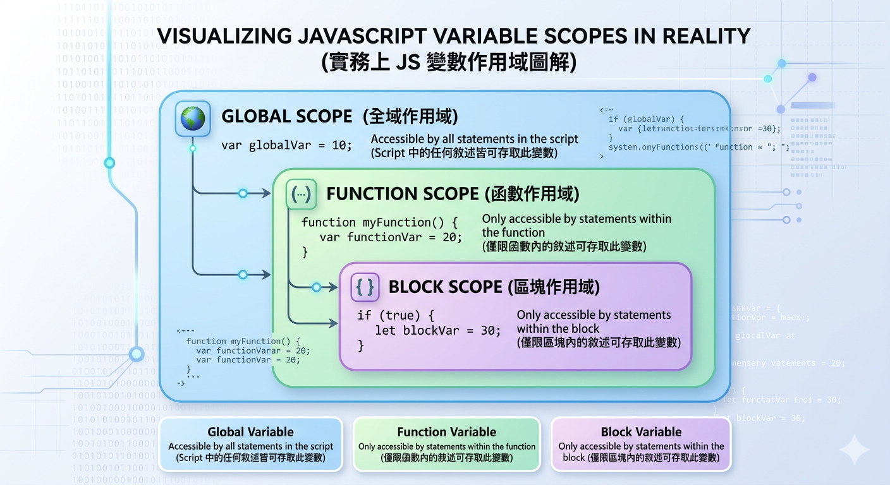

---
export_on_save:
  html: true
puppeteer: 
    displayHeaderFooter: true
    margin:
      top: '15mm'
      bottom: '15mm'
---

# JavaScript 基礎語法 (1)

## 語法架構

### 程式敘述 (Statements)

- JavaScript 程式是由多個 **敘述** (statements) 組成
- 敘述向 JavaScript 解譯器說明要執行的動作
- 敘述中可包含 **變數、運算式、運算子、關鍵字** 等
- 敘述用分號 (;)結束

```js
var x, y;     // 宣告變數 x 和 y
x = 2;        // 將數值 2 指派給變數 x
y = 3;        // 將數值 3 指派給變數 y
```


### 區塊結構 (Blocks)

- 區塊用來組織程式敘述，成為一個邏輯上的單位
- 例如：函數區塊、條件敘述區塊、迴圈區塊等
- 使用 `{}` 定義程式區塊的範圍，區塊符號後不加分號

```js
function func() { // 函數區塊開始
    var x, y;    // 宣告區塊內的變數 x 和 y
    x = 2; y = 3; // 指派數值給變數 x 和 y
    console.log(x + y); // 輸出 x 和 y 的和
} // 函數區塊結束
```

### 註解 (Comments)

為何要寫註寫？

1. **提高可讀性**：註解可以幫助其他開發者（或未來的自己）理解程式碼的目的和邏輯。
2. **方便維護**：當程式碼需要修改或擴展時，註解可以提供有用的背景資訊，減少出錯的機會。
3. **除錯**：在除錯過程中，註解可以幫助標記問題區域或記錄已測試的部分。
4. **文件化**：註解可以作為程式碼的內部文件，記錄重要的設計決策和假設。

註解是良好程式碼習慣的一部分

### 單行與多行註解

單行註解用雙斜線(//)

```js
// 這是單行註解
```

何時使用單行註解？當需要:

- 對程式碼的某一行或某個小區塊進行簡短說明時
 
使用單行註解是最合適的選擇。


多行註解用斜線星號 `/* */`
```js
/*
  這是
  多行註解
*/
```

何時使用多行註解？當需要:

- 對一段程式碼進行詳細說明，或者
- 需要暫時註解掉一大段程式碼進行測試時，
  
多行註解會更方便。

### 範例: 使用 JSDoc 註解撰寫函數說明

```js
/**
 * 加法函數
 * @param {number} a - 加數
 * @param {number} b - 加數
 * @returns {number} 兩數相加之和
 */
function add(a, b) {
    return a + b;
}
```

函數的註解使用 JSDoc 格式，可以提供函數的參數類型、返回值類型以及功能說明，這對於提高程式碼的可讀性和維護性非常有幫助。

你可以使用 Copilot 或 AI 工具來自動生成這些註解。


## 變數宣告


### 變數 (Variables)

- 使用變數來儲存程式執行過程中需要的資料
- 變數是儲存資料的容器，存放在記憶體中
- 變數資料型態會決定變數的大小與儲存方式

- JS 是弱型別語言，變數不需明確指定資料型別
  - JS 會根據資料型別自動判斷


- 執行過程中，變數可動態的指派不同類型的資料

```js
// 動態指派不同類型的資料
var x = 10; // x 是一個數字
x = "Hello"; // 現在 x 是一個字串
x = False; // 現在 x 是一個布林值
```

### 動態型別的好處與壞處

**好處**：

- 執行上的彈性

Q: 以下的函數可以接受那些類型的引數(arguments)？為什麼？

```js
function printValue(x) {
    console.log(x);
}
```

```js
printValue(10); // 可以接受數字
printValue("Hello"); // 可以接受字串
printValue(true); // 可以接受布林值
printValue({ name: "Alice" }); // 可以接受物件
printValue([1, 2, 3]); // 可以接受陣列
```


**壞處**：

型別不清楚，導致:

  - 程式難以閱讀與理解
  - 程式難除錯
  - API 文件不清楚，使用者不確定如何使用函數

```js
function calculateTotal(price, quantity) {
    return price + quantity;
}
```

Q: 呼叫 `calculateTotal()` `price` 和 `quantity` 參數可以接受哪些類型的引數？
Q: 不同型別的引數會導致什麼樣的結果？


```js
let total = calculateTotal(10, 5); // total 會是 15
let total = calculateTotal("10", "5"); // total 會是 "105"
```

**小結**

- 小專案、快速開發：使用動態型別，可以快速撰寫程式碼，增加彈性

- 大型專案、團隊合作：建議使用靜態型別，增加程式碼的可讀性與維護性
  - 使用 TypeScript 將 JavaScript 轉換為靜態型別語言


### 宣告變數

- 在使用變數之前，先宣告變數，告訴 JavaScript 引擎要為變數分配記憶體空間
- 宣告變數使用 `var`、`let` 或 `const` 關鍵字
  - 各有不同的作用範圍與特性

- 當要宣告變數於整個 **函數** 或 **全域** 使用時，使用 `var` 關鍵字 (Function Scope)
  - 函數內的所有敘述都可以存取此變數，包括函數內不同區塊

- 當要限制在**區塊內**使此時，使用 `let` 關鍵字 (Block Scope)
  - 只有在相同區塊內的敘述才可以存取此變數


```js
var x = 10;
{
    let y = 20;
    console.log(x); // 10
    console.log(y); // 20
}
console.log(y); // ReferenceError: y is not defined
console.log(x); // 10
```

- `let y` 限制 `y` 作用於區塊內，區塊外無法存取 `y`，會產生 ReferenceError 錯誤。
- `var x` 作用於整個函數或全域，區塊外仍可存取 `x`，不會產生錯誤。

### 宣告常數

- 當要限制變數不可變更時，使用 `const` 關鍵字
  - 常數必須在宣告時就指定值
  - 常數的值不可再次指定
- 常數的作用範圍與 `let` 相同，只在區塊內有效


```js
const PI = 3.14;
PI = 3.14159; // TypeError: Assignment to constant variable.
```

常數的區塊範圍:
```js
{
    const PI = 3.14;
    var x = 10;
    console.log(PI); // 3.14
}
console.log(PI); // ReferenceError: PI is not defined
console.log(x); // 10
```

### 變數宣告的反思

Q: 在 `{}` 用 `var` 宣告的變數是良好的開發實務嗎？為什麼？會產生什麼樣的問題？

設計意圖上的矛盾:

- `{}` 區塊結構用來組織程式碼，形成邏輯單位, 暗示變數應該限制在區塊內使用
- `var` 宣告的變數作用於整個函數或全域，無法限制在區塊內使用，違反了區塊結構的設計意圖

Q: 為何會有 var, let 和 const 三種宣告方式？

- JavaScript 在 1995 年誕生時只有 `var` 宣告方式, 讓網頁設計師也能快速撰寫腳本, 設計較為寬鬆、彈性高，但也帶來隱藏風險
- ES6 (ECMAScript 2015) 引入 `let` 和 `const` 宣告方式, 提供更嚴格的變數宣告選項, 代表JavaScript 的轉型
  - 從「小型腳本語言」走向「大型應用程式語言」

Q: 我一定要宣告變數再使用嗎？為什麼？

- 如果 JS 沒有限制一定要宣告會發生什麼？
    - 拼字錯誤變成新變數
    - 沒有宣告的變數會成為全域變數，可能會污染全域命名空間，導致難以維護和除錯

```js
// bad smell - 沒有宣告變數，會成為全域變數
function test() {
    x = 10;  // 未宣告變數 x，會成為全域變數
}
console.log(x); // 10
```

Q: 在 JS 下如何強制要求宣告變數？

- 使用 "use strict" 指令，可以強制要求宣告變數，否則會產生 ReferenceError 錯誤

```js
"use strict";
x =10;  //  未宣告變數 x，會產生 ReferenceError 錯誤, x is not defined
console.log(x); 
```

```js
x =10;
console.log(x);  // 在非嚴格模式下，x 會成為全域變數，輸出 10
```

有關進一步 strict model 的說明，參考 [Strict mode - JavaScript | MDN](https://developer.mozilla.org/en-US/docs/Web/JavaScript/Reference/Strict_mode#changes_in_strict_mode)

### 變數初始化

- 變數宣告要求 JS 配置記憶體空間，但沒有指定初始值
- 未初始化的變數會被賦予 `undefined` 值，表示變數尚未賦值

- 開發者必須在使用變數之前，先給予初始值，以避免使用未初始化的變數，產生非預期的錯誤

初始化變數的時機：
1. 宣告時同時賦值: 可以在宣告變數時直接指定初始值

```js
let dogName = "Buddy"; // 宣告變數 dogName 並指定初始值 "Buddy"
```

2. 先宣告，之後再賦值: 可以先宣告變數，之後在程式的其他部分指定初始值

```js
let dogName; // 宣告變數 dogName，但未指定初始值
...
dogName = "Buddy"; // 在程式的其他部分指定初始值 "Buddy"
```


### 未有初始化的變數的副作用

- 未初始化的變數會被賦予 `undefined` 值，表示變數尚未賦值
- `undefined` 與其它資料型別的運算會產生非預期的結果

```js
let x;
console.log(x+5); // NaN
console.log(x + "Hello"); // "undefinedHello"
```

最佳實務作法:
- 變數宣告時應盡量指定初始值, 避免產生非預期的錯誤

### 變數命名規則

JS 要求: 
- 變數名稱可以包含字母、數字、底線、美元符號
- 變數名稱不可以數字開頭
- 變數名稱區分大小寫
- 變數名稱不可以使用保留字 (Reserved Words)

Ex 2-5: 變數命名規則
```js
var myVar = 10;
var _myVar = 20;
var $myVar = 30;
var 1myVar = 40; // SyntaxError: Invalid or unexpected token
```


最佳實務:
- 變數名稱應具有描述性，易於理解
- 變數名稱應使用駝峰式命名法 (camelCase)
  - 第一個單字小寫，後續單字首字大寫
  - 例如：`myVariableName`
  - 也可以使用底線分隔 (underscore)
  - 例如：`my_variable_name`
- 但不建議使用連字號 (dash), 會被當作減號
  - 例如：`my-variable-name`


```js
var myVariableName = 10;
var my_variable_name = 20;
```

### 糟糕的命名（Sloppy Naming）

以下函數要做什麼？你能一眼看出來嗎？
```js

function calc(a, b, c) {
  let x = a * b; // a 是什麼？x 是什麼？
  if (c) {
    x = x - c;   // c 是折扣嗎？還是稅金？
  }
  let y = x * 1.05; 
  return y;
}

console.log(calc(100, 2, 50)); // 輸出 157.5... 這是什麼鬼？
```

使用有意義的變數名稱，可以讓程式碼更易讀、更易理解，減少除錯的難度。

修改後的版本：

```js
function calculateTotalPrice(price, quantity, discount) {
  let totalPrice = price * quantity; // 計算總價
  if (discount) {
    totalPrice = totalPrice - discount; // 扣除折扣
  }
  let finalPrice = totalPrice * 1.05; // 加上稅金
  return finalPrice;
}

console.log(calculateTotalPrice(100, 2, 50)); // 輸出 157.5, 這是總價扣除折扣後加上稅金的結果
```

### Lab 01

[Lab 01: 變數宣告與作用域](labs/ch2_lab_01.md)


##  資料型別 (Data Type)

- 不同類型的資料在記憶體中有不同的儲存方式和運算特性
- 不同資料型別的變數，不能直接進行運算，需要進行型別轉換 (Type Conversion) 才能運算

### JS 引擎中的記憶體區域畫分


堆疊(Stack) 和堆積(Heap) 記憶體結構的運作方式。

- 堆疊(Stack)：用於儲存區域變數和方法呼叫資訊(如 main() 和 print() 方法)。 
- 堆積(Heap)：用於動態分配記憶體，儲存物件實例。 

圖中線顯示了堆疊上的變數參考(Reference) 指向堆積中實際的物件資料。

- 藍色是 const string, 一種**原生型別**，儲存在堆疊中
- 其它產生是**物件型別**，儲存在堆積中，變數內存的是指向實際資料記憶體位置的參考(reference or pointer)
  - eg. object, array, function

以下對「原生型別」和「參考型別」進行說明。

### 原生型別 (Primitive Types)

- 原生型別 (Primitive Types) 不是物件，沒有方法
  - 資料儲存在堆疊 (Stack) 中

6 種原生型別: 

- 字串 (string)
- 數字 (number)
- 布林 (boolean)
- 未定義 (undefined)
- 空值 (null)
- 符號 (symbol) (ES6 新增) (超過本章節範圍，暫不討論)

注意: 原生型態的名稱是全部小寫，如果使用大學開頭的名稱，則會被當作物件型別。
  - 例如： string 是原生型別，String 是物件型別

Ex. 原生型別： string, number, boolean
```js
var str = "Hello";
var num = 123;
var bool = true;
```

### Null 與 Undefined

- `null`：表示變數無值，是一個空值
  - 可用來清空變數值
  - 表示已作過賦值動作，但變數值為空 (明確設定為空值)
- `undefined`：表示變數尚未賦值
  - 當變數宣告後，但未指定值時，變數值為 `undefined`

Q: 為何要區分 null 和 undefined？

- undefined 表示「還沒有值」, 系統層面的「預設狀態」
- null 表示「刻意沒有值」, 程式設計師層面的「語意選擇」
  - null 的設計初衷：它被預期作為物件的佔位符（代表「這裡未來會放一個物件，但現在是空的」）。

語義上的區分有助於程式設計師表達意圖，並且在除錯時更容易理解變數的狀態。

因為語義上的不同，null 和 undefined 在運算中的行為也不同：

```js
let discount; // discount 是 undefined，表示尚未賦值
console.log(100* (1 - discount)); // NaN, undefined 無法轉換為數字
```

```js
let discount = null; // discount 是 null，表示刻意沒有值
console.log(100*(1- discount)); // 100, null 被強制轉換為數字 0
```


### 參考型別 (Reference Type)(Object)

除了原生型別外，其它型別都是參考型別(或者稱物件型別)

物件型別的資料型態舉例:
- 陣列 (Array)
- 函數 (Function)
- 日期 (Date)
- 函數 (Function)
- 物件 (Object)

```js
var arr = [1, 2, 3];  // 陣列
var fn = function() { return "Hello"; }; // 函數
var obj = { name: "John", age: 25 }; // 物件
```

Q: 以下的結果是什麼？為什麼？

```js 
let arr1 = [1, 2, 3];
let arr2 = arr1;

arr2.push(4);

console.log(arr1); // ?
console.log(arr2); // ?
```

```
Stack                      Heap
-----                      -----
arr1  ───────────────►   [1,2,3]
arr2  ───────────────┘
```

Q: 以下的結果是什麼？為什麼？

```js
let a = [1, 2];
let b = a;

b = [9, 9];

console.log(a); // ?
console.log(b); // ?
```


`let a = [1, 2];`
```
Stack                      Heap
-----                      -----
a  ───────────────►     [1, 2]
```

`let b = a;`

```
Stack                      Heap
-----                      -----
a  ───────────────►     [1, 2]
b  ───────────────┘
```

`b = [9, 9];`

```

Stack                      Heap
-----                      -----
a  ───────────────►     [1, 2]

b  ───────────────►     [9, 9]
```


### 參考型別與原生型別的差異

- 資料儲存方式不同
  - 原生型別的資料儲存在堆疊 (Stack) 中
  - 參考型別的實際資料儲存在 Heap 中, 變數內存的是指向實際資料記憶體位置的參考(reference or pointer)


## 變數的作用域 (Scope)

- 變數的作用範圍 (Scope) 決定變數的可存取範圍

### Q: 實務上為何要有不同的變數作用範圍？

在實務開發中，不同的變數作用範圍有其明確目的：

- **避免命名衝突**：  
  若所有變數都是全域變數，名稱很容易重複，導致錯誤或覆蓋既有資料。

- **降低副作用 (Side Effects)**：  
  變數若只存在於函數或區塊內，可避免被外部程式意外修改，提高程式穩定性。

- **提升可讀性與可維護性**：  
  看到變數的宣告位置，就能推測它的可存取範圍，讓程式結構更清楚。

- **強化封裝與模組化設計**：  
  將資料限制在特定範圍內，有助於設計獨立、可重用的函數與模組。

- **改善記憶體管理**：  
  區域變數在函數執行完畢後可被垃圾回收機制回收，避免長期占用記憶體。

### 變數作用範圍分類

- 全域變數 (Global Variable)：Script 中的任何敘述皆可存取此變數
- 函數變數 (Function Variable)：僅限函數內的敘述可存取此變數
- 區塊變數 (Block Variable)：僅限區塊內的敘述可存取此變數



宣告規則及範例
- 全域變數：用 `var` 宣告在函數外，所有範圍的敘述皆可存取此變數 
- 函數變數：用 `var` 宣告，只有在此函數內的敘述可存取此變數
- 區塊變數：在區塊內宣告的變數, 用 `let` 或 `const` 宣告。
  - 只有在相同區塊內的敘述才可以存取此變數，區塊外無法存取此變數

---

變數作用範圍範例

```js
var globalVar = "全域變數";

function test() {
    var localVar = "函數變數";
    {
        let blockVar1 = "區塊變數1";
        console.log(globalVar); // 可存取
        console.log(localVar); // 可存取
        console.log(blockVar1); // 可存取
        console.log(blockVar2); // 錯誤！區塊變數2 無法存取
    }
    {
        let blockVar2 = "區塊變數2";
    }
    console.log(localVar); // 可存取
    console.log(blockVar1); // 錯誤！區塊變數1 無法存取
    console.log(blockVar2); // 錯誤！區塊變數2 無法存取
}
console.log(globalVar); // 可存取
console.log(localVar); // 錯誤！區域變數無法存取
test();
```

### 作用域重疊 (Scope Shadowing)

考慮以下的程式碼，請問執行後的結果為何？為什麼呢？

```js
var x = 10;
function test() {
    var x = 20;
    console.log(x);
}
test();
```

在上述程式碼中，函數 `test()` 內部宣告了一個與全域變數 `x` 同名的區域變數 `x`。當 `console.log(x)` 執行時，它會優先存取區域變數 `x`，因此輸出結果為 `20`。這種現象稱為作用域重疊 (Scope Shadowing)，即內部作用域的變數遮蔽了外部作用域的同名變數。


### 變數提升 (Hoisting)

考慮以下的程式碼，請問執行後的結果為何？ 
為何可以在宣告變數 `a` 之前就使用它？

```js
console.log(a);
var a = 10;
console.log(a);
```

JS Engine 在執行程式碼之前，會先進行**變數提升 (Hoisting)**，將所有使用 `var` 宣告的變數宣告提升到作用域的最上方。
所以，我們可以不用先宣告變數 `a` 就使用它。

所以上述程式碼等同於以下程式碼

```js
var a;   // 變數宣告提升並初始化為 undefined
console.log(a); // undefined
a = 10;     
console.log(a); // 10
```

簡單說, 變數提升 (Hoisting) 的功能:
- 在程式執行前，JS 引擎會將變數(及函數)宣告提升至作用域的最上方
- 但只有宣告會被提升，賦值不會被提升


### Q: 變數提升(Hoisting) 對開發者有什麼好處？

- 提升程式可讀性: 允許先使用函式，後定義，讓主要邏輯優先，細節放後面。
  - 更接近人類的思考方式，先思考使用，再補上細節。
- 提升程式靈活性: 允許開發者在變數與函式定義前就使用它們，方便程式撰寫。

Ex 先執行函數，後定義函數
```js
greet(); 

function greet() {
    console.log("Hello, world!");
}
```


上述程式碼等同於以下程式碼

```js
function greet() {
    console.log("Hello, world!");
}
greet();
```

### var 與 let 的變數提升 (Hoisting)

- 變數提升只會提升變數宣告，不會提升變數賦值
- var 和 let 都會有變數提升行為不同。

`var` 宣告的變數會被提升並初始化為 `undefined`，因此在宣告之前使用該變數不會產生錯誤，但會得到 `undefined` 的值。

```js
console.log(a);  // undefined, 因為 var a 被提升並初始化為 undefined
var a = 20;
console.log(a); // 20, 因為 a 已經被賦值為 20
```

`let` 宣告的變數也會被提升，但不會被初始化，因此在宣告之前使用該變數會產生 ReferenceError 錯誤。

```js
console.log(a); // ReferenceError: Cannot access 'a' before initialization, 因為 let a 被提升但未初始化
let a = 20;
console.log(a);  // 20, 因為 a 已經被賦值為 20
```

`let` 變數在未經初始化前處於「暫時性死區 (Temporal Dead Zone), TDZ」，是無法使用的。

Q: 為什麼 `let` 會有這樣的行為？這樣的設計有什麼好處？

TDZ 的目的：
- 防止意外存取未初始化變數
- 強迫開發者遵守「先宣告後使用」
- 提高程式安全性

這是 ES6 改善 var 設計缺陷的一部分。

let 及 const 皆具有 TDZ 行為，建議在開發中優先使用 let 和 const 來宣告變數，以避免 var 的提升行為帶來的潛在問題。


## 複習問題

---

### 一、概念理解題

1. 說明「宣告」與「賦值」的差異。為什麼兩者不能混為一談？
2. 為什麼在現代 JavaScript 中建議使用 `let` 或 `const` 而非 `var`？
3. 說明 `undefined` 與 `null` 在語意上的差異，並舉一個實務情境說明何時應使用 `null`。
4. 什麼是原生型別（Primitive Type）？與參考型別（Reference Type）在記憶體儲存方式上有何不同？
5. 什麼是作用域（Scope）？為什麼大型專案特別需要明確的作用域設計？

---

### 二、技術緣由與設計決策題

6. JavaScript 為何在 ES6 之前只有 `var`？ES6 引入 `let` / `const` 的設計動機是什麼？
7. 為什麼 `let` 具有 TDZ（Temporal Dead Zone）設計？這樣的設計解決了什麼問題？
8. 在什麼情況下使用 `const` 會比 `let` 更好？請說明你的設計考量。
9. 為什麼動態型別在小型專案中具有優勢，但在大型專案中可能帶來風險？
10. 為什麼在實務上應盡量避免未宣告變數？strict mode 在其中扮演什麼角色？

---

### 三、程式碼閱讀與分析

11. 請說明以下程式的輸出結果，並解釋原因：

```js
console.log(a);
var a = 10;
```

12. 請說明以下程式為何會產生錯誤：

```js
console.log(b);
let b = 20;
```

13. 請分析以下程式的結果，並說明 Stack / Heap 的概念：

```js
let arr1 = [1, 2];
let arr2 = arr1;
arr2.push(3);

console.log(arr1);
console.log(arr2);
```

14. 請分析以下程式的結果：

```js
let x = 5;

{
    console.log(x);
    let x = 10;
}
```

15. 以下程式有何設計問題？請說明可能產生的風險。

```js
function calculate(a, b) {
    total = a + b;
    return total;
}
```


<script src="../js/h1_numbering.js"></script>

