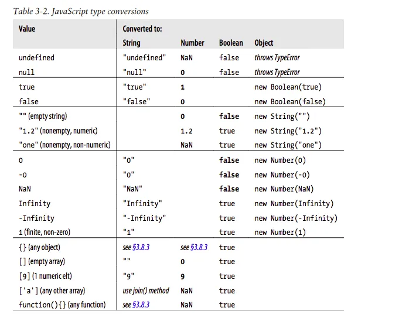

# JavaScript 基礎語法 (2)

不同型別的值不能直接運算或比較，必須先轉換成相同型別。

JS 中提供自動型別轉換 (Type Coercion) 和明確型別轉換 (Explicit Type Conversion) 兩種方式來處理不同型別的值。

## 轉換型別

## 型別自動偵測

- JS Engine 會自動偵測變數型別, 無需於宣告時指定
  - 在執行期偵測
- 同一個變數可在不同時間指定不同型別的值

```js
let foo = 42;    // foo is a number
let foo = 'bar'; // foo is a string
let foo = true;  // foo is a boolean
let foo;        // foo is undefined
```

### 判斷變數內的資料型別

Q: 執行過程中，如何判斷變數內的資料型別？

- 使用 `typeof` 運算子
  - 回傳變數的資料型別

```js
let foo = 42;
console.log(typeof foo); // number
let bar = '42';
console.log(typeof bar); // string
```

## 型別轉換

- 不同型別的值必須先轉換成相同型別才能進行運算或比較

### 不同型別的值間的運算與比較

考慮以下例子:

```js
let x = 10;
let y = '5';
```

x + y 的結果是什麼？

- `x` 是數字，`y` 是字串, 兩者型別不同，無法直接相加
- 因為開發者沒有明確指定如何轉換，JS 會依內建規則自動轉換型別
- `+` 運算子的轉換規則，如果其中一個運算元是字串，則另一個運算元也會被轉換成字串
- 因此 `x` 會被轉換成字串 "10"，然後與 `y` 進行串接，結果是 "105"。

### JS 的型別轉換方式

- 自動轉換型別
  - JS 可以依內建規則自動轉換型別 
  - 稱為 [Type Coercion](https://developer.mozilla.org/en-US/docs/Glossary/Type_coercion) 或 Implicit Type Conversion

- 明確型別轉換 或 Explicit Type Conversion
  - 程式設計師 可使用 轉換函數 來明確轉換型別
  - e.g. `String()` 函數將數字轉換成字串, `Number()` 函數將字串轉換成數字
`
## 明確型別轉換(Explicit Type Conversion)

- 使用函數明確轉換型別
- 數字轉字串: `String()` 或 Number 物件的 `toString()` 方法
- 字串轉數字: `Number()` 或 `parseInt()` 或 `parseFloat()` 函數
- 轉佈林值: `Boolean()` 函數

### 字串轉數字

情境: 10進位數字字串轉換成數字 "42" -> 42
  
- 使用 Number() 函數
  

```js
let y = 1 + Number("42"); // 43
```

情境: 其他進位數字字串轉換成數字 "0x42" -> 66 (16進位)
- 使用 [parseInt()](https://developer.mozilla.org/en-US/docs/Web/JavaScript/Reference/Global_Objects/parseInt) 函數 或 parseFloat() 函數

```js
let y = 1 + parseInt("42", 16); // 67 (16 進位)(base 16)
let z = 1 + parseInt("42", 8); // 35 (8 進位)(base 8)
```

### Number() 函數: 將字串轉換為數字

- Number() 函數是一個建構函數(建構子 Constructor)，用來建立一個 Number 物件, 是一種參考型別
- Number() 函數也可以當作一般函數使用，將字串轉換成數字，回傳一個原始型別的 number 值

```js
let x = Number(42); // x 是一個 Number 物件
console.log(typeof x); // number
```

### 數字轉字串

情境: 數字 10 轉換成字串 "10"
- 使用 String() 函數 或 Number 物件的 toString() 方法

```js
var num = 10;
// 使用 String() 函數
var str1 = String(num); // "10"
// 使用 Number 物件的 toString() 方法
var str2 = num.toString(); // "10"
```

情境: 數字 10 轉成 2 進位字串 "1010"
- 使用 Number 物件的 toString() 方法
- 也可轉成其它進位數字字串

```js
var num = 10;
var str = num.toString(2); // "1010"
```

### 轉換為布林值

- 使用 Boolean() 函數

```js
let x = Boolean(0); // false
let y = Boolean(1); // true
let z = Boolean(undefined); // false
let w = Boolean(null); // false 
```
### 反思

Q: 何時該使用明確型別轉換？何時該使用自動型別轉換？


## 自動型別轉換(Type Coercion)

- 可以使用運算子的 **預設轉換規則** 執行明確型別轉換
  - 可以節省時間，但會降低程式碼可讀性, 因為這些規則可能不是很直觀

### 轉換為字串

- 使用 `+` 運算子
  - 如果其中一個運算元是字串，則另一個運算元也會被轉換成字串
  - `+` 符號有兩種功能: 加法運算子和串接運算子 (運算子多載 Overloading) 
  - 若其中一個運算元是字串，則使用 **串接運算子** 功能
  - 否則使用 **加法運算子** 功能
    - 所有運算元都會被轉換成數字

```js
let x = 10 + '1';
console.log(x); // "101"
let y = 1 + true;   // true 被轉換成 1
console.log(y); // 2
let z = '1' + true; // true 被轉換成 "true"
console.log(z); // "1true"
```

### 轉換為數字

- 在字串前使用 `+` 符號表示將字串轉換成數字
- 或者使用 `-` 運算子減去 0 來轉換為數字
  - 執行減法時, 非數字的運算子(operand)會被轉換成數字

```js
var x = '10' - 0;
console.log(x); // 10
var y = +'10';
console.log(typeof y); // number
```

### 轉換為布林值

使用 `!!` 強迫轉換為布林值

```js
console.log(!!undefined);  // false
console.log(!!null); // false
console.log(!!0); // false
console.log(!!''); // false
console.log(!!NaN); // false
console.log(!!1); // true
```


### JS Type Conversion summary 



### Quick Practice

Q: 解釋以下運算的結果，並說明 JavaScript 的自動型別轉換規則：

```javascript
console.log(5 + "10");
console.log("5" - 2);
console.log(true + 1);
console.log("3" * "2");
console.log(1 + true + "2");
```

## 不同型別的大小比較

### 字串和數字比較前要先轉換成相同型別

- 字串與數字比較時，會先將字串轉換成數字

```js
var x = 'abc';
var y = 10;
console.log(x > y); // false
```
自動轉換規則:
1. 比較時，JS 會嘗試將字串 'abc' 轉換成數字，因為另一個運算元是數字。
2. 轉換後，'abc' 變成 NaN (Not a Number)。
3. NaN 與任何數字比較都會返回 false。因此，`x > y` 的結果是 false。


### 相等比較: 相等 (==) 與嚴格相等 (===)

開發者可決定是否允許自動型別轉換來進行相等比較。

啟用自動型別轉換的相等比較
- `==` 運算子
  - JS 會自動轉換型別
  - 轉換後兩個值相等，則返回 true

不啟用自動型別轉換的相等比較
- `===` 運算子
  - 不會自動轉換型別
  - 必須型別與值都相等，才返回 true

```js
console.log(5 == "5");  // true
console.log(5 === "5"); // false
```


## 總結

- JS 在宣告變數時，不需指定型別
  - 執行期 JS 會自動偵測變數型別
- 不同型別的值必須轉換成相同型別才能進行: 運算或比較
- JS 可以自動轉換型別 (Type Coercion)
  - 依內建規則轉換，簡省時間，但程式碼不易讀
- 程式設計師 可使用 轉換函數 來明確轉換型別


<script>
    // add the following script at the end of your marp slide file.
    const h2s = document.querySelectorAll('h2');
    h2s.forEach(function(h2, idx){
        h2.innerHTML = `<span class="small-font">${idx + 1}</span> ${h2.innerHTML}`
    })
</script>