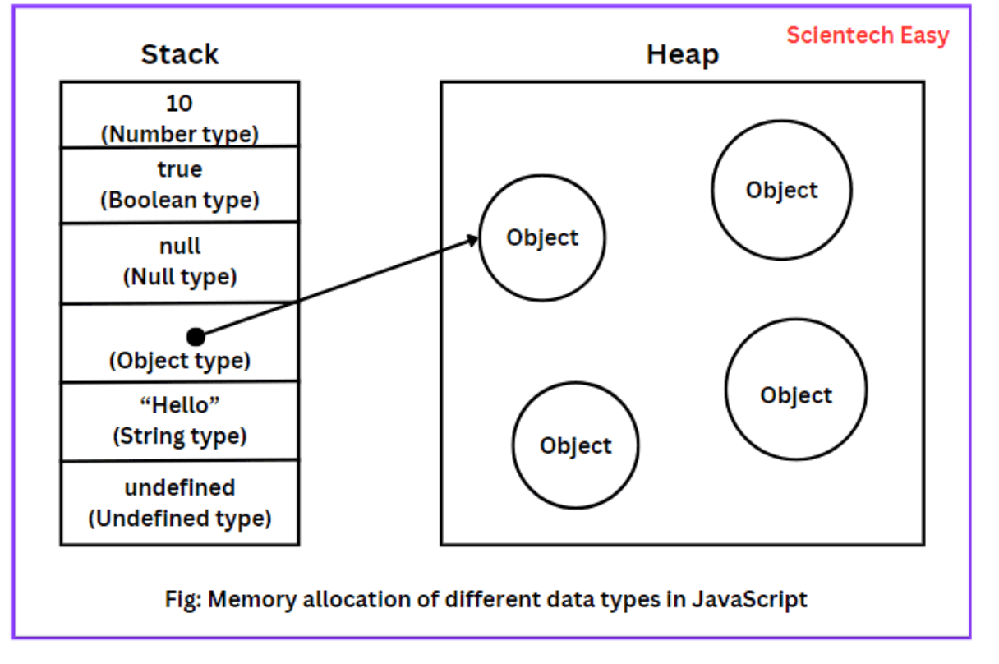

<style>
    .columns {
    display: flex;
  }
  .column {
    flex: 1;
    padding: 10px;
  }
  .column.large{
    flex: 2;
  }
  .small-font {
    font-size: 0.8em;
  }

  section > header,
section > footer {
  position: absolute;
  left: auto;
  right: 90px;
  height: 20px;
}

header {
  top: 30px;
}

footer {
  bottom: 30px;
}

</style>

# JavaScript 基礎語法 (1)

## 語法架構

### **程式敘述 (Statements)**
- JavaScript 程式是由 **程式敘述** (statements) 組成
  - 包含 **變數、運算式、運算子、關鍵字、備註** 等
- 敘述用分號 (;)結束

```js
var x, y;     //第1行程式敘述
x = 2;        //第2行程式敘述
y = 3;        //第3行程式敘述
```

### 區塊結構 (Blocks)
- 用來組織程式敘述, 執行整個區塊內的敘述
- 例如: 函數、條件敘述、迴圈等
- 使用 `{}` 定義程式區塊, 區塊符號後不加分號

```js
function func() { // 函數區塊
    var x, y;
    x = 2; y = 3;
    console.log(x + y);
}
```

### 註解 (Comments)

為何要寫註寫？

1. **提高可讀性**：註解可以幫助其他開發者（或未來的自己）理解程式碼的目的和邏輯。
2. **方便維護**：當程式碼需要修改或擴展時，註解可以提供有用的背景資訊，減少出錯的機會。
3. **除錯**：在除錯過程中，註解可以幫助標記問題區域或記錄已測試的部分。
4. **文件化**：註解可以作為程式碼的內部文件，記錄重要的設計決策和假設。

註解是良好程式碼習慣的一部分

### 單行與多行註解

單行註解用雙斜線(//)
```js
// 這是單行註解
```

多行註解用斜線星號 `/* */`
```js
/*
  這是
  多行註解
*/
```

### 範例: 使用 JSDoc 註解撰寫函數說明
```js
/**
 * 加法函數
 * @param {number} a - 加數
 * @param {number} b - 加數
 * @returns {number} 兩數相加之和
 */
function add(a, b) {
    return a + b;
}
```


## 變數(variable)與資料型別(Data Type)

### 變數 (Variables)
- 變數 (variable) 是用來儲存資料的容器
  - 其資料型態會決定變數的大小與儲存方式
- JS 是弱型別語言，變數不需明確指定資料型別
  - JS 會根據資料型別自動判斷
- 變數可存放不同類型的資料，如字串、數字、物件等

### 宣告變數

- 當要宣告變數於整個 **函數** 或 **全域** 使用時，使用 `var` 關鍵字 (Function Scope)
  - 函數內的所有敘述都可以存取此變數，包括函數內不同區塊
- 當要限制在**區塊內**使此時，使用 `let` 關鍵字 (Block Scope)
  - 只有在相同區塊內的敘述才可以存取此變數

---

Ex 2-1: 函數變數與區塊變數
```js
var x = 10;
{
    let y = 20;
    console.log(x); // 10
    console.log(y); // 20
}
console.log(y); // ReferenceError: y is not defined
```

### 宣告常數

- 當要限制變數不可變更時，使用 `const` 關鍵字
  - 常數必須在宣告時就指定值
  - 常數的值不可再次指定
- 常數的作用範圍與 `let` 相同，只在區塊內有效

Ex 2-2: 常數宣告
```js
const PI = 3.14;
PI = 3.14159; // TypeError: Assignment to constant variable.
```

### 變數初始化

- 未初始化的變數會被賦予 `undefined` 值，表示變數尚未賦值
- 可以在宣告變數時直接指定初始值
- 也可以宣告變數後，再用另一個敘述指定值

Ex 2-3: 變數初始化
```js
var x; // 未初始化
console.log(x); // undefined
var y = 10; // 直接指定初始值
var z;
z = 20; // 後續指定值
```


### 未有初始化的變數的副作用

**小心**：未初始化的變數運算會產生 `NaN` (Not a Number) 錯誤

Ex 2-4: 未初始化變數運算
```js
var x;
var y = x + 10; // NaN
```

最佳實務作法:
- 變數宣告時應盡量指定初始值, 避免產生非預期的錯誤

### 變數命名規則

JS 要求: 
- 變數名稱可以包含字母、數字、底線、美元符號
- 變數名稱不可以數字開頭
- 變數名稱區分大小寫
- 變數名稱不可以使用保留字 (Reserved Words)

Ex 2-5: 變數命名規則
```js
var myVar = 10;
var _myVar = 20;
var $myVar = 30;
var 1myVar = 40; // SyntaxError: Invalid or unexpected token
```

---

最佳實務:
- 變數名稱應具有描述性，易於理解
- 變數名稱應使用駝峰式命名法 (camelCase)
  - 第一個單字小寫，後續單字首字大寫
  - 例如：`myVariableName`
  - 也可以使用底線分隔 (underscore)
  - 例如：`my_variable_name`
- 但不建議使用連字號 (dash), 會被當作減號
  - 例如：`my-variable-name`

---

Ex 2-6: 變數命名實例
```js
var myVariableName = 10;
var my_variable_name = 20;
```

### 快速練習

1. 宣告一個變數，儲存 "學生姓名"，並指定值為 "John"
2. 宣告一個變數，儲存 "數學成績"，並指定值為 90
3. 在 console.log() 中印出 "學生姓名" 和 "數學成績" 的值

使用有意義的變數名稱。

### 反思與討論

和變數相關的 "最佳實務作法" 有那些? 你認為哪些是最重要的? 為什麼?

##  資料型別 (Data Type)

### 原生型別 (Primitive Types)

- 原生型別 (Primitive Types) 不是物件，沒有方法
  - 資料儲存在堆疊 (Stack) 中

6 種原生型別: 
- 字串 (string)
- 數字 (number)
- 布林 (boolean)
- 未定義 (undefined)
- 空值 (null)
- 符號 (symbol) (ES6 新增) (超過本章節範圍，暫不討論)

注意: 原生型態的名稱是全部小寫，如果使用大學開頭的名稱，則會被當作物件型別。
  - 例如： string 是原生型別，String 是物件型別

--- 

Ex 2-7: 原生型別： string, number, boolean
```js
var str = "Hello";
var num = 123;
var bool = true;
```

### Null 與 Undefined

- `null`：表示變數無值，是一個空值
  - 可用來清空變數值
  - 表示已作過賦值動作，但變數值為空
- `undefined`：表示變數尚未賦值
  - 當變數宣告後，但未指定值時，變數值為 `undefined`

---

小心: `null` 與 `undefined` 是不同的資料型別, 且與運算特性不同

Ex 2-8: Null 與 Undefined
```js
var x = null; // 空值
var y; // 未定義
console.log(x+1); // 1. null 被強制轉換為數字 0
console.log(y+1); // NaN. undefined 無法轉換為數字  
```

### 參考型別 (Reference Type)

除了原生型別外，其它型別都是參考型別

物件型別的資料型態舉例:
- 陣列 (Array)
- 函數 (Function)
- 日期 (Date)
- 函數 (Function)
- 物件 (Object)

```js
var arr = [1, 2, 3];  // 陣列
var fn = function() { return "Hello"; }; // 函數
var obj = { name: "John", age: 25 }; // 物件
```

### 參考型別與原生型別的差異

- 資料儲存方式不同
  - 原生型別的資料儲存在堆疊 (Stack) 中
  - 參考型別的實際資料儲存在 Heap 中, 變數內存的是指向實際資料記憶體位置的參考(reference or pointer)




## 變數的作用範圍 (Scope)

### 變數作用範圍

- 變數的作用範圍 (Scope) 決定變數的可存取範圍

Q: 實務上為何要有不同的變數作用範圍？
- 變數命名衝突：減少錯誤，讓變數的作用範圍明確。
- 封裝與模組化：提高程式的可讀性與維護性。
- 記憶體管理：局部變數可被回收，減少不必要的記憶體占用。
- 程式安全性：限制變數存取，防止未經授權的修改。
- 多執行緒安全性：避免競爭條件導致不穩定結果。

### 變數作用範圍分類

- 全域變數 (Global Variable)：Script 中的任何敘述皆可存取此變數
- 函數變數 (Function Variable)：僅限函數內的敘述可存取此變數
- 區塊變數 (Block Variable)：僅限區塊內的敘述可存取此變數

宣告規則及範例
- 全域變數：在函數外宣告的變數, 用 `var` 宣告
- 函數變數：在函數內宣告的變數, 用 `var` 宣告
- 區塊變數：在區塊內宣告的變數, 用 `let` 或 `const` 宣告

---

Ex 2-9: 變數作用範圍範例

```js
var globalVar = "全域變數";

function test() {
    var localVar = "函數變數";
    {
        let blockVar1 = "區塊變數1";
        console.log(globalVar); // 可存取
        console.log(localVar); // 可存取
        console.log(blockVar1); // 可存取
        console.log(blockVar2); // 錯誤！區塊變數2 無法存取
    }
    {
        let blockVar2 = "區塊變數2";
    }
    console.log(localVar); // 可存取
    console.log(blockVar1); // 錯誤！區塊變數1 無法存取
    console.log(blockVar2); // 錯誤！區塊變數2 無法存取
}
console.log(globalVar); // 可存取
console.log(localVar); // 錯誤！區域變數無法存取
test();
```

### Quick Practice

考慮以下的程式碼，請問執行後的結果為何？為什麼呢？

```js
var x = 10;
function test() {
    var x = 20;
    console.log(x);
}
test();
```

### 變數提升 (Hoisting)

考慮以下的程式碼，請問執行後的結果為何？ 
可以在變數宣告前使用變數嗎？

```js
console.log(a);
var a = 10;
console.log(a);
```

---

變數提升 (Hoisting)
- 在程式執行前，JS 引擎會將變數(及函數)宣告提升至作用域的最上方
- 但只有宣告會被提升，賦值不會被提升

所以上述程式碼等同於以下程式碼

```js
var a;   // 變數宣告提升並初始化為 undefined
console.log(a); // undefined
a = 10;     
console.log(a); // 10
```

### Q: JS 中為何使用 變數提升(Hoisting)？

- 提升程式可讀性: 允許先使用函式，後定義，讓主要邏輯優先，細節放後面。
  - 更接近人類的思考方式，先思考使用，再補上細節。
- 提升程式靈活性: 允許開發者在變數與函式定義前就使用它們，方便程式撰寫。

Ex 2-10: 先執行函數，後定義函數
```js
greet(); 

function greet() {
    console.log("Hello, world!");
}
```

---

上述程式碼等同於以下程式碼

```js
function greet() {
    console.log("Hello, world!");
}
greet();
```

### 技術細節討論

- 變數提升只會提升變數宣告，不會提升變數賦值
- 但 使用 var 和 let 的 hoisting 行為會相同嗎？

以下兩個程式執行後結果有相同嗎？

```js
console.log(a); 
var a = 20;
console.log(a);
```

```js
console.log(a);
let a = 20;
console.log(a);
```

請問 GPT 以下問題? 
> 什麼是 Hoisting? 用 var 及 let 時，在 hoisting 上有什麼差別？


<script>
    // add the following script at the end of your marp slide file.
    const h2s = document.querySelectorAll('h2');
    h2s.forEach(function(h2, idx){
        h2.innerHTML = `<span class="small-font">${idx + 1}</span> ${h2.innerHTML}`
    })
</script>

## 總結

- JS 程式由多個程式敘述組成
- 變數是用來儲存資料的容器
  - 宣告後會配置記憶體空間
- 程式設計師要自己初始化變數值
  - 未初始化的變數值為 `undefined`
- 變數值依型別不同，會有不同的運算特性
  - 原生型別 (Primitive Types) 與參考型別 (Reference Types)
- 變數的作用範圍 (Scope) 決定變數的可存取範圍
  - 全域變數、函數變數、區塊變數
- 變數提升 (Hoisting) 是 JS 引擎在執行前將變數宣告提升至作用域的最上方(第一行)的特性
  - 不必依循 "先定義後使用" 的原則

<script>
    // add the following script at the end of your marp slide file.
    const h2s = document.querySelectorAll('h2');
    h2s.forEach(function(h2, idx){
        h2.innerHTML = `<span class="small-font">${idx + 1}</span> ${h2.innerHTML}`
    })
</script>