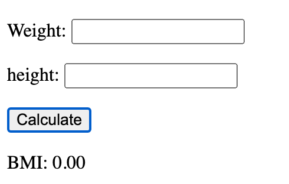
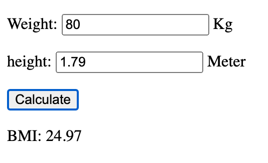

# 實驗 02_01 BMI 計算器

建立一個 HTML 頁面來計算一個人的身體質量指數 (BMI)。該頁面應包含以下元素：

- 輸入欄位用於輸入體重（公斤）。
- 輸入欄位用於輸入身高（公尺）。
- 按鈕用於計算 BMI。
- 區域顯示結果，結果應包含兩位小數。

計算 BMI 的公式：

```
BMI = weight / (height * height)
```

撰寫一個函數來計算 BMI 並回傳結果。該函數應將身高的預設值設為 1，體重的預設值設為 0。

## 步驟

### 1 建立 HTML 頁面

```html
<body>
<div>
    <p> <label for="weight">體重：</label> <input type="text" id="weight" /> 公斤 </p>
    <p> <label for="height">身高：</label> <input type="text" id="height" /> 米 </p>
    <p> <button id="calculate">計算</button> </p>
    <p> <label for="bmi">BMI：</label> <span id="bmi"></span> </p>
</div>
</body>
```

### 步驟 2 建立計算 BMI 的函數。

```javascript
function calBMI(weight, height) {
        const w = Number(weight) || 0;
        const h = Number(height) || 1;
        const bmiValue = w / (h * h);
        return bmiValue.toFixed(2);
    }
```

- `||` 用來為 falsy value 設定 預設值。
- Falsy value 是指那些轉換為布林值時產生 false 的值，包括: false、0、""、null、undefined 和 NaN。
- `Number()` 用來將字串轉換為數字。
- `toFixed(2)` 用來將數字格式化為兩位小數的字串。

### 步驟 3 建立函數以從輸入欄位獲取值並顯示結果。

```javascript
 function displayBMI() {
        const weight = document.getElementById('weight').value;
        const height = document.getElementById('height').value;
        const bmi = calBMI(weight, height);
        document.getElementById('bmi').textContent = bmi;
    }
```

### 步驟 4 為按鈕添加事件監聽器。

修改按鈕元素以添加事件監聽器。

```html
<button id="calculate" onclick="displayBMI()">計算</button>
```

### 步驟 5 測試頁面。




