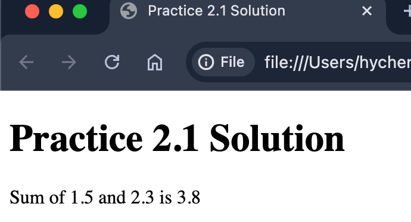

# Chapter 2 練習

製作一個 HTML 頁面，提示使用者輸入兩個數字。
然後，將這兩個數字的和顯示在頁面上（不是在警告框中）。

如果使用者沒有輸入任何內容或輸入非數字的值，預設值為 0。
在此練習中，不要使用 if 陳述式。

JavaScript 程式碼可以寫在 HTML 檔案中或外部的 JS 檔案中。

畫面範例：

Hint:
- 使用 `prompt()` 取得使用者輸入的數字並存到變數中
- 使用 `document.write()` 顯示結果 或者 修改元素的 innerHTML 屬性輸出結果。