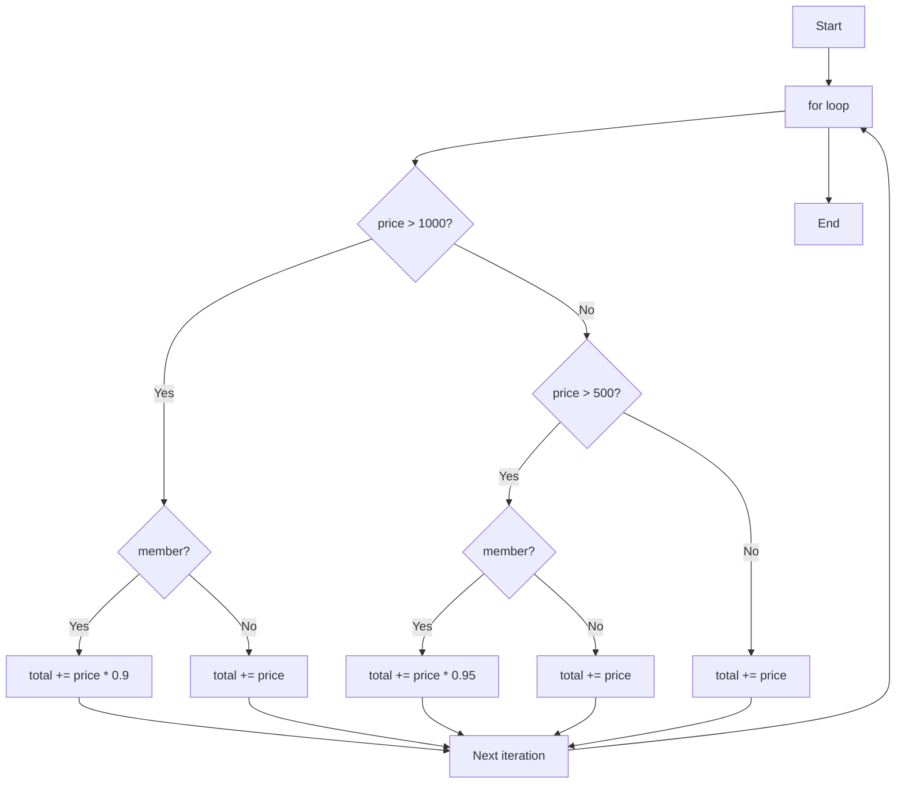

---
export_on_save:
  html: true
puppeteer: 
    displayHeaderFooter: true
    margin:
      top: '15mm'
      bottom: '15mm'
---


# Ch3 程式控制結構

## 條件式

用來控制程式的流程:
- 根據條件的真假來決定要執行哪一段程式碼。
- 或者根據條件的真假來決定要指派什麼值給變數。

### if

```js
if (條件) {
    // 條件為真時執行的程式碼
}
```

### if...else

```js

if (條件) {
    // 條件為真時執行的程式碼
} else {
    // 條件為假時執行的程式碼
}
```

### if...else if...else

```js
if (條件1) {
    // 條件1為真時執行的程式碼
} else if (條件2) {
    // 條件2為真時執行的程式碼
} else {
    // 以上條件都為假時執行的程式碼
}
```

### 條件運算式 ?: (三元運算子)

```js
條件 ? 條件為真時的值 : 條件為假時的值
```

Example:

```js
let age = 20;
let canVote = age >= 18 ? 'Yes' : 'No';
console.log(canVote); // Output: Yes
```

### switch-case 

```js
switch (表達式) {
    case 值1:
        // 表達式等於值1時執行的程式碼
        break;
    case 值2:
        // 表達式等於值2時執行的程式碼
        break;
    // 可以有多個 case
    default:
        // 表達式不等於任何 case 時執行的程式碼
}
```

Example:

```js
let day = 3;
switch (day) {
    case 1: 
        console.log('Monday');
        break;
    case 2:
        console.log('Tuesday');
        break;
    case 3:
        console.log('Wednesday');
        break;
    default:
        console.log('Invalid day');
}
```

Q: 何時使用 switch-case 而不是 if-else-if?

A: 當有多個條件需要檢查，且這些條件是基於同一個表達式的不同值時，使用 switch-case 會更清晰和易讀。相對地，如果條件較少或不基於同一表達式，使用 if-else-if 可能更合適。

Example:

都是相等比較的情況，使用 switch-case 會更清晰：

使用 if-else-if:
```js
let color = 'red';
if (color === 'red') {
    console.log('The color is red');
} else if (color === 'blue') {
    console.log('The color is blue');
} else if (color === 'green') {
    console.log('The color is green');
} else {
    console.log('Unknown color');
}
```

改用 switch-case，使程式更 清晰、結構化、可讀性高。
```js
let color = 'red';
switch (color) {
    case 'red':
        console.log('The color is red');
        break;
    case 'blue':
        console.log('The color is blue');
        break;
    case 'green':
        console.log('The color is green');
        break;
    default:
        console.log('Unknown color');
}
```


### Switch-case 的 fall-through 行為

在 switch-case 中，如果沒有使用 break，程式會繼續執行下一個 case 的程式碼，直到遇到 break 或 switch 結束為止。這種行為稱為 fall-through。

```js
let num = 1;

switch (num) {
  case 1:
    console.log("One");

  case 2:
    console.log("Two");

  case 3:
    console.log("Three");
}
```

在上述程式碼中，當 num 為 1 時，會輸出 "One"，然後繼續執行 case 2 和 case 3 的程式碼，最終輸出 "Two" 和 "Three"。


何使用 fall-through 的特性，提高程式碼的效率和可讀性？
- 當多個 case 需要執行相同的程式碼時，可以利用 fall-through 的特性，避免重複撰寫相同的程式碼。例如：

Bad Example:

```js
let day = 1;
switch (day) {
    case 1:
        console.log("It's a weekday");
        break;
    case 2:
        console.log("It's a weekday");
        break;
    case 3:
        console.log("It's a weekday");
        break;
    case 4:
        console.log("It's a weekend");
        break;
    case 5:
        console.log("It's a weekend");
        break;
    default:
        console.log("Invalid day");
}   
```


Clean Example:
```js
let day = 1;
switch (day) {
  case 1:
  case 2:
  case 3:
    console.log("It's a weekday");
    break;
  case 4:
  case 5:
    console.log("It's a weekend");
    break;
  default:
    console.log("Invalid day");
}
```

## 迴圈

迴圈用來重複執行一段程式碼，直到滿足特定條件為止。

### for 迴圈

已經知道要重複執行的次數，或者需要使用迴圈變數來控制迴圈的執行，可以使用 for 迴圈。

```js
for (初始化; 條件; 更新) {
    // 迴圈內要執行的程式碼
}
```

### while 迴圈

未知道要重複執行的次數，依據條件來控制迴圈的執行。執行時先檢查條件，如果條件為真，則執行迴圈內的程式碼，然後再次檢查條件，直到條件為假為止。

```js
while (條件) {
    // 迴圈內要執行的程式碼
}
```
### do...while 迴圈

未知道要重複執行的次數，依據條件來控制迴圈的執行。
但想要先執行至少一次迴圈內的程式碼，然後再檢查條件是否為真，決定是否繼續執行迴圈。

```js
do {
    // 迴圈內要執行的程式碼
} while (條件);
```

### 迴圈的執行控制：強制跳出、繼續新迴圈

當需要在特定條件下結束迴圈的執行，可以使用 break 關鍵字來強制跳出迴圈。

```js
for (let i = 0; i < 10; i++) {
    if (i === 5) {
        break; // 當 i 等於 5 時，跳出迴圈
    }
    console.log(i);
}
```

當需要在特定條件下跳過當前迴圈的剩餘程式碼，直接進入下一次迴圈的執行，可以使用 continue 關鍵字。

```js

for (let i = 0; i < 10; i++) {
    if (i % 2 === 0) {
        continue; // 當 i 是偶數時，跳過當前迴圈的剩餘程式碼，直接進入下一次迴圈的執行
        //以下的程式碼不會被執行
        // console.log(i); // 這行程式碼不會被執行
    }
    console.log(i); // 只會輸出奇數
}
```


## 例外處理

- 當程式執行過程中發生錯誤時，會拋出一個例外（exception）。
- 例外是一個物件，包含了錯誤的相關資訊，例如錯誤訊息、錯誤類型、堆疊追蹤等。
- 如果不處理例外，程式會中止執行，並顯示錯誤訊息。
- 使用 `try...catch` 可以捕捉和處理例外，讓程式繼續執行。

Example:

```js

let a = 10;
let result = a / 0; // 這行程式碼會拋出一個例外，因為除以零是無效的運算
console.log(result); // 這行程式碼不會被執行，因為前一行程式碼拋出了例外，導致程式中止執行

```

### try...catch

為了避免程式中止執行，可以使用 try...catch 來捕捉和處理例外。

```js
let a = 10;
let result;
try {
    let result = a / 0; // 這行程式碼會拋出一個例外，因為除以零是無效的運算
} catch (error) {
    console.log("An error occurred: " + error.message); // 捕捉到例外後，輸出錯誤訊息
    result = null; // 可以給 result 指派一個預設值，讓程式繼續執行
}
console.log(result); // 這行程式碼會被執行，因為前面的例外已經被捕捉和處理了
```

輸出結果為: 

```
An error occurred: Division by zero
null

```

### try...catch...finally

當需要在無論是否發生例外的情況下都要執行某些程式碼，可以使用 try...catch...finally 結構。
- finally 區塊中的程式碼會在 try 區塊執行完畢後執行，無論 try 區塊中是否發生例外。

例如讀取檔案的程式碼，無論是否成功讀取檔案，都需要關閉檔案資源：

```js
import { readFile } from 'fs/promises';

try {
    // 嘗試讀取檔案
    let fileContent = await readFile("data.txt");
    console.log(fileContent);
} catch (error) {
    // 捕捉到例外後，輸出錯誤訊息
    console.log("An error occurred: " + error.message);
} finally {
    // 無論是否發生例外，都要關閉檔案資源
    closeFile("data.txt");
}
```

[ch3_read_local_file.js](./examples/ch3_read_local_file.js) 是一個使用 try...catch...finally 結構來讀取本地檔案的範例程式碼。
請在檔案所在的目錄下執行 `node ch3_read_local_file.js`，並確保同一目錄下有一個名為 `product-list.txt` 的檔案, 才能看到程式的執行結果。


## 高度循環複雜度(High Cyclomatic Complexity)

- 循環複雜度(Cyclomatic Complexity) 是評估程式碼中有多少條獨立的執行路徑的指標。
- 循環複雜度越高，表示程式碼中有更多的條件分支和迴圈，會導致程式碼更難閱讀、維護和測試。

### 高度循環複雜度的程式碼 (Bad Code) 

<a id="bad_code"></a>

假設一個購物網站的訂單系統，需要根據商品價格和會員狀態來計算折扣。
若價格大於 1000，會員享有 10% 折扣；如果價格在 500 到 1000 之間，會員享有 5% 折扣；如果價格小於或等於 500，則沒有折扣。

以下程式碼，計算商品總價的邏輯包含了多層的條件判斷，導致循環複雜度很高：

```js
// 計算商品總價

let total = 0;
items = [
    { price: 1200 },
    { price: 800 },
    { price: 300 }
];

for (let i=0; i < items.length; i++) {
    // 根據價格和會員狀態計算折扣
    // 如果價格大於 1000，會員享有 10% 折扣
    if (items[i].price > 1000) {
        // 如果是會員，則享有 10% 折扣
        if (order.member === true) {
            total += item.price * 0.9;
        } else {
            // 如果不是會員，則沒有折扣
            total += item.price;
        }

    } else if (items[i].price > 500) { // 如果價格在 500 到 1000 之間，會員享有 5% 折扣
        // 如果是會員，則享有 5% 折扣
        if (order.member === true) {
            total += items[i].price * 0.95;
        } else {
        // 如果不是會員，則沒有折扣
            total += items[i].price;
        }

    } else {
        // 如果價格小於或等於 500，則沒有折扣
        total += items[i].price;
    }

}
```

這個程式共用有 6 條獨立的執行路徑，導致循環複雜度為 6，參考 [補充: 獨立路徑與 Control Flow Graph](#獨立路徑-Independent-Path-與-Control-Flow-Graph) 的說明。


Clean Code 思維下，應該盡量降低程式碼的循環複雜度，使程式碼更簡潔、易讀和易維護。

Clean Code 的做法是將複雜的程式碼拆分成多個簡單的函式，每個函式只負責一件事情，這樣可以降低每個函式的循環複雜度，提高程式碼的可讀性和可維護性。

### 重構 (Refactoring) 以降低循環複雜度

Example: 重構後的程式碼 (Clean Code)

上述程式碼中導致高度循環複雜度的原因是重覆許多相同邏輯判斷，例如對於每個商品都要判斷價格區間和會員狀態。

這些邏輯可以抽取成一個獨立的函式來處理，這樣就可以降低主程式的循環複雜度。

```js
let total = 0;
items = [
    { price: 1200 },
    { price: 800 },
    { price: 300 }
];  

function calculateItemPrice(price, isMember) {
    // 不是會員，直接回傳原價
    if (!isMember) {
        return price;
    }
    // 以下是會員的情況，根據價格區間計算折扣後的價格
    if (price > 1000) {
        // 價格大於 1000，享有 10% 折扣
        return price * 0.9;
    } else if (price > 500) {
        // 價格在 500 到 1000 之間，享有 5% 折扣
        return price * 0.95;
    } else {
        // 價格小於或等於 500，沒有折扣
        return price;
    }
}

// 主程式只負責迴圈和累加總價，循環複雜度大幅降低
for (let i=0; i < items.length; i++) {
    total += calculateItemPrice(items[i].price, order.member);
}

```

主程式的循環複雜度為 1+1 = 2，因為只有一個 for 迴圈，其他的邏輯都被抽取到 `calculateItemPrice` 函式中處理了。

`calculateItemPrice` 函式的循環複雜度為 3 + 1 = 4，因為有 3 個 if/else if/else 的條件分支. 

Cyclomatic Complexity 是以函式為單位衡量，而不是整個檔案直接相加。(重要觀念)

所以, 改寫後的循環複雜度為：
- function: 4
- main: 2

好處：
- 主程式及函式 更容易測試，可分開測試
- 主程式及函式 更容易理解
- 避免巨大的 decision tree

### 使用 AI 重構以降低循環複雜度

使用 AI 重構先前的[高度循環複雜度的程式碼](#bad_code).

比較以下兩個提示語 (prompt) 的差異：

版本一：
```
重構以下程式碼

<程式碼>
```

版本二：
```
重構以下程式碼，降低它的循環複雜度，讓程式碼更簡潔、易讀和易維護：

<程式碼>
```


### Q：什麼是 Clean Code?

Clean Code 是指
> 容易閱讀、容易理解、容易修改、容易測試的程式碼。

Clean Code 的目標不是讓程式「更短」，而是讓程式 更容易被人理解與維護(修改)。

因為在實際軟體開發中：

> 閱讀程式碼的時間 >> 撰寫程式碼的時間

核心原則:

> 好程式碼 = 容易理解 + 容易修改


## 補充(撰擇閱讀): 獨立路徑 (Independent Path) 與 Control Flow Graph

為了理解「循環複雜度」，可以先看程式的 **控制流程圖 (Control Flow Graph, CFG)**。  
節點 (node) 代表程式區塊，箭頭代表程式可能的執行流程。



**獨立路徑 (Independent Path)**  
是指從程式開始到結束的一條執行路徑，並且該路徑至少包含一條先前路徑沒有經過的新邊 (edge)。

在此範例中主要的獨立路徑包括：

1. `price > 1000` 且 `member = true`
2. `price > 1000` 且 `member = false`
3. `500 < price ≤ 1000` 且 `member = true`
4. `500 < price ≤ 1000` 且 `member = false`
5. `price ≤ 500`
6. 迴圈結束離開 `for`

因此此程式的 **Cyclomatic Complexity = 6**。

計算方式:
- 獨立路徑數量 = 決策點數 + 1
- 決策點數 = 程式中所有的 for、if、else if、switch 等條件分支的數量
- 在此範例中有 5 個決策點 (1 個 for , 2 個 if/else if 和 2 個 member 判斷)，所以獨立路徑數量 = 5 + 1 = 6。