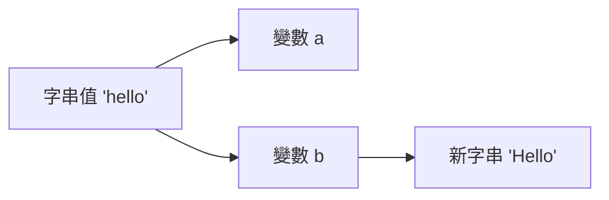

# Ch4 參考型別

## 字串物件

### 字串原生型別與字串物件

當指定一個字串文字(String literal)給一個變數時, 變數的型別為 `string`, 一種原生型別(Primitive Type)

```js
let str = 'Hello, World!';
console.log(typeof str); // "string"
```

JS 中也提供了字串物件(String object)，提供字串操作的相關方法。

當使用 `new String()` 時會建立一個字串物件，這時變數的型別為 `object`。

```js
let strObj = new String('Hello, World!');
console.log(typeof strObj); // "object"
```

字串原生型別和字串物件是不同的型別，兩者相比時，若沒有轉換型別，是不相等的。

```js
let str = 'Hello, World!';
let strObj = new String('Hello, World!');
console.log(str == strObj); // true，因為 == 會進行型別轉換
console.log(str === strObj); // false，因為 === 不會進行型別轉換
```

Q: 為什麼有原生字串型別，還要提供字串物件？

### 原生包裝模式 (Primitive Wrapper Pattern)

JavaScript 同時提供「原生型別」與「物件型別」的設計，這種設計方式稱為 **原生包裝模式 (Primitive Wrapper Pattern)**。

JS 的設計哲學可以簡單理解為：

- **Primitive for efficiency**：原生型別提供較好的效能與較小的記憶體成本  
- **Object for behavior**：物件型別提供方法 (methods) 與行為  
- **Autoboxing to connect them**：透過自動裝箱機制連接兩者  

例如，下列程式碼中的 `str` 是一個原生型別 `string`：

```js
let str = "hello";
console.log(typeof str); // "string"
```

雖然 `str` 是原生型別，但仍然可以呼叫字串方法：

```js
let str = "hello";
let strUpper = str.toUpperCase()); // JS auto box str to String object
// 裝箱過程中的 String object 為暫時的，用完就丟棄了
console.log(typeof strUpper); // "string"
console.log(typeof str); // "hello"
```

這是因為 JavaScript 在需要呼叫方法時，會 **暫時建立一個對應的包裝物件 (wrapper object)**。

概念上，JavaScript 會進行如下的動作：

```
str.toUpperCase(); =(auto-boxing)=> (new String(str)).toUpperCase();
```

這個暫時建立的物件只在方法呼叫期間存在，完成後就會被丟棄。

這種機制稱為 **自動裝箱 (Autoboxing)**。

因此：

- 原生型別負責 **資料儲存 (data)**
- 物件型別負責 **提供操作方法 (behavior)**

透過這種設計，JavaScript 同時兼顧了 **效能與使用便利性**。


最佳實務:
> 儘量使用原生型別，除非需要使用物件方法
> 避免直接使用 `new String()` 等物件建構子，除非有特別需求 

觀念小測驗:

以下程式碼中，`str1` 和 `str2` 的型別分別為何？

```js 
let str1 = "purchase";
let str2 = "purchase".substring(0, 4);
```

str1 是 ___________，str2 是 ___________。

原因:
- Autboxing 只在呼叫方法時發生，`substring()` 方法會回傳一個新的字串原生型別, 其值會指派到 `str2` 變數中，因此 `str2` 的型別也是 `string`。


### 字串的不可改變 (immutable) 特性

在 JavaScript 中，**字串 (string) 是不可改變的資料型別 (immutable)**。  
一旦建立字串，其內容就無法被直接修改。

例如：

```js
let str = "hello";
str[0] = "H";

console.log(str); // "hello"
```

即使嘗試修改字串中的某個字元，字串內容仍然不會改變。


#### 字串操作會產生新的字串

當對字串進行操作時，JavaScript 並不是修改原本的字串，而是 **建立新的字串**。

```js
let str = "hello";
let newStr = str.toUpperCase();

console.log(str);    // "hello"
console.log(newStr); // "HELLO"
```

`toUpperCase()` 並沒有改變 `str`，而是回傳一個新的字串。


#### 字串串接也會建立新字串

字串的串接 (concatenation) 也會建立新的字串。

```js
let str = "hello";
str = str + " world";

console.log(str); // "hello world"
```

在這個過程中：

1. 原本的 `"hello"` 不會被修改  
2. JavaScript 會建立新的字串 `"hello world"`  
3. 變數 `str` 重新指向新的字串


#### 為何字串是不可改變的？

- 記憶體效率與效能 (String Interning)：相同內容的字串可以共用同一份記憶體

JavaScript 引擎會維護一個「字串池」（String Pool）。如果多個變數的值都是 "hello"，它們在記憶體中其實會指向同一個位址。


```js
let a = "hello";
let b = "hello"; // a 和 b 共用同一個字串物件
```

```
a ---\
      \
       "hello" (string pool)
      /
b ---/
```

- 安全性: 字串常用於儲存敏感資訊，如網路 URL、資料庫路徑、使用者名稱或密碼。
  - 如果字串是可變的，可能會被意外或惡意修改，導致安全漏洞。

- Immutable 字串運作概念圖

```js
let a = "hello";
let b = a;

b = "Hello";

console.log(a); // "hello"
console.log(b); // "Hello"
```



#### 小結

JavaScript `string` 的重要特性：

- `string` 是 **primitive type**
- `string` 是 **immutable**
- 所有字串操作都會 **回傳新的字串**


#### 觀念小測驗

#### Q1

```js
let str = "hello";

str.toUpperCase();

console.log(str);
```

輸出結果為：__________

#### Q2

```js
let str = "hello";

console.log(str === new String("hello"));
```

輸出結果為：__________

### 字串樣板字串 (Template String)

Template String（樣板字串）是 ES6（ECMAScript 2015）引入的一種字串語法，用來 **更方便地建立與組合字串**。

與傳統字串不同，Template String 使用 **反引號 (backtick) `** 包住字串，而不是單引號 `'` 或雙引號 `"`。

```js
let name = "Alice";
let message = `Hello, ${name}!`;

console.log(message); // "Hello, Alice!"
```

---

#### 為什麼需要 Template String？

在 ES6 之前，如果要將變數放入字串中，通常需要使用字串串接：

```js
let name = "Alice";
let message = "Hello, " + name + "!";

console.log(message);
```

當字串內容較長或包含多個變數時，程式會變得不易閱讀。

Template String 可以讓字串組合 **更直覺且更容易閱讀**。

---

#### Template String 的主要功能

1️⃣ **字串插值 (String Interpolation)**  
可以在字串中直接嵌入變數或運算式。

```js
let price = 100;
let quantity = 3;

let message = `Total price: ${price * quantity}`;

console.log(message); // "Total price: 300"
```

`${ }` 中可以放入：

- 變數
- 運算式
- 函式呼叫

---

2️⃣ **多行字串 (Multiline String)**

Template String 可以直接撰寫多行文字，而不需要 `\\n`。

```js
let message = `Order Summary
Product: Laptop
Quantity: 1
Price: 30000`;

console.log(message);
```

---

#### 使用時機

Template String 常用於以下情境：

- 建立 **動態訊息 (dynamic message)**
- 建立 **HTML 片段**
- 產生 **報表或格式化輸出**
- 組合 **API request / URL**

---

#### 電子商務範例

假設在電子商務系統中，需要產生訂單摘要：

```js
let customerName = "Alice";
let product = "Wireless Mouse";
let price = 800;
let quantity = 2;

let orderSummary = `
Customer: ${customerName}
Product: ${product}
Quantity: ${quantity}
Total Price: ${price * quantity}
`;

console.log(orderSummary);
```

輸出：

```
Customer: Alice
Product: Wireless Mouse
Quantity: 2
Total Price: 1600
```

使用 Template String 可以讓程式 **更清楚呈現資料內容與格式**。


#### 小結

Template String 的優點：

- 使用 **反引號 `** 定義字串
- 支援 **字串插值 `${}`**
- 支援 **多行字串**
- 讓字串組合更容易閱讀與維護

### JavaScript 字串方法速查表 (JS String Methods Cheatsheet)

在 JavaScript 中，字串具有 **Immutable（不可變）** 特性。所有修改字串的方法都會**回傳一個新字串**，不會更動原始變數。


#### 1. 基礎屬性與存取

| 方法 / 屬性 | 說明 | 範例 |
| :--- | :--- | :--- |
| `.length` | 回傳字串長度 (屬性) | `"Hi".length` → `2` |
| `[index]` | 透過索引取得字元 | `"ABC"[0]` → `"A"` |
| `.at(index)` | 取得字元 (支援負數索引) | `"ABC".at(-1)` → `"C"` |
| `.charAt(index)` | 取得指定位置的字元 | `"ABC".charAt(1)` → `"B"` |


#### 2. 搜尋與檢查 (回傳布林值或索引)

| 方法 | 說明 | 範例 |
| :--- | :--- | :--- |
| `.includes(str)` | 是否包含特定子字串 | `"Hello".includes("el")` → `true` |
| `.startsWith(str)` | 是否以特定字串開頭 | `"Hello".startsWith("H")` → `true` |
| `.endsWith(str)` | 是否以特定字串結尾 | `"Hello".endsWith("o")` → `true` |
| `.indexOf(str)` | 第一次出現的位置 | `"banana".indexOf("a")` → `1` |
| `.lastIndexOf(str)`| 最後一次出現的位置 | `"banana".lastIndexOf("a")` → `5` |


#### 3. 擷取與分割 (最常用)

| 方法 | 說明 | 範例 |
| :--- | :--- | :--- |
| `.slice(start, end)`| 擷取字串 (不含 end，支援負數) | `"JavaScript".slice(0, 4)` → `"Java"` |
| `.substring(s, e)` | 擷取字串 (不支援負數) | `"JavaScript".substring(4, 10)` → `"Script"` |
| `.split(separator)` | **將字串分割為陣列** | `"a,b,c".split(",")` → `["a", "b", "c"]` |


#### 4. 修改與變換 (回傳新字串)

| 方法 | 說明 | 範例 |
| :--- | :--- | :--- |
| `.toLowerCase()` | 轉為全小寫 | `"Apple".toLowerCase()` → `"apple"` |
| `.toUpperCase()` | 轉為全大寫 | `"apple".toUpperCase()` → `"APPLE"` |
| `.trim()` | 移除前後空白 | `"  Hi  ".trim()` → `"Hi"` |
| `.replace(a, b)` | 替換第一個匹配項 | `"red red".replace("red", "blue")` → `"blue red"` |
| `.replaceAll(a, b)`| 替換所有匹配項 | `"red red".replaceAll("red", "blue")` → `"blue blue"` |
| `.repeat(n)` | 重複 n 次 | `"Hi".repeat(3)` → `"HiHiHi"` |
| `.padStart(n, s)` | 前方補足字元至長度 n | `"5".padStart(2, "0")` → `"05"` |


#### 💡 快速心法
- **找資料：** 用 `includes`, `indexOf`
- **拿部分：** 用 `slice` (最通用)
- **變格式：** 用 `trim`, `toLowerCase`, `toUpperCase`
- **轉陣列：** 用 `split`


### 字串的 Clean Code 寫法

在實務開發中，字串常用於產生訊息、組合 URL、建立 HTML 片段或顯示資料。  

字串的處理應
- 「集中管理」，避免散落在程式碼中，造成維護困難。
- 不要過度使用字串串接，尤其是當字串內容複雜或包含多個變數時。


以下是幾個與字串相關的 **Clean Code 建議做法**。


#### 1. 使用 Template String 提高可讀性

當字串中包含變數或運算時，應優先使用 **Template String**，避免複雜的字串串接。

不好的寫法：

```js
let message = "Customer " + name + " purchased " + quantity + " items.";
```

較好的寫法：

```js
let message = `Customer ${name} purchased ${quantity} items.`;
```

#### 2. 集中管理字串常數

- 避免 Magic Strings
  - Magic String 是指程式中直接寫死的字串值。
- 如果字串被重複使用或具有特定意義，應定義為常數, 集中管理。

不好的寫法：

```js
if (order.status === "PAID") {
    shipOrder();
}
```

較好的寫法：

```js
const ORDER_STATUS_PAID = "PAID";
if (order.status === ORDER_STATUS_PAID) {
    shipOrder();
}
```

#### 3. 將字串產生邏輯封裝成函式

如果字串的產生邏輯較複雜，建議封裝成一個函式，讓程式碼更清晰且易於維護。

不好的寫法：

```js
let message = `Order #${order.id} for ${order.customerName} has a total price of $${order.totalPrice}.`;
``` 

較好的寫法：

```js
function generateOrderMessage(order) {
    return `Order #${order.id} for ${order.customerName} has a total price of $${order.totalPrice}.`;
}   
let message = generateOrderMessage(order);
```


## 數值物件

## 布林物件

## 日期與時間物件

## Global 物件