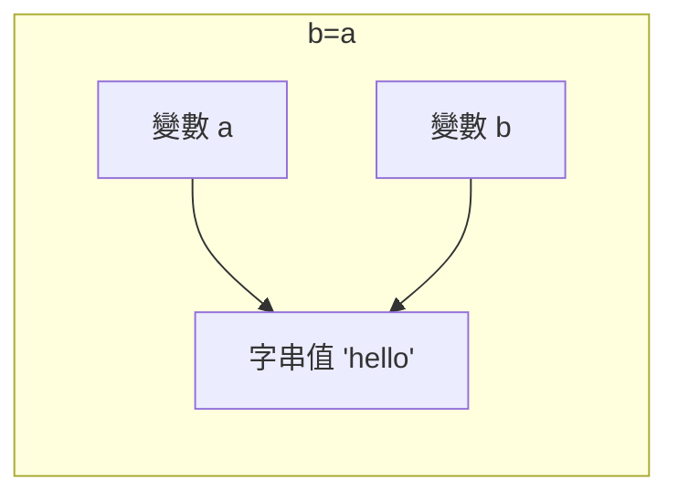
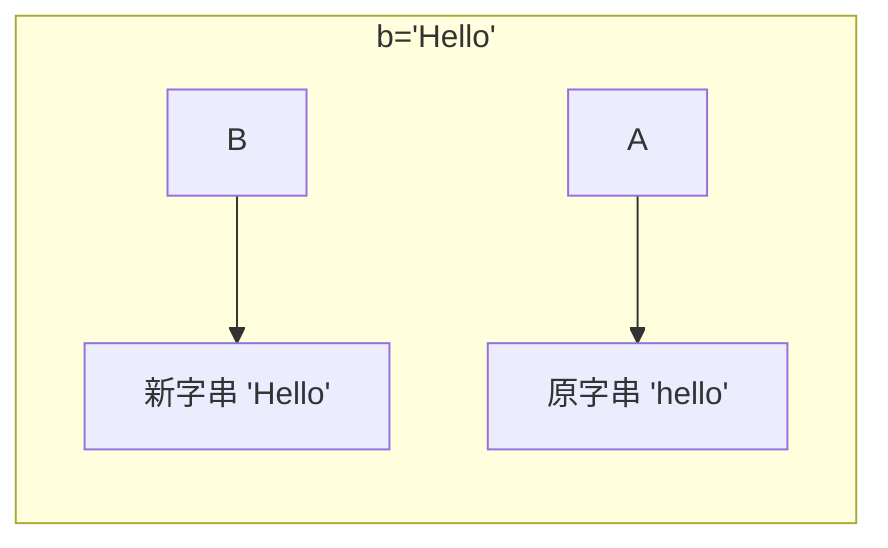

# Ch4 參考型別 1: 字串及數值物件

## 字串物件

### 字串原生型別與字串物件

當指定一個字串文字(String literal)給一個變數時, 變數的型別為 `string`, 一種原生型別(Primitive Type)

```js
let str = 'Hello, World!';
console.log(typeof str); // "string"
```

JS 中也提供了字串物件(String object)，提供字串操作的相關方法。

當使用 `new String()` 時會建立一個字串物件，這時變數的型別為 `object`。

```js
let strObj = new String('Hello, World!');
console.log(typeof strObj); // "object"
```

字串原生型別和字串物件是不同的型別，兩者相比時，若沒有轉換型別，是不相等的。

```js
let str = 'Hello, World!';
let strObj = new String('Hello, World!');
console.log(str == strObj); // true，因為 == 會進行型別轉換
console.log(str === strObj); // false，因為 === 不會進行型別轉換
```

Q: 為什麼有原生字串型別，還要提供字串物件？

### 原生包裝模式 (Primitive Wrapper Pattern)

JavaScript 同時提供「原生型別」與「物件型別」的設計，這種設計方式稱為 **原生包裝模式 (Primitive Wrapper Pattern)**。

JS 的設計哲學可以簡單理解為：

- **Primitive for efficiency**：原生型別提供較好的效能與較小的記憶體成本  
- **Object for behavior**：物件型別提供方法 (methods) 與行為  
- **Autoboxing to connect them**：透過自動裝箱機制連接兩者  

例如，下列程式碼中的 `str` 是一個原生型別 `string`：

```js
let str = "hello";
console.log(typeof str); // "string"
```

雖然 `str` 是原生型別，但仍然可以呼叫字串方法：

```js
let str = "hello";
let strUpper = str.toUpperCase()); // JS auto box str to String object
// 裝箱過程中的 String object 為暫時的，用完就丟棄了
console.log(typeof strUpper); // "string"
console.log(typeof str); // "hello"
```

這是因為 JavaScript 在需要呼叫方法時，會 **暫時建立一個對應的包裝物件 (wrapper object)**。

概念上，JavaScript 會進行如下的動作：

```
str.toUpperCase(); =(auto-boxing)=> (new String(str)).toUpperCase();
```

這個暫時建立的物件只在方法呼叫期間存在，完成後就會被丟棄。

這種機制稱為 **自動裝箱 (Autoboxing)**。

因此：

- 原生型別負責 **資料儲存 (data)**
- 物件型別負責 **提供操作方法 (behavior)**

透過這種設計，JavaScript 同時兼顧了 **效能與使用便利性**。


最佳實務:
> 儘量使用原生型別，除非需要使用物件方法 <br/>
> 避免直接使用 `new String()` 等物件建構子，除非有特別需求 

觀念小測驗:

以下程式碼中，`str1` 和 `str2` 的型別分別為何？

```js 
let str1 = "purchase";
let str2 = "purchase".substring(0, 4);
```

str1 是 ___________，str2 是 ___________。

原因:
- Autboxing 只在呼叫方法時發生，`substring()` 方法會回傳一個新的字串原生型別, 其值會指派到 `str2` 變數中，因此 `str2` 的型別也是 `string`。


### 字串的不可改變 (immutable) 特性

在 JavaScript 中，**字串 (string) 是不可改變的資料型別 (immutable)**。  
一旦建立字串，其內容就無法被直接修改。

例如：

```js
let str = "hello";
str[0] = "H";

console.log(str); // "hello"
```

即使嘗試修改字串中的某個字元，字串內容仍然不會改變。


#### 字串操作會產生新的字串

當對字串進行操作時，JavaScript 並不是修改原本的字串，而是 **建立新的字串**。

```js
let str = "hello";
let newStr = str.toUpperCase();

console.log(str);    // "hello"
console.log(newStr); // "HELLO"
```

`toUpperCase()` 並沒有改變 `str`，而是回傳一個新的字串。


#### 字串串接也會建立新字串

字串的串接 (concatenation) 也會建立新的字串。

```js
let str = "hello";
str = str + " world";

console.log(str); // "hello world"
```

在這個過程中：

1. 原本的 `"hello"` 不會被修改  
2. JavaScript 會建立新的字串 `"hello world"`  
3. 變數 `str` 重新指向新的字串


#### 為何字串是不可改變的？

- 記憶體效率與效能 (String Interning)：相同內容的字串可以共用同一份記憶體

JavaScript 引擎會維護一個「字串池」（String Pool）。如果多個變數的值都是 "hello"，它們在記憶體中其實會指向同一個位址。


```js
let a = "hello";
let b = "hello"; // a 和 b 共用同一個字串物件
```

```
a ---\
      \
       "hello" (string pool)
      /
b ---/
```

- 安全性: 字串常用於儲存敏感資訊，如網路 URL、資料庫路徑、使用者名稱或密碼。
  - 如果字串是可變的，可能會被意外或惡意修改，導致安全漏洞。

#### Immutable 字串運作概念圖

```js
let a = "hello";
let b = a;

b = "Hello";

console.log(a); // "hello"
console.log(b); // "Hello"
```




#### 小結

JavaScript `string` 的重要特性：

- `string` 是 **primitive type**
- `string` 是 **immutable**
- 所有字串操作都會 **回傳新的字串**


#### 觀念小測驗

#### Q1

```js
let str = "hello";

str.toUpperCase();

console.log(str);
```

輸出結果為：__________

#### Q2

```js
let str = "hello";
console.log(str === new String("hello"));
```

輸出結果為：__________

### 字串樣板字串 (Template String)

Template String（樣板字串）是 ES6（ECMAScript 2015）引入的一種字串語法，用來 **更方便地建立與組合字串**。

與傳統字串不同，Template String 使用 **反引號 (backtick) `** 包住字串，而不是單引號 `'` 或雙引號 `"`。

```js
let name = "Alice";
let message = `Hello, ${name}!`;

console.log(message); // "Hello, Alice!"
```

---

#### 為什麼需要 Template String？

在 ES6 之前，如果要將變數放入字串中，通常需要使用字串串接：

```js
let name = "Alice";
let message = "Hello, " + name + "!";

console.log(message);
```

當字串內容較長或包含多個變數時，程式會變得不易閱讀。

Template String 可以讓字串組合 **更直覺且更容易閱讀**。

---

#### Template String 的主要功能

1️⃣ **字串插值 (String Interpolation)**  
可以在字串中直接嵌入變數或運算式。

```js
let price = 100;
let quantity = 3;

let message = `Total price: ${price * quantity}`;

console.log(message); // "Total price: 300"
```

`${ }` 中可以放入：

- 變數
- 運算式
- 函式呼叫

---

2️⃣ **多行字串 (Multiline String)**

Template String 可以直接撰寫多行文字，而不需要 `\\n`。

```js
let message = `Order Summary
Product: Laptop
Quantity: 1
Price: 30000`;

console.log(message);
```

---

#### 使用時機

Template String 常用於以下情境：

- 建立 **動態訊息 (dynamic message)**
- 建立 **HTML 片段**
- 產生 **報表或格式化輸出**
- 組合 **API request / URL**

---

#### 電子商務範例

假設在電子商務系統中，需要產生訂單摘要：

```js
let customerName = "Alice";
let product = "Wireless Mouse";
let price = 800;
let quantity = 2;

let orderSummary = `
Customer: ${customerName}
Product: ${product}
Quantity: ${quantity}
Total Price: ${price * quantity}
`;

console.log(orderSummary);
```

輸出：

```
Customer: Alice
Product: Wireless Mouse
Quantity: 2
Total Price: 1600
```

使用 Template String 可以讓程式 **更清楚呈現資料內容與格式**。


#### 小結

Template String 的優點：

- 使用 **反引號 `** 定義字串
- 支援 **字串插值 `${}`**
- 支援 **多行字串**
- 讓字串組合更容易閱讀與維護

### JavaScript 字串方法速查表 (JS String Methods Cheatsheet)

在 JavaScript 中，字串具有 **Immutable（不可變）** 特性。所有修改字串的方法都會**回傳一個新字串**，不會更動原始變數。


#### 1. 基礎屬性與存取

| 方法 / 屬性 | 說明 | 範例 |
| :--- | :--- | :--- |
| `.length` | 回傳字串長度 (屬性) | `"Hi".length` → `2` |
| `[index]` | 透過索引取得字元 | `"ABC"[0]` → `"A"` |
| `.at(index)` | 取得字元 (支援負數索引) | `"ABC".at(-1)` → `"C"` |
| `.charAt(index)` | 取得指定位置的字元 | `"ABC".charAt(1)` → `"B"` |


#### 2. 搜尋與檢查 (回傳布林值或索引)

| 方法 | 說明 | 範例 |
| :--- | :--- | :--- |
| `.includes(str)` | 是否包含特定子字串 | `"Hello".includes("el")` → `true` |
| `.startsWith(str)` | 是否以特定字串開頭 | `"Hello".startsWith("H")` → `true` |
| `.endsWith(str)` | 是否以特定字串結尾 | `"Hello".endsWith("o")` → `true` |
| `.indexOf(str)` | 第一次出現的位置 | `"banana".indexOf("a")` → `1` |
| `.lastIndexOf(str)`| 最後一次出現的位置 | `"banana".lastIndexOf("a")` → `5` |


#### 3. 擷取與分割 (最常用)

| 方法 | 說明 | 範例 |
| :--- | :--- | :--- |
| `.slice(start, end)`| 擷取字串 (不含 end，支援負數) | `"JavaScript".slice(0, 4)` → `"Java"` |
| `.substring(s, e)` | 擷取字串 (不支援負數) | `"JavaScript".substring(4, 10)` → `"Script"` |
| `.split(separator)` | **將字串分割為陣列** | `"a,b,c".split(",")` → `["a", "b", "c"]` |


#### 4. 修改與變換 (回傳新字串)

| 方法 | 說明 | 範例 |
| :--- | :--- | :--- |
| `.toLowerCase()` | 轉為全小寫 | `"Apple".toLowerCase()` → `"apple"` |
| `.toUpperCase()` | 轉為全大寫 | `"apple".toUpperCase()` → `"APPLE"` |
| `.trim()` | 移除前後空白 | `"  Hi  ".trim()` → `"Hi"` |
| `.replace(a, b)` | 替換第一個匹配項 | `"red red".replace("red", "blue")` → `"blue red"` |
| `.replaceAll(a, b)`| 替換所有匹配項 | `"red red".replaceAll("red", "blue")` → `"blue blue"` |
| `.repeat(n)` | 重複 n 次 | `"Hi".repeat(3)` → `"HiHiHi"` |
| `.padStart(n, s)` | 前方補足字元至長度 n | `"5".padStart(2, "0")` → `"05"` |


#### 💡 快速心法
- **找資料：** 用 `includes`, `indexOf`
- **拿部分：** 用 `slice` (最通用)
- **變格式：** 用 `trim`, `toLowerCase`, `toUpperCase`
- **轉陣列：** 用 `split`


### 字串的 Clean Code 寫法

在實務開發中，字串常用於產生訊息、組合 URL、建立 HTML 片段或顯示資料。  

字串的處理應
- 「集中管理」，避免散落在程式碼中，造成維護困難。
- 不要過度使用字串串接，尤其是當字串內容複雜或包含多個變數時。


以下是幾個與字串相關的 **Clean Code 建議做法**。


#### 1. 使用 Template String 提高可讀性

當字串中包含變數或運算時，應優先使用 **Template String**，避免複雜的字串串接。

不好的寫法：

```js
let message = "Customer " + name + " purchased " + quantity + " items.";
```

較好的寫法：

```js
let message = `Customer ${name} purchased ${quantity} items.`;
```

#### 2. 集中管理字串常數

- 避免 Magic Strings
  - Magic String 是指程式中直接寫死的字串值。
- 如果字串被重複使用或具有特定意義，應定義為常數, 集中管理。

不好的寫法：

```js
if (order.status === "PAID") {
    shipOrder();
}
```

較好的寫法：

```js
const ORDER_STATUS_PAID = "PAID";
if (order.status === ORDER_STATUS_PAID) {
    shipOrder();
}
```

#### 3. 將字串產生邏輯封裝成函式

如果字串的產生邏輯較複雜，建議封裝成一個函式，讓程式碼更清晰且易於維護。

不好的寫法：

```js
let message = `Order #${order.id} for ${order.customerName} has a total price of $${order.totalPrice}.`;
``` 

較好的寫法：

```js
function generateOrderMessage(order) {
    return `Order #${order.id} for ${order.customerName} has a total price of $${order.totalPrice}.`;
}   
let message = generateOrderMessage(order);
```


## 數值物件

### 數字文字 

當在程式中撰寫以下數字文字(Numeric literal)時，JavaScript 會將其解析為一個數字原生型別 (Primitive Type)：

整數文字的寫法:

```js
let num = 42; // base-10 整數
let hex = 0x2A; // base-16 十六進位, 0x 開頭
let oct = 0o52; // base-8 八進位, 0o 開頭
let bin = 0b101010; // base-2 二進位, 0b 開頭
```

浮點數文字的寫法:

```js
let float1 = 3.14; // 小數點表示法
let float2 = 1e-5; // 科學記號表示法, 1e-5 表示 1 * 10^(-5)
```

注意： 
- JS 中的數字型別沒有區分整數和浮點數，所有數字都是以雙精度浮點數的形式儲存。


### 數字原生型別的自動包裝(Autoboxing)

和原生字串類似，原生數字型別提供較好的效能與較小的記憶體成本，但沒有方法可以直接操作數字。

當需要使用數字方法時，JavaScript 會自動將原生數字包裝成一個數字物件 (Number object)，讓我們可以呼叫方法。

例如，要將 1500 轉為美式貨幣格式(字串輸出)：

```js
let price = 1500;
// 格式化為美式貨幣格式
let formattedPrice = price.toLocaleString('en-US', { style: 'currency', currency: 'USD' });
console.log(formattedPrice); // "$1,500.00"
```

在這個例子中，`price` 是一個原生數字型別，但我們可以直接呼叫 `toLocaleString()` 方法，因為 JavaScript 會自動將 `price` 包裝成一個數字物件來執行方法呼叫。

### Number 物件提供的方法

### 數字的格式化輸出 

Number 物件主要提供格式化數字輸出的方法

#### 將數字格式化為特定的**數字字串**表示。

| 方法                     | 說明           | 範例                                      |
| :--------------------- | :----------- | :-------------------------------------- |
| `num.toFixed(n)`       | 固定小數位數（四捨五入） | `(1.234).toFixed(2)` → `"1.23"`         |
| `num.toPrecision(n)`   | 指定有效位數       | `(123.456).toPrecision(4)` → `"123.5"`  |
| `num.toExponential(n)` | 科學記號         | `(1234).toExponential(2)` → `"1.23e+3"` |
| `num.toString(base)` | 轉為指定進位的字串 | `(255).toString(16)` → `"ff"`           |

注意, 這些方法都會回傳一個**字串**，而不是數字。

```js
let fixedNum = (1.234567).toFixed(2);
console.log(fixedNum); // "1.23"
console.log(typeof fixedNum); // "string"
```

#### 地區化數字格式化(字串輸出)

`toLocaleString()` 方法可以根據指定的地區和選項，將數字格式化為符合當地習慣的字串表示。

如顯示地區金額格式：

```js
let totalPrice = 12500;
// 美式格式
console.log(totalPrice.toLocaleString('en-US')); // "12,500"
// 德式格式
console.log(totalPrice.toLocaleString('de-DE')); // "12.500"
```

加入貨幣格式化選項物件 `options`：

```js
number.toLocaleString([locales[, options]])
```

在 `options` 中可以指定 `style: 'currency'` 和 `currency: 'USD'` 等選項來格式化為貨幣表示. 

例子:
```js
let price = 1500;
// 格式化為美式貨幣格式
let formattedPrice = price.toLocaleString('en-US', { style: 'currency', currency: 'USD' });
console.log(formattedPrice); // "$1,500.00"
// 格式化為日式貨幣格式
let formattedPriceJP = price.toLocaleString('ja-JP', { style: 'currency', currency: 'JPY' });
console.log(formattedPriceJP); // "￥1,500
```

### 數字的格式化輸入(字串轉數字)


Number 物件也提供數個靜態方法用來將字串轉換為數字

| 方法                | 說明      | 範例                               |
| :---------------- | :------ | :------------------------------- |
| `Number(x)`       | 數字文字轉換為數字型態   | `Number("123")` → `123`          |
| `Number.parseInt(str)`   | 分析字串，將其中的數字文字轉整數（字串） | `parseInt("123px")` → `123`      |
| `Number.parseFloat(str)` | 分析字串，將其中的數字文字轉浮點數    | `parseFloat("3.14abc")` → `3.14` |


使用建議:
- 如果文字串中包含非數字字元，建議使用 `Number.parseInt()` 或 `Number.parseFloat()`，因為它們會從字串的開始位置分析，直到遇到非數字字元為止。
- 若無法解析為有效數字，上述方法會回傳 `NaN`

Example:
```js
let num1 = Number("abc123"); // NaN，因為 "abc123" 不是有效的數字文字
let num2 = Number.parseInt("$123,00"); // Nan, 因為 "USD123,00" 開頭不是數字文字
```

JS 內建的 `Number.parseInt()` 和 `Number.parseFloat()` 只能解析簡單的數字字串，對於包含貨幣符號、千分位逗號等格式的字串，無法正確解析。

因此，在實務開發中，通常會使用第三方函式庫（如 `currency.js`）來處理更複雜的金額字串解析與運算。
參考後面小節 [支援 Currency 運算的第三方函式庫 Currency.js](#支援-Currency-運算的第三方函式庫-Currency.js) 的說明與範例。

### 檢查特殊數字: NaN、Infinity、-Infinity

JS 提供數個特殊的數字型別值，如 `NaN`、`Infinity` 和 `-Infinity`。

我們無法直接使用 `typeof`、`instanceof` 或 `===` 來檢查這些特殊值。

必須使用 `Number` 類別提供的靜態方法來進行檢查：

| 方法                        | 說明         | 範例                                         |
| :------------------------ | :--------- | :----------------------------------------- |
| `Number.isNaN(x)`         | 判斷是否為 NaN  | `Number.isNaN(NaN)` → `true`               |
| `Number.isFinite(x)`      | 是否為有限數     | `Number.isFinite(10)` → `true`             |
| `Number.isInteger(x)`     | 是否為整數（數學上） | `Number.isInteger(10.5)` → `false`         |
| `Number.isSafeInteger(x)` | 是否為安全整數    | `Number.isSafeInteger(2**53 - 1)` → `true` |


### 數字常數

為何需要 Number 常數？

JavaScript 的 number 採用 IEEE 754 浮點數表示法，數值並不是無限精確的，而是存在範圍限制與精度誤差。

因此，Number 提供一組常數，用來描述這些限制與邊界，例如：

- `MAX_VALUE`：可表示的最大數值
- `MAX_SAFE_INTEGER`：仍能精確表示的整數範圍
- `EPSILON`：可接受的最小誤差

這些常數讓開發者能夠：

- 判斷數值是否超出範圍
- 確認整數計算是否仍然可靠
- 正確處理浮點數比較問題

👉 簡單來說：

> Number 常數是用來描述「數值系統的限制」，幫助我們寫出正確且可靠的程式。

Number 常數列表:

| 常數                         | 說明                |
| :------------------------- | :---------------- |
| `Number.MAX_VALUE`         | 最大值               |
| `Number.MIN_VALUE`         | 最小正數              |
| `Number.MAX_SAFE_INTEGER`  | 最大安全整數 (2^53 - 1) |
| `Number.MIN_SAFE_INTEGER`  | 最小安全整數            |
| `Number.EPSILON`           | 最小誤差值（≈ 2.22e-16） |
| `Number.POSITIVE_INFINITY` | 正無限               |
| `Number.NEGATIVE_INFINITY` | 負無限               |
| `Number.NaN`               | 非數值               |


#### 電子商務範例：使用 Number.EPSILON 處理金額比較

在電子商務系統中，常需要驗證訂單金額是否正確，例如：

```js
let total = 0.1 + 0.2;
let expected = 0.3;

console.log(total); // 0.30000000000000004
// 直接比較會得到 false
if (total === expected) {
    console.log("金額正確");
}
```

由於 JavaScript 使用浮點數表示，計算結果可能產生微小誤差。

因此，應該使用 `Number.EPSILON` 來判斷兩個數字是否「足夠接近」，而不是直接比較：

```js
if (Math.abs(total - expected) < Number.EPSILON) {
    console.log("金額正確");
}
```

在金額計算中：
- 不應直接使用 === 比較浮點數，因為可能會因為微小誤差而得到 false。
- 解決方式:
  - 使用 Number.EPSILON 來判斷兩個數字是否「足夠接近」，以確保金額比較的正確性。
  - 使用專門處理金額的第三方函式庫（如 currency.js）來避免浮點數誤差問題，確保金額計算的精確性。


### 浮點數的精確度問題

JavaScript 的 `number` 採用 IEEE 754 浮點數表示法，因此某些十進位小數無法被完全精確地儲存。

這會導致看似簡單的計算出現微小誤差，例如：

```js
let x = 0.2 - 0.1; // 0.1 
let y = 0.3 - 0.2; // 0.09999999999999998
console.log(x == y) // false
```

這類誤差在一般科學計算中或許可以接受，但在電子商務的金額計算中就可能造成問題，例如：

- 小計與總計不一致
- 折扣後金額出現多餘小數
- 直接比較金額時得到錯誤結果

因此，若只是一般數值比較，可使用 `Number.EPSILON` 處理；若是價格、折扣、稅額等金額運算，實務上更常使用專門處理貨幣的函式庫，例如 `Currency.js`。


### 支援 Currency 運算的第三方函式庫 Currency.js

在電子商務系統中，金額處理通常不只是「顯示價格」，還包括：

- 商品單價顯示
- 購物車小計與總計
- 折扣計算
- 稅額與運費加總
- 將貨幣字串轉回數值

如果只使用原生 `number`，常會遇到兩個實務問題：

1. 金額格式化後，若要再轉回數值，常需要自行清理字串。
2. 浮點數運算可能產生精確度誤差。

`Currency.js` 是專門處理金額的第三方函式庫，適合用在購物車、訂單、付款與報表等場景。

#### Currency.js 的特性

- 專門處理貨幣金額，而不是一般數值
- 支援金額格式化輸出
- 可從貨幣字串建立金額物件
- 提供 `add()`、`subtract()`、`multiply()` 等金額運算方法
- 可降低 JavaScript 浮點數運算誤差對金額計算的影響

#### 1. 金額格式化 / 反格式化

原生 JavaScript 可以用 `toLocaleString()` 格式化金額，但若要把 `"$1,234.56"` 再轉回數字，通常要自己用 `replace()` 清理字串。

程式如下:

```js
let priceStr = "$1,234.56";
// 先移除貨幣符號與千分位逗號
let cleanStr = priceStr.replace(/[$,]/g, '');
let priceNum = parseFloat(cleanStr);
console.log(priceNum); // 1234.56
```

上述程式中:
- 使用正則表達式(Regex) `/[$,]/g` 來尋找字串中的 `$` 和 `,` 字元，並將它們替換為空字串 `''`。
- 符號 `[]` 表示要匹配的字元清單，`$` 和 `,` 是要匹配的字元，而 `g` 則表示全域匹配，即替換字串中所有出現的 `$` 和 `,` 字元。

上述程式的問題在於:
- 程式不夠直觀，需要額外力氣理解程式的意圖


`Currency.js` 可同時幫我們做到：
- 將數值格式化為貨幣字串
- 將常見貨幣字串轉回可運算的數值
- 提供金額運算方法，降低浮點數誤差問題


格式化金額字串：
```js
let price = currency(1234.56);

console.log(price.format()); // "$1,234.56"
console.log(price.value); // 1234.56
```

直接分析帶有貨幣符號與千分位的字串：
```js
let inputPrice = currency("$1,234.56");

console.log(inputPrice.value); // 1234.56
console.log(inputPrice.format()); // "$1,234.56"
```

處理小數點誤差問題：
```js
let a = currency(0.2).subtract(0.1); // currency object
let b = currency(0.3).subtract(0.2); // currency object
console.log(a.value == b.value);
// 以下為錯誤的比較方式，會得到 false
console.log(a == b); // false, 因為 a 和 b 是不同的物件實例
```


#### 2. 降低浮點數誤差問題

JavaScript 的 `number` 採用雙精度浮點數表示，因此某些小數相加時會出現誤差。

例如：

```js
console.log(0.1 + 0.2); // 0.30000000000000004
```

在金額運算中，這類誤差是不理想的。

使用 `Currency.js`：

```js
let total = currency(0.1).add(0.2);

console.log(total.value); // 0.3
console.log(total.format()); // "$0.30"
```

再看一個接近電子商務的例子：

```js
let subtotal = currency(19.99)
  .add(5.99)
  .subtract(2.00);

console.log(subtotal.value); // 23.98
console.log(subtotal.format()); // "$23.98"
```

這種寫法比直接使用原生浮點數更適合金額計算。

#### 小結

- `Currency.js` 很適合電子商務中的金額處理
- 它同時支援「格式化顯示」與「由字串建立金額物件」
- 它比直接使用原生浮點數更適合處理價格、折扣、稅額與總計
- 若程式只需要顯示數字格式，`toLocaleString()` 已經足夠
- 若程式需要進一步做金額運算，`Currency.js` 會是更安全的選擇


#### Lab: 使用 Currency.js 處理電子商務購物車金額

[lab_04_02 使用 Currency.js 處理電子商務購物車金額](ch4/labs/lab_04_02_currency_guided.md)

### 數學運算常數與函數: Math 物件

在 JavaScript 中，`Math` 是一個內建的全域物件（global object），用來提供各種**數學運算相關的常數與函數**。

與 `Number` 不同，`Math` 不是建構子（constructor），也不需要使用 `new` 建立物件。

```js
Math.sqrt(16); // 4
```

Math 物件主要用於：

- 基本數學運算（四捨五入、取整數）
- 最大值 / 最小值計算
- 指數與開根號運算
- 三角函數計算
- 隨機數產生

常見數學常數（Math Constants）

| 常數             | 說明       | 範例                       |
| :------------- | :------- | :----------------------- |
| `Math.PI`      | 圓周率 π    | `Math.PI` → `3.14159...` |
| `Math.E`       | 自然對數底數 e | `Math.E` → `2.718...`    |
| `Math.SQRT2`   | √2       | `Math.SQRT2`             |
| `Math.SQRT1_2` | √(1/2)   | `Math.SQRT1_2`           |

更多 Math 函數與常數可以參考 [JavaScript 數學函數速查表 (Cheat Sheet)](ch4_math_function_cheat_sheet.md). 
或者直接參考 MDN 的 [Math 物件](https://developer.mozilla.org/en-US/docs/Web/JavaScript/Reference/Global_Objects/Math) 文件。
