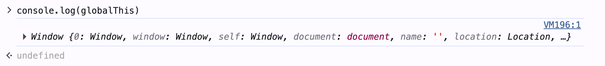
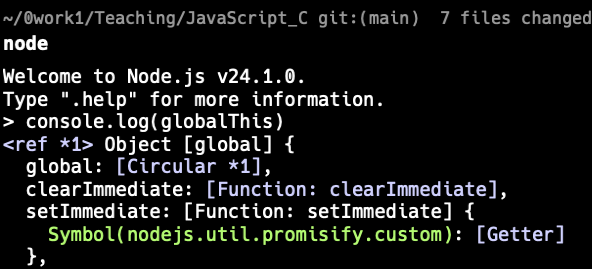

# Ch4 參考型別 2: 布林物件、日期與時間物件、Global 物件

## 布林物件

boolean 是 JavaScript 中的原生型別，只有兩個值：`true` 和 `false`。

Boolean 物件則是 boolean 的物件型別, 主要用於強制型別轉換。

```js
console.log(Boolean('hello')); // true
console.log(Boolean('')); // false
console.log(Boolean(0)); // false
```

### falsy 及 truthy values


Falsy value 是指 Boolean 轉換後會得到 `false` 的值。

JS 會將以下的值轉換成 `false`：

```js
undefined
null
0
-0
NaN
"" (空字串)
'' (空字串)
false
```

Truthy value 是指 Boolean 轉換後會得到 `true` 的值。

除了上述的 falsy value 以外，其他所有值，包括物件、陣列、函式、非空字串、非零數字等，都會被轉換成 `true`。

```js
let members = ["Alice", "Bob"];
if (members) {
    console.log("有成員");
} else {
    console.log("沒有成員");
}
```

輸出結果為 "有成員"，因為陣列是一個 truthy value。

### 實務技巧：使用 Boolean 轉換來檢查變數是否有值

在 JavaScript 中，條件判斷（如 `if`）不只接受 `true` 或 `false`，也會將值自動轉為布林值。

#### 技巧 1: 簡化條件判斷

```js
if (cartItems.length > 0){
    console.log("購物車有商品");
} 
```

可以簡化為：

```js
if (cartItems.length) {
    console.log("購物車有商品");
}
```

#### 技巧 2: 檢查字串是否存在

原來版本:
不為空字串才執行折扣邏輯：
```js
if (couponCode !== "") {
    applyDiscount(couponCode);
}
```


可以簡化為：

```js
if (couponCode) {
    applyDiscount(couponCode);
}
```

變成不為 falsy value 就執行折扣邏輯。

可同時處理以下 falsy value：

- ""
- null
- undefined

#### 技巧 3: 設定預設值

應用 short-circuit evaluation 來設定預設值：

```js
let discount = userDiscount || 0;
```

這樣如果 `userDiscount` 是 falsy value（如 `null`、`undefined`、`0`），就會使用預設值 `0`。
如果 `userDiscount` 是 truthy value（如非空字串、非零數字），就會使用 `userDiscount` 的值。

`||` 是邏輯 OR 運算子，屬 於 short-circuit evaluation 的一種，會從左到右評估運算式。只要遇到第一個 truthy value 就會停止評估並回傳該值。


### 比較程式意圖

有程式檢查商品「價格是否已設定」，可以寫成以下兩種版本：

版本 A:
```js
let unitPrice = 0;

if (unitPrice !== null) {
    console.log("價格已設定");
} else {
    console.log("價格未設定");
}
```

版本 B:
```js
let unitPrice = 0;
if (unitPrice) {
    console.log("價格已設定");
} else {
    console.log("價格未設定");
}
```

上述兩段程式碼的輸出和意圖有什麼不同？

兩段程式碼的差異，除了執行結果外，還在於開發者想表達的意圖（intent）不同。

第一段程式碼使用 `unitPrice !== null` 來檢查價格是否已設定，
- 意圖是「單價不是 null 表示已設定」。

第二段程式碼使用 `if (unitPrice)` 來檢查價格是否已設定
- 意圖是「檢查單價是為有效值表示己設定」. 
- 單價的有效值不能為 `0`、`""`、`null`、`undefined`。


**Clean Code 重點**

在閱讀或撰寫程式時，應思考：

- 你是要判斷「是否未設定」？
  - 使用 `if (unitPrice !== null)` 來檢查是否為 null 來判斷是否已人為設定
- 還是判斷「是否有有效值」？
  - 使用 `if (unitPrice)` 來檢查為有效值（非 falsy value）


## 日期與時間物件

JS 中沒有原生的日期型別，只有 `Date` 物件。

在電子商務系統中，日期與時間非常常見，例如：

- 訂單建立時間
- 付款時間
- 出貨時間

### 取得目前日期與時間或指定日期

用 Date 物件的建構子取得目前日期與時間：

```js
let now = new Date();
console.log(now); // 2024-06-01T12:00:00.
```

也可以用建構子建, 輸入日期文字等參數建立指定日期：

```js
let orderDate = new Date("2024-06-01T10:00:00");
console.log(orderDate); // 2024-06-01T10:00:00
```

### 修改日期

日期的組成包括: 西元年(FullYear)、月、(月)日、週天、時、分、秒(Second)、毫秒(Time)等

可以用 Date 物件提供的 setter 與 getter 方法來修改或取得日期的各個部分：

Example: 取得目前的西元年：

```js
let now = new Date();
let year = now.getFullYear();
console.log(year); // 2026
```

Example: 將目前的月份改為 12 月：

```js
let orderDate = new Date();
console.log(orderDate); 
orderDate.setMonth(11); // 月份從 0 開始
console.log(orderDate); // 月份已改為 12 月
```

日期元素的操作方法清單:

Getters:
| 方法               | 說明           | 範例                                 |
| :---------------- | :----------- | :--------------------------------- |
| `getFullYear()`   | 取得西元年       | `date.getFullYear()` → `2024`           |
| `getMonth()`      | 取得月份 (0-11) | `date.getMonth()` → `5` (6 月)         |    
| `getDate()`       | 取得日期 (1-31) | `date.getDate()` → `1`                 |
| `getDay()`        | 取得星期 (0-6)  | `date.getDay()` → `0` (週日)             |
| `getHours()`      | 取得小時 (0-23)  | `date.getHours()` → `14`             |
| `getMinutes()`    | 取得分鐘 (0-59)  | `date.getMinutes()` → `30`             |
| `getSeconds()`    | 取得秒數 (0-59)  | `date.getSeconds()` → `45`             |
| `getTime()`       | 取得自 1970-01-01T00:00:00Z 以來的毫秒數 | `date.getTime()` → `1712123456789` |

Setters:
| 方法               | 說明           | 範例                                 |
| :---------------- | :----------- | :--------------------------------- |
| `setFullYear(year)` | 設定西元年       | `date.setFullYear(2025)`               |
| `setMonth(month)` | 設定月份 (0-11) | `date.setMonth(0)` (1 月)           |
| `setDate(date)`   | 設定日期 (1-31) | `date.setDate(15)`                   |
| `setHours(hour)`  |設定小時 (0-23)  | `date.setHours(9)`                    |
| `setMinutes(min)` | 設定分鐘 (0-59)  | `date.setMinutes(45)`                   |
| `setSeconds(sec)` | 設定秒數 (0-59)  | `date.setSeconds(30)`                   |
| `setTime(ms)`    | 設定自 1970-01-01T00:00:00Z 以來的毫秒數 | `date.setTime(1712123456789)` |

### 日期的格式化顯示

可以使用 `toLocaleDateString()`、`toLocaleTimeString()` 和 `toLocaleString()` 方法來格式化日期與時間的顯示。

```js
let orderDate = new Date("2024-06-01T10:00:00");
console.log(orderDate.toLocaleDateString('"de-DE"')); // "1.6.2024" (德國日期格式)
```

### 日期的運算

### 基本原則

👉 不要直接對 Date 做加減運算

運算子 `+`、`-`、`*`、`/` 等無法直接對 Date 物件進行運算，因為 Date 物件不是數字型別。

```js
let date = new Date();
let newDate = date + 1; // 日期轉字串後再加 1，結果不是預期的日期加一天
console.log(newDate); // "Wed Jun 01 2024 12:00:00 GMT+0800 (台北標準時間)1"
```

操作原則:

- 使用 `getXXX()` 取得要修改的日期元素
- 進行數字運算（加減天數、月數等）
- 使用 `setXXX()` 將修改後的值設定回 Date 物件
- 注意 setter 的行為:
  - 1. setter 會修改原始 Date 物件
  - 2. setter 會自動處理日期溢位（如超過當月天數會自動進位到下個月）

Example: 將日期加 7 天：

```js
let orderDate = new Date("2024-06-01T10:00:00");
let currentDay = orderDate.getDate();  // 取得當前日期的月天 (1); number type
orderDate.setDate(currentDay + 7); // 加 7 天
console.log(orderDate); // 2024-06-08T10:00:00
```

### Lab 03: 使用 datejs 套件處理日期運算

[lab_04_03 訂單 + 出貨 + Coupon](labs/lab_04_03_dayjs_short.md)

## Global 物件

global object 是一個特殊的物件，它在程式執行時永遠存在，且其屬性和方法可以在程式的任何地方被直接存取。

主要功能與特性:
- 存放標準內建物件與函數
  - 物件如 `Math`、`Date`、`Number`、`String` 等
  - 全域函式，如 `parseInt()`、`isNaN()` 等
- 提供全域變數的存取
    - 在函數外以 var 宣告的變數會成為 global 物件的屬性
    - 在 non-strict 模式下，未宣告的變數會自動成為 global 物件的屬性

Example: 

```js
function test() {
    // 在函數內宣告變數
    var functionLocalVar = "I am local in test function";
    // 在函數內未宣告變數，會成為 global 物件的屬性
    globalVar = "I am global";
}
console.log(functionLocalVar); // ReferenceError: functionLocalVar is not defined
console.log(globalVar); // "I am global"
```

### 為何會有 global 物件？

1. 提供一個「大容器」
- 需要一個地方來存放所有內建功能（如 Array、Object、Math、parseInt）

2. 允許兩個 js 檔案共享資料

```js
// a.js 
var sharedData = "Hello from a.js";

// b.js
console.log(sharedData); // "Hello from a.js"
```

參考 [cart-store.js](examples/global_object_shared_data/cart-store.js) 的範例說明.

3. 代表執行環境（Host Environment）

全域物件被用來反映環境特有的能力：
- 在瀏覽器中，global 物件是 `window`，提供 DOM 操作、事件處理等功能。
- 在 Node.js 中，global 物件是 `global`，提供檔案系統、網路等功能.

### Global 物件的名稱

- 在瀏覽器中，global 物件的名稱是 `window`。
- 在 Node.js 中，global 物件的名稱是 `global`。

在 ES2020 中，新增了 `globalThis` 這個標準化的全域物件名稱
- 會視執行環境自動指向正確的 global 物件
- 讓跨環境的程式碼更容易撰寫與維護

ex. 在 Browser 的 console 中：

```js
console.log(globalThis); // 會輸出 window 物件，因為在瀏覽器中 globalThis 指向 window
```



在 Node.js 中：

```js
console.log(globalThis); // 會輸出 global 物件，因為在 Node.js 中 globalThis 指向 global
```



### Code Bad Smell: global 物件造成的負面影響

#### 1. **命名衝突**：
- 全域空間是共用的。
- 不同的程式碼或函式庫可能會使用相同的全域變數名稱，導致衝突和不可預期的行為。

參考範例：
- [Global 命名衝突 Demo](examples/global_name_collision_ecommerce/index.html)
- [storefont.js](examples/global_name_collision_ecommerce/storefront.js) 先被載入
  - 在 global 物件上定義了 `formatPrice()` 函式 
- [campaign-widget.js](examples/global_name_collision_ecommerce/campaign-widget.js) 接著再被載入
  - 也在 global 物件上定義了 `formatPrice()` 函式，覆蓋了 storefront.js 的版本


#### 2. 隱式耦合 (Implicit Coupling)

隱式耦合 (Implicit Coupling)： 模組之間透過「沒有明說的共享狀態」互相依賴

考慮以下兩個 JavaScript 模組(檔案)：

```js
// moduleA.js
var taxRate = 0.05;
```

```js
// moduleB.js
function calculate(price) {
  // 函數的行為依賴於全域變數 taxRate，但沒有明確宣告這個依賴 (隱式耦合)
  return price * (1 + taxRate);
}
```

函數 `calculate()` 依賴於 `taxRate` 這個全域變數
這個依賴關係是隱式的，因為 `calculate()` 並沒有明確宣告它需要 `taxRate` 這個變數。

這種隱式耦合會讓程式碼難以理解和維護
- 可讀性變差: 開發者不知道 taxRate 是從哪裡來的，必須搜尋整個程式碼庫才能找到它的定義。
- 可維護性變差: 其它模組也可修改 taxRate 的值，可能會不小心影響到 calculate() 的行為，導致難以追蹤和修復錯誤。

```js
// moduleC.js
taxRate = 0.1; // 不小心修改了 taxRate 的值，導致 calculate() 的行為改變
```

### Lab 04: Global 物件的負面影響

[lab_04_04 Global 物件的負面影響](labs/lab_04_04_global_object_collision_guided.md)