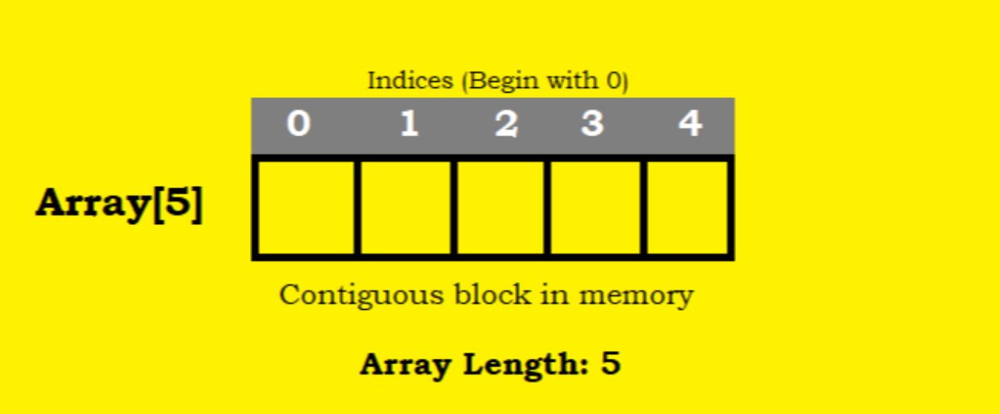
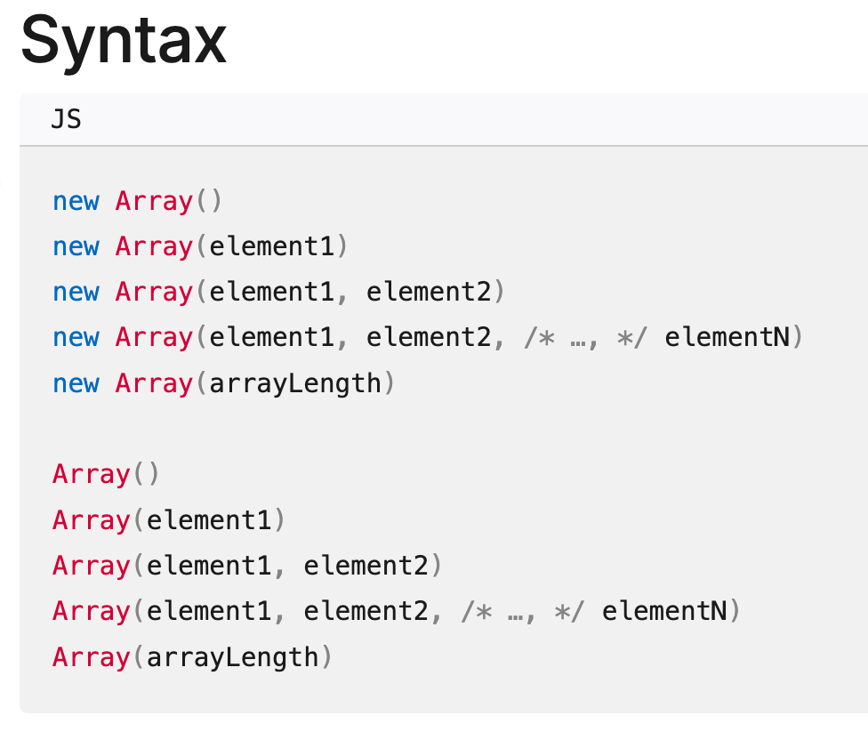

# Ch5 集合(Collection) 物件

## 學習目標

- 了解集合物件的特性
- 陣列(Array)的宣告及操作
- Set 與 Map 的宣告及操作

## 集合物件

- 集合物件是用來儲存多個值的資料結構
- 例如:
    - 陣列 (Array): 存放多個值，使用索引(index)來存取, 值可重複
    - Set: 存放不重複的值, 使用索引來存取
    - Map: 存放鍵值對 (key-value pair), 使用 key 來存取 值
- 他們都是物件參考型別(Object Reference Type)
    - stack 中儲存物件的參考(reference)位址
    - heap 中儲存物件的實際資料, 可動態擴展

## 陣列 (Array)

- 以連續的記憶體空間儲存多個值
- 值的型別可以不同，不一定要全部是同一型別



## 使用情境

- 存放同學的成績: 用陣列儲存班上同學的考試分數，方便計算平均分數和排序
- 購物車商品清單: 儲存使用者選購的商品，每個元素可以是商品物件，包含名稱、價格等資訊
- 歷史紀錄追蹤: 記錄使用者最近的操作或瀏覽記錄，可以使用陣列來實作「上一步」或「下一步」功能 

## 陣列的基本操作

- 建立陣列
- 訪問陣列元素
- 修改陣列元素（添加、刪除和更新）
- 獲取陣列的長度
- 遍歷陣列(拜訪陣列的每個元素)
- 陣列的排序和搜尋
- 陣列的切片和拼接

## 建立陣列

有三種建立陣列的方法:
1. 陣列文字(Array Literal)
2. Array() 建構子
3. Array.of() 方法


### 陣列文字(Array Literal)

- 使用文字來描述陣列及其內容
- 經常在建立空陣列或事先已知值的清單時使用。

Ex: 有 red, green, blue 三個顏色的陣列

```js
var colors = ['red', 'green', 'blue'];
```

Ex: 建立空陣列

```js
var emptyArray = [];
```

### Array() 建構子

- Array literal 的限制
    - 無法一次建立很長的陣列
    - e.g. 建立一個長度為 100 的陣列

- 使用 Array() 建構子來建立陣列
    - 可提供 "數字" 表示陣列的長度
    - 可提供 "一個或多個值"，表示陣列的內容

Ex: 建立長度為 5 的陣列, 以儲存顏色
- 注意: 內容沒有初始化

```js
var colors = new Array(5);
console.log(colors); // [ <5 empty items> ]
```

Ex: 儲存 5 個顏色的陣列, 5 個顏色分別為: red, green, blue, yellow, purple

```js
var colors = new Array('red', 'green', 'blue', 'yellow', 'purple');
console.log(colors); // [ 'red', 'green', 'blue', 'yellow', 'purple' ]
```

### Array() 的簽名



- 多個引數時, 使用這些引數來初始化陣列
- 單一引數時，
    - 如果是數字，則表示陣列的長度
    - 如果不是數字，則表示陣列的內容

### Array() 的常見陷阱


x_arr 和 y_arr 的意義相同嗎？
```js
var x_arr = new Array(5);
var y_arr = new Array("5")
```

### Array.of()

- 如果明確地要使用一串資料(a list values)來建立陣列，則使用 Array.of() 方法
  - 明確的展現你的意圖
- Array.of() 方法會將所有引數視為陣列的內容

Ex: 建立一個學生成績的陣列, 只有一個元素 80 分

```js
var scores = Array.of(80);
console.log(scores); // [ 80 ]
```

### 補充

另有 Array.from() 方法
- 將一個 array-like 物件(類陣列物件)或可迭代物件(iterable object)轉換為陣列
- 後續章節會介紹 array-like 物件和可迭代物件

## 訪問陣列元素 (Accessing Array Elements)

### 使用整數的索引值

- 使用索引來訪問陣列的元素
- 索引符號是方括號 []
- 索引值是必需是 整數及非負數
- 陣列的索引從 0 開始
- 如果索引超出範圍，則返回 undefined

### 取得陣列的元素

Ex. 取得顏色陣列的第2個元素

```js
var colors = ['red', 'green', 'blue'];
console.log(colors[1]); // green
```

Ex. 取得顏色陣列的最後一個元素

```js
var colors = ['red', 'green', 'blue'];
console.log(colors[colors.length - 1]); // blue
```

Ex. 索引值超出範圍

```js
var colors = ['red', 'green', 'blue'];
console.log(colors[3]); // undefined
```

### 非整數的索引值: 成為 Array 的屬性

- 陣列是物件
- JS 中，允許動態的新增物件屬性
- 取得物件屬性的語法：
    - 物件名稱.屬性名稱
    - 物件名稱["屬性名稱"]
- 當使用非整數的索引值時，會變成使用物件屬性的語法。

Ex. 使用非整數的索引值

```js
var colors = ['red', 'green', 'blue'];
// 3.5 會轉成字串 "3.5"
colors[3.5] = 'yellow'; 
colors[-1] = 'purple';
```

會產生以下 colors 物件

```js
{
    0: "red",
    1: "green",
    2: "blue",
    '3.5': "yellow",
    '-1': "purple"
}
```

## 陣列元素的: add, delete, update

- 可以新增、刪除或更新陣列的元素

### 新增或更新元素

- 使用指派運算子 (=) 來新增或更新元素
- 索引值超出範圍時，會自動擴展陣列的大小
  - 若有跳號的情況，則會在中間的元素補上 undefined
- 否則, 會更新指定索引的元素

Ex. 新增元素: 索引值超出範圍，並有跳號的情況

```js
var colors = ['red', 'green', 'blue'];
colors[5] = 'yellow';
console.log(colors); // [ 'red', 'green', 'blue', <2 empty items>, 'yellow' ]
```

Ex. 更新元素: 更新第一個元素為 black

```js
var colors = ['red', 'green', 'blue'];
colors[0] = 'black';
console.log(colors); // [ 'black', 'green', 'blue' ]
```

### 加到陣列的最後面的位置

方法 1: 使用 length 屬性取得陣列的長度

```js
var colors = ['red', 'green', 'blue'];
colors[colors.length] = 'yellow';
console.log(colors); // [ 'red', 'green', 'blue', 'yellow' ]
```

方法 2: 使用 push() 方法

```js
var colors = ['red', 'green', 'blue'];
colors.push('yellow');
console.log(colors); // [ 'red', 'green', 'blue', 'yellow' ]
```

Q: 那個程式碼看起來比較優雅？明確表達你的意圖？

### 刪除元素
  
- 使用 delete 運算子來"刪除"元素
- `delete` 並沒有真正的刪除元素
    - 只是將該元素的值設為 undefined
    - 陣列的長度不會改變

Ex. 刪除元素 (陣列長度不變)
```js
var colors = ['red', 'green', 'blue'];
delete colors[1];
console.log(colors); // [ 'red', <1 empty item>, 'blue' ]
```

### delete 運算子的副作用

- delete 運算子會使陣列變得稀疏，因為它不會改變陣列的長度。
- 如果你要移除元素，包含它的位置，請使用陣列的 `splice()` 方法。
  - 避免陣列變得稀疏
- `splice()` 方法用來添加(insert)、更新(update)和刪除(delete)陣列中的元素。
  - 會改變陣列的長度，避免陣列變得稀疏
  - splice 中文意指接合或連接。

See MDN web docs: [Array.prototype.splice() - JavaScript | MDN](https://developer.mozilla.org/en-US/docs/Web/JavaScript/Reference/Global_Objects/Array/splice)


## 遍歷陣列(拜訪陣列的每個元素)

- 遍歷陣列的每個元素是常見的陣列操作
- 常見情境:
  - 印出陣列的每個元素
  - 計算陣列的總和
  - 陣列中的每個元素加 1