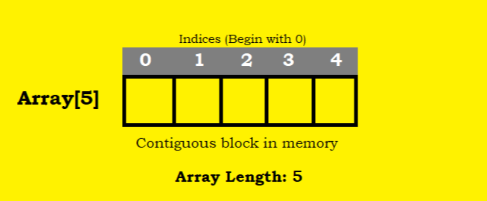
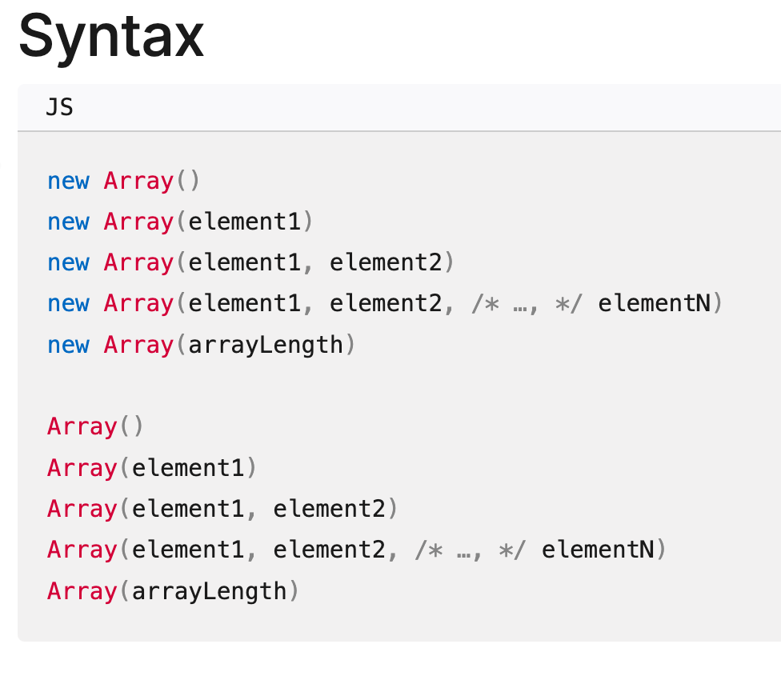

# Ch5 集合(Collection) 物件 - Part 1

## 本章重點

- 了解「集合物件」的用途，並知道 Array / Set / Map 的基本差異
- 使用多種方式建立陣列，並理解何時適合用 Array literal (`[]`)、`Array()`、`Array.of()`、`Array.from()`
- 辨識 `Array()` 建構子的常見陷阱，理解單一數字引數與稀疏陣列 (sparse array) 帶來的副作用
- 使用索引 `[]` 正確存取陣列元素，並知道非整數索引會變成物件屬性
- 在陣列中新增、更新與刪除元素，並理解 `delete` 與 `splice()` 在刪除行為上的差異
- 使用 `for`、`for...of` 與 `forEach` 遍歷陣列，並理解 `entries()` 如何同時取得 index 與 value


## 集合物件

- 集合物件是用來儲存多個值的資料結構
- 例如:
    - 陣列 (Array): 存放多個值，使用索引(index)來存取, 值可重複
    - Set: 存放不重複的值, 使用索引來存取
    - Map: 存放鍵值對 (key-value pair), 使用 key 來存取 值
- 皆是物件參考型別(Object Reference Type)


## 陣列 (Array)

- 以連續的記憶體空間儲存多個值
- 值的型別可以不同，不一定要全部是同一型別



## 使用情境

- 存放同學的成績: 用陣列儲存班上同學的考試分數，方便計算平均分數和排序
- 購物車商品清單: 儲存使用者選購的商品，每個元素可以是商品物件，包含名稱、價格等資訊
- 歷史紀錄追蹤: 記錄使用者最近的操作或瀏覽記錄，可以使用陣列來實作「上一步」或「下一步」功能 

## 陣列的基本操作

- 建立陣列
- 訪問陣列元素
- 修改陣列元素（添加、刪除和更新）
- 獲取陣列的長度
- 遍歷陣列(拜訪陣列的每個元素)
- 陣列的排序和搜尋
- 陣列的切片和拼接

## 建立陣列

情境:
1. 建立空陣列或事先已知值的清單時，使用「文字描述」的方式來建立陣列
   - e.g. 建立一個商品清單的陣列，裡面有衣服、鞋子、帽子三個商品
2. 需要建立一個很長的空陣列，無法用文字描述的方式來建立
   - e.g. 建立一個長度為 100 的陣列
3. 已經有個「類陣列物件」，想要將他轉換成陣列
   - e.g. 將一個字串轉換成陣列

### 情境 1: 使用文字描述的方式來建立陣列

- 使用「陣列文字」(Array Literal)來描述陣列及其內容
- 經常在建立空陣列或事先已知值的清單時使用。

Ex: 有 衣服, 帽子, 鞋子 三個商品的陣列

```js
var products = ['衣服', '帽子', '鞋子'];
```

- 也可以建立空陣列，表示目前沒有任何商品

Ex: 建立空陣列

```js
var products = [];
```


### 情境 2: 建立一個很長的空陣列 - Array() 建構子


- Array literal 的限制
    - 無法一次建立很長的陣列
    - e.g. 建立一個長度為 100 的陣列

- 使用 Array() 建構子來建立陣列
    - 可提供 "數字" 表示陣列的長度
    - 可提供 "一個或多個值"，表示陣列的內容


Ex: 建立長度為 5 的空購物車，但沒有任何商品(初始化內容)
- 注意: 內容沒有初始化

```js
var shoppingCart = new Array(5);
console.log(shoppingCart); // [ <5 empty items> ]
```

Ex: 建立購物車，內容有 衣服, 帽子, 鞋子 三個商品

```js
var products = new Array('衣服', '帽子', '鞋子');
console.log(products); // [ '衣服', '帽子', '鞋子' ]
```

反思： 用 Array() 建構子來建立陣列，是否比使用 Array Literal 來得更簡潔、更直觀、更可讀？為什麼？

<details>
<summary>參考答案</summary>

通常**不是**。在「內容已知」或「只是要一個空陣列」的情況下，Array literal（`[]`）更簡潔、直觀、可讀，也更符合 JavaScript 慣例。
  - **更直覺**：`['衣服', '帽子', '鞋子']` 一眼就看出是「三個元素的清單」，不需要理解建構子的特殊規則。

```js
let products = ['衣服', '帽子', '鞋子']; // 更直覺、更簡潔、更可讀, 不需要理解建構子的特殊規則
```

</details>


### Array() 的簽名與其特殊規則(陷阱)

#### Array() 的簽名



引數的個數會決定 Array() 的行為：
1. 多個引數時, 使用這些引數來建立陣列的內容
2. 單一引數時 (小心陷阱):
    - 如果是數字，則表示陣列的長度
    - 如果不是數字，則表示陣列的內容


x_arr 和 y_arr 的意義相同嗎？
```js
let x_arr = new Array(5);
let y_arr = new Array("5")
```

<details>
<summary>參考答案</summary>

- x_arr 是一個長度為 5 的陣列，內容沒有初始化
- y_arr 是一個長度為 1 的陣列，內容為字串 "5"
- 所以 x_arr 和 y_arr 的意義不同

</details>


#### Array() 的常見陷阱

情境範例：呼叫 API 來建立空的購物車陣列。

你查 `ec.resolveItemIds()` API 取得一串商品 ID 清單，你想要為此清單建立一個陣列。

該 API 會回傳的資料陣列:
- case 1: [5] - 表示一個商品
- case 2: [1, 2, 3] - 表示三個商品


你撰寫以下的程式碼:

```js
// ... 是展開運算子, 會將陣列轉成值清單
var shoppingCart = new Array(...ec.resolveItemIds());
```

Q: 這段程式碼的行為一定正確嗎？為什麼？

<details>
<summary>參考答案</summary>

這段程式碼**不一定正確**，因為 `Array()` 在「單一引數」時有特殊規則：

```js
new Array(...[5])   // → [ <5 empty items> ]  (長度為 5 的空陣列)
new Array(...[1, 2, 3]) // → [1, 2, 3]  (內容為 [1, 2, 3] 的陣列)
```

- 如果 `ec.resolveItemIds()` 回傳的是數字 `[5]`
  - → 會建立「長度為 5 的空陣列」（尚未初始化內容）
- 如果回傳的是字串 `[1, 2, 3]`
  - → 會建立 `[1, 2, 3]`（長度為 3 的陣列）

**相同的 API 語意，卻有不同的行為**，這是 `Array()` 的特殊規則所導致的陷阱。

因此，這段程式碼存在潛在 bug，取決於 API 回傳型別。

建議：
- 若要建立固定長度的陣列，應確認型別（例如使用 `Number()` 轉換）
- 若要建立有內容的陣列，則直接使用 `Array.of()` 或 `[]` 來避免這種混淆。

</details>


#### 避開 Array() 的陷阱 - Array.of() 方法

- 如果明確地要使用一串資料(a list values)來建立陣列，則使用 Array.of() 方法
  - 明確的展現你的意圖
- Array.of() 方法會將所有引數視為陣列的內容

Ex: 建立一個學生成績的陣列, 只有一個元素 80 分

```js
var scores = Array.of(80);
console.log(scores); // [ 80 ]
```

### 情境 3: 已經有個「類陣列物件」，想要將他轉換成陣列

#### 類陣列物件 (Array-like Object)

類陣列物件 (Array-like Object): 長得像陣列，但不是陣列的物件

陣列物件的特徵:
- 有索引(index)來存取元素
- 有 length 屬性
- 有陣列操作的方法

類陣列物件的特徵:
- 有索引(index)來存取元素
- 有 length 屬性
- **沒有** 陣列操作的方法
- e.g.
  - 字串(String): 可以使用索引來存取字串的每個字元，並且有 length 屬性，但沒有陣列操作的方法
  
```js
// Array Object
let arr = ['C', 'A', 'B'];
arr.sort() 
console.log(arr); // [ 'A', 'B', 'C' ]

// Array-like Object
let str = 'CAB';
console.log(str.length); // 3
console.log(str[0]); // C
str.sort() // TypeError: str.sort is not a function
```

#### 將類陣列物件轉換成陣列

動機: 將類陣列物件轉換成陣列，以使用陣列操作的方法，修改內容或進行其他陣列操作。

```js
let str = 'CAB';
let arr = Array.from(str);
arr.sort();
console.log(arr); // [ 'A', 'B', 'C' ]
```

### 補充

- 可迭代物件 (Iterable Object) 也是類陣列物件的一種
  - 可迭代物件是指可以使用 for/of loop 來遍歷的物件


## 取出陣列元素 (Accessing Array Elements)

情境:
1. 取出特定位置的元素
2. 取出某個範圍的元素


### 情境 1: 取出特定位置的元素


#### 使用「整數索引值」及 索引符號 `[]`

- 索引符號方括號 []
- 使用索引來訪問陣列的元素
- 索引值是必需是**整數**及**非負數**
  - 從陣列的前面開始計數，第一個元素的索引值為 0
- 陣列的索引從 0 開始
- 如果索引超出範圍，則返回 undefined

```
[ 'A', 'B', 'C' ] undefined
   0    1    2     3 
  -3   -2   -1
```

#### 取得特定位置的元素

Ex. 取得 products 陣列的第2個元素

```js
var products = ['衣服', '帽子', '鞋子'];
console.log(products[1]); // 帽子
```

Ex. 取得 products 陣列的最後一個元素

```js
var products = ['衣服', '帽子', '鞋子'];
console.log(products[products.length - 1]); // 鞋子
```

Ex. 索引值超出範圍

```js
var products = ['衣服', '帽子', '鞋子'];
console.log(products[3]); // undefined
```

#### [] 符號的陷阱: 使用非整數的索引值變成 Array 的屬性 

非整數的索引值: 成為 Array 的屬性

- 陣列是物件
- JS 中，允許動態的新增物件屬性
- 取得物件屬性的語法：
    - 物件名稱.屬性名稱, 或者
    - 物件名稱["屬性名稱"]
- 當使用非整數的索引值時:
  - 先轉成字串，之後會成為陣列的屬性
  - 變成「取得物件屬性」的語意，而不是「取得陣列元素」的語意


Ex. 使用非整數的索引值

以下的語意不是取得陣列元素，而是新增陣列的屬性 "3.5" ，並將值設為 "T-Shirt"。

```js
let products = ['衣服', '帽子', '鞋子'];
products[3.5] = 'T-Shirt'; // 非整數的索引值，轉成字串
console.log(products); // [ '衣服', '帽子', '鞋子', '3.5': 'T-Shirt' ]
console.log(Array.isArray(products)); // true
console.log(products[3.5]); // T-Shirt
```

會產生以下 products 的 Array 物件

```js
{
    "衣服",
    "帽子",
    "鞋子",
    '3.5': "T-Shirt",
    length: 3
    // 其他陣列方法和屬性
}
```

### 取出某個範圍的元素 - slice() 方法 

使用 slice() 方法來取出陣列的某個範圍的元素

`slice(start, end)` 方法用來取出陣列中某個範圍的元素: 
- **回傳一個新的陣列** (重要)
- 不會改變原始陣列的內容

Syntax:

```js
slice()  // 取出整個陣列
slice(start)  // 取出從 start 開始到陣列的最後一個元素
slice(-start) // 取出後面的 n 個元素 (從倒數 start 的位置取到最後一個元素)
slice(start, end) // 取出從 start 開始到 end - 1 的元素
```

---

由**前往後**及由**後往前**的 start 

```
read from start --->
   0     1     2     3     4
|     |     |     |     |     |
|  S  |  L  |  I  |  C  |  E  |
|     |     |     |     |     |
  -5    -4    -3    -2    -1
<--- read from reverse
```

#### Example

```js
// 從 index 2 開始取到最後一個元素
const fruits = ["Apple", "Banana", "Orange", "Mango", "Pineapple"];

const tropical = fruits.slice(2);
console.log(tropical); // ['Orange', 'Mango', 'Pineapple']

// 從倒數第 2 個元素開始取到最後一個元素
const lastTwo = fruits.slice(-2);
console.log(lastTwo); // ['Mango', 'Pineapple']

```

#### 閱讀程式


```js
let url = 'https://developer.mozilla.org/en-US/docs/Web/JavaScript/Reference/Global_Objects/Array/slice';
let urlParts = url.split('/');
let part1 = urlParts.slice(-2);
let part2 = urlParts.slice(2, 4);
urlParts.slice(-1)
console.log(part1);
console.log(part2);
```

閱讀上面的程式碼，回答以下問題：

1. urlParts 陣列的內容是什麼？（提示：使用 split() 方法來分割 url 字串）
2. part1 陣列的內容是什麼？
3. part2 陣列的內容是什麼？

<details>
<summary>參考答案</summary>

1. urlParts 陣列的內容是: ['https:', '', 'developer.mozilla.org', 'en-US', 'docs', 'Web', 'JavaScript', 'Reference', 'Global_Objects', 'Array', 'slice']
2. part1 陣列的內容是: ['Array', 'slice']
3. part2 陣列的內容是: ['developer.mozilla.org', 'en-US']

</details>


## 陣列的動態擴增、縮減和更新

- 可以新增、刪除或更新陣列的元素

### 擴增陣列的大小

- 指派一個值到目前索引範圍以外的位置，JS 會自動擴增陣列的大小以容納新的元素

```js
let customers = [];
let customers[100] = 'Alice';
console.log(customers); // [ <100 empty items>, 'Alice' ]
```

注意: 
- 若有跳號的時，則會在中間的元素補上 undefined
- 此時產生一個稀疏陣列 (Sparse Array)，中間的元素是空的 (empty) 或 undefined 的。


### 加到陣列的最後面的位置

情境: 顧客逐一取號碼牌，你要如何將顧客加入到等待的陣列中？

方法 1: 使用 length 屬性取得陣列的長度

```js
let queue = ['David']
// 加入 Alice 到陣列的最後面  
queue[queue.length] = 'Alice';
// 加入 Bob 到陣列的最後面
queue[queue.length] = 'Bob';
```

方法 2: 使用 push() 方法

```js
let queue = ['David']
// 加入 Alice 到陣列的最後面
queue.push('Alice');
// 加入 Bob 到陣列的最後面
queue.push('Bob');
```

Q: 那個程式碼看起來比較優雅？明確表達你的意圖？為什麼？

<details>
<summary>參考答案</summary>

通常方法 2（`push()`）比較能展現意圖。

- **語意更直接**：`queue.push('Alice')` 讀起來就是「把 Alice 加到尾端」，不用先理解 `queue.length` 再推導「這是在尾端新增」。
- **抽象層級更高**：`push()` 是 Array 提供的「尾端追加」API；你表達的是「操作」，不是「索引細節」。日後就算資料結構或寫法調整（例如改成封裝成函式），意圖仍清楚。
- **較不容易寫錯**：`queue[queue.length] = ...` 要自己處理索引，初學者更容易出現跳號、覆寫錯位置、或把它誤用成在特定 index 插入。
- **可讀性與維護性**：看到 `push()`，維護者立刻知道這段在做 append；看到 `arr[arr.length]` 則需要多一步腦內解碼。

補充：兩者在一般情況下效果相同（都是加在最後），但實務多半偏好 `push()` 來把意圖講清楚。

</details>


### 刪除元素

情境: 隊伍中的某位顧客因故離開，你要如何將他從陣列中移除？


```js
let queue = ['David', 'Alice', 'Bob'];
```
  
- 使用 delete 運算子(operator)來 "刪除" 特定位置的元素
- `delete` 並沒有真正的刪除元素
    - 只是將該元素的值設為 undefined
    - 陣列的長度不會改變
- 注意: 
  - delete 是運算子，不是方法(method)
  - 運算的結果： true 表示刪除成功， false 表示刪除失敗

Ex. `Alice` 離開隊伍
```js
let queue = ['David', 'Alice', 'Bob'];
let result = delete queue[1];
if (result) {
    console.log('刪除成功');
} else {
    console.log('刪除失敗');
}
console.log(queue); // [ 'David', <1 empty item>, 'Bob' ]
console.log(queue.length); // 3
```

### delete 運算子的副作用

- delete 運算子會使陣列變得稀疏，因為它不會改變陣列的長度。
- 如果你要移除元素，包含它的位置，請使用陣列的 `splice()` 方法。
  - 避免陣列變得稀疏
- `splice()` 方法用來添加(insert)、更新(update)和刪除(delete)陣列中的元素。
  - 會改變陣列的長度，避免陣列變得稀疏
  - splice 中文意指接合或連接。

See MDN web docs: [Array.prototype.splice() - JavaScript | MDN](https://developer.mozilla.org/en-US/docs/Web/JavaScript/Reference/Global_Objects/Array/splice)


## 遍歷陣列(拜訪陣列的每個元素)

- 遍歷陣列的每個元素是常見的陣列操作
- 遍歷陣列會對陣列的每個元素進行某些操作，例如印出元素、計算總和、或修改元素的值
- 常見情境:
  - 印出陣列的每個元素
  - 計算陣列的總和
  - 陣列中的每個元素加 1

情境: 印出等待隊伍中每個顧客的名字

```js 
let queue = ['David', 'Alice', 'Bob', 'Charlie'];
```

要印出格式化的名字，例如: "顧客: David", "顧客: Alice", "顧客: Bob", "顧客: Charlie"。


三種遍歷陣列的語法:

- `for` loop: 傳統的方式, 要自己管理 counter
- `for/of` loop: 較新的方式, 會自動管理 counter
  - 取得 counter 的值要另外使用 `entries()` 方法
- `forEach()` method: 使用 Iterator 物件來遍歷陣列


### for-loop  

使用 for loop, 你需要自己管理 counter (或 index ) 的值

```js
for (let i = 0; i < queue.length; i++) {
    let msg = `顧客: ${queue[i]}`;
    console.log(msg);
}
```

Q: 有沒有更簡潔的方式？

### for/of loop

- `for/of` loop 是 ES6 新增的語法
- 會
  - 自動管理 counter (或 index ) 的值
  - 自動取出被拜訪(當前)的元素的值
- 但你需要一個「變數」來存放被拜訪(當前)的元素(current element)

重寫上面的程式碼:

```js
for (let customer of queue) {
    let msg = `顧客: ${customer}`;
    console.log(msg);
}
```

### 取得 counter 的值 (使用 for/of loop 的時候)

使用 for/of loop 的時候，JS 會自動管理 counter (或 index ) 的值，無法直接取得 counter 的值。

Example: 輸出以下格式化訊息: "顧客 1: David", "顧客 2: Alice", "顧客 3: Bob", "顧客 4: Charlie"。 訊息中含有顧客排隊的順序 (counter 的值)。

如何取得 counter 的值？

使用 `Array` 物件的 `entries()` 方法, 取得陣列元素的 [index, value] 陣列

程式：

```js
for (let [index, customer] of queue.entries()) {
    let msg = `顧客 ${index + 1}: ${customer}`;
    console.log(msg);
}
```

說明: 
- Array 物件的 `entries()` 方法回傳一個走訪器 (Iterator) 物件, 自動逐一回傳陣列元素的 [index, value] 陣列
- 在 for/of loop 中, 使用解構賦值 (Destructuring Assignment) 來將 [index, value] 陣列的元素分別賦值給 index 和 customer 變數

解構賦值語法功能:
- 允許在 指派運算子 的右手邊使用多個變數，並將右邊的值依序賦值給這些變數

```js
let [index, customer] = [0, 'David'];
```


### 走訪元素時，套用相同的操作邏輯

考慮以下的情境。
系統中有兩個等候隊伍。一個為在門口等候的顧客隊伍，另一個為在結帳中等候的顧客隊伍。你想要印出這兩個隊伍中每個顧客的排隊順序和名字, 顯示在電子看版上。

```
門口等候名單:
1: David, 2: Alice, 3: Bob, 4: Charlie

結帳中等候名單:
1: Emily, 2: Frank, 3: Grace
```

##### 使用 for/of loop 來實作

```js
let doorQueue = ['David', 'Alice', 'Bob', 'Charlie'];
let checkoutQueue = ['Emily', 'Frank', 'Grace'];

console.log('門口等候名單:');
for (let [index, customer] of doorQueue.entries()) {
    let msg = `${index + 1}: ${customer}`;
    console.log(msg);
}

console.log('結帳中等候名單:');
for (let [index, customer] of checkoutQueue.entries()) {
    let msg = `${index + 1}: ${customer}`;
    console.log(msg);
}
```

反思: 你有看到重複的程式碼嗎？是什麼重複？

<details>
<summary>參考答案</summary>


重複的地方是 for/of loop 的 block 中的內容：

- 兩個 `for ... of queue.entries()` 迴圈的內容幾乎一樣
- 對每個元素都套用相同的操作邏輯：
  - 組成同樣格式的字串 `msg`，然後印出來

</details>


#### Refactor 的做法

Q: 如何讓 for/of loop 對每個元素套用相同的操作邏輯，避免重複的程式碼？ 

A: 
- 把重複的程式碼抽出來變成一個 function
- 然後，把此 function 傳入 forEach() method
- 我們可以在 forEach() method 中使用此 function 


#### 重構 for/of loop 的程式碼

1. 將操作邏輯抽出來變成一個 function
  
```js
function printCustomer(customer, index  ) {
    let msg = `顧客 ${index + 1}: ${customer}`;
    console.log(msg);
}
```

2. 使用 forEach() method 來套用此 function 到每個元素

```js
let doorQueue = ['David', 'Alice', 'Bob', 'Charlie'];
let checkoutQueue = ['Emily', 'Frank', 'Grace'];
console.log('門口等候名單:');
doorQueue.forEach(printCustomer);
console.log('結帳中等候名單:');
checkoutQueue.forEach(printCustomer);
```


### Quick Practice

有以下的陣列, 我們期望將內容轉成大寫並印出來:

```js
let doorQueue = ['David', 'Alice', 'Bob', 'Charlie'];
```

使用 forEach() method 完成要求。

Hints:
- 先定義一個函數，將傳入的參數轉成大寫並印出來 
  - 使用 `String` 物件的 `toUpperCase()` 方法轉成大寫
- 接著使用 forEach() method 套用此函數到每個元素

---

<details>
<summary>參考答案</summary>

```js
function printUpperCase(element) {
    console.log(element.toUpperCase());
}

doorQueue.forEach(printUpperCase);
```

</details>


### ForEach() 的 callback function 的簽名

若只想要元素的值，則只需要一個參數

```js
function callback(element) {
    // ...
}
```
若還需要 index 的值，則需要兩個參數

```js
function callback(element, index) {
    // ...
}
```

若還需要陣列本身的參考，以得到陣列的其他元素或屬性，則需要三個參數，將目前的陣列也傳入 callback function 中：

```js
function callback(element, index, array) {
    // ...
    // array.length 陣列的長度
    // array[index + 1] 相鄰的元素
}
```

## 本章內容回顧

- 集合物件與陣列的基本觀念
  - 集合物件是用來儲存多個值的資料結構
  - Array / Set / Map 都屬於集合物件，但存放資料與存取方式不同
  - Array 適合依照索引順序存放與處理一串資料

- 建立陣列的方法
  - Array literal `[]`：適合建立空陣列或內容已知的陣列
  - `Array()`：可用來建立固定長度的陣列，但單一數字引數有特殊規則
  - `Array.of()`：會把所有引數都視為陣列內容，可避開 `Array()` 的單一引數陷阱
  - `Array.from()`：可將字串等類陣列物件或可迭代物件轉成真正的陣列

- `Array()` 與稀疏陣列
  - `Array()` 在單一數字引數時，代表的是陣列長度，不是元素內容
  - 使用跳號索引或 `delete` 都可能產生稀疏陣列
  - 稀疏陣列容易讓資料狀態不直觀，實務上通常應盡量避免

- 存取與切片陣列元素
  - 使用索引 `[]` 取得特定位置的元素
  - 非整數索引不會變成陣列元素，而會變成物件屬性
  - `slice()` 可取出指定範圍的元素，並回傳新的陣列，不會改變原始陣列

- 修改陣列內容
  - 可透過指定索引、`push()`、`delete`、`splice()` 等方式修改陣列
  - `push()` 適合將元素加到陣列尾端，語意清楚且常用
  - `delete` 不會真正移除元素，只會留下空洞
  - 若要真正刪除元素並維持陣列結構，應優先使用 `splice()`

- 遍歷陣列的方法
  - `for`：可自行控制索引與流程
  - `for...of`：可直接逐一取得元素，語法較簡潔
  - `forEach()`：可將相同操作套用到每個元素，適合重複使用既有的處理邏輯

- `entries()` 與 callback function
  - `entries()` 可在遍歷時同時取得 index 與 value
  - `forEach()` 的 callback 可依需求接收 element、index、array 三種參數
  - 將重複的處理邏輯抽成函數，再交給 `forEach()`，可提升可讀性與重用性

## 複習問題

1. 什麼是集合物件？Array、Set、Map 三者在資料存放方式或存取方式上，有什麼基本差異？

2. 建立陣列時，什麼情況下適合使用 Array literal `[]`？什麼情況下才會考慮使用 `Array()`？

3. `Array()` 在「單一引數」時有什麼特殊規則？為什麼這個規則容易造成誤解或 bug？

4. `Array.of()` 與 `Array()` 都可以用來建立陣列，它們在處理單一引數時有什麼差別？

5. 什麼是類陣列物件（array-like object）？為什麼字串雖然可以用索引存取字元，卻不能直接使用陣列的方法？

6. 什麼情況下會使用 `Array.from()`？它在本章中主要解決了什麼問題？

7. 使用索引 `[]` 存取陣列元素時，有哪些基本規則需要注意？如果索引超出範圍，會得到什麼結果？

8. 為什麼使用非整數索引時，語意會從「陣列元素」變成「物件屬性」？這會帶來什麼影響？

9. `slice()` 的主要用途是什麼？它與 `splice()` 在是否改變原始陣列這件事上，有什麼不同？

10. 為什麼說 `push()` 通常比 `arr[arr.length] = value` 更能清楚表達意圖？

11. 使用 `delete` 刪除陣列元素時，實際上發生了什麼事？為什麼它可能造成稀疏陣列？

12. 如果你真的想把某個元素連同它的位置一起從陣列中移除，應該優先使用哪個方法？為什麼？

13. `for`、`for...of`、`forEach()` 都可以用來遍歷陣列，它們各自適合什麼情境？

14. 使用 `for...of` 時，如果還想同時取得 index，應該搭配什麼方法？它會回傳什麼形式的資料？

15. `forEach()` 的 callback function 最多可以接收哪三個參數？它們各自代表什麼？

16. 為什麼把重複的處理邏輯抽成函數，再交給 `forEach()`，會讓程式碼更容易閱讀與維護？