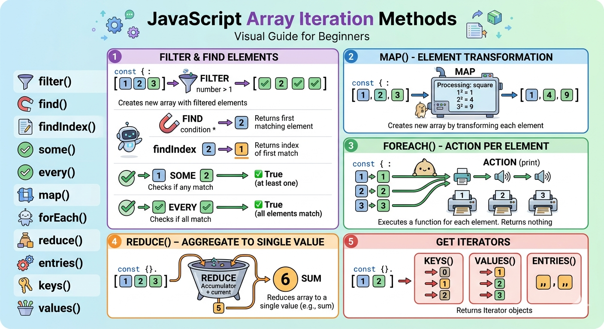
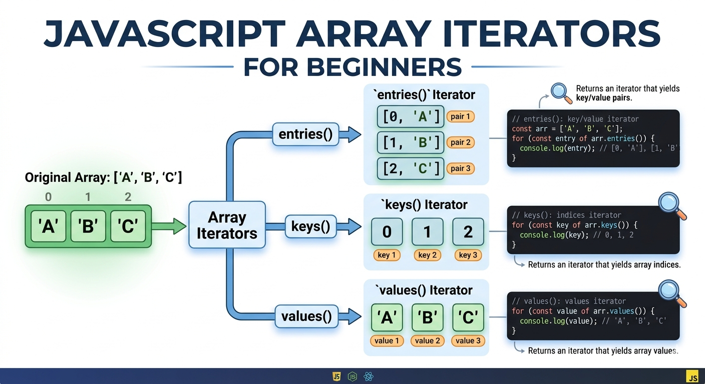

# Ch5 集合(Collection) 物件 - Part 2

## 本章重點

- 陣列操作: 在陣列中新增、更新與刪除元素，並理解哪些操作會直接改變原始資料
- 陣列展開: 如何把陣列展開成一串值，或把多個值收集成一個陣列
- 排序元素: 排序與反轉的基本觀念，並知道數字排序需要額外指定規則
- 陣列迭代方法: 常見的陣列迭代方法，理解它們分別適合過濾、尋找、轉換、逐一處理與歸納資料
- lambda 函數: 一般函數與 lambda 函數的差別，知道何時適合用具名函數，何時適合用簡短的匿名函數
- 迭代器: 了解在需要更細緻流程控制時，為什麼有時仍要自己寫迴圈或使用迭代器

## 陣列的基本操作方法

請自行閱讀 [陣列操作基本方法](ch5_self_study.md). 

### 新增、更新或刪除元素的通用方法 - splice():

- 一個可用於在陣列中新增、移除和替換元素的通用方法。
- 優點: 
  - 不會產生稀疏的陣列，因為會改變陣列的長度
- 小心: 
  - 會改變原始陣列的內容

`splice()` 可依據傳入的參數的組合，產生不同的語義，執行不同的操作:

- 新增元素： `splice(start, 0, item1, item2, ...)`
  - 從 `start` 索引處開始(含)，刪除 0 個元素，然後插入 `item1, item2, ...` 等元素
  - `start` 由 0 開始

- 更新元素： `splice(start, deleteCount, newItem1, newItem2, ...)`
  - 從 `start` 索引處開始(含)，刪除 `deleteCount` 個元素，然後插入 `newItem1, newItem2, ...` 等元素
  
- 刪除元素： `splice(start, deleteCount)`
  - 從 `start` 索引處開始(含)，刪除 `deleteCount` 個元素

`splice()` 執行後重要行為:
- 修改原始陣列的內容 (mutating method)
- 回傳被移除的元素的**陣列**。如果沒有移除任何元素，則回傳**空陣列**。


#### 觀念: 函數簽名

> JavaScript 本身不強制檢查型別，它的簽名主要看名稱與參數數量。
> 
> 相同名稱的函數可以有不同的參數組合，產生不同的行為。
> 
> e.g. `splice()` 不同參數組合產生不同的行為(新增/更新/刪除元素)，但都是同一個函數。

#### Case: 在特定位置新增元素

- 有 months 陣列 `months = ['Jan', 'March', 'April', 'June'];`
- 缺了二月，請將二月加到 Jan 和 March 之間

要從陣列的第 2 個位置開始(索引值為 1)，刪除 0 個元素，然後插入 'Feb' 元素

```js
let months = ['Jan', 'March', 'April', 'June'];
months.splice(1, 0, 'Feb');
console.log(months); // [ 'Jan', 'Feb', 'March', 'April', 'June' ]
```


#### Case: 更新特定的元素

- 更新 Feb 及 March 為 February 及 March
- 沒有直接的更新，必須先刪除再新增

要從陣列的第 2 個位置開始(索引值為 1)，刪除 2 個元素，然後插入 'February' 和 'March' 元素

```js
let months = ['Jan', 'Feb', 'Mar', 'Apr', 'Jun'];
months.splice(1, 2, 'February', 'March');
console.log(months); // [ 'Jan', 'February', 'March', 'April', 'June' ]
```

#### Case: 刪除特定的元素

- 刪除 Apr 及 Jun
- 注意: 會改變原始陣列的內容

要從陣列的第 4 個位置開始(索引值為 3)，刪除 2 個元素

```js
let months = ['Jan', 'Feb', 'Mar', 'Apr', 'Jun'];
removedElm = months.splice(3, 2);
console.log(months); // [ 'Jan', 'Feb', 'Mar' ]
console.log(removedElm); // [ 'Apr', 'Jun' ]
```

#### Quick Practice

閱讀以下程式碼並說明輸出結果:

#### P1 

```js
let arr = ['A', 'B', 'C'];
arr.splice(1, 0, '1', '2');
console.log(arr);  
```

Ans: ＿＿＿＿


#### P2

```js
let arr = ['A', 'B', 'C'];
arr.splice(1, 2);
console.log(arr); 
```

Ans: ＿＿＿＿

### ... 展開運算子 將陣列轉成值清單

- `...` 運算子(三個點)是 「展開運算子」(spread operator) 
- 用來將陣列轉換為值清單(移除中括號)

`['A', 'B', 'C']`(單一個物件) 轉換為 `'A', 'B', 'C' (三個物件)`

#### 為什麼需要展開運算子？

很多 JavaScript API 的函數簽名是「不定引數」（variadic arguments）：

- 它不是要你傳入一個陣列
- 而是要你傳入「一串值清單」：`fn(v1, v2, v3, ...)`

但在實務上，我們常常手上拿到的是「一個陣列」（例如：從 API 回傳的資料、前一步運算的結果）。

展開運算子 `...` 的目的，就是把「陣列」轉成「值清單」，以符合這類 API 的參數型態：

在呼叫時使用 `...` 展開陣列，將陣列中的元素展開成獨立的引數傳入函數中

```js
let ids = ['A', 'B', 'C'];

// 想呼叫一個吃不定引數的 API: fn(v1, v2, v3)
// 需要將陣列展開成值清單
fn(...ids);   // ✅ 變成 fn('A', 'B', 'C')
fn(ids);      // ❌ 變成 fn(['A','B','C']) (把整個陣列當成 1 個參數)
```

典型例子（不定引數之函數）：

1) `max(item1, item2, item3, ...)` 用來找出最大值


```js
Math.max(3, 10, 7);           // 不定引數
Math.max(...[3, 10, 7]);      // ✅ 把陣列展開成引數
Math.max([3, 10, 7]);         // ❌ NaN (參數型態不對)
```

2) `push(item1, item2, item3, ...)` 用來在陣列末尾新增元素

```js 
let queue = [];
queue.push('A', 'B');         // push 也是不定引數
queue.push(...['C', 'D']);    // ✅
```

3) 在 Array Literal 中使用展開運算子, 將某個陣列的元素展開成值清單，插入到另一個陣列中

```js
let arr1 = ['1', '2', '3'];
let arr2 = ['D', 'E', 'F', ...arr1];
console.log(arr2); // [ 'D', 'E', 'F', '1', '2', '3' ]
```

#### 補充: rest parameter (剩餘參數)

rest parameter（剩餘參數）是「函式定義端」的語法：用 `...` 接受不定引數，並把呼叫時傳入的「值清單」收集成一個陣列，方便在函式內部處理。

你雖然看不到內建函式的實作，但很多 **Standard built-in objects** 的 API 在文件/簽名上會用 `...` 表示它們接受「不定個引數」(前面提到的 variadic function)（概念上就像內部把引數收集起來處理）。

典型例子（標準內建 API 皆可接受「值清單」）：


1) `Array.of(...items)`：用一串值建立陣列

```js
let ids = Array.of(5, 8, 13);
console.log(ids); // [5, 8, 13]
```

2) `Array.prototype.push(...items)`：在陣列尾端一次加入多個元素

```js
let queue = [];
queue.push('A', 'B', 'C');
console.log(queue); // ['A', 'B', 'C']
```

3) `Array.prototype.splice(start, deleteCount, ...items)`：在指定位置插入多個元素


將 ['1', '2', '3']  插入到 陣列 ['D', 'E', 'F'] 的 D 和 E 之間。
使用 splice() 方法

```js
let arr1 = ['1', '2', '3'];
let arr2 = ['D', 'E', 'F'];
arr2.splice(1, 0, ...arr1);
console.log(arr2); // [ 'D', '1', '2', '3', 'E', 'F' ]
```

如果沒有展開運算子，會將整個陣列當成一個值

```js
let arr1 = ['1', '2', '3'];
let arr2 = ['D', 'E', 'F'];
arr2.splice(1, 0, arr1);
console.log(arr2); // [ 'D', [ '1', '2', '3' ], 'E', 'F' ]
```

小結：
- 傳入引數時使用 `...arr`: 展開運算子，將陣列展開成值清單，適用於呼叫具不定引數的 API
- 定義函式時使用 `(...args)`: rest parameter ，將值清單收集成陣列，適用於定義接受不定引數的函式


### 排序元素

- `sort()` 將陣列中的元素進行排序, 預設由小到大
- `reverse()` 將陣列中的元素反轉

注意:
1. 會改變原始陣列的內容
2. 預設會將內容轉成字串進行排序
   - 若要使用其他的排序方式，則需要提供一個比較函數

Sort syntax:

```js
sort()
sort(compareFn) // 若要自訂排序方式，則需要提供一個比較函數
```

將陣列中的內容由小到大排序：

```js
let arr = [1, 100, 2, 12 , 21]
arr.sort();
console.log(arr); // [ 1, 100, 12, 2, 21 ]
```

`sort()` 重要行為:
- 會將內容轉成字串進行排序
- 因為 sort() 預設是以字串的方式進行排序，所以會將數字轉成字串進行比較，導致排序結果不符合預期

### 排序數字

- 若要使用數字進行排序，則需要提供一個比較函數

#### compare function（比較函數）的設計規則

`sort(compareFn)` 會在排序過程中不斷呼叫 `compareFn(a, b)` 來比較兩個元素。

比較函數的「回傳值」代表排序規則：

- 回傳 **負數**：代表 `a` 應該排在 `b` 前面
- 回傳 **0**：代表 `a` 和 `b` 在排序上視為相等
- 回傳 **正數**：代表 `a` 應該排在 `b` 後面

因此，比較函數的核心就是：

- 如果你希望 `a` 在前，就回傳負數
- 如果你希望 `b` 在前，就回傳正數

常用模板：

- **數字升冪**：`(a, b) => a - b`
- **數字降冪**：`(a, b) => b - a`


#### 升冪排序範例

```js
function ascendingOrder(a, b) {
    return a - b;
}

let arr = [1, 100, 2, 12 , 21]
arr.sort(ascendingOrder);
console.log(arr); // [ 1, 2, 12, 21, 100 ]
```

#### 程式閱讀練習

解釋以下程式碼執行的結果，並說明為什麼會得到這樣的結果？

```js
let str = 'Hello World';
let arr = Array.from(str);
arr.reverse();
let newStr = arr.join('');
console.log(newStr);
```

<details>
<summary>參考答案</summary>

將字串 'Hello World' 反轉成 'dlroW olleH'

Hints:
- 將字串轉成 char array
- 使用 reverse() 方法反轉陣列
- 使用 join() 方法將陣列轉成字串

三種方法將字串轉成陣列:
1. `Array.from(str)`
2. `Array.of(...str)`
3. `str.split('')`

</details>


## 陣列的迭代方法 (Iterative Methods)

### 迭代方法 (Iterative Methods)

- 陣列（Array）、Set、Map 等可迭代對象所提供的方法
- 他們會自動拜訪每個元素，並執行使用者提供的 callback 函數
- 迭代方法背後的思維:
  - 使用函數轉換每一個原始的元素，得到一個新的陣列或集合
  - 不會改變原始的陣列或集合 

### 為什麼要使用迭代方法？

**原因一：更簡潔、更直覺、更可讀**

相比傳統的 `for` 迴圈，迭代方法讓程式碼更清晰、簡短，並減少錯誤的可能性。
- 沒有 counter 變數及索引值的操作
- 不需要手動管理迴圈的起始和終止條件

傳統 `for` 迴圈：

```js
let scores = [60, 70, 80, 90];
let passScores = [];
for (let i = 0; i < scores.length; i++) {
    if (scores[i] > 70) {
        passScores.push(scores[i]);
    }
}
console.log(passScores); // [80, 90]
```

使用迭代方法 `filter()`：

```js
let scores = [60, 70, 80, 90];
let passScores = scores.filter(score => score > 70);
console.log(passScores); // [80, 90]
```

---

**原因二：關注點分離**

將「迭代動作」與「處理邏輯」分開：
- 迭代方法（如 `filter()`）負責遍歷，開發者只需專注於撰寫條件邏輯
- 「處理邏輯」可以獨立定義，並重複使用在不同的可迭代物件上

```js
// 定義一次判斷邏輯
function isPass(score) {
    return score > 70;
}

// 重複使用在不同的陣列
let classA = [60, 80, 90];
let classB = [55, 75, 85, 95];

console.log(classA.filter(isPass)); // [80, 90]
console.log(classB.filter(isPass)); // [75, 85, 95]
```

---

**原因三：可以串接方法（Method Chaining）**

多個迭代方法可以串接，讓複雜的資料處理流程更清晰：

```js
// 過濾偶數，然後將每個偶數平方
const numbers = [1, 2, 3, 4, 5, 6];
const result = numbers
    .filter(num => num % 2 === 0)   // [2, 4, 6]
    .map(num => num ** 2);           // [4, 16, 36]
console.log(result); // [4, 16, 36]
```

使用 for loop 的話，會變得冗長不直觀

```js
const numbers = [1, 2, 3, 4, 5, 6];
let squaredEvens = [];
for (let i = 0; i < numbers.length; i++) {
    if (numbers[i] % 2 === 0) {
        squaredEvens.push(numbers[i] ** 2);
    }
}
console.log(squaredEvens); // [4, 16, 36]
```

## 函數與 lambda 函數

函數是一段可重複使用的程式碼，具有名稱和參數，可以被重複使用。

```js
function fn(parm1, parm2, ...) {
    // 函數主體
    // ...
    return result; // 可選的回傳值
} 
```

但，有些情況下，我們只需要一個簡單的函數，並且不需要重複使用它。這時候，我們可以使用 lambda 函數（匿名函數）來定義這樣的函數。

lambda 函數省略了 `function` 關鍵字和函數名稱, 只有參數和函數主體，及一個箭頭 `=>` 來分隔參數和函數主體。
- lambda 函數也稱為箭頭函數，Arrow Function

```js
(parm1, parm2, ...) => {
    // 函數主體
    // ...
    return result; // 可選的回傳值
}
```

lambda 函數精簡規則:

- 若參數只有一個，則可以省略參數串列的括號
- 若只有一個運算式，則可以省略大括號(函數主題)和 return 關鍵字

最精簡的 lambda 函數範例:
- 只有一個參數 x；一個運算式 `x + 1`；回傳 `x + 1` 的結果

```js
x => x + 1
```

在迭代方法中，常常會使用 lambda 函數來定義簡單的回呼函數，因為這些回呼函數通常只會用在一次，並且邏輯很簡單。

兩者的選擇原則
> - 會重複使用、邏輯較複雜：優先考慮一般函數
> - 只用一次、邏輯很短：優先考慮 lambda 函數


### 迭代方法 概覽



- 過濾與㝷找元素:
  - `filter()`: 過濾陣列中的元素
  - `find()`: 找到陣列中的第一個符合條件的元素
  - `findIndex()`: 找到陣列中的第一個符合條件的元素的索引值
  - `some()`: 判斷陣列中是否有至少一個元素符合條件
  - `every()`: 判斷陣列中是否所有元素都符合條件 

- 元素轉換:
  - `map()`: 將陣列中的每個元素轉換為新的值

- 對每個元素執行操作:
  - `forEach()`: 對陣列中的每個元素執行操作

- 將多個元素變成一個值:
  - `reduce()`: 將陣列中的所有元素轉換為一個值(e.g. 加總)

- 取得迭代器 (Iterator):
  - `entries()`: 取得陣列 key/value 的迭代器
  - `keys()`: 取得陣列的索引值的迭代器
  - `values()`: 取得陣列的值的迭代器


## 過濾與㝷找元素

### filter() 過濾陣列中的元素

情境: 陣列中存放銷售金額, 找出大於 700 的銷售金額 

思維: 迭代動作與過濾邏輯分開

設計一函數，傳入一個數字，判斷是否大於 70

```js
function isGreater(sale) {
    return sale > 700;
}
```

- 將 `isGreater()` 函數傳入 `filter()` 方法中，過濾出大於 700 的銷售金額

```js
let sales = [600, 700, 800, 900];
let passSales = sales.filter(isGreater);
console.log(passSales); // [ 800, 900 ]
```

### 使用 lambda 函數精簡程式碼

如果 `isGreater()` 函數只會用在 `filter()` 方法中，使用 lambda 函數來精簡程式碼

```js
let sales = [600, 700, 800, 900];
let passSales = sales.filter(sale => sale > 700);
console.log(passSales); // [ 800, 900 ]
```

### 運作過程

- `filter()` 方法會遍歷陣列中的每個元素
- 對每個元素執行傳入的 `isGreater()` 函數
  - 如果 `isGreater()` 函數回傳 true，則將該元素加入到新的陣列中
  - 如果回傳 false，則不加入
- `filter()` 方法會回傳一個新的陣列，包含所有符合條件的元素
- 不會改變原始陣列的內容

### 所有元素是否都符合條件 - every() 

情境: 學生的成績是否都大於 60 呢?

- 使用 `every()` 方法, 回傳 boolean 值

```js
let scores = [60, 70, 80, 90];
let isAllPass = scores.every(score => score > 60);
console.log(isAllPass); // false
```

### Quick Practice

有以下的銷售金額

`sales = [1200, 1500, 800, 2000, 500]`

1. 請判斷是否所有金額都大於 1000
2. 如果不是, 請印出所有小於 1000 的金額

<details>
<summary>參考答案</summary>

先使用 `every()` 方法判斷是否所有金額都大於 1000
找出小於 1000 的金額, 使用 `filter()` 方法
之後，再印出這些金額。

```js
let sales = [1200, 1500, 800, 2000, 500];
let isAllPass = sales.every(sale => sale > 1000);
if (!isAllPass) {
    console.log("不是所有金額都大於 1000");
    let lowSales = sales.filter(sale => sale < 1000);
    console.log(lowSales); // [ 800, 500 ]
} else {
    console.log("所有金額都大於 1000");
}
```
</details>

## 元素轉換

### 情境

調整學生的成績，每位學生加 5 分

原始成績: `scores = [60, 70, 80, 90];`

新的成績: `newScores = [65, 75, 85, 95];`

每個元素的運算邏輯: `x => x + 5`
- 傳入 x, 回傳 `x + 5`

### map() 方法

- `map()` 方法用來將陣列中的每個元素轉換為新的值
  - 回傳一個新的陣列

```js
let scores = [60, 70, 80, 90];
let newScores = scores.map(score => score + 5);
console.log(newScores); // [ 65, 75, 85, 95 ]
```

## 對每個元素執行操作

### 情境

將學生成績格式化輸出:   `成績 xx, 及格/不及格`

- 原始成績: `scores = [60, 70, 80, 90];`
- 輸出: 
  - `成績 60, 不及格`
  - `成績 70, 及格`
  - `成績 80, 及格`
  - `成績 90, 及格`

每個元素的執行操作:
```js
score => console.log(
  `成績 ${score}, ${score > 70 ? '及格' : '不及格'}`)`)
```

### 其它情境

- 將元素寫到檔案中
- 將元素傳到伺服器
- 將元素印出來

### forEach() 方法

- 使用 `forEach()` 方法對陣列中的每個元素執行操作
  - 不會回傳任何值

```js
let scores = [60, 70, 80, 90];
scores.forEach(score => console.log(
  `成績 ${score}, ${score > 70 ? '及格' : '不及格'}`));
```


### Quick Practice

銷售金額 [1200, 1500, 800, 2000, 500]。
超過 1000 的為 VIP 客戶，其它的為 一般客戶。

將金額資料改成 [1200(VIP), 1500(VIP), 800(一般), 2000(VIP), 500(一般)]. 
接著印出這些資料。

<details>
<summary>參考答案</summary>

```js
let sales = [1200, 1500, 800, 2000, 500];
sales.map(sale => {
    let type = sale > 1000 ? 'VIP' : '一般';
    return `${sale}(${type})`;
}).forEach(sale => console.log(sale));
```
</details>  

## 對所有元素逐一進行歸納(reduce): 多個值變成一個值

### 情境

成績資料 [60, 70, 80, 90]

- 算出總和
  - 逐一累加，得到總合
- 找出最大/最小值
  - 逐一比大小，得到最大或最小值
- 找出高於 70 分的人數
  - 逐一判斷，得到符合條件的元素

### 典型歸納函數

傳入一個歸納函數給 `reduce()` 方法

典型歸納函數的簽名: 

```js
function reducer(accumulator, currentValue) {
    // ...
    // 回傳歸納的結果
    return newAccumulator;
}
```

一定要有兩個參數:
- `accumulator`: 累加器，累加的結果(目前歸納的結果)
- `currentValue`: 當前元素的值

回傳 
- 新的累加器的值

---

補充: 完整的簽名

```js
function reducer(accumulator, currentValue, currentIndex, array) {
    // ...
    // 回傳「新的歸納結果」
    return newAccumulator;
}
```
- `accumulator` 和 `currentValue` 是必須的參數
- `currentIndex`: 當前元素的索引值
- `array`: 原始陣列的參考

### 典型歸納器範本

歸納總合

```js
function sum(accumulator, currentValue) {
    return accumulator + currentValue;
}

// lambda function
(accumulator, currentValue) => accumulator + currentValue
```

歸納最大值

```js
function max(accumulator, currentValue) {
    return Math.max(accumulator, currentValue);
}

// lambda function
(accumulator, currentValue) => Math.max(accumulator, currentValue)
```


歸納符合某個條件的元素的數量
如大於 70 的人數

```js
function count(accumulator, currentValue) {
    return currentValue > 70 ? accumulator + 1 : accumulator;
}
// lambda function
(accumulator, currentValue) => currentValue > 70 ? accumulator + 1 : accumulator
```

### reduce() 方法

- `reduce()` 方法用來對陣列中的每個元素執行歸納操作
- 回傳一個新的值
- 不會改變原始陣列的內容
- 可以指定累加器的初始值
    - 如果沒有指定，則使用陣列中的第一個元素作為初始值

Syntax:

```js
reduce(callbackFn)
reduce(callbackFn, initialValue)
```

### Ex. 算出成績的總和

```js
let scores = [60, 70, 80, 90];
let total = scores.reduce(
  (accumulator, currentValue) => accumulator + currentValue);
console.log(total); // 300
```

### Ex. 找出成績大於 70 的學生人數

```js
let scores = [60, 70, 80, 90];
let count = scores.reduce(
  (accumulator, currentValue) => currentValue > 70 ? accumulator + 1 : accumulator, 0);
console.log(count); // 3
```

### Quick Practice 

銷售金額 [1200, 1500, 800, 2000, 500]。

找出最低的金額，並印出來。

<details>
<summary>參考答案</summary>

```js
let sales = [1200, 1500, 800, 2000, 500];
let minSale = sales.reduce(
  (accumulator, currentValue) => Math.min(accumulator, currentValue));
console.log(minSale); // 500
```

</details>

## 自行迭代 

### 何時需要自行迭代？

- 如果迭代方法不符合需求，可以取得 Array 的迭代器，然後自行迭代

Q: 為何要自行迭代？迭代方法的限制？

雖然 `filter()`、`map()`、`forEach()`、`reduce()` 這些迭代方法很好用，但它們主要適合「常見且單一目的」的資料處理。

如果需求比較複雜，就可能需要自行迭代。


**Case 1. 需要在特定條件下「中斷」或「跳出」迴圈**

這是在 JavaScript 中最常見的限制。

原因：像 `forEach` 這樣的方法，其設計初衷是針對數組中的每個元素執行一次。除了拋出異常，它無法使用 `break` 或 `continue` 來提早終止。

替代方案：若需要提早跳出，應使用傳統的 `for` 迴圈、`for...of` 迴圈，或使用能回傳布林值以控制流程的方法，如 `some()` 或 `every()`。


**Case 2: 非同步操作（Async/Await）的處理**

原因：`forEach` 不會等待非同步回呼函式（callback）執行完畢。如果你在裡面使用 `await`，它會幾乎同時啟動所有非同步操作，而不會按順序等待。

替代方案：使用 `for...of` 迴圈搭配 `await` 來確保任務按順序執行，或使用 `Promise.all(array.map(...))` 來並行處理所有請求。


**Case 3: 極大型數據集的性能考量**

原因：某些迭代方法（如 `map`、`filter`）會建立中繼陣列，造成處理非常大數據集時性能下降。

替代方案：使用傳統迴圈或 `for...of` 來直接處理元素，避免建立中繼陣列，從而提升性能。

Example:

```js
let transactions = [...]; // 假設有一個非常大的交易數據集
// 過濾出金額大於 1000 的交易，之後再轉換成特定字串格式
let vipReport = transactions
  .filter(tx => tx.amount > 1000) // 這會建立一個新的陣列，可能很大
  .map(tx => `交易 ${tx.id}: 金額 ${tx.amount}`); // 又會建立另一個新的陣列
```

改用 `for...of` 來直接處理：

```js
let transactions = [...]; // 假設有一個非常大的交易數據集
let vipReport = [];
for (const tx of transactions) {
    if (tx.amount > 1000) {
        vipReport.push(`交易 ${tx.id}: 金額 ${tx.amount}`);
    }
}
```

**Case 4: 處理高度遞迴的結構（如樹狀或圖結構）**

原因：迭代方法通常適用於「線性結構（如陣列）」，但對於樹狀或圖結構，可能需要使用遞迴或堆疊來遍歷。

#### 小結

- 迭代方法適合常見、單一、線性的資料處理工作
- 自行迭代適合需要流程控制、複雜邏輯、或一次完成多件事的情境
- 重點不是哪個一定比較好，而是選擇更適合當下需求的工具

### 自行迭代的程序

1. 取得可迭代對象的迭代器
   - 例如：使用 `entries()`、`keys()`、`values()` 方法來取得陣列的迭代器


2. 使用 `for...of` 對迭代器自動迭代，遍歷每個元素

```js 
for (const element of iterator) {
    // 對每個元素執行操作
    // break/continue 也可以使用
}
```


### Array 提供的 Iterators 

- `entries()`: 取得陣列 key/value 的迭代器
  - 假設陣列為 `['A', 'B', 'C']`
  - entries() 的 iterator 逐一回傳的資料 [0, 'A'], [1, 'B'], [2, 'C']
    - 回傳陣列 [index, value]
- `keys()`: 取得陣列的索引值的迭代器
  - 逐一回傳的資料 [0, 1, 2]
- `values()`: 取得陣列的值的迭代器
  - 逐一回傳的資料 ['A', 'B', 'C']



#### entries() 迭代器

情境: 迭代時要取得元素的索引及值

Ex. 印出學生成績的索引及元素值，輸出格式為: `學生 index: xx, 成績: xx`

使用 `entries()` 迭代器，搭配 `for...of` 迴圈來達成：

```js
let scores = [60, 70, 80, 90];
for (const [index, score] of scores.entries()) {
    console.log(`學生 index: ${index}, 成績: ${score}`);
}
```

- `scores.entries()` 會回傳一個迭代器，逐一回傳 [index, score] 的陣列
- `[index, score]` 是解構賦值，將迭代器的回傳值解構為 index 和 score

也可以使用 `forEach()` 方法, 使用第二個參數來達成`

```js
let scores = [60, 70, 80, 90];
scores.forEach((score, index) => {
    console.log(`學生 index: ${index}, 成績: ${score}`);
});
```


#### keys() 迭代器

- 取得陣列的索引值的迭代器
- 如果用於 Map 物件，則會取得 Map 中的鍵值的迭代器

Ex. 取得 Array 物件的索引值

```js
let arr = ['A', 'B', 'C'];

for (const key of arr.keys()) {
    console.log(key); // 0, 1, 2
}
```

#### values() 迭代器

- 取得陣列的值的迭代器
- 如果用於 Map 物件，則會取得 Map 中的值的迭代器

Ex. 取得 Array 物件的值
```js
let arr = ['A', 'B', 'C'];
for (const value of arr.values()) {
    console.log(value); // A, B, C
}
```


### Quick Review

- Array 物件提供了那些類型的迭代方法？舉例使用說明情境
- 想要把陣列中的每個元素的值除以 100 轉換成百分比, 應該使用那個迭代方法？為什麼? 
- Array 物件提供了哪些迭代器？ 

### 補充: 解構賦值(自行閱讀)

- 情境: 如果要將一個陣列的值指派給多個變數, 要如何寫會比較簡潔?

- Examples: 
  -  [1, 2, 3] 的值要指派給 a, b, c 三個變數
  -  [1, 2, 3] 中 1 和 3 的值要指派給 a 和 b 兩個變數, 2 捨棄

- ES 6 提供了解構賦值(Destructuring Assignment)的語法
  - 在指派符號的左右兩側, 皆可使用陣列或物件
  - 陣列物件會以位置對應的方式進行指派
  - 一般物件會以鍵值對應的方式進行指派

---

Ex. [1, 2, 3] 的值要指派給 a, b, c 三個變數

```js
let [a, b, c] = [1, 2, 3];
```

Ex. [1, 2, 3] 中 1 和 3 的值要指派給 a 和 b 兩個變數, 2 捨棄

```js
let [a, , b] = [1, 2, 3];
```

---

- 也可使用 `...` 展開運算子(Spread operator) 儲存剩餘的值到另個陣列中

Ex. 將 [1, 2, 3] 中 的 1 指派到 a, [2, 3] 放到另個陣列中 subArr 中

```js
let [a, ...subArr] = [1, 2, 3];
console.log(a); // 1
console.log(subArr); // [ 2, 3 ]
```


## 本章內容回顧

- 陣列的基本操作方法
  - `splice()`：可在指定位置新增、更新或刪除元素
  - `sort()`：排序陣列內容；若是數字排序，通常要提供比較函數
  - `reverse()`：反轉陣列元素順序

- 展開運算子與剩餘參數
  - spread `...arr`：把陣列展開成值清單
  - rest `(...args)`：把值清單收集成陣列
  - 常見用途：呼叫不定引數函數、合併陣列、插入多個元素

- 陣列的迭代方法
  - `filter()`：過濾符合條件的元素
  - `find()` / `findIndex()`：尋找第一個符合條件的元素或索引
  - `some()` / `every()`：判斷是否有元素或所有元素符合條件
  - `map()`：將每個元素轉換成新值
  - `forEach()`：對每個元素執行操作
  - `reduce()`：將多個元素歸納成一個值

- 函數與 lambda 函數
  - 一般函數：適合重複使用、邏輯較清楚的情境
  - lambda 函數：適合短小、一次性的 callback function

- 自行迭代與迭代器
  - 當需要 `break` / `continue`、更細緻流程控制或避免中繼結果時，可使用 `for` 或 `for...of`
  - Array 提供的迭代器：`entries()`、`keys()`、`values()`
  - 可搭配解構賦值一起使用，例如 `for (const [index, value] of arr.entries())`

## 複習問題

1. `splice()` 可以用來完成哪三類操作？它與 `slice()` 在是否改變原始陣列上有什麼不同？

2. 為什麼說 `splice()` 是一個「多種參數組合、對應不同語義」的方法？請舉例說明新增與刪除的差別。

3. 什麼情況下需要使用展開運算子，將陣列轉成值清單？請用自己的話說明原因。

4. spread 與 rest 都使用 `...`，但兩者的用途有何不同？

5. 為什麼陣列中的數字在使用預設排序時，結果可能不符合直覺？

6. 比較函數在排序中的作用是什麼？如果想要做數字由小到大的排序，回傳值應該符合什麼規則？

7. 常見的陣列迭代方法可以分成哪些類型？請至少說出過濾、轉換、逐一處理與歸納各對應的一個方法。

8. 為什麼說迭代方法能讓程式碼更簡潔，並把「迭代動作」與「處理邏輯」分開？

9. 一般函數與 lambda 函數各適合用在什麼情況？請分別說明。

10. 如果某段邏輯只會使用一次，而且內容很短，通常會優先選擇哪一種函數寫法？為什麼？

11. 為什麼在某些情況下仍然需要自行迭代，而不能只依賴內建的迭代方法？請說明至少兩個原因。

12. Array 提供了哪些常見的迭代器？它們各自回傳的是什麼資料？