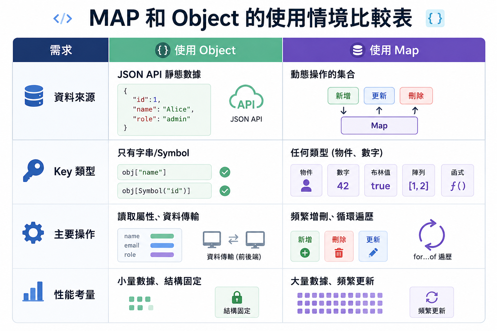

# Chapter 5 集合物件 - Part 3

Map and Set 物件

## Map 物件

`Map` 物件是一種集合物件，允許使用任意類型的值作為鍵（key）來儲存對應的值（value）。

```
       📜 JavaScript Map 插入順序與映射示意圖
 ━━━━━━━━━━━━━━━━━━━━━━━━━━━━━━━━━━━━━━━━━━━━━━━━━━━━━
  [ 插入順序 ]      [ 鍵 (Key) ]            [ 值 (Value) ]
 ─────────────────────────────────────────────────────
     Step 1  ───  'name' (字串)  ━━━━▶  'Alice'
     Step 2  ───  100    (數字)  ━━━━▶  'Score'
     Step 3  ───  {id:1} (物件)  ━━━━▶  'Data Obj' 💡鍵不限字串
     Step 4  ───  true   (布林)  ━━━━▶  'Yes'
 ━━━━━━━━━━━━━━━━━━━━━━━━━━━━━━━━━━━━━━━━━━━━━━━━━━━━━
       ┃                ┃                    ┃
   迭代有序         唯一不重複           一對一映射存取
 (Iterative)      (Unique Keys)        (Key-Value Pair)

```

- 直接使用鍵來存取對應的值，不需逐一拜訪搜尋
- 逐一拜訪時，會按照插入的順序來迭代


## 使用情境

### 電子商務應用程式中的 Map 使用場景

1. **購物車存儲** - 以產品 ID 為鍵，存儲購物車物件（數量、價格等）   
2. **用戶會話管理** - 以用戶 ID 為鍵，存儲登入會話資料
3. **用戶收藏清單** - 以用戶 ID 為鍵，存儲收藏的商品列表

## 建立 MAP 物件

有三種常見的方式來建立 Map 物件：
- 從已有的鍵值對的「二維陣列」建立 Map 物件
- 從已由鍵值對資料的「物件」建立 Map 物件
- 直接建立空的 Map 物件

### Case 1: 已有鍵值對(key-value pairs)資料(陣列) 建立 Map 物件

已知有以下的產品 ID 及 數量，想要建立一個 Map 物件來存儲這些資料：

由二維陣列表示的產品資料：
```js
const productData = [
    [10, 2],
    [20, 5],
    [30, 1]
];
```

其中每個子陣列的第一個元素是產品 ID(做為鍵)，第二個元素是數量(做為值)： `[產品 ID, 數量]`。

使用 MAP 建構子來建立 Map 物件：

```js
const productData = [
    [10, 2],
    [20, 5],
    [30, 1]
];
const cartMap = new Map(productData);
```

建立出以下的 Map 物件：

```
 ━━━━━━━━━━━━━━━━━━━━━━━━━━━━━━━━━━━━━━━━━━━━━━━━━━━━━━━━━━━━
  [ 插入順位 ]       [ 鍵 (Key) ]             [ 值 (Value) ]
 ────────────────────────────────────────────────────────────
    (Step 1)  ───   10 (數字)    ━━━━▶   2
    (Step 2)  ───   20 (數字)    ━━━━▶   5
    (Step 3)  ───   30 (數字)    ━━━━▶   1
 ━━━━━━━━━━━━━━━━━━━━━━━━━━━━━━━━━━━━━━━━━━━━━━━━━━━━━━━━━━━━
       ▲                ▲                    ▲
    順序穩定         鍵不重複             一對一映射
  (Ordered)       (Unique Keys)        (Value Storage)

```

### Case 2: 從物件(object) 建立 Map 物件

假設我們從資料庫拿到一個以 skuId 為鍵的物件，內容是產品的價格、庫存和名稱：

```js
// 原始物件 (來自 API 或設定檔)
const stockData = {
  "PROD_001": { price: 100, stock: 50, name: "無線滑鼠" },
  "PROD_002": { price: 2500, stock: 10, name: "機械鍵盤" },
  "PROD_003": { price: 450, stock: 0, name: "人體工學鼠墊" }
};
```

物件的屬性名（如 "PROD_001"）是字串類型的鍵，對應的值是產品資訊物件。


想要將這個物件轉換成 Map 物件。

使用 `Object.entries()` 方法將物件轉換成鍵值對陣列 `[[欄位，值]...]` ，再傳入 Map 建構子：

```js
const stockDataMap = new Map(Object.entries(stockData));
``` 

建立出來的 MAP:

```
               📜 Map 集合：商品資料儲存 (Product Registry)
 ━━━━━━━━━━━━━━━━━━━━━━━━━━━━━━━━━━━━━━━━━━━━━━━━━━━━━━━━━━━━━━━━━━━━━━━
  [ 插入順位 ]       [ 鍵 (Key) ]                 [ 值 (Value) ]
 ───────────────────────────────────────────────────────────────────────
    (Step 1)  ───  'PROD_001'  ━━━━▶  { price: 100,  stock: 50, name: "..." }
    (Step 2)  ───  'PROD_002'  ━━━━▶  { price: 2500, stock: 10, name: "..." }
    (Step 3)  ───  'PROD_003'  ━━━━▶  { price: 450,  stock: 0,  name: "..." }
 ━━━━━━━━━━━━━━━━━━━━━━━━━━━━━━━━━━━━━━━━━━━━━━━━━━━━━━━━━━━━━━━━━━━━━━━
       ▲                ▲                         ▲
    順序穩定         鍵不重複                  複雜物件內容
  (Ordered)       (Unique Keys)            (Object Values)

```

### 補充: MAP 和 Object 的差異

在 ES6（2015年） 推出 Map 之前，JavaScript 開發者唯一的選擇就是將 Object 當成 Map 來使用

但使用 Object 當成 Map 來用會有一些限制和問題，例如：

- 大量資料時，Object 的性能會下降
- 資料沒有插入順序，迭代時會亂掉
- 只能用字串或 Symbol 作為鍵，無法使用其他類型


將物件轉成 MAP 的時機:

- 需要使用 Object 做為 key 值時
- 需要頻繁「增刪」資料時
- 需要保持資料的插入順序時
- 需要頻繁獲取長度（Size）時

MAP 和 Object 的使用情境比較表：

| 需求 | 使用 Object | 使用 Map |
|------|------------|---------|
| 資料來源 | JSON API 靜態數據 | 動態操作的集合 |
| Key 類型 | 只有字串/Symbol | 任何類型 (物件、數字) |
| 主要操作 | 讀取屬性、資料傳輸 | 頻繁增刪、循環遍歷 |
| 性能考量 | 小量數據、結構固定 | 大量數據、頻繁更新 |



你選對了資料結構嗎？如果你的需求是「需要頻繁增刪資料」或「需要保持插入順序」，那麼使用 Map 會比 Object 更適合。

### Case 3: 建立空的 Map 物件

直接使用 Map 建構子來建立空的 Map 物件：

```js
const emptyMap = new Map();
```

## 新增、刪除、修改 Map 物件內的資料

### 新增資料

使用 `set(key, value)` 方法來新增資料：

```js
const cartMap = new Map();
cartMap.set(10, 2); // 產品 ID 10 的數量為 2
cartMap.set(20, 5); // 產品 ID 20 的數量為 5
cartMap.set(30, 1); // 產品 ID 30 的數量為 1
```

### 取得資料

使用 `get(key)` 方法來取得資料：

```js
const quantity = cartMap.get(10); // 取得產品 ID 10 的數量
console.log(quantity); // 輸出: 2
```

注意，不要和 Object 的屬性存取方式混淆了，Map 是用 `get()` 方法來取得值，而不是用 `[]`。

- carMap[10] 或 myMap.key 是 Object 的存取方式，會導致意圖混淆，分不清楚是在操作「物件的屬性」還是在操作「資料的對應」。

Bad Smell (不建議的寫法)

```js
// 嘗試取得 cartMap 的 "10" 屬性，而不是取得 Map 中鍵為 10 的值
const quantity = cartMap[10]; // 錯誤的存取方式，會得到 undefined
console.log(quantity); // 輸出: undefined
```

### 修改資料

使用 `set(key, value)` 方法來修改資料：

`key` 已存在時，`set()` 方法會覆蓋原有的值：


```js
cartMap.set(10, 3); // 修改產品 ID 10 的數量為 3
``` 


### 刪除資料

使用 `delete(key)` 方法來刪除資料：

```js
cartMap.delete(20); // 刪除產品 ID 20 的資料
```

### 清空 Map 物件

使用 `clear()` 方法來清空 Map 物件：

```js
cartMap.clear(); // 清空所有資料
```

### 取得 keys 或 values

使用 `keys()` 方法來取得所有的鍵：

```js
const keys = cartMap.keys(); // 取得所有的鍵
console.log(keys); // 輸出: MapIterator { 10, 30 }
```

keys() 方法回傳一個 MapIterator 物件，可以用 `for...of` 迴圈來遍歷所有的鍵。

```js
for (const key of cartMap.keys()) {
    console.log(cartMap.get(key)); // 輸出: 2, 1
}
```

你也可以使用 `values()` 方法來取得所有的值：

```js
const values = cartMap.values(); // 取得所有的值
console.log(values); // 輸出: MapIterator { 3, 1 }
```

`values()` 方法回傳一個 MapIterator 物件，可以用 `for...of` 迴圈來遍歷所有的值。

```js
for (const value of cartMap.values()) {
    console.log(value); // 輸出: 3, 1
}
```


### 取得 Map 的大小

使用 `size` 屬性來取得 Map 的大小：

```js
const size = cartMap.size; // 取得 Map 的大小
console.log(size); // 輸出: 2
```

### 遍歷 Map 物件

### 使用 `for...of` 迴圈來遍歷 Map 物件：

```js
for (const [key, value] of cartMap) {
    console.log(`產品 ID: ${key}, 數量: ${value}`);
}
```

對 Map 物件使用 `for...of` 迴圈時，每次迭代會回傳一個包含鍵和值的陣列 `[key, value]`，可以使用解構賦值來直接取得鍵和值。


### 使用 `forEach()` 方法來遍歷 Map 物件：

你若要對 MAP 中的每個鍵值對執行某些操作(執行函數)，可以使用 `forEach()` 方法，該方法會接受一個回呼函式，對 Map 中的每個鍵值對執行一次。

```js
function printCartItem(value, key) {
    console.log(`產品 ID: ${key}, 數量: ${value}`);
}
cartMap.forEach(printCartItem);
```

Callback 函式會接受三個參數：`value`、`key` 和 `map`，分別代表當前迭代的值、鍵和整個 Map 物件。

Callback 函數的簽名:

```js
function callback(value, key, map) {
    // 在這裡對每個鍵值對執行操作
}
```

注意 API 的設計，風格和 Array 的 `forEach()` 的 callback 的簽名一致:

Array 的 `forEach()` 的 callback 的簽名，也是元素在前，索引在後：

```js
function callback(element, index, array) {
    // 在這裡對每個元素執行操作
}
```

所以，在 Array 中，我們通常最在意的是元素本身；同樣地，在 Map 中，設計者認為值（Value）才是主要資料，鍵（Key）則扮演類似陣列索引的角色。


## Map 集合的 Clean Code 實踐

當目的是建立『鍵值對應』的邏輯時，應使用 Map 的 API，而不是把 Object 當成雜湊表（Hash Map）來用。

### Rule 1: 不要把 Object 當成 Map 來用 - 使用 .set()、.get() 而非 []

Object 使用屬性來存取值，感覺上也是用「鍵」來存取「值」。

例如有以下「訂單表頭」物件:

```js
const orderHeader = {
    orderId: 12345,
    customerName: "Alice",
    orderDate: "2024-06-01"
};
```

取得訂單 ID 的值：

```js
const orderId = orderHeader["orderId"]; // 這裡是用字串當作鍵來存取值
console.log(orderId); // 輸出: 12345
``` 

如果把 Object 當成 Map 來用，會造成意圖混淆，分不清楚是在操作「物件的屬性」還是在操作「資料的對應」。

如果資料有頻繁的增刪改查需求，或是需要使用非字串類型的鍵，應該使用 Map 物件來實現.
如果你的資料是固定格式（例如：一個人的 name、age），就用 Object。

例如儲存使用者會話資料(session data), 屬動態資料, 以用戶 ID 為鍵，存儲登入會話資料：

```js
const sessionMap = new Map();
sessionMap.set("user123", { isLoggedIn: true, lastLogin: "2024-06-01" });
sessionMap.set("user456", { isLoggedIn: false, lastLogin: "2024-05-30" });
```

### Rule 2: 使用內建方法取代手動檢查, 讓邏輯變得像英文句子一樣直覺。

當需要檢查 Map 中是否存在某個鍵時，應使用 `has(key)` 方法，而不是手動檢查 `get(key)` 的結果。

例如要檢查產品 ID 10 是否存在：

Code Scent (良好寫法)

```js
if (cartMap.has(10)) {
    console.log("產品 ID 10 存在");
} else {
    console.log("產品 ID 10 不存在");
}
```

Bad Smell (不建議的寫法)

```js
if (cartMap.get(10) !== undefined) {
    console.log("產品 ID 10 存在");
} else {
    console.log("產品 ID 10 不存在");
}
```

例如：清空 Map 物件：

Code Scent (良好寫法)

```js
cartMap.clear(); // 直接使用 clear() 方法來清空 Map
```

Bad Smell (不建議的寫法)

```js
for (const key of cartMap.keys()) {
    cartMap.delete(key); // 手動刪除每個鍵值對來清空 Map
}
```

### Rule 3: 遍歷時直接解構 (Destructuring)

要遍歷 Map 時利用 「解構賦值」，讓變數名稱在第一時間就定義清楚。

Code Scent (良好寫法)

```js
for (const [productId, quantity] of cartMap) {
    console.log(`產品 ID: ${productId}, 數量: ${quantity}`);
}
```

Bad Smell (不建議的寫法)

```js
for (const entry of cartMap) {
    const productId = entry[0]; // 手動從 entry 中取出鍵和值
    const quantity = entry[1];
    console.log(`產品 ID: ${productId}, 數量: ${quantity}`);
}
```

## Map 的應用 - 滿額折抵 / 優惠券自動湊單

情境： 網站正在辦「兩件商品湊 1000 元現折 100 元」的活動。
應用： 當使用者選了一件 600 元的商品時，系統要從資料庫或購物車中，快速找出是否有另一件剛好 400 元 的商品（目標值 ）可以配對。

- 傳統做法： 拿 600 元去跟每一件商品比對（$O(n^2)$），商品多時會卡頓。
- Map 做法： 將所有商品價格存入 Map，直接檢查 map.has(400)。

假設有以下的商品價格列表：

```js
const prices = [200, 400, 600, 800];
```

假設顧客選了一件 600 元的商品，目標值為 1000 元 - 600 元 = 400 元。
要回傳商品的索引 (index)

傳統做法：

```js
const target = 1000 - 600; // 目標值為 400 元
let found = false;
let matchedIndex = -1;
for (let [idx, price] of prices.entries()) {
    if (price === target) {
        found = true;
        matchedIndex = idx;
        break;
    }
}
console.log(found ? `找到配對商品，索引為 ${matchedIndex}` : "沒有找到配對商品");
```

Map 做法：

```js
const target = 1000 - 600; // 目標值為 400 元

// 建立價格到索引的 Map
const priceMap = new Map();
prices.forEach((price, index) => {
    // price 作為鍵，index 作為值
    priceMap.set(price, index);
});

if (priceMap.has(target)) {
    // 直接使用 get() 方法來取得配對商品的索引
    const matchedIndex = priceMap.get(target);
    console.log(`找到配對商品，索引為 ${matchedIndex}`);
} else {
    console.log("沒有找到配對商品");
}
```


## Set 物件

Set 物件可讓你儲存任何類型的唯一值（unique），不論是基本型別（primitive）值或物件參考（references）。
- `Set` 儲存的是「不重複的值（unique values）」

`Set` 物件也是集合物件，但它和 `Array` 最大的差異是：
- `Set` 中的值是唯一的，不能有重複的值。

注意: 
- `Set` 是一個不重複值的集合，並且是有順序的（迭代時會按照插入的順序）。但它沒有索引，不能像陣列一樣用索引來存取值。
- 需要轉換成陣列才能根據索引取值。

```text
           📜 Set 集合：唯一值的儲存 (Unique Value Storage)
 ━━━━━━━━━━━━━━━━━━━━━━━━━━━━━━━━━━━━━━━━━━━━━━━━━━━━━━━━━━━━
  [ 插入順序 ]      [ 值 (Value) ]
 ────────────────────────────────────────────────────────────
    (Step 1)  ───   "apple"  ━━━━▶   "apple"
    (Step 2)  ───   "banana" ━━━━▶   "banana"
    (Step 3)  ───   "orange" ━━━━▶   "orange"
    (Step 4)  ───   "apple"  ━━━━▶   (不加入，因為已存在)
 ━━━━━━━━━━━━━━━━━━━━━━━━━━━━━━━━━━━━━━━━━━━━━━━━━━━━━━━━━━━━
       ▲                         ▲
    順序穩定                  值不可重複
  (Ordered)                (Unique Values)
```

注意： 沒有索引，不能用 `mySet[0]` 來存取值。


## Set 的操作

### 建立 Set 物件

```js
const mySet = new Set();
```

### 新增、檢查、刪除 Set 物件內的資料

新增資料：

使用 `add(value)` 方法來新增資料：

```js
mySet.add("apple");
mySet.add("banana");
mySet.add("apple"); // 重複的值不會被加入
```

資料的順序和加入的順序一致，但重複的值只會保留一份：

```
           📜 Set 集合：索引與值 (Indexed Access)
 ━━━━━━━━━━━━━━━━━━━━━━━━━━━━━━━━━━━━━━━━━━━━━━━━━━━━━━━━━━━━
  [ 插入順序 ]              [ 值 (Value) ]
 ────────────────────────────────────────────────────────────
    (Step 1)        ━━━━━━▶     "apple"
    (Step 2)        ━━━━━━▶     "banana"
 ━━━━━━━━━━━━━━━━━━━━━━━━━━━━━━━━━━━━━━━━━━━━━━━━━━━━━━━━━━━━
         ▲                        ▲
      順序穩定                 值不可重複
   (Ordered List)           (Unique Values)

```

查找資料是否存在：

使用 `has(value)` 方法來檢查某個值是否存在：

```js
console.log(mySet.has("apple")); // true
console.log(mySet.has("orange")); // false
```

### 刪除資料：

使用 `delete(value)` 方法來刪除資料：

```js
mySet.delete("banana");
console.log(mySet.has("banana")); // false
```

或者使用 `clear()` 方法來清空整個 Set：

```js
mySet.clear();
console.log(mySet.size); // 0
```

### 取得 Set 中某個位置的值

Set 物件的用途是「儲存不重複的值」且用來快速查找Set 「是否有某個值」 (時間複雜度為 $O(1)$)

Set 的設計不是「根據索引取值」(如 `mySet[0]`)，所以 Set 沒有提供直接根據索引取值的方法。

如果真的一定要根據索引取值，需要先把 Set 轉成 Array：

```js
const mySet = new Set(["apple", "banana", "orange"]); // array-like object
const myArray = Array.from(mySet); // 或者使用 [...mySet]
console.log(myArray[0]); // "apple"
```

Set 是一個 Array-Like Object, 可以 Array.from() 建立一個真正的 Array 物件。


### 取得 Set 的大小

使用 `size` 屬性來取得 Set 的大小：

```js
const mySet = new Set(["apple", "banana", "orange"]);
console.log(mySet.size); // 3
```

### 遍歷 Set 物件

使用 `for...of` 迴圈來遍歷 Set 物件：

```js
const mySet = new Set(["apple", "banana", "orange"]);
for (const value of mySet) {
    console.log(value);
}
```


Set 也提供 `values()` 及 `entries()` 方法回傳 setIterator 物件，可以用 `for...of` 迴圈來遍歷. 

Set 也提供 `forEach()` 方法來遍歷 Set 物件.

`forEach()` 的 callback 的簽名:

```js
function callback(value, key, set) {
    // 在這裡對每個值執行操作
}
```

其中 `value` 和 `key` 是一樣的，因為 Set 沒有鍵值對的概念，只有值，所以 `key` 只是為了保持和 Map 的 callback 的簽名一致而存在的。


## Array, Map, Set 的 callback 的設計原則 

Array, Map, Set 的 callback 的簽名比較表：

| 資料結構 | 常見方法 | callback 簽名 | 第 1 個參數代表什麼 | 第 2 個參數代表什麼 | 第 3 個參數代表什麼 |
|------|------|------|------|------|------|
| `Array` | `forEach()`、`map()`、`filter()`、`some()`、`every()` | `callback(element, index, array)` | 目前元素 `element` | 目前索引 `index` | 原本的陣列 `array` |
| `Map` | `forEach()` | `callback(value, key, map)` | 目前的值 `value` | 對應的鍵 `key` | 原本的 `Map` 物件 |
| `Set` | `forEach()` | `callback(value, key, set)` | 目前的值 `value` | 同一個值 `key` | 原本的 `Set` 物件 |

可觀察到一致的設計原則：

1. **先給你目前正在處理的主要資料**
2. **再給你定位資訊**（例如 `index` 或 `key`）
3. **最後再給整個集合本身**


### API 設計原則歸納

從 `Array`、`Map`、`Set` 的 callback 設計，可以整理出幾個常見的 API 設計原則：

#### 1. 把「最常用、最重要」的資料放前面

- `Array` 最重要的是目前元素 `element`
- `Map` 最重要的是目前的值 `value`
- `Set` 最重要的是目前的值 `value`

也就是說，callback 一開始就先把「你最可能要操作的資料」交給你。

#### 2. 第二個參數放「定位資訊」

- 在 `Array` 中，定位資訊是 `index`
- 在 `Map` 中，定位資訊是 `key`
- 在 `Set` 中，雖然沒有真正的 key，但仍保留第二個位置

這樣設計讓開發者在不同集合之間切換時，不需要重新記憶完全不同的參數順序。

#### 3. 第三個參數保留整個集合，方便必要時取用上下文

第三個參數不是最常用，但在某些情況很有幫助，例如：

- 需要知道集合大小
- 需要和原集合做比對
- 想避免在外部額外宣告變數

#### 4. 優先追求一致性，而不是每個 API 都各自最佳化

`Set` 最值得注意，因為它其實沒有 key，但 callback 還是長這樣：

```js
callback(value, value, set)
```

這不是因為 `Set` 真的有鍵，而是因為 API 設計者希望它和 `Map` 的 callback 形式保持一致。

這種一致性有幾個好處：

- 降低學習成本
- 降低切換資料結構時的心智負擔
- 讓同類型 API 看起來更可預測

#### 5. API 設計要讓「常見用法」最順手

多數情況下，我們在遍歷集合時：

- 最常需要的是「目前值」
- 其次才是「它的位置或 key」
- 最後才可能用到「整個集合」

所以 callback 參數順序才會設計成：

```js
(主要資料, 定位資訊, 整個集合)
```

一句話總結：**好的 API 不是只追求功能完整，而是讓最常見的使用方式最自然、最一致、最不容易寫錯。**


## Set 和 Array  的差異

`Set` 和 `Array` 都可以用來存放多筆資料，但它們的設計目的不同：

- `Array` 適合儲存「有順序、可重複、可用索引存取」的資料
- `Set` 適合儲存「不重複、只需要檢查是否存在」的資料

### 例子

```js
const fruitArray = ["apple", "banana", "apple"];
const fruitSet = new Set(["apple", "banana", "apple"]);

console.log(fruitArray); // ["apple", "banana", "apple"]
console.log(fruitSet);   // Set(2) { "apple", "banana" }
```

在 `Array` 中，重複值會被保留；在 `Set` 中，重複值會自動被移除。

### Set 和 Array 的比較表

| 比較項目 | Array | Set |
|------|------|-----|
| 可否重複 | 可以 | 不可以 |
| 是否有索引 | 有 | 沒有 |
| 取值方式 | `arr[0]` | 沒有直接用索引取值 |
| 新增資料 | `push()` | `add()` |
| 檢查是否存在 | `includes()` | `has()` |
| 刪除資料 | `splice()` 等方法 | `delete()` |
| 適合情境 | 清單、排序資料、逐項處理 | 去重、會員資格、標籤集合 |


### 如何判斷要用哪一個

先問自己兩個問題：

1. 我需不需要保留重複值？
2. 我需不需要用索引取值？

如果答案是「需要」，通常用 `Array`。
如果答案是「不需要，而且我只想保留不重複的值」，通常用 `Set`。


## 使用情境


### 去除陣列中的重複值

這是 `Set` 最常見也最直覺的用途。

```js
const numbers = [1, 2, 2, 3, 3, 3, 4];
// 輸入 array 建立 Set，Set 會自動去除重複值，再轉回 array
const uniqueNumbers = [...new Set(numbers)];

console.log(uniqueNumbers); // [1, 2, 3, 4]
```

這段程式的意思是：

1. 先把陣列交給 `Set`
2. 讓 `Set` 自動移除重複值
3. 再用展開運算子 `...` 轉回陣列

### 黑名單過濾

需要從一堆留言中，過濾掉黑名單使用者的留言

```js
const blackList = new Set(['spammer1', 'bot_user', 'scammer']); // 查詢容器用 Set

// Array of comment objects
const comments = [
  { user: 'Alice', text: 'Hello!' },
  { user: 'bot_user', text: 'Buy this now!' }
];

// 過濾邏輯：利用 Set 的快速查找
const cleanComments = comments.filter(comment => !blackList.has(comment.user));
console.log(cleanComments); // [{ user: 'Alice', text: 'Hello!' }]
```

## 本章重點

### 1. Map 是鍵值對集合

- `Map` 用來儲存 `key -> value` 的對應關係
- `key` 可以是任意型別，不一定只能是字串
- 常用於查表、對應資料、快速依 key 找值

常用操作：

- 新增或修改：`set(key, value)`
- 取得資料：`get(key)`
- 檢查是否存在：`has(key)`
- 刪除資料：`delete(key)`
- 清空資料：`clear()`
- 取得筆數：`size`

### 2. Set 是不重複值的集合

- `Set` 只儲存 value，不儲存 key
- `Set` 中的值不可重複
- 常用於去重、黑名單、標籤集合、會員資格判斷

常用操作：

- 新增資料：`add(value)`
- 檢查是否存在：`has(value)`
- 刪除資料：`delete(value)`
- 清空資料：`clear()`
- 取得筆數：`size`

### 3. Map 和 Set 的核心差異

- `Map` 存的是鍵值對
- `Set` 存的是不重複的值
- `Map` 有 `get()`，`Set` 沒有 `get()`
- `Map` 適合做資料對應，`Set` 適合做去重與存在性檢查

### 4. Set 和 Array 的核心差異

- `Array` 可以有重複值，`Set` 不可以
- `Array` 有索引，`Set` 沒有索引
- `Array` 適合當有順序的清單
- `Set` 適合當不重複值的集合

### 5. 三種結構的快速判斷

當你寫程式時，可以先問自己：

- 需要 `key` 對應 `value` 嗎？用 `Map`
- 只需要「不重複的值」嗎？用 `Set`
- 需要保留重複值、順序，或用索引取值嗎？用 `Array`

### 6. 初學者最容易混淆的地方

- 不要把 `Object` 和 `Map` 混在一起使用
- 不要把 `Set` 當成 `Array` 用索引取值
- 不要忘記 `Set` 會自動移除重複值
- 不要忘記 `Map` 和 `Set` 都可以用 `has()` 檢查資料是否存在

### 7. 一句話總結

- `Map`：用來做對應關係
- `Set`：用來存不重複的值
- `Array`：用來存有順序的資料清單

## 本章複習題

### 1. 觀念題：Map、Set、Array 的核心差異是什麼？

請用自己的話說明以下三種資料結構各自最適合處理什麼問題：

- `Map`
- `Set`
- `Array`

並各舉一個生活化或程式中的例子。

### 2. 工程決策題：這三種情境各該用什麼資料結構？

請回答應該使用 `Map`、`Set` 或 `Array`，並簡要說明原因：

1. 儲存每位學生的學號與成績
2. 儲存一篇文章有哪些不同標籤
3. 儲存購物車中每一筆加入順序不能亂掉的商品項目

### 3. 觀念題：為什麼 `Set` 沒有 `get()` 方法？

請說明：

- 為什麼 `Map` 有 `get(key)`
- 為什麼 `Set` 沒有 `get()`
- 這個差異反映出它們在設計目的上的什麼不同

### 4. Clean Code 題：下面哪一種寫法比較好？為什麼？

請比較以下兩段程式：

```js
if (cartMap.get(10) !== undefined) {
    console.log("產品存在");
}
```

```js
if (cartMap.has(10)) {
    console.log("產品存在");
}
```

請說明哪一種寫法的語意比較清楚，以及具體原因是什麼。

### 5. Clean Code 題：下面的需求應不應該用 Set？

需求：

「系統要記錄每一位登入使用者的帳號，以及他最後一次登入的時間。」

請回答：

1. 應該用 `Set` 還是 `Map`？為什麼？
2. 如果選錯資料結構，會讓程式出現什麼問題？

### 6. 程式判讀題：以下程式的輸出結果是什麼？

```js
const values = ["A", "B", "A", "C"];
const mySet = new Set(values);

console.log(mySet.size);
console.log(mySet.has("B"));
console.log(mySet.has("D"));
```

請寫出執行結果，並說明原因。

### 7. 工程思考題：什麼時候要把 Array 轉成 Set？

請思考以下問題：

- 如果原始資料來自 API，通常為什麼會先是 `Array`？
- 當需求變成「去除重複值」時，為什麼可以轉成 `Set`？
- 為什麼有時候做完去重後，又要再轉回 `Array`？

請用「資料來源」與「後續操作需求」兩個角度來回答。


