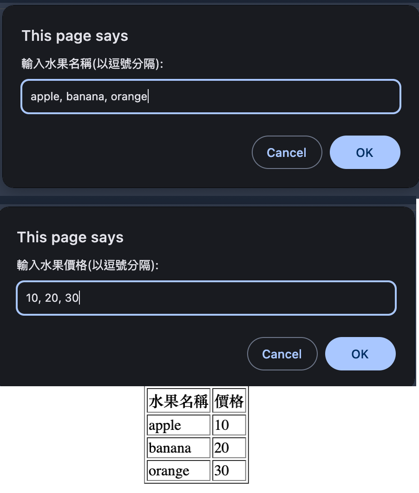

# Chapter 5 

## Practice 1

JavaScript 中提供不同類型的集合(Collection)，如陣列(Array)、集合(Set) 和映射(Map)。

請說明在什麼情況下，應該使用這些集合類型？
請畫一張決策樹，幫助你選擇適合的集合類型。

## Practice 2

有以下的英文段落

```text
TORONTO — President Donald Trump’s tariffs on Canadian goods, coming on the heels of his taunting threats to make the country the 51st U.S. state, are eroding the inherent politeness of Americans’ northern neighbors and rallying them around their own flag.
```

請在 console 顯示長度大於 8 的單字, 並轉換成全部大寫字圖。

## Practice 3

請寫一個 HTML 頁面。讓使用先輸入數個水果名稱, 如: apple, banana, orange. 之後, 再輸入相對應的價格, 如: 10, 20, 30. 資料皆以逗號分隔。最後, 以表格的方式顯示水果名稱和價格。表格的第一列為標題，顯示 "水果名稱" 和 "價格"。

使用 document.write() 來輸出 HTML 內容。

參考輸出

