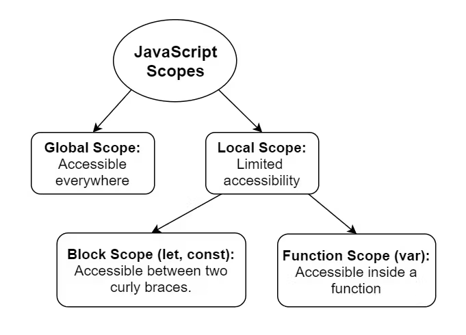
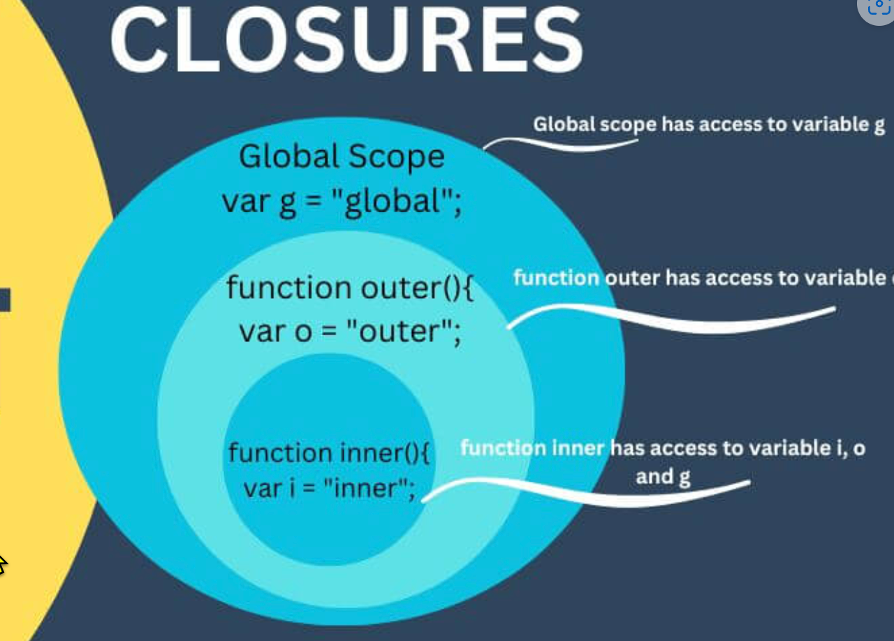
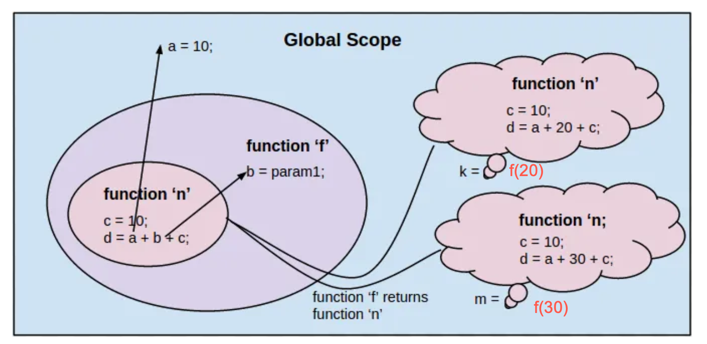

<style>
    .columns {
    display: flex;
  }
  .column {
    flex: 1;
    padding: 10px;
  }
  .column.large{
    flex: 2;
  }
  .small-font {
    font-size: 0.8em;
  }

  section > header,
section > footer {
  position: absolute;
  left: auto;
  right: 90px;
  height: 20px;
}

header {
  top: 30px;
}

footer {
  bottom: 30px;
}

</style>

# 第六章 函數

## 本章主題

- 函數宣告、參數及回傳值
    - 具名函數、函數表達式、箭頭函數
- 執行函數
- 函數的參數及呼叫時傳遞引數
- 和函數有關的變數作用域
- 閉包 (closure)與靜態作用域(static scope)


## 什麼是函數？

- 函數是**可重複使用的程式碼區塊**。
- 函數是**物件**
    - 可以作為參數傳遞給其他函數
    - 可以做為其它函數的回傳值
    - 可以指派給變數

**最佳實務做法** 不要重複自己
- 如果發現自己多次撰寫相同的代碼，考慮重構這些程式碼，提取成為函數
- 代碼將更具可讀性和可維護性。

## 函數宣告

- 函數是一個物件。
- 透過函數宣告，建立一個函數物件。

- 有三種方式宣告函數：
    - `function` 敘述(statement)
    - `function` 表達式(expression)
    - 箭頭函數(Arrow function) (ES6)

### 使用函數敘述宣告函數

Task: 建立一個具兩個參數並回傳兩個參數相加的函數。

使用 `function` 敘述

```javascript
function add(a, b) {
    return a + b;
}
```

---

語法結構:
- `function` 關鍵字
- 函數名稱
- 參數列表
    - 參數用來接受傳入函數的引數，參數間用逗號分隔
    - 參數名稱 a, b 視為函數內的區域變數
    - 區域變數的作用範圍是函數內部
- 函數主體 
  - 在 `{}` 中，放執行程式碼
  - return 敘述回傳函數的結果
    - 如果沒有 return 敘述，則預設回傳 `undefined`

### 函數表達式(expression) 宣告函數

使用 function 表達式來建立函數物件, 並將函數的參考賦值給變數。

```javascript
const add = function(a, b) {
    return a + b;
};
```

- 指派符號左側的表達式建一個函數物
- 變數 `add`儲存了函數物件的參考

--- 

- 此宣告方式和第一種方式的結果是一樣的。
- 這兩種方式都用來建立一個具名函數物件。
- 但兩者在函數提升(function hoisting)的行為上有所不同。

### 函數提升 (function hoisting)

- "函數提升" 功能方便開發者可先使用函數，然後再宣告它。
- JS Engine 在執行程式碼之前，會將所有函數宣告提升到作用域的最上方。

- 使用 `function` 敘述宣告的函數會被提升到作用域的最上方。

Example:

```js
let result = add(2, 3); 
console.log(result); // 5

function add(a, b) {
    return a + b;
}
```

### 使用 `function` 表達式宣告的函數沒有提升的行為

- 使用 `function` 表達式宣告的函數, JS Engine 不會將它提升到作用域的最上方。
- 必須在宣告之後才能使用函數

Example:

```js
let result = add(2, 3); // TypeError: add is not a function
var add = function(a, b) {
    return a + b;
};
```

錯誤訊息:
```
TypeError: add is not a function
```

### 箭頭函數 (ES6)

- 使用箭頭函數可替代 `function` 表達式
  - 提供更簡潔的語法

- 前述的 `add` 函數可以改寫:

```javascript
const add = (a, b) => {return a + b;};
```

- 如果函數中只有一個返回語句，可以省略大括號和 `return` 關鍵字。

```javascript
const add = (a, b) => a + b;
```

### Lab 6.1：撰寫一個函數，接受體重和身高並回傳 BMI值

- BMI 的公式是 `weight / (height**2)`。
- 使前前述的三種方式宣告函數。
- 如果 height 變數的值是: 未定義(undefined)、null 或非數字（false 值），將之預設為 0。

### 最佳實務做法: 撰寫函數註解

- 描述函數的目的
- 描述參數和回傳值
- 遵循 [JSDoc](https://github.com/jsdoc/jsdoc) 格式，以便使用工具自動產生 API 文件
- [How to use JSDoc - Basics & Introduction @ youtube 13:04](https://www.youtube.com/watch?v=Nqv6UkTROak)

---

使用 JSDoc 格式撰寫註解的範例:

```javascript
/**
 * 計算 BMI
 * @param {number} weight - 體重(kg)
 * @param {number} height - 身高(m)
 * @returns {number} - BMI值
 */
const calculateBMI = (weight, height) => {
  height = height || 0;
  return weight / (height ** 2);
};
```

## 執行函數

### 執行函數的方法

- 宣告後，開發者呼叫函數。
- 宣告後立即自我執行(IIFE 函數)
- 被其它函數呼叫 (Callback function)

### 開發者呼叫函數

- 開發者呼叫函數的名稱，並提供參數。
- 使用括號 `()` 包含參數列表。

Ex.

```javascript
// Call the function
const sum = add(1, 2);
console.log(sum); // 3
```

---

- 如果沒有提供括號，其意思不是呼叫函數，而是取用函數物件的參考。

```javascript
add = (x, y) => x + y;
console.log(add); // Prints the function object
```

輸出結果

```javascript
(x, y) => x + y
```

### 立即自我執行(IIFE 函數)

- 某些情境下我們需要 JS Engine 在函數宣告完後立即執行它。

典型情境:
- 當頁面載入時，自動為元素加入事件監聽器(Event Listener). 
- 使用 IIFE 避免函數內的區域變數污染全域命名空間
  - 函數內的變數成為私有變數
- 為函數/物件建立私有屬性。
- 將複雜的多個敘述包裝在一起變成單一運算式(expression)

可參考: [IIFEs in JavaScript — Use cases](https://medium.com/swlh/iifes-in-javascript-use-cases-92811495d936)

### 立即自我執行函數(IIFE)的特性

- 宣告後立即執行
  - 將宣告和執行合併在一起
- IIFE 函數內的變數是私有的, 外部無法存取
- IIFE 執行過後，就無法再次執行(因為它沒有名稱可以重覆呼叫)
  - 不可重覆呼叫

### IIFE 語法

```javascript
(function() {
  // code here
})(arguments);
```
- 第一個括號 `()` 宣告函數
- 第二個括號 `()` 執行函數並傳遞參數

---

也可改用 Arrow function 語法

```javascript
(() => {
  // code here
})(arguments);
```

---

Example: 定義一個函數，顯示兩個數字的總和並立即執行它。

```javascript
((a, b) => {
  console.log(a + b);
})(1, 2);
```

### 快速練習

使用 IIFE 宣告一個函數，將給與的字串反轉並顯示在 console 中。

例如: Hello -> olleH

Hint: 反轉字串的方式
- `str.split('').reverse().join('')`, or
- `Array.from(str).reverse().join('')`

<details>
<summary>參考答案</summary>

```javascript
((str) => {
  console.log(str.split('').reverse().join(''));
})('Hello');
```
</details>

### IIFE 的用應: 建立模組(Module)

- 使用 IIFE 將變數和函數包裝在一起，變成一個模組
- 模組內的成員皆是私有的，外部無法存取
- 你可以建立一個物件, 公開函數的參考給外部使用
  - 透過這個方式決定哪些成員是公開的，哪些是私有的
  - 成員包括: 變數、函數
- 這種設計模式稱為模組模式 (Module Pattern)


### 模組的使用情境

建立一個模組，包含兩個函數：
- `increment`: 將計數器增加 1, 並印出計數器的值
- `setStartValue`: 設定計數器的起始值。
- 計數器是模組的私有變數。

---

使用 IIFE 實作模組模式

```js
(function() {
    let counter = 0;

    function setStartValue(startValue) {
        counter = startValue;
    }
    function increment() {
        counter += 1;
        console.log(counter);
    }

    // Node.js 中的全域物件名稱為 global
    // 瀏覽器中的全域物件名稱為 window
    global.myModule = {
        // myModel 成為全域物件的一個特性，存放模組物件的參考
        increment: increment,
        setStartValue: setStartValue
    };
})();
```

---

測試模組:

```js
myModule.setStartValue(10);
myModule.increment()
myModule.increment();
myModule.increment();
```

Outputs:
```
11
12
13
```

### Lab 6.2：建立一個 「隨機描述輸入名字」的程式

建立一個模組，包含一個隨機形容輸入名字的函數。
- 模組內有一個私有的對於名字的形容詞陣列, 例如 `['聰明', '有趣', '善良', '勤奮']`
- 函數接受一個名字作為參數。
    - 從形容詞陣列中隨機選取一個值，用來形容名字。
    - 回傳一個 "形容詞＋名字" 的字串。

例如，描形容詞陣列為 `['聰明', '有趣', '善良', '勤奮']`。給定名字 `Alice`，程式可能會輸出 `Alice，你很聰明`。

提示：
- `Math.random()` 回傳一個介於 0 和 1 之間的隨機數。
- `Math.floor()` 回傳小於或等於給定數字的最大整數。

## 函數的參數(parameter)及引數(argument)

- "參數" 和 "引數" 是兩個不同的概念
- "參數" 是宣告函數時所給定的變數名稱，指定函數的輸入
- "引數" 是呼叫函數時所傳遞的值

```javascript   
const add = (a, b) => a + b;
const sum = add(1, 2);
```

- 變數 a, b 是函數的參數(變數)
- 1, 2 是函數的引數, 呼叫時傳入的值。

### 參數與引數的對應

JS 中提供多種傳入引數到函數的方式

1. 彈性引數個數: 引數個數可以少於與多於參數個數
2. 選項參數(預設參數的值)
3. 剩餘的參數(rest of parameters)

### 彈性引數個數

- 引數個數可以少於與多於參數個數
- JS 使用位置對應的方式指派引數到參數

```javascript   
const add = (a, b) => a + b;
const sum = add(1, 2);
```

此時 a=1, b=2.

---

- 當引數個數少於參數個數時, 沒有對應到的參數值被設為 `undefined`

```javascript
const add = (a, b) => a + b;
const sum = add(1); // 1 + undefined = NaN
```

a=1, b=undefined

---

- 當引數個數超過參數個數時, 多的引數被捨棄

```javascript
const add = (a, b) => a + b;
const sum = add(1, 1, 4); // 1 + 1 = 2
```

第 3 個引數 `4` 被捨棄

### 選項參數(預設參數的值)

- 很多時候在呼叫函數時，希望能夠只傳入必要的引數值, 其它的參數則使用預設值
  - 簡化函數的呼叫
- JS 讓開發者在宣告函數時，指定參數的預設值。

```javascript
function greet(name = 'Alice') {
  return `Hello, ${name}`;
}
console.log(greet()); // Hello, Alice
console.log(greet('Bob')); // Hello, Bob
```

- `name` 參數的預設值為 `Alice`

### Quick Practice

檢視底下的 randomWord 函數, `descWords` 參數是一個描述名字的形容詞清單。
請為 desWords 設定預設值。 
接著呼叫 randomWord 函數, 但不提供 `descWords` 的引數。

```js
function randomWord(name, descWords) {
    // scale the random number to the length of the array and round down to the nearest whole number
    let randomIndex = Math.floor(Math.random() * descWords.length);
    return `${name}, you are ${words[randomIndex]}.`;
}
```

<details>
<summary>參考答案</summary>

```javascript
function randomWord(name, descWords = ['聰明', '有趣', '善良', '勤奮']) {
    // scale the random number to the length of the array and round down to the nearest whole number
    let randomIndex = Math.floor(Math.random() * descWords.length);
    return `${name}, you are ${descWords[randomIndex]}.`;
}

console.log(randomWord('Alice'));
```

</details>


### 剩餘的參數(rest of parameters)

- JS 的函數可以接受不定數量的引數(indefinite number of arguments)
  - 或者可接受一串引數(a list of arguments)
- 例如 Math.max() 

```js
Math.max(value1, value2, /* …, */ valueN)
```

這種函數在電腦科學上稱為 「可變參數函數」(variadic function)

---

可變參數函數的定義方式:

```js
function functionName(...rest) {
    // code here
}
```

- 在 參數名稱前加上 `...` 符號
- `rest` 是一個陣列(array)，包含所有傳入的引數
  - 可以使用其它的名稱
- `...rest` 稱之為「剩餘參數」(rest parameter)

### 可變參數函數的使用

呼叫時, 傳入一串引數

直接給一串引數:
```js
let maxValue = Math.max(1, 2, 3, 4, 5);
```

使用 spread 運算子 `...` 將陣列展開成為一串引數
```js
let numbers = [1, 2, 3, 4, 5];
let maxValue = Math.max(...numbers);
```

--- 

在函數內, 參數的型態為陣列

e.g. 印出傳入的所有引數
```js
function printAll(...args) {
    args.forEach(arg => console.log(arg));
}
printAll(1, 2, 3, 4, 5);
```

### Quick Practice

以下兩個對不定引數函數 `printAll` 的呼叫，輸出有何不同？

```js
let arrA = [1, 2, 3];
let arrB = [4, 5, 6];

// Statement 1
printAll(...arrA, ...arrB);

// Statement 2
printAll(arrA, arrB);
```

<details>
<summary>參考答案</summary>

```javascript
// Statement 1
printAll(...arrA, ...arrB);
// Output: 1, 2, 3, 4, 5, 6
// Statement 2
printAll(arrA, arrB);
// Output: [1, 2, 3], [4, 5, 6]
```
</details>

## 剩餘參數的應用: 高階函數(Higher-order function)

- 高階函數: 接受函數作為參數或回傳函數的函數
- 當接受函數作為參數時，高階函數可以使用剩餘參數接受被傳入的函數的所有引數
- 被傳入的函數稱為回呼函數(callback function)

---


```js
// 定義回呼函數
function callBackFunction(a, b, c) {
    // code here
}

// 定義高階函數，可以接受回呼函數
function higherOrderFunction(callback, ...args) {
    // code here
    callback(...args);
}

// 使用高階函數執行回呼函數，並傳入回呼函數的引數
higherOrderFunction(callBackFunction, 1, 2, 3);
```

- 在設計高階函數時，由於每個回呼函數的參數個數無法預測，因此使用剩餘參數來接收傳給回呼函數的引數

### 範例

設計一個函數 `add(a, b)`, 回傳 a + b 的結果

設定一個函數 `invokeFunction()`, 接受一個函數和一組引數，並執行該函數，並回傳執行的結果. 

```javascript
const add = (a, b) => a + b;

function invokeFunction(func, ...args) {
  // args is an array. Use the spread operator to take the elements out of the array.
  return func(...args);
}

const sum = invokeFunction(add, 1, 2); // 3
```

### Lab 6.3: 簡單的加法與乘法計算機

1. 建立一個 `sum` 函數，接受不定數量的引數並回傳這些引數的總和。
2. 建立一個 `multiply` 函數，接受不定數量的引數並回傳這些引數的乘積。
3. 你必須撰寫一個函數來呼叫 `sum` 和 `multiply` 函數，並傳入提供的引數。
4. 對於輸入的字串 "sum 1 2 3 4". 字串的第一個字是函數名稱，後面的字是引數。你的程式應該呼叫 `sum` 函數並傳入引數 1, 2, 3 和 4，並印出結果。
5. 對於輸入的字串 "multiply 1 2 3 4"，你的程式應該呼叫 `multiply` 函數並傳入引數 1, 2, 3 和 4，並印出結果。

---  

提示:
- 使用字串的 `split` 方法將輸入的字串分割成字串陣列。然後，使用陣列解構賦值技術將它們賦值給變數陣列。
  - `let [operation, ...args] = str.split(" ");`
- 如果不想使用 switch 或 if-else 語句以條件式的方式執行函數，可以使用 map 資料結構來索引和存儲函數。

## 函數中變數的作用範圍(scope)

### 三種變數的作用範圍

- 變數的作用範圍(variable scope):變數在程式碼中可存取的範圍
- JS 中的變數作用範圍有兩種:
    - 全域(global scope)
    - 區域(local scope)
      - 函數作用範圍(function scope)
      - 區塊作用範圍(block scope)



--- 

- 全域(global scope)
  - 在函數外部宣告的變數
  - 成為 window 物件 (或 Node.js 中的 global 物件) 的屬性
  - window 物件是 JS 的全域物件
- 函數作用範圍(function scope)
  - 在函數內任何地方使用 `var` 宣告的變數
  - 只能在函數內部存取
- 區塊作用範圍(block scope)
  - 在區塊內使用 `let` 或 `const` 宣告的變數
    - 區塊內使用 `var` 宣告的變數屬函數作用域
  - 只能在區塊內存取

### 範例

```javascript
var x = 1;  // Global Scope

function myFunction(p) {
  // parameter p is function scope variable
  var functionScopeVar = 10;   // function scope variable 
  if (true){
    let y = 20;  // block scope variable
    var z = 30; // function scope variable
  } // end of block

  console.log(x); // 1 (Global)
  console.log(y); // ReferenceError: y is not defined (block scope)
  console.log(z); // 30 (Function scope)
  console.log(p); // 100 (Function scope)
} // end of function

myFunction(100);
console.log(x); // 1
console.log(y); // ReferenceError: y is not defined
console.log(z); // ReferenceError: z is not defined
console.log(p); // ReferenceError: param is not defined
```

### Quick Test 

考慮以下的程式碼，輸出結果為何？

```js
function test() {
    var x = 1; 
    let y = 0;
    for (var i = 0; i < 3; i++) {
        y += i;
        console.log(y);
    }
    console.log(i)
    for (let j = 0; j < 3; j++) {
        y += j;
        console.log(y);
    }
    console.log(j)
}
test();
console.log(i);
```

--- 

<details>
<summary>參考答案</summary>

- 第一個 `console.log(y)` 印出 0, 1, 2
  - `y` 是函數作用域的變數
- `console.log(i)` 印出 3
  - `i` 是函數作用域的變數, for 迴圈結束後，`i` 的值為 3
  
- 第二個 `console.log(y)` 印出 3, 4, 5
  - `y` 是函數作用域的變數，持續累加
- `console.log(j)` 印出 ReferenceError (j is not defined)
  - `j` 是區塊作用域的變數，for 迴圈結束後，`j` 變數結束

- 最後的 `console.log(i)` 印出 ReferenceError (i is not defined)

### `var` 宣告變數產生變數提升(variable hoisting) 

- 在函數中，使用 `var` 宣告的變數會被提升到函數的最上方(函數最開始的地方)
  - JS 初始化此變數為 `undefined` 
- 指派動作會在原本的地方執行
- 這個機允許開發者不必遵守 "使用前必須宣告" 的規則
- 在這個機制下, 使用未先宣告的變數, 其值為 undefined

--- 

範例:

```js 
function hoisting() {
  console.log(a); // undefined
  var a = 10;
  console.log(a); // 10
}
```

相當於

```js
function hoisting() {
  var a; // 宣告變數 a
  console.log(a); // undefined
  a = 10;
  console.log(a); // 10
}   
```

### `let` 和 `const` 宣告變數的暫時死區(temporal dead zone)

- 在函數中，使用 `let` 或 `const` 宣告的變數也會被提升到函數的最上方
- 但是, JS 不會初始化這些變數
- 在賦值之前, 這些變數無法使用
- 從提升至作用域的開始到賦值之間的區域稱為 "暫時死區" (temporal dead zone)
- 在這個區域內, 使用這些變數會產生 ReferenceError

---


```js
function hoisting() {
  console.log(b); 
  let b = 20;
  console.log(b); // 20
}
```

相當於

```js
function hoisting() {
  let b; // 宣告變數 b, 但不初始化. 
  // "暫時死區" (temporal dead zone) 開始
  console.log(b); // ReferenceError
  b = 20;
  // "暫時死區" (temporal dead zone) 結束
  console.log(b); // 20
}   
```

### Quick Question

1. 解釋以下的名詞:
- 變數提升 (variable hoisting)
- 暫時死區 (temporal dead zone)

2. 在函數內使用 `var` 和 `let` 宣告變數展現的程式意圖有何不同?

<details>
<summary>參考答案</summary>

Q1.
- 變數提升 (variable hoisting): 在函數內使用 `var` 宣告的變數會被提升到函數的最上方(函數最開始的地方)，JS 初始化此變數為 `undefined`。指派動作會在原本的地方執行。
- 暫時死區 (temporal dead zone): 在函數內使用 `let` 或 `const` 宣告的變數也會被提升到函數的最上方，但是, JS 不會初始化這些變數。在賦值之前, 這些變數無法使用。從提升至作用域的開始到賦值之間的區域稱為 "暫時死區" (temporal dead zone)。在這個區域內, 使用這些變數會產生 ReferenceError。

Q2
- 在函數內使用 `var` 宣告變數表示此變數會在整個函數內部使用。
- 使用 `let` 及 `const` 宣告變數表示是此變數只會在區塊內部使用。

</details>

## 巢狀函數(Nested function)結構下變數的作用域規則

### 巢狀函數

- 在函數內可以定義其它函數
  - 因為函數本身為一種物件
- 函數內有函數的結構稱為 「巢狀函數」
  - 內部函數(inner function) 指在函數內部定義的函數
  - 外部函收(outer function) 指包含內部函數的函數

```js
function outerFunction() {
  let outerVar = 10;
  ...
  function innerFunction() {
    let innerVar = 20;
    ...
  }
}
```

### 巢狀函數下的變數作用範圍規則

Rule 1: 內部函數可以存取外部函數的區域變數及參數
- 因為內部函數被定義在外部函數的作用範圍內  

```javascript
function outerFunction(x) {
  let outerVar = 10;
  function innerFunction() {
    console.log(x); // Hi, the argument passed to the outer function
    console.log(outerVar); // 10
  }
  innerFunction();
}
outerFunction('Hi');
```

- innerFunction 可以存取 outerFunction 的參數 x 和區域變數 outerVar

---

Rule 2: 外部函數無法存取內部函數的區域變數

- 內部函數不開放給外部函數存取其區域變數

```javascript
function outerFunction() {
  function innerFunction() {
    // function scope starts
    let innerVar = 20;
  } // function scope ends

  console.log(innerVar); // ReferenceError: innerVar is not defined
}
outerFunction();
```

- innerVar 是 innerFunction 的區域變數, 外部函數無法存取

---

Rule 3: 當變數名稱相同時，內部函數的區域變數會覆蓋外部函數的區域變數
- 內部函數的區域變數有較高的優先權

```javascript
function outerFunction() {
  let outerVar = 10;
  function innerFunction() {
    let outerVar = 20;
    console.log(outerVar); // 20
  }
  innerFunction();
}
outerFunction();
```

- 在 innerFunction() 中, outerVar 是內部函數的區域變數, 覆蓋外部函數的 outerVar

--- 

Rule 4: 無法從外部函數以外的地方存取其內部函數
- 內部函數是外部函數的私有成員

```javascript
function outerFunction() {
  function innerFunction() {
    console.log('Inner function');
  }
}
innerFunction(); // ReferenceError: innerFunction is not defined
```

### Quick Practice

考慮以下的程式碼，標示 `#1`, `#2`, `#3`, `#4` 的輸出結果為何？


```javascript
function outerFunction(x) {
  let outerVar = 10;
  function innerFunction() {
    let innerVar = 20;
    console.log(x); //#1
    console.log(outerVar); //#2
    console.log(innerVar); //#3
  }
  innerFunction();
  console.log(innerVar); //#4
}
outerFunction('Hello');
```

<details>
<summary>參考答案</summary>

#1: Hello
#2: 10
#3: 20
#4: ReferenceError: innerVar is not defined

</details>

## 閉包(Closure)

### 什麼是閉包(Closure)

閉包(Closure)高階函數回傳函數時產生的特殊的變數作用域範圍。

考慮以下的高階函數, 當執行 `aFunc()` 時, `outerVar` 變數還存在嗎？

```javascript
function outerFunction() {
  let outerVar = 10;
  function innerFunction() {
    console.log(outerVar);
  }
  // return the inner function object (not invoking the inner function)
  return innerFunction;
}

// aFunc and innerFunction refer to the same function object
const aFunc = outerFunction();
```

---

- `outerFunction` 是一個高階函數，回傳 `innerFunction` 函數物件
- `aFunc` 是 `innerFunction` 的參考


### 閉包的特性

- 被高階函數回傳的函數，仍可存取高階函數的區域變數及參數, 即使高階函數已經執行完畢
- 這種特性稱為閉包(Closure)

```javascript
function outerFunction() {
  let outerVar = 10;
  function innerFunction() {
    console.log(outerVar);
  }
  return innerFunction;
}

const aFunc = outerFunction();
```

- 前述例子的輸出結果為 10，因為 `innerFunction` 仍可存取 `outerVar` 變數

### 如何解釋閉包結構下的變數作用範圍: 詞法作用域（Lexical Scope）

詞法作用域:
- 變數在程式碼中的位置決定了它的作用範圍
  - 也稱為靜態作用域(static scope)
- 而不是在函數執行時的狀態決定其作用範圍

<div class="columns">
<div class="column" >

</div>
<div class="column">

- outer() 可以存取變數 g 和 o。
- inner() 可以存取變數 g、o 和 i。

</div>
</div>

<!-- Fig Src: [Understanding Closure Functions in JavaScript: Examples and Explanation - Blog and News](https://tamdiary.com/technology/2023/understanding-closure-functions-in-javascript-examples-and-explanation/) -->

### 靜態作用域分析 

有一高階函數 f 回傳一個函數:

```js
// Global variable 
const a = 10;
function f(b){
    return function (){
        let c = 10;
        return a + b + c;
    }
}
```

以下執行結果 ?
```js
funcN1 = f(20);
const k = funcN1();
console.log(k);
```
---

分析:
- 因為閉包作用, funcN1 可以存取 f 函數的區域變數 b 及全域變數 a
- funcN1 可以存取 f 函數的區域變數 c

所以
- a = 10, b = 20, c = 10
- 輸出 40

---

上述範例的圖示說明:



<!-- Fig source: [Javascript closures —An Angular approach](https://medium.com/@rama41222/javascript-closures-an-angular-approach-3764d13ca21b) -->

### Quick Practice

建立一個 high order function `createCounter(startValue)`, 回傳一個函數, 每次呼叫此函數時, 印出一個遞增的數字。 `startValue` 是計數器的起始值。

使用 `createCounter` 建立兩個計數器, 這兩個計數器的起始值分別為 1 和 10。

分別呼叫這兩個計數器函數各 3 次。
輸出的結果應該分別為: 1, 2, 3 和 10, 11, 12


<details>
<summary>參考答案</summary>

```javascript
function createCounter(startValue){
    return function(){
        console.log(startValue++);
    }
}

let counter1 = createCounter(1);
let counter2 = createCounter(10);

counter1();
counter1();
counter1();

counter2();
counter2();
counter2();
```

## 本章總結


- 函數是可重複使用的程式碼區塊，並且是物件。
- 函數宣告有三種方式：`function` 敘述、`function` 表達式、箭頭函數。
  - 函數提升 (function hoisting) 開發者不必嚴格遵守 "使用前必須宣告" 的規則，利於我們撰寫程式碼。

- 函數的參數指定函數的輸入，而引數是傳遞給函數的值。
- 呼叫函數時，引數的個數可以少於或多於參數的個數。
- 定義函數時，
  - 使用預設值來設定選項參數的值。
  - 使用剩餘參數來處理不定數量的引數。

--- 

- 高階函數可以接受函數作為參數或回傳函數。
  - 使用高階函數可執行傳入的函數(回呼函數)。

- 變數的作用範圍有全域、函數作用範圍和區塊作用範圍。
- 巢狀函數結構下的變數作用域規則: 
  - 內部函數的變數不開放給外部函數存取; 
  - 但內部函數可以存取外部函數的變數。
  - 相同變數名稱時，內部函數的變數會覆蓋外部函數的變數。

--- 

- 當高階函數回傳函數時，產生的特殊的變數作用範圍稱為閉包(Closure)。
  - 回傳的函數仍可以存取高階函數的區域變數及參數，即使高階函數已經執行完畢。
  - 重要的 JS 程式樣態之一。


<script src="../h2_numbering.js"></script>