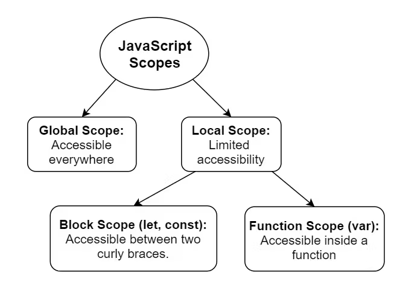
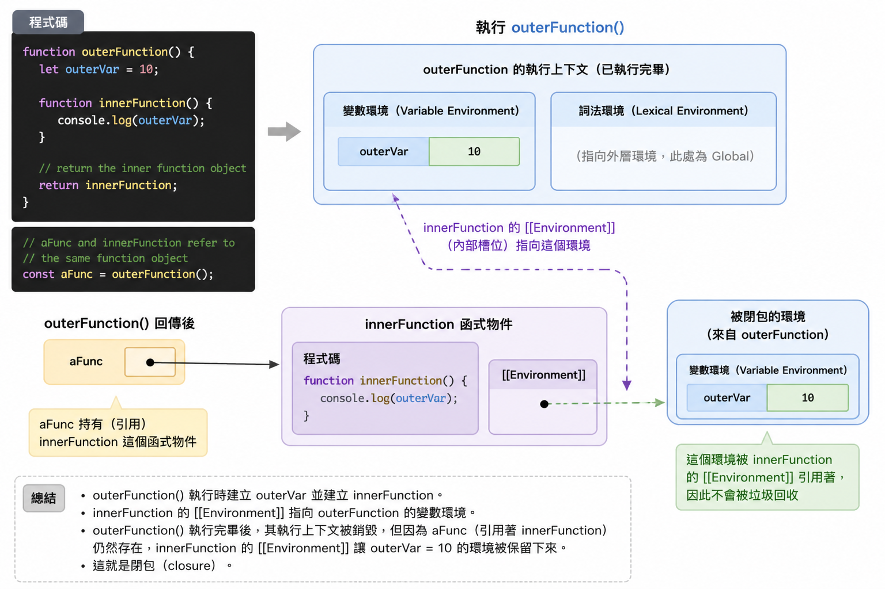
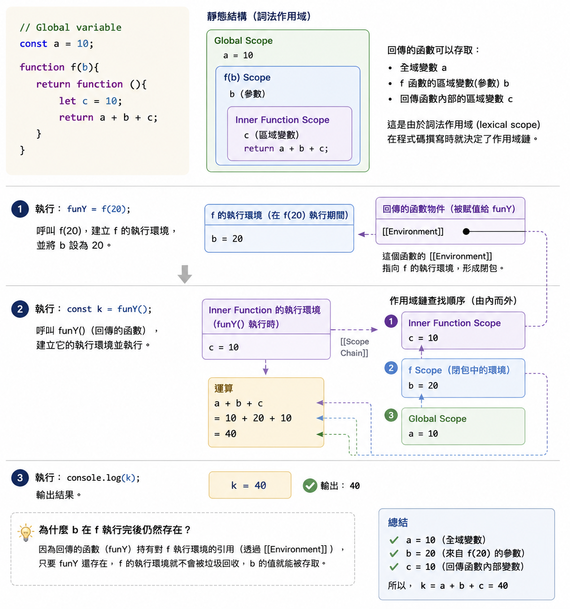

# 第六章 函數 - Part 2

## 本章重點

- 理解巢狀函數中的變數作用域規則：內部函數、外部函數與全域作用域之間的存取關係
- 掌握詞法作用域的觀念：函數可存取哪些變數，取決於函數在程式碼中宣告的位置
- 認識閉包：被回傳的函數仍可存取外部函數的區域變數與參數
- 使用閉包建立私有狀態，並理解工廠模式如何建立多個狀態彼此獨立的函數物件

## 巢狀函數(Nested function)結構下變數的作用域規則

### 三種變數的作用範圍(複習)

- 變數的作用範圍(variable scope):變數在程式碼中可存取的範圍
- JS 中的變數作用範圍有兩種:
    - 全域(global scope)
    - 區域(local scope)
      - 函數作用範圍(function scope)
      - 區塊作用範圍(block scope)




- 全域(global scope)
  - 在函數外部宣告的變數
  - 成為 globalThis 物件 (Browser 中的 window 物件或 Node.js 中的 global 物件) 的屬性
- 函數作用範圍(function scope)
  - 在函數內任何地方使用 `var` 宣告的變數
  - 只能在函數內部存取
- 區塊作用範圍(block scope)
  - 在區塊內使用 `let` 或 `const` 宣告的變數
    - 區塊內使用 `var` 宣告的變數屬函數作用域
  - 只能在區塊內存取

### 巢狀函數

- 在函數內可以定義其它函數
  - 因為函數本身為一種物件
- 函數內有函數的結構稱為 「巢狀函數」
  - 內部函數(inner function) 指在函數內部定義的函數
  - 外部函收(outer function) 指包含內部函數的函數

```js
function outerFunction() {
  let outerVar = 10;
  ...
  function innerFunction() {
    let innerVar = 20;
    ...
  }
}
```

Q: 巢狀函數的使用案例？
- 複雜的計算需要拆解成多個小步驟，但這些小步驟對外部完全沒用
- 封裝在函數內部重覆使用的邏輯，避免重覆撰寫相同的程式碼
- 需要私有變數或工廠模式 (建立閉包 closure)

巢狀函數的特性:
-  每次執行外部函數時，內部的巢狀函數都會被重新建立一次
-  即每次呼叫 outerFunction() 都會建立一個新的 innerFunction()
   -  因為這些巢狀函數是外部函數的區域變數，每次呼叫外部函數都會重新建立這些區域變數


### 巢狀函數結構下的變數作用範圍規則

內部函數在外部函數的變數空間內又分割出新的空間，而導致新的變數作用域規則。

#### Rule 1: 內部函數可以存取外部函數的區域變數及參數
- 因為內部函數被定義在外部函數的作用範圍內  

```javascript
function outerFunction(x) {
  let outerVar = 10;
  function innerFunction() {
    console.log(x); // Hi, the argument passed to the outer function
    console.log(outerVar); // 10
  }
  innerFunction();
}
outerFunction('Hi');
```

- innerFunction 可以存取 outerFunction 的參數 x 和區域變數 outerVar


#### Rule 2: 外部函數無法存取內部函數的區域變數

- 內部函數不開放給外部函數存取其區域變數

```javascript
function outerFunction() {
  function innerFunction() {
    // function scope starts
    let innerVar = 20;
  } // function scope ends

  console.log(innerVar); // ReferenceError: innerVar is not defined
}
outerFunction();
```

- innerVar 是 innerFunction 的區域變數, 外部函數無法存取


#### Rule 3: 當變數名稱相同時，內部函數的區域變數會覆蓋外部函數的區域變數
- 內部函數的區域變數有較高的優先權

```javascript
function outerFunction() {
  let outerVar = 10;
  function innerFunction() {
    let outerVar = 20;
    console.log(outerVar); // 20
  }
  innerFunction();
}
outerFunction();
```

- 在 innerFunction() 中, outerVar 是內部函數的區域變數, 覆蓋外部函數的 outerVar


#### Rule 4: 無法從外部函數以外的地方存取其內部函數

- 內部函數是外部函數的私有成員

```javascript
function outerFunction() {
  function innerFunction() {
    console.log('Inner function');
  }
}
innerFunction(); // ReferenceError: innerFunction is not defined
```

### Quick Practice

考慮以下的程式碼，標示 `#1`, `#2`, `#3`, `#4` 的輸出結果為何？


```javascript
function outerFunction(x) {
  let outerVar = 10;
  function innerFunction() {
    let innerVar = 20;
    console.log(x); //#1
    console.log(outerVar); //#2
    console.log(innerVar); //#3
  }
  innerFunction();
  console.log(innerVar); //#4
}
outerFunction('Hello');
```

<details>
<summary>參考答案</summary>

#1: Hello
#2: 10
#3: 20
#4: ReferenceError: innerVar is not defined

</details>


## 閉包(Closure)

### 什麼是閉包(Closure)

閉包(Closure)高階函數回傳函數時產生的特殊的變數作用域範圍。

被回傳的函數仍可存取高階函數的區域變數及參數, 即使高階函數已經執行完畢。

利用閉包的特性，可以製造出函數內部的私有變數
- 只有被回傳的函數可以存取這些私有變數，外部無法存取，達到封裝的效果。

Example: 

考慮以下的高階函數, 當執行 `aFunc()` 時, `outerVar` 變數還存在嗎？

```javascript
function outerFunction() {
  let outerVar = 10;
  function innerFunction() {
    console.log(outerVar);
  }
  // return the inner function object (not invoking the inner function)
  return innerFunction;
}

// aFunc and innerFunction refer to the same function object
const aFunc = outerFunction();
```



- `outerFunction` 是一個高階函數，回傳 `innerFunction` 函數物件
- `aFunc` 是 `innerFunction` 的參考


閉包的特性
- 被高階函數回傳的函數，仍可存取高階函數的區域變數及參數, 即使高階函數已經執行完畢
- `function` + `[[Environment]]` ＝ closure
  - `function` 是被回傳的函數物件
  - `[[Environment]]` 是該函數物件在宣告時所處的作用域環境
  - closure 是 `function` 和 `[[Environment]]` 的組合，形成一個特殊的作用域範圍

- 前述例子的輸出結果為 10，因為 `innerFunction` 仍可存取 `outerVar` 變數

### 如何解釋閉包結構下的變數作用範圍: 詞法作用域（Lexical Scope）

詞法作用域:
- 變數在程式碼中的位置決定了它的作用範圍
  - 也稱為靜態作用域(static scope)
- 而不是在函數執行時的狀態決定其作用範圍

### 靜態作用域分析 

有一高階函數 f 回傳一個函數:

```js
// Global variable 
const a = 10;
function f(b){
    return function (){
        let c = 10;
        return a + b + c;
    }
}
```

以下執行結果 ?

```js
funY = f(20);
const k = funY();
console.log(k);
```

詞法作用域分析:

1. 在目前的程式碼中，回傳的函數物件可以存取變數包括:
- 全域變數 a
- f 函數的區域變數(參數) b
- 回傳的函數內部的區域變數 c

2. 當執行 `funY = f(20)` 時, `f(20)` 會回傳一個函數物件, 並把 `b` 的值設定為 20
  
3. 當執行 `const k = funY()` 時, `funY()` 會執行回傳的函數, 並計算 `a + b + c` 的值
   - `a` 的值是 10 (全域變數)
   - `b` 的值是 20 (因為 `f(20)` 把 `b` 的值設定為 20)
   - `c` 的值是 10 (回傳函數內部的區域變數)

所以計算結果是: 40


上述範例的圖示說明:




### Quick Practice

建立一個 high order function `createCounter(startValue)`, 回傳一個函數, 每次呼叫此函數時, 印出一個遞增的數字。 `startValue` 是計數器的起始值。

使用 `createCounter` 建立兩個計數器, 這兩個計數器的起始值分別為 1 和 10。

分別呼叫這兩個計數器函數各 3 次。
輸出的結果應該分別為: 1, 2, 3 和 10, 11, 12


<details>
<summary>參考答案</summary>

```javascript
function createCounter(startValue){
    return function(){
        console.log(startValue++);
    }
}

let counter1 = createCounter(1);
let counter2 = createCounter(10);

counter1();
counter1();
counter1();

counter2();
counter2();
counter2();
```

</details>

## 閉包的應用: 工廠模式 (Factory Pattern)

工廠模式是一種建立物件或函數的設計方式。

它的核心概念是：
- 不直接在外部建立所有細節
- 而是透過一個「工廠函數」負責建立並回傳需要的物件或函數
- 每次呼叫工廠函數，都可以建立一個新的、獨立的結果

在 JavaScript 中，工廠函數可以搭配閉包使用，建立「具有狀態的函數物件」。

這裡的「狀態」指的是函數內部會記住某些資料，而且這些資料會隨著函數被呼叫而改變。

### Example: 使用閉包建立購物車計數器

情境：電子商務網站中，每一位使用者都有自己的購物車。購物車需要記住目前有幾件商品，但不希望外部程式碼直接修改這個數量。

先建立一個工廠函數 `createCartCounter(customerName)`，它會回傳一個函數，這個函數可以用來增加或移除購物車中的商品數量，並回傳目前的商品數量。

在回傳的函數中，傳入 `add` 或 `remove` 作為參數，來增加或移除商品數量。

```javascript
function createCartCounter(customerName) {
    let itemCount = 0;

    return function(action) {
        if (action === "add") {
            itemCount++;
        }

        if (action === "remove" && itemCount > 0) {
            itemCount--;
        }

        return `${customerName} 的購物車目前有 ${itemCount} 件商品`;
    };
}
```

為 `Alice` 和 `Bob` 分別建立購物車計數器

```js
const aliceCart = createCartCounter("Alice");
const bobCart = createCartCounter("Bob");
```

`aliceCart` 和 `bobCart` 是兩個不同的函數物件，它們各自擁有獨立的狀態。
- 他們有各自獨立的「閉包環境」`[[environment]]`, 所以他們的 `itemCount` 變數是獨立的，不會互相干擾。

分別呼叫 `aliceCart` 和 `bobCart` 來增加或移除商品數量，並印出目前的商品數量。

```js
console.log(aliceCart("add")); // Alice 的購物車目前有 1 件商品
console.log(aliceCart("add")); // Alice 的購物車目前有 2 件商品

console.log(bobCart("add")); // Bob 的購物車目前有 1 件商品
console.log(bobCart("remove")); // Bob 的購物車目前有 0 件商品
```

### 為什麼這是工廠模式？

因為 `createCartCounter` 負責「製造」購物車計數函數。

每次呼叫 `createCartCounter`：
- 都會建立新的區域變數 `itemCount`
- 都會回傳一個新的函數物件
- 回傳的函數物件會透過閉包記住自己的狀態

這種寫法可以用來建立多個行為相同、但狀態彼此獨立的函數物件。

## 本章內容回顧

- 變數作用域複習
  - 全域作用域中的變數可被多個函數存取，但也容易造成名稱衝突
  - 函數作用域中的變數只能在函數內部存取
  - 區塊作用域中的 `let` 與 `const` 變數只能在該區塊內存取

- 巢狀函數
  - 在函數內部定義另一個函數，稱為巢狀函數
  - 內部函數可以存取外部函數的參數與區域變數
  - 外部函數無法存取內部函數的區域變數
  - 若內外層有同名變數，內部函數會優先使用自己作用域中的變數
  - 外部程式碼無法直接存取外部函數內部宣告的內部函數

- 詞法作用域
  - 變數的可存取範圍由程式碼中的宣告位置決定
  - 函數可以存取哪些變數，不是由呼叫位置決定，而是由函數被宣告的位置決定
  - 分析巢狀函數與閉包時，要從函數宣告的位置往外層作用域查找變數

- 閉包
  - 當外部函數回傳內部函數時，內部函數仍可存取外部函數的區域變數與參數
  - 閉包可理解為函數物件加上它宣告時的作用域環境
  - 即使外部函數已經執行完畢，被回傳的函數仍能使用被保存的變數
  - 閉包可以用來建立私有變數，讓外部程式碼無法直接修改內部狀態

- 工廠模式
  - 工廠函數負責建立並回傳新的物件或函數
  - 每次呼叫工廠函數，都會建立新的區域變數與新的函數物件
  - 搭配閉包後，可以建立多個行為相同、但狀態彼此獨立的函數物件
  - 這種寫法適合用來封裝狀態，避免把資料直接暴露在全域作用域中

## 複習問題

1. 什麼是巢狀函數？巢狀函數通常適合用在哪些情境？

2. 內部函數可以存取外部函數的哪些資料？外部函數可以直接存取內部函數的區域變數嗎？

3. 當內部函數與外部函數有同名變數時，JavaScript 會優先使用哪一個？為什麼？

4. 為什麼外部程式碼無法直接呼叫外部函數內部宣告的內部函數？

5. 什麼是詞法作用域？為什麼說函數的變數存取範圍是由宣告位置決定，而不是由呼叫位置決定？

6. 什麼是閉包？為什麼外部函數執行完畢後，被回傳的內部函數仍然可以存取外部函數的變數？

7. `function` + `[[Environment]] = closure` 這句話代表什麼意思？

8. 閉包如何用來建立私有變數？這樣做對程式設計有什麼好處？

9. 什麼是工廠模式？工廠函數每次被呼叫時，通常會建立哪些新的東西？

10. 在使用閉包實作工廠模式時，為什麼不同函數物件的狀態可以彼此獨立？
