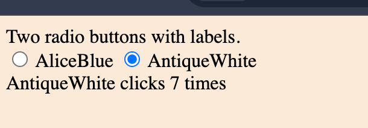

# 第六章練習題

## 練習 6-1

解釋 JavaScript 中的回呼函式。

使用 `setTimeout` 函式說明回呼函式的概念。

## 練習 6-2

解釋 JavaScript 中的「閉包」。

舉例說明閉包的應用場景。

## 練習 6-3

撰寫一個函式，接受任意數量的參數並回傳將所有參數串接起來的字串。

例如，若函式被呼叫為 `concat("a", "b", "c")`，應回傳 `"abc"`。

提交程式碼並附上執行結果的截圖。

## 練習 6-4

應用閉包技巧。

以下是程式碼片段：

```html
<!DOCTYPE html>
<html>
<head>
    <title>Lab 6.4</title>
</head>
<body>
    兩個帶標籤的單選按鈕。
    <div>
        <input type="radio" id="radio1" name="radio" value="1" data-color="AliceBlue"> <label id="lbl1">AliceBlue </label>
        <input type="radio" id="radio2" name="radio" value="2" data-color="AntiqueWhite"> <label id="lbl2">AntiqueWhite</label>
    </div>  
    <div>
        <label id="totalClicks">0</label>
    </div>

</body>

</html>
```

為每個單選按鈕新增點擊事件監聽器。

當單選按鈕被點擊時，將 `body` 的背景色更改為該按鈕 `data-color` 屬性指定的顏色。例如，若使用者點擊第一個按鈕，背景色應變為 `AliceBlue`。

兩個按鈕的事件監聽邏輯相同，但需各自維護一個計數器來記錄點擊次數。

完成練習的步驟如下：

1. 獲取所有單選按鈕元素。
2. 遍歷單選按鈕元素，為每個按鈕新增事件監聽器。
3. 新增事件監聽器時，建立一個函式，該函式回傳另一個函式，使回傳的函式能使用父函式的參數作為閉包變數來記錄點擊次數。
4. 在回傳的函式中，將 `body` 的背景色更改為單選按鈕 `data-color` 屬性指定的顏色，然後將計數器加 1，最後 `<label id="totalClicks">` 以顯示點擊次數。

提示：
- 回傳的函式可以帶有 event 參數，這樣可以獲取觸發事件的 DOM 元素。
- 也可用 `this` 在函數中參考到被點擊的單選按鈕。事件處理函式中，this 預設會綁定到觸發事件的 DOM 元素（即 event.target）。
- 使用 `this.getAttribute("data-color")` 獲取觸發事件的單選按鈕 `data-color` 屬性的值。

範例截圖如下：




