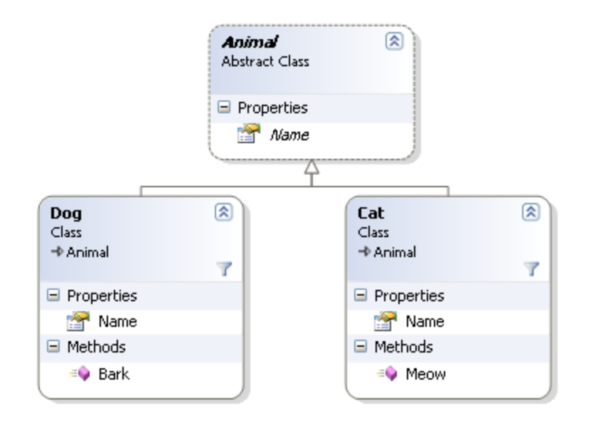
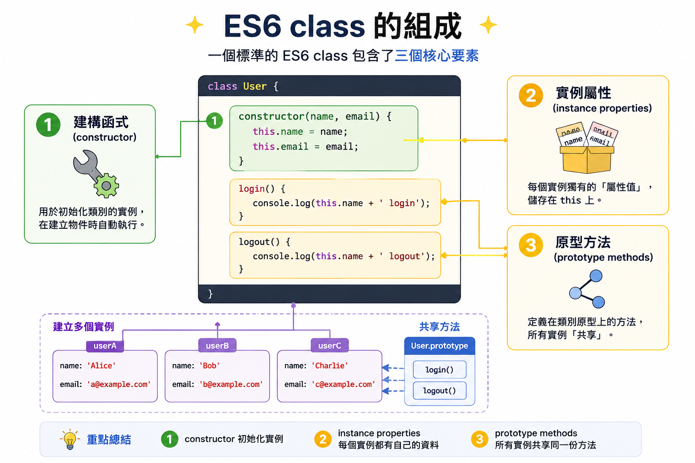
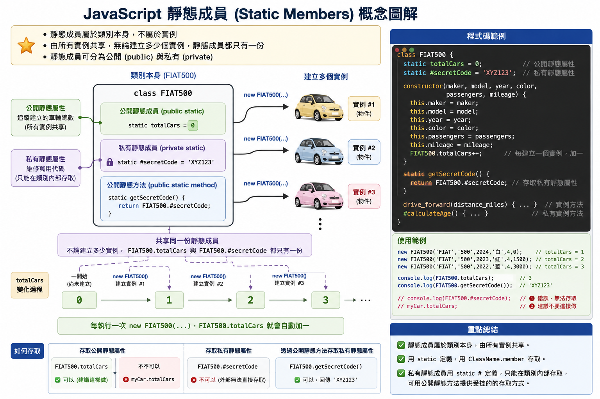
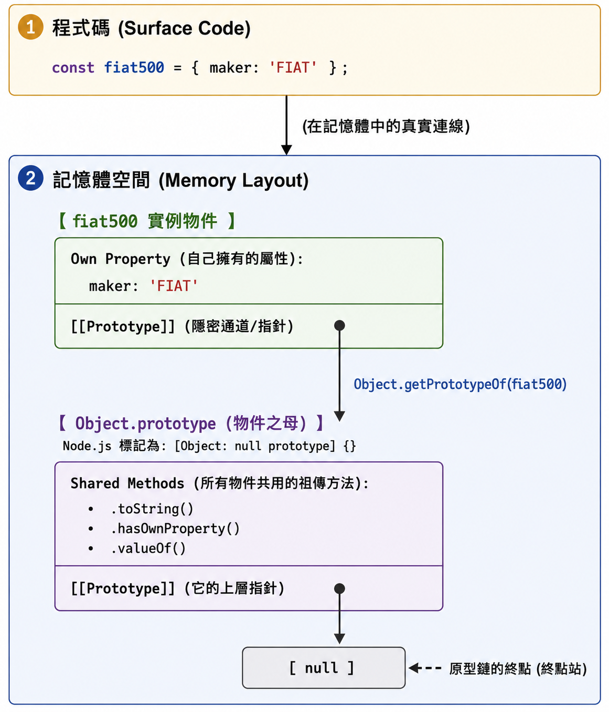

# Chapter 7 類別、原型與繼承: Part 1

## 物件 (Objects)

物件是現實世界實體的抽象化。
- 可用於在程式中建模現實世界的實體。

物件可以從另一個物件繼承屬性與方法以擴展其功能。
- 使開發者更容易維護與擴展程式碼。


例如:  狗 (Dog) 和貓 (Cat) 都是動物 (Animal) 的一種，它們都繼承了動物的屬性與方法，但也有自己獨特的屬性與方法。


## 物件的結構

物件是一種包含**屬性**與**方法**的集合的資料結構。
- 屬性: 鍵值對 (key-value pair)。
  - 鍵 (key): 物件的屬性名稱, 只能是字串或符號(symbol)。
  - 值 (value): 物件屬性的值, 可以是任何資料類型。
- 方法: 可以存取物件屬性以執行任務的函式。

例如:
- 貓 (Cat) 物件可能有屬性如 `name`、`age` 和方法如 `meow()`。

註: 參考 [[#補充：符號 (Symbol) 資料型態 | 補充：符號 (Symbol) 資料型態]] 以了解更多關於 Symbol 的資訊。


## 建立物件的方式

在 JavaScript 中，有三種方式可以建立物件：
- 物件字面語法 (object literal)，
- 類別定義(class definition)

### 物件字面語法 (object literal)

使用物件字面語法 `{}` 以宣告的方式建立一個 `Object` 資料型態的實例(instance)。
- 用文字描述物件的屬性與方法。
- 缺點：一次只能建立一個物件。


### `Object` 資料型態

`Object` 是 JavaScript 中的內建資料型態，大部份的物件都是 `Object` 的實例。

JS 執行 object literal 的過程:
1. 使用 `new Object()` 在記憶體開闢一塊新空間
2. 繼承 `Object` 的原型 (prototype) 以獲得基本的物件功能。 
   - 如: `toString()`, `hasOwnProperty()` 等方法。
3. 把大括號裡寫好的屬性與方法塞進去。

**`Object` type 是什麼？**
- `Object` 是 JavaScript 中的內建資料型態，是物件的始祖 - 幾乎所有物件都是 `Object` 的實例。

JavaScript 中沒有 `Class` 資料型態，只有 `Object` 資料型態。
- 類別定義(class definition) 是一種語法糖(syntactic sugar)，底層仍然是使用 `Object` 來實現物件的功能。
- 之後繼承也是使用 `Object` 來實現的。


**`Object` 的原型 (prototype) 是什麼？**
- `Object` 的原型是一個特殊的物件，包含了所有物件共享的方法與屬性。
- 例如: `toString()`, `hasOwnProperty()` 等方法都是定義在 `Object` 的原型上的，所有物件都可以使用這些方法。


### 範例：使用物件字面語法建立 FIAT 500 車輛物件


FIAT 500 的屬性與方法, 將其抽象化為物件, 以放到程式中使用。

- 屬性:
  - 製造商 (maker), 型號 (model), 年份 (year), 顏色 (color), 乘客數量 (passengers), 里程數 (mileage)
- 方法:
  - 向前行駛 (drive_forward), 向後行駛 (drive_backward)

使用物件字面語法建立 FIAT 500 車輛物件:

```js
const fiat500 = {
    maker: 'FIAT',
    model: '500',
    year: 2020,
    color: 'red',
    passengers: 4,
    mileage: 10000,
    // 「方法簡寫」（Method Shorthand）
    drive_forward() {
        console.log('The car is driving forward.');
    },
    drive_backward() {
        console.log('The car is driving backward.');
}
```

語法規則:
- 使用大括號 `{}` 包裹物件內容。
- 每個屬性與方法之間用逗號 `,` 分隔
- 屬性名稱與值之間用冒號 `:` 分隔。
- 方法定義使用簡潔的函式語法, 不需要使用 `function` 關鍵字。

在物件字面語法中，也可使用 「方法屬性定義」（Method Property Definition）的語法來定義方法。
- 上述的 drive_forward 方法也可以寫成以下的形式:

```js
drive_forward: function() {
    console.log('The car is driving forward.');
}
```

展現的語義：將一個函式表達式賦值給名為 sayHello 的屬性鍵（Key）。
- 可想像物件字面語法是「鍵-值對」的集合, 其中方法也是一種特殊的屬性, 其值為函式。


## 類別定義(class definition)

物件字面語法適合用於建立單一物件。
限制：
- 當需要建立多個具有相同屬性與方法的物件時，容易出錯。
  - 必須為每個物件重複撰寫相同的屬性與方法。

類別定義是一種更結構化的方式來建立物件，特別適用於需要建立多個相似物件的情況。

### ES6 class

ES6（2015年）引入的 class 關鍵字提供了一種更簡潔且易於理解的語法來定義類別。

一個標準的 ES6 class 包含了三個核心要素：建構函式、實例屬性 與 原型方法。
  - 建構函式 (constructor): 用於初始化類別的實例。
  - 實例屬性 (instance properties): 每個實例獨有的「屬性值」。
  - 原型方法 (prototype methods): 定義在類別原型上的方法，所有實例「共享」。



### 範例：使用 ES6 class 定義 FIAT 500 車輛類別

```javascript
class FIAT500 {
  // 建構子函式
  constructor(maker, model, year, color, passengers, mileage) {
    this.maker = maker; // 為物件新增屬性
    this.model = model;
    this.year = year;
    this.color = color;
    this.passengers = passengers;
    this.mileage = mileage;
  }
  // 實例方法：簡寫的函式定義
  drive_forward(distance_miles) {
    console.log('向前行駛');
    this.mileage += distance_miles;
  }
  drive_backward() {
    console.log('向後行駛');
  }
}
```

在建構函式中:
1. 使用 `this` 關鍵字來指代當前類別的實例(instance)
2. 用 `this.屬性名`新增實例屬性(instance property)
3. 建構函式接受參數以初始化實例的屬性值。
4. 用 「方法簡寫」（Method Shorthand） 的語法來定實例方法(instance method)。

注意和物件字面語法的區別: 沒有使用逗號 `,` 分隔方法定義。

### 快速練習

- 定義一個 `Car` 類別，並新增以下實例屬性與方法：
  - 屬性：`brand`、`model`、`year`、`color`
  - 方法：
  - `start()`: 在控制台輸出 "Car started."
  - `stop()`: 在控制台輸出 "Car stopped."
  - `info()`: 在控制台輸出車輛的品牌、型號、年份與顏色。
- 使用 Class 語法


## 使用類別建構實例(Instance)

在類別定義完成後，使用 `new` 關鍵字來創建類別的實例（instance）。

範例：建立 myFiat500 和 yourFIAT500 兩個實例。

```javascript
let myFiat = new FIAT500('Fiat', '500', 1957, 'Blue', 2, 6000);
let yourFiat = new FIAT500('Fiat', '500', 1957, 'Red', 2, 80000);
```

## 實例的屬性的存取與修改

### 存取實例屬性

使用點運算子 `.` 或方括號 `[]` 來存取實例的屬性（或鍵名）。

範例：顯示 `myFiat` 實例的里程屬性。

```javascript
console.log(myFiat.mileage);  // 6000
// or 
console.log(myFiat['mileage']);  
```

### 點運算子 `.` 或方括號 `[]` 的差異

#### 點運算子 `.`用於「靜態」且符合「標準識別碼命名」規範的屬性名稱

靜態屬性名稱，優先使用點運算子 `.` 來存取實例屬性。
- 當屬性名稱是固定的、已知的字串，且符合 標準識別碼（Identifier）命名規範 時，一律使用點號。
- 例如: `myFiat.mileage`。

原因:
- 可讀性極佳：程式碼最為簡潔、直觀。
- 工具支援度高：IDE（如 VS Code）能完美提供語法自動補全（Autocomplete）、型別檢查與程式碼重構（Refactoring）支援。

#### 方括號 `[]` 用於「動態」或「非標準識別碼命名」的屬性名稱

動態屬性名稱，必須使用方括號 `[]` 來存取實例屬性。
- `[]`會將內部的表達式求值後，將結果作為屬性名稱來存取物件屬性。

例如，我們用變數存儲屬性名稱：

```javascript
const key = 'email';
const user = { name: 'Alice', email: 'alice@example.com' };

console.log(user.key);   // ❌ 錯誤：會去尋找名為 "key" 的屬性，結果為 undefined
console.log(user[key]);  //  正確：等同於 user['email']
```

屬性名稱包含特殊字元或非標準識別碼
- `user-id`, `3`, `first name` 等屬性名稱無法使用點運算子存取，必須使用方括號。

```js
const data = {
  'user-id': 101,
  'first name': 'Bob',
  3: 'third place'
};

// console.log(data.user-id);    // ❌ 語法錯誤（會被誤判為減號）
// console.log(data.first name); // ❌ 語法錯誤

console.log(data['user-id']);    //  正確
console.log(data['first name']); //  正確
console.log(data[3]);            //  正確（會自動將數字轉為字串 '3'）
```

### 動態屬性使用情境

在實戰中，專業的 JS 開發者會將「資料（對照表）」與「邏輯（存取）」分離，以確保程式碼的可讀性與維護性。

假設 `apiStatus` 是從伺服器動態傳回來的變數, 代表 API 的狀態碼.

API 靜態配置表 (Configuration / Lookup Table) 如下, 定義文字訊息與顏色:

```js
// 這裡的結構是確定的，可以用描述性的命名
const STATUS_CONFIG = {
  success: { text: '檢索成功', color: 'green' },
  no_results: { text: '找不到相關文件', color: 'yellow' },
  out_of_tokens: { text: '額度已耗盡，請稍後再試', color: 'red' }
};
```

假設 `apiStatus` 的回傳值是 `out_of_tokens`, 那麼我們就可以使用 `[]` 來動態存取對應的訊息與顏色：

```javascript
const apiStatus = 'out_of_tokens'; // 這個值是動態的，來自伺服器回傳
// 使用 [] 來動態存取對應的訊息與顏色
const statusInfo = STATUS_CONFIG[apiStatus] ?? { text: '未知狀態', color: 'gray' }; // 提供預設值以防止 undefined   
console.log(statusInfo.text);  // 輸出: 額度已耗盡，請稍後再試
console.log(statusInfo.color); // 輸出: red
```

## Clean Code 實務: 點運算子 `.` 或方括號 `[]` 的使用

### 展現意圖

- 點號 `.` 的語意：「我非常確定這個物件的結構，這是一個固定的屬性。」它代表強型別與契約（Contract）。
- 中括號 [] 的語意：「這裡涉及動態邏輯，屬性可能來自設定檔、使用者輸入或迴圈。」它代表動態映射（Mapping）

### 不要 `[]` 使用 Magic String

直接在 `[]` 直接在括號內寫死字串（如 `user['name']`）會導致程式碼重構困難
- 因為 IDE 無法幫自動重構
- 只能靠人工搜尋替換，容易遺漏或誤替換。

Bad Smell:

```js
// 讀取固定屬性卻使用字串硬編碼（Magic String）
const userName = user['name']; 
const userAge = user['age'];
```

Clean Code:

```js
const userName = user.name; // 使用點運算子存取固定屬性
const userAge = user.age;
```

意圖清晰且易讀。

### 程式碼檢查清單（Code Review Checklist）

1. 可以寫成 `.` 的，絕不寫成 `[]`。只要出現 `['string']`，就思考能不能重構屬性名稱（改為符合點號規範的命名）。
2. 如果必須用 `[variable]`，確保該變數的型別是受控的，而不是任意字串。

## 新增物件屬性

物件建立後，也可以隨時新增該物件的屬性與方法

因為物件間是獨立的實例，所以新增的屬性只會影響該物件，不會影響其他物件。

範例: 為 `myFiat` 及 `yourFiat` 物件新增 `owner` 屬性。

```javascript
myFiat.owner = 'Alice';
yourFiat.owner = 'Bob';
console.log(myFiat.owner);  // 輸出: Alice
console.log(yourFiat.owner); // 輸出: Bob
```

提醒: 獨自為 `myFiat` 物件新增 `owner` 屬性，不會影響 `yourFiat` 物件. 所以，`yourFiat` 物件也要手動新增 `owner` 屬性。

## 刪除物件屬性

JavaScript 可於執行時動態新增、修改及刪除物件的屬性。

使用 `delete` 運算子來刪除物件的屬性。

這只會刪除該物件的屬性，不會影響其他物件。

範例: 刪除 `myFiat` 物件的 `owner` 屬性。

```javascript
delete myFiat.owner;
console.log(myFiat.owner);  // 輸出: undefined
// yourFiat 物件的 owner 屬性不受影響
console.log(yourFiat.owner); // 輸出: Bob
```

## 私有成員

物件的成員包括「屬性」與「方法」，預設是公開(public)的。

### 私有屬性(Private Properties)

物件的私有屬性(成員)用來將資料封裝在類別內部，防止外部直接存取。

在建構函數內使用 `this.propertyName` 定義的屬性預設為公開(public)，可以被外部存取與修改。

ES6 之後引入了私有屬性的語法，使用 `#` 前綴來定義私有屬性。

此屬性必須在類別定義時在建構函式外宣告，並用 `#` 前綴來修飾屬性名稱。

存取物件的私有屬性時，必須在類別內部使用 `this.#propertyName` 的語法來存取。

範例: 為 `FIAT500` 類別新增一個私有屬性 `#vin`（車輛識別碼），並提供一個公開方法 `getVin()` 來存取該私有屬性。

```javascript
class FIAT500 {
  #vin; // 私有屬性

  constructor(maker, model, year, color, passengers, mileage, vin) {
    this.maker = maker;
    this.model = model;
    this.year = year;
    this.color = color;
    this.passengers = passengers;
    this.mileage = mileage;
    // 私有屬性必須在建構函式內使用 this.#propertyName 存取
    this.#vin = vin;
  }
  // 公開方法提供外部存取私有屬性
  getVin() {
    return this.#vin; // 提供公開方法來存取私有屬性
  }
}
```

### 私有屬性存取器(Accessors)

私有屬性未經公開方法存取，外部無法直接存取或修改。
要讓外部能存取或修改私有屬性，必須提供公開的方法，稱為存取器（Accessor），包括 getter 與 setter。

- Getter: 用於讀取私有屬性的值。
- Setter: 用於修改私有屬性的值。

範例: 為 `FIAT500` 類別的私有屬性 `#vin` 提供 getter 與 setter 方法。

```javascript
class FIAT500 {
  #vin; // 私有屬性

  constructor(maker, model, year, color, passengers, mileage, vin) {
    ...

  }
  // Getter 方法
  get vin() {
    return this.#vin; // 提供 getter 方法來讀取私有屬性
  }
  // Setter 方法
  set vin(newVin) {
    this.#vin = newVin; // 提供 setter 方法來修改私有屬性
  }
}
```

語法說明:

- Getter 方法使用 `get` 關鍵字定義，方法名稱為屬性名稱（不帶 `#`）。
- Setter 方法使用 `set` 關鍵字定義，方法名稱同樣為屬性名稱（不帶 `#`），並接受一個參數用於設定新的值. 

使用 `set` 與 `get` 的好處:
- 外部存取私有屬性時，可以像存取一般屬性一樣使用點運算子 `.`，而不需要呼叫方法。
- 當存取屬性時，取值器與設值器方法會自動被呼叫。

範例: 使用 getter 與 setter 存取 `myFiat` 實例的私有屬性 `#vin`。

```javascript
const myFiat = new FIAT500('Fiat', '500', 1957, 'Blue', 2, 6000, '1A2B3C4D5E');
console.log(myFiat.vin); // 自動呼叫 getter 方法，輸出: '1A2B3C4D5E'
myFiat.vin = '5E4D3C2B1A'; // 自動呼叫 setter 方法來修改私有屬性
console.log(myFiat.vin); 
```

### 私有方法(Private Methods)

私有方法用來封裝類別內部的邏輯，防止外部直接呼叫。

同樣使用 `#` 前綴來定義私有方法，並且只能在類別內部呼叫。

範例: 為 `FIAT500` 類別新增一個私有方法 `#calculateAge()`，用來計算車輛的年齡，並在公開方法 `getCarInfo()` 中呼叫該私有方法。

```javascript
class FIAT500 {
    #vin; // 私有屬性
    constructor(maker, model, year, color, passengers, mileage, vin) {
        // 初始化公開屬性
        ...
        this.mileage = mileage;
        // 初始化私有屬性
        this.#vin = vin;
    }
    // 私有方法
    #calculateAge() {
        const currentYear = new Date().getFullYear();
        return currentYear - this.year;
    }
    // 公開方法
    getCarInfo() {
        const age = this.#calculateAge(); // 在公開方法中呼叫私有方法
        return `${this.maker} ${this.model} (${this.year}) - Age: ${age} years`;
    }
}
```

### Clean Code 實務: Setter 與 Getter 的使用

- 不是每個私有屬性都需要 getter/setter。
- 過度使用使得「物件（Object）」降格為單純的「資料結構」
  - 物件是用來封裝「資料」與「行為」的實體
- 進而使得使用者在物件外部處理邏輯，違反了 Clean Code 原則: 「告訴它，而不是詢問它」原則 (Tell, Don't Ask)
  - 物件應該自己處理自己的狀態與行為，而不是讓外部去詢問它的狀態然後在外部處理邏輯。

Clean Code 原則: 「告訴它，而不是詢問它」原則 (Tell, Don't Ask)


#### 範例: 「告訴它，而不是詢問它」原則

違反精神的做法(Bad Smell)
- 取得屬性值後在外部處理邏輯，最後再把結果寫回物件。
 
詢問 FIAT500 目前的里程數，然後在外部處理邏輯，最後再把結果寫回物件。

```javascript
const myFiat = new FIAT500('Fiat', '500', 1957, 'Blue', 2, 6000, '1A2B3C4D5E');

// 先詢問物件目前的狀態
const currentMileage = myFiat.mileage;

// 在物件外部處理邏輯
const tripDistance = 120;
const newMileage = currentMileage + tripDistance;

// 再把結果寫回物件
myFiat.mileage = newMileage;
```

Scent Smell 的做法: 告訴物件要做什麼，而不是詢問它的狀態: Tell, Don't Ask

```javascript
const myFiat = new FIAT500('Fiat', '500', 1957, 'Blue', 2, 6000, '1A2B3C4D5E');
// 直接告訴物件要做什麼
myFiat.drive_forward(120); // 讓物件自己處理里程數
``` 

#### Setter 的使用時機

大部份的情況下，私有屬性不需要有 setter 方法

因為在 「告訴它，而不是詢問它」原則下，物件應該提供一個公開的方法來執行任務，而不是讓外部去修改物件的狀態。
- 如上例中的 `drive_forward()` 方法，讓物件自己處理里程數的更新，而不是讓外部去修改里程數。
- 公開的方法的取名和私有屬性名稱脫鉤，可以更清晰地表達領域意圖(domain intent)

如果一定要提供私有屬性的方法，則應封裝對私有屬性設定時的「商業規則」或「驗證規則」。

範例: `FIAT500` 允許手動更換車牌號碼，但必須驗證新的車牌號碼是否符合特定格式（如 ABC-1234）。

```javascript
class FIAT500 {
  #licensePlate;

  constructor(maker, model, year, color, passengers, mileage, licensePlate) {
    ...
    this.licensePlate = licensePlate; // 交給 setter 驗證
  }

  set licensePlate(newPlate) {
    const platePattern = /^[A-Z]{3}-\d{4}$/;
    // 驗證新的車牌號碼是否符合格式
    if (!platePattern.test(newPlate)) {
      console.error('車牌格式錯誤，必須為 ABC-1234');
      return;
    }

    this.#licensePlate = newPlate;
  }
}
```

使用時，在設定車牌號碼時，JS 會自動呼叫 setter 方法來驗證新的車牌號碼是否符合格式：

```javascript
const myFiat = new FIAT500('Fiat', '500', 1957, 'Blue', 2, 6000, 'ABC-1234');
myFiat.licensePlate = 'XYZ-5678'; // 成功更換車牌
myFiat.licensePlate = 'INVALID'; // 失敗，輸出錯誤訊息
``` 

#### Getter 的使用時機

##### 計算型欄位 (Computed Property)

Getter 很適合用來提供「計算型欄位 (Computed Property)」。

所謂計算型欄位，是指該值不是獨立儲存在物件內部，而是根據既有屬性即時計算出來的結果。

例如: 車輛的車齡 (`age`) 並不一定需要另外存成一個屬性，因為它可以由 `year` 推導出來。

```javascript
class FIAT500 {
  constructor(maker, model, year, color, passengers, mileage) {
    ...
  }

  // Getter: 提供計算型欄位
  get age() {
    const currentYear = new Date().getFullYear();
    return currentYear - this.year;
  }
}
```

使用時，外部可以像讀取一般屬性一樣存取它:

```javascript
const myFiat = new FIAT500('Fiat', '500', 1957, 'Blue', 2, 6000);
console.log(myFiat.age); // 例如輸出: 69
```

這樣設計的好處:

- 不需要額外儲存一份 `age` 資料，避免重複狀態。
- `age` 每次存取時都會重新計算，不容易出現資料過期的問題。
- 對外仍然可以用「屬性」的方式存取，語意自然。

實務上，只要某個值可以由其它屬性穩定推導出來，就很適合考慮用 getter 來實作，而不是把它當作一個獨立欄位儲存。

##### Read-only 的私有屬性

另一種適合使用 getter 的情境，是對外提供「唯讀（Read-only）」的私有屬性。

也就是說，外部可以讀取這個值，但不能直接修改它。

這種設計常用於一些建立後不應隨意變動的資料，例如車輛識別碼 `vin`。

```javascript
class FIAT500 {
  #vin;
  constructor(maker, model, year, color, passengers, mileage, vin) {
    ...
    // 初始化私有屬性
    this.#vin = vin;
  }

  get vin() {
    return this.#vin;
  }
}
```

使用時，外部只能讀取，不能直接重新指定:

```javascript
const myFiat = new FIAT500('Fiat', '500', 1957, 'Blue', 2, 6000, '1A2B3C4D5E');

console.log(myFiat.vin); // 輸出: 1A2B3C4D5E
// 不會修改 #vin，在嚴格模式（Strict Mode）下會拋出錯誤TypeError: Cannot set property vin of #<Fiat500> which has only a getter
myFiat.vin = '9Z8Y7X6W5V'; 

console.log(myFiat.vin); // 仍然是 1A2B3C4D5E
```

這樣設計的好處:

- 外部可以安全地讀取資料。
- 類別仍然保有對內部狀態的控制權。
- 避免使用者在物件外部任意改動不該變動的資料。

因此，當某個私有屬性需要被外部查看，但不應被外部直接修改時，只提供 getter 而不提供 setter，通常是較合理的設計。


## 靜態成員(Static Members)

靜態成員是屬於類別本身的成員，而不是類別的實例。
靜態成員是共享於該類別的實例之間的成員，無論創建多少個實例，靜態成員都只有一份。
靜態成員也可區分公開與私有



### 公開靜態成員 (Public Static Members)

使用 `static` 關鍵字來定義公開的靜態成員，
使用 `ClassName.staticMember` 的語法來存取成員

範例: 為 `FIAT500` 類別新增一個公開的靜態屬性 `totalCars`，用來追蹤創建的車輛總數。

```javascript
class FIAT500 {
  static totalCars = 0; // 公開靜態屬性

  constructor(maker, model, year, color, passengers, mileage) {
    // 初始化實例屬性
    this.maker = maker;
    ...
    // 更新靜態屬性來追蹤創建的車輛總數
    FIAT500.totalCars++; // 每創建一個實例，總數加一
  }
}
```

每執行一次 `new FIAT500(...)`，`totalCars` 就會自動增加。

### 私有靜態成員 (Private Static Members)

使用 `static` 關鍵字與 `#` 前綴來定義私有的靜態成員，只能在類別內部使用 `ClassName.#privateStaticMember` 的語法來存取。

範例: 為 `FIAT500` 類別新增一個私有的靜態屬性 `#secretCode` 表示車輛的維修萬用代碼，並提供一個公開的靜態方法 `getSecretCode()` 來存取該私有靜態屬性。

```javascript
class FIAT500 {
  static totalCars = 0; // 公開靜態屬性
  static #secretCode = 'XYZ123'; // 私有靜態屬性

    constructor(maker, model, year, color, passengers, mileage) {
        this.maker = maker;
        this.model = model;
        this.year = year;
        this.color = color;
        this.passengers = passengers;
        this.mileage = mileage;
        FIAT500.totalCars++;
    }
    // 公開靜態方法來存取私有靜態屬性
    // 用 static get 來定義靜態存取器方法
    static get secretCode() {
        return FIAT500.#secretCode;
    }
    // 其它公開或私有實例方法
    drive_forward(distance_miles) {...}
    #calculateAge() {...}
}
```


## 補充：符號 (Symbol) 資料型態

Symbol 是 JavaScript 在 ES6（2015年）引入的一種原始資料型態（Primitive Data Type）。目的是創造一個絕對獨一無二且不可變（Immutable）的值，主要用來解決物件屬性名稱可能發生衝突的問題。

宣告一個 Symbol 的方式如下：

```javascript   
const mySymbol = Symbol('id');
```

將其用為 物件的屬性名稱：

```javascript
const id = Symbol('id');

const user = {
  name: 'Alice',
  [id]: 123456  // 使用 Symbol 作為屬性名稱
};
```

在這個例子中，`id` 是一個 Symbol，並且被用作 `user` 物件的屬性名稱。由於 Symbol 的唯一性，即使有多個 Symbol 使用相同的描述（'id'），它們仍然是不同的值，因此不會發生屬性名稱衝突。

屬性名稱中使用 `[]`, 其正式名稱叫做「計算屬性名稱」（Computed Property Names），允許我們使用「變數」或「表達式」來定義物件的屬性名稱。


取得 Symbol 屬性的值只能使用 `[]` 符號，不能使用點符號（`.`）：

```javascript
console.log(user[id]);  // 輸出: 123456
```

## 補充: Object Literal 產生的物件的記憶體結構



```
 ┌────────────────────────────────────────────────────────┐
 │ 1. 程式碼 (Surface Code)                                │
 │                                                        │
 │    const fiat500 = { maker: 'FIAT' };                  │
 └───────────────────────────┬────────────────────────────┘
                             │
                             ▼ (在記憶體中的真實連線)
 ┌────────────────────────────────────────────────────────┐
 │ 2. 記憶體空間 (Memory Layout)                            │
 │                                                        │
 │    【 fiat500 實例物件 】                                │
 │   ┌──────────────────────────────────────────────┐     │
 │   │  Own Property (自己擁有的屬性):                │     │
 │   │    maker: 'FIAT'                             │     │
 │   ├──────────────────────────────────────────────┤     │
 │   │  [[Prototype]] (隱密通道/指針)                 │     │
 │   └───────────────┬──────────────────────────────┘     │
 │                   │                                    │
 │                   │  Object.getPrototypeOf(fiat500)    │
 │                   ▼                                    │
 │    【 Object.prototype (物件之母) 】                     │
 │     Node.js 標記為: [Object: null prototype] {}         │
 │   ┌──────────────────────────────────────────────┐     │
 │   │  Shared Methods (所有物件共用的祖傳方法):        │     │
 │   │    .toString()                               │     │
 │   │    .hasOwnProperty()                         │     │
 │   │    .valueOf()                                │     │
 │   ├──────────────────────────────────────────────┤     │
 │   │  [[Prototype]] (它的上層指針)                  │     │
 │   └───────────────┬──────────────────────────────┘     │
 │                   │                                    │
 │                   ▼                                    │
 │                [ null ]  ◄─── 原型鏈的終點 (終點站)       │
 └────────────────────────────────────────────────────────┘

```

