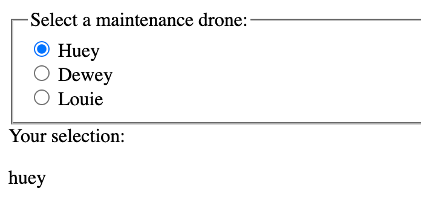
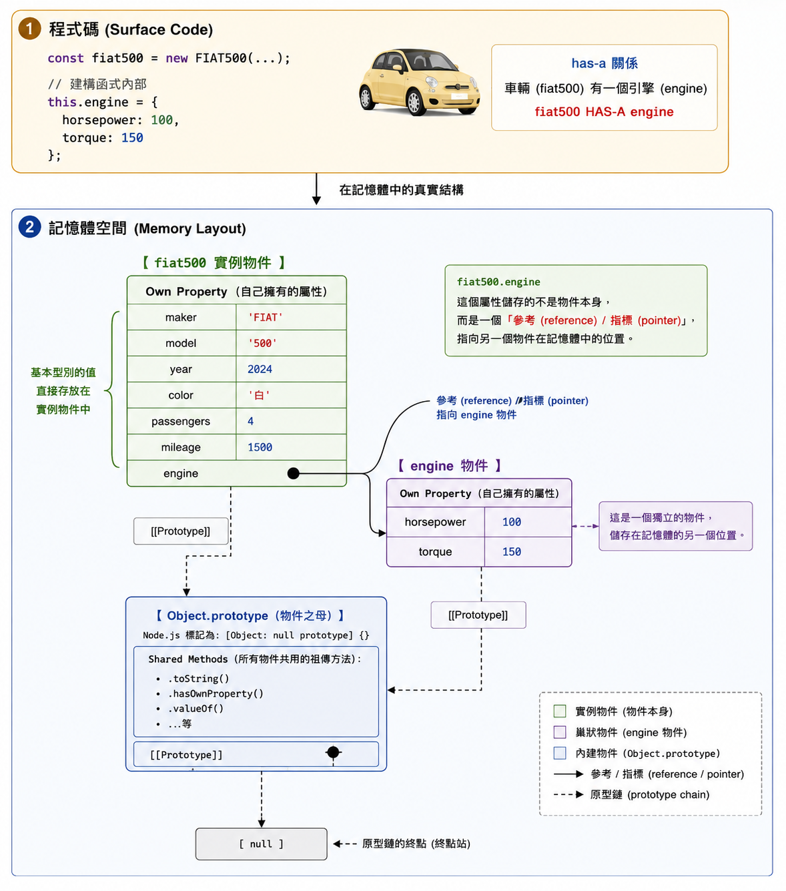
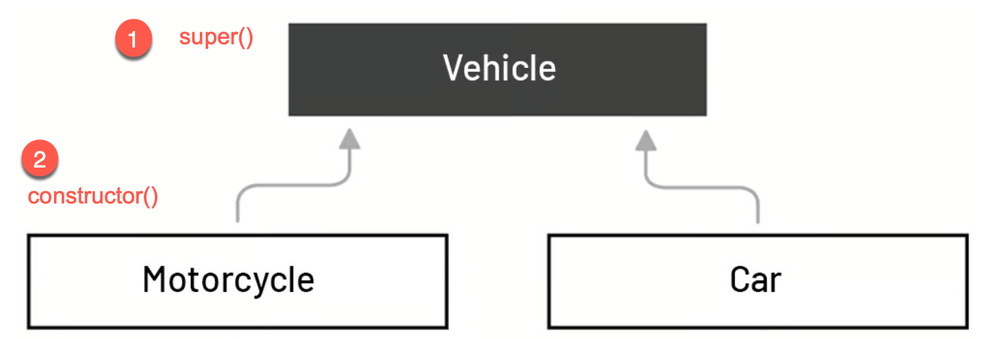
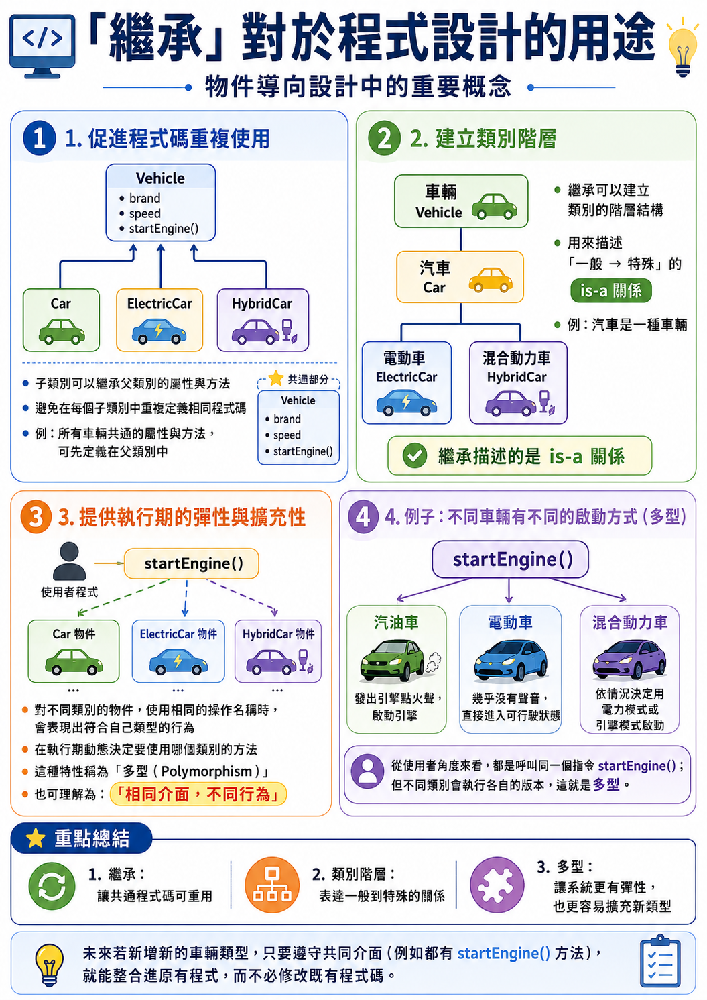
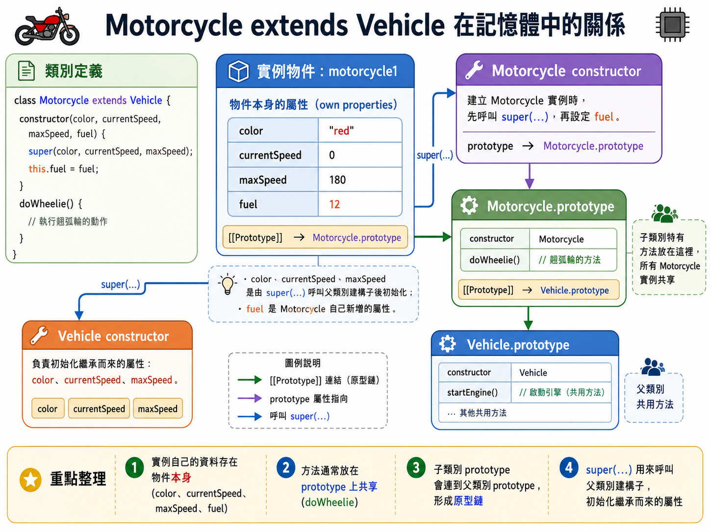
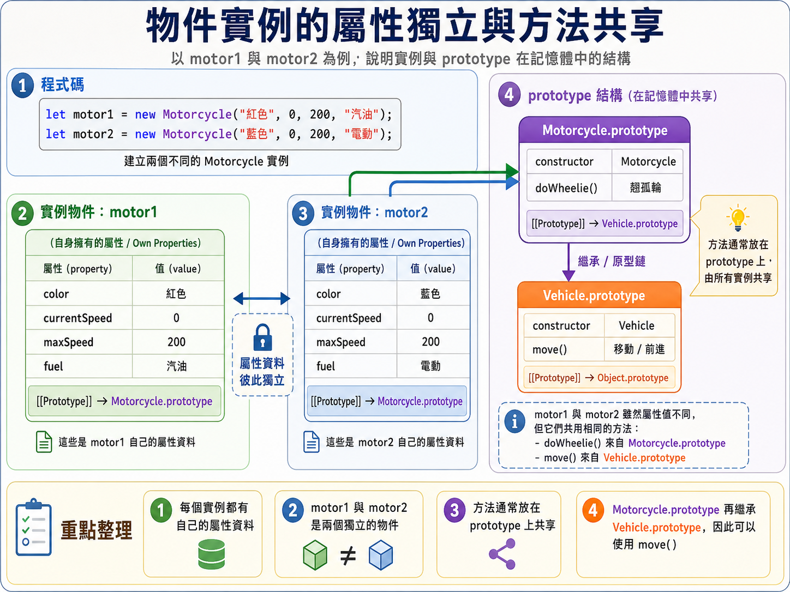
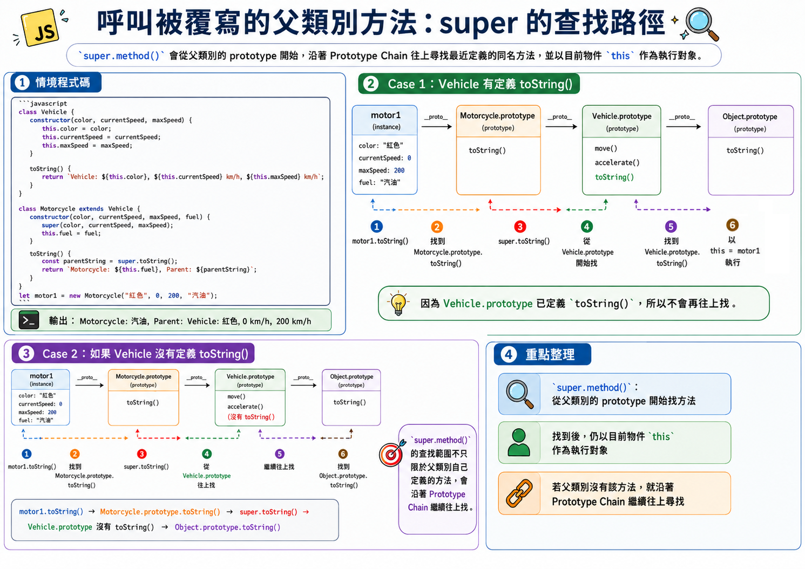

# Chapter 7 類別、原型與繼承: Part 2 物件陣列、巢狀物件及繼承

## 本章重點

- 理解物件與陣列的組合使用：物件可以放入陣列，物件屬性也可以保存陣列或其他物件
- 掌握常見物件集合處理情境：例如 HTMLElement 物件陣列、File 物件陣列，以及用 `forEach()` 逐一操作物件
- 理解巢狀物件的語意：用物件屬性表示 has-a 關係，讓複合資料結構更貼近真實領域
- 認識繼承的用途：透過父類別與子類別表達 is-a 關係，重複使用共通屬性與方法
- 掌握 ES6 class 繼承流程：使用 `extends` 指定父類別，使用 `super()` 初始化父類別屬性，再補上子類別自己的屬性與方法
- 理解 prototype 與 prototype chain：實例擁有自己的屬性資料，但方法透過原型物件共享，方法查找會沿著原型鏈進行
- 分辨實例自有方法、prototype 方法、覆寫方法與 `super.method()` 的呼叫意義

## 物件與陣列的操作

### 物件的陣列

處理物件陣列是 JavaScript 程式設計中的常見任務。

典型情境:
- 查詢具有相同 class 名稱的 HTML 元素物件(HTMLElement objects) 並將它們存儲為物件陣列。
- 當在頁面上點擊按上傳檔案時, 取得多個 File 物件 並將它們存儲為物件陣列。


### 範例: 建立 `cars` 陣列，包含 2 個 FIAT500 物件

使用 `FIAT500` 類別來創建兩個車輛物件，並將它們存儲在 `cars` 陣列中。

```javascript
const cars = [
  new FIAT500('Fiat', '500', 1957, 'Blue', 2, 6000),
  new FIAT500('Fiat', '500', 1957, 'Red', 2, 80000)
];
```

可迭代陣列呼叫 `FIAT500` 實例的 `getCarInfo()` 方法來顯示每輛車的資訊：

```javascript
cars.forEach(car => {
  console.log(car.getCarInfo());
});
```

### 情境: 處理 HTMLElement Objects 陣列 

在底下的 HTML 文件中，為每個 radio button 新增一個 click 事件監聽器。
- 頁面上有三個 radio button，分別為 Huey(休依)、Dewey(杜威) 和 Louie(路易)。
  - 唐老鴨的三個姪兒

當 radio button 被點擊時，顯示 radio button 的值。

將值顯示在 `<p>` 元素中，其 id 為 `display`。




```html
<fieldset>
        <legend>Select a maintenance drone:</legend>
      
        <div>
          <input type="radio" id="huey" name="drone" value="huey" checked />
          <label for="huey">Huey</label>
        </div>
      
        <div>
          <input type="radio" id="dewey" name="drone" value="dewey" />
          <label for="dewey">Dewey</label>
        </div>
      
        <div>
          <input type="radio" id="louie" name="drone" value="louie" />
          <label for="louie">Louie</label>
        </div>
      </fieldset>
    <div>
       Your selection: <p id="display"></p>
    </div>
```

做法:
- 首先, 取得所有 radio button 元素並存入陣列中。
  - 使用 document.getElementsByName() 取得一組 radio button 元素。
  - 其回傳值是 NodeList，屬於類陣列物件，不是真正的 Array，但在現代瀏覽器中可以使用 forEach() 逐一處理。
- 然後, 迭代陣列並為每個 radio button 新增 click 事件監聽器。
  - 監聽器函式取得 radio button 的值並顯示在 `<p>` 元素中。
    - 使用 `e.target.value` 取得 radio button 的值。


```javascript
let drones = document.getElementsByName('drone');

// NodeList(3) [input#huey, input#dewey, input#louie], an array of input elements
console.log(drones);  

// iterate the array
drones.forEach( drone => {
    // add a click event listener to each radio button
    drone.addEventListener('click', function(e){
        // get the radio button's value
        let value = e.target.value;
        // show the value in the <p> element
        document.getElementById('display').textContent = value;
    });
})
```

完整檔案參考 [examples/array_of_objects.html](examples/array_of_objects.html)

提醒：
- 這不是處理單選按鈕選擇的最佳方式。
- 更簡潔的做法: 將點擊事件監聽器新增到單選按鈕的父元素
  - 因為事件可以從單選按鈕 浮升 到父元素，讓我們在父元素上處理事件.


### 在屬性中使用陣列

屬性的值可以是任何資料型態，包括陣列或其他物件。

範例: 為 `FIAT500` 類別新增一個屬性 `gear` 表示車輛的檔位，並將其值設為一個陣列，包含不同檔位的名稱。

```javascript
class FIAT500 {
  constructor(maker, model, year, color, passengers, mileage) {
    this.maker = maker;
    this.model = model;
    this.year = year;
    this.color = color;
    this.passengers = passengers;
    this.mileage = mileage;
    // 屬性的值可以是陣列
    this.gear = ['P', 'R', 'N', 'D']; // 表示車輛的檔位
  }
}
```

顯示 `myFiat` 實例的的第一個檔位名稱：

```javascript
const myFiat = new FIAT500('Fiat', '500', 1957, 'Blue', 2, 6000);
console.log(myFiat.gear[0]);  // 輸出: 'P'
```

### 巢狀物件 

屬性的值也可以是另一個物件，形成巢狀物件（Nested Object）。

巢狀物件用來描述物件間 has-a 的關係。

例如: 車輛物件有一個屬性 `engine`，其值是一個物件，包含引擎的相關資訊, 如 `hoursepower` (馬力) 與 `torque` (扭力)。

我們使用 Object Literal 來定義 `engine` 屬性，並將其值設為一個物件：

```javascript
class FIAT500 {
  constructor(maker, model, year, color, passengers, mileage) {
    this.maker = maker;
    this.model = model;
    this.year = year;
    this.color = color;
    this.passengers = passengers;
    this.mileage = mileage;
    // 屬性的值可以是另一個物件
    this.engine = {
      horsepower: 100,
      torque: 150
    };
  }
}
```

顯示 `myFiat` 實例的引擎馬力：

```javascript
const myFiat = new FIAT500('Fiat', '500', 1957, 'Blue', 2, 6000);
console.log(myFiat.engine.horsepower);  // 輸出: 100
```



## 繼承


### 什麼是「繼承」？
- 繼承是一種從現有類別 (父類別) 建立新類別 (子類別) 的機制。
- 父類別表示子類別的通用屬性與方法。
  - 例如: 摩托車是一種車輛，因此「摩托車」繼承「車輛」的屬性與方法。
  - 車輛是父類別，摩托車是子類別。
- 子類別可以新增自己的屬性與方法，或覆寫父類別的方法以提供特定的行為。



### 「繼承」對於程式設計的用途

**促進程式碼重覆使用**
- 子類別繼承父類別的屬性與方法，避免重複定義相同的程式碼。
  - 例如: 所有車輛都有共同的屬性與方法
    - 我們可以將這些共通的屬性與方法定義在父類別中，讓子類別繼承它們。
    - 不需要在每個子類別中重複定義相同的屬性與方法。

**建立類別階層**
- 繼承允許我們建立類別的階層結構，反映現實世界中物件之間的關係。
  - 繼承繼承可以描述「一般 → 特殊」(is-a) 關係
  - 例如: 車輛 → 汽車 
    - 汽車是一種車輛，因此汽車繼承車輛的屬性與方法。

**提供執行期的執行彈性與擴充性** 
- 對不同類別的物件，使用**相同的操作名稱時**，物件會各自表現出符合自己類型的行為
    - 在執行期動態地決定使用哪個類別的實例的方法
  - 此特性稱為多型 (Polymorphism)，是物件導向程式設計的重要特徵之一
  - 多型也可以理解成「相同介面，不同行為」。


### 例子: 不同車輛有不同的啟動方式(多型)

假設我們有幾種不同的車輛，例如汽油車、電動車和混合動力車。雖然它們都屬於「車輛」，而且都可以執行「啟動引擎」`startEngine()` 這個動作，但實際上的啟動方式並不相同。

- 汽油車啟動時，可能會發出引擎點火的聲音。
- 電動車啟動時，可能幾乎沒有聲音，而是直接進入可行駛狀態。
- 混合動力車則可能依照當下情況，決定使用電力模式或引擎模式啟動。

從使用者的角度來看，我們都是在對「車輛」下達相同的指令 `startEngine()`；但從物件本身來看，不同類別會執行各自的版本。這就是多型的核心概念。

未來新增新的車輛類型時，只要它遵守共同的操作介面(例如都有 `startEngine()) 方法，就能融入原本的程式，而不需要修改現有的程式碼，這就是多型帶來的彈性與擴充性。



## 繼承父類別的程序與程式碼

### 建立子物件的過程

1. 指定要繼承的父類別: 子類別使用 `extends` 關鍵字指定父類別。
2. 初始化父類別的屬性: 子類別必須在建構子(constructor)中呼叫父類別的建構子 (`super()`) 來初始化父類別的屬性。
3. 初始化子類別的屬性: 子類別在同一個建構子中定義及初始化自己的屬性。
4. 新增子類別的方法: 子類別可以定義自己的方法，或覆寫父類別的方法以提供特定的行為。

### 範例: 建立 `Vehicle` 類別與 `Motorcycle` 子類別

### S1: 建立父類別 `Vehicle`

建立 `Vehicle` 類別，包含屬性 `color`、`currentSpeed`、`maxSpeed` 以及方法 `move()`。

```javascript
class Vehicle {
  constructor(color, currentSpeed, maxSpeed) {
    this.color = color;
    this.currentSpeed = currentSpeed;
    this.maxSpeed = maxSpeed;
  }

  move() {
    console.log("移動中，速度:", this.currentSpeed, "km/h");
  }

  accelerate(amount) {
  this.currentSpeed += amount;
  console.log("目前速度:", this.currentSpeed, "km/h");
}
}
```

### S2: 建立子類別 `Motorcycle` 並指定繼承父類別 `Vehicle`

建立 `Motorcycle` 類別，繼承 `Vehicle` 類別，並新增屬性 `fuel` 與方法 `doWheelie()`。

```js
class Motorcycle extends Vehicle {
    
}
```

### S3: 撰寫 `Motorcycle` 的建構子 (Constructor)

`Motorcycle` 類別多了一個屬性 `fuel`.

撰寫 `Motorcycle` 的建構子 (Constructor):

1. 呼叫 `super()` 來初始化父類別的屬性 (子類別的責任)。
2. 定義及初始化子類別的屬性 

```javascript
class Motorcycle extends Vehicle {
  constructor(color, currentSpeed, maxSpeed, fuel) {
    // 呼叫父類別的建構子
    super(color, currentSpeed, maxSpeed);
    // 新增及初始化子類別的屬性
    this.fuel = fuel;
  }
}
```

### S4: 新增子類 `Motorcycle` 的方法

`Motocycle` 有「單輪行駛」的功能，因此新增 `doWheelie()` 方法。


```javascript
class Motorcycle extends Vehicle {
  constructor(color, currentSpeed, maxSpeed, fuel) {
    // 呼叫父類別的建構子
    super(color, currentSpeed, maxSpeed);
    // 新增及初始化子類別的屬性
    this.fuel = fuel;
  }
  // 子類別特有的方法
  doWheelie() {
    console.log("單輪行駛");
  }
}
```

此時，`Motorcycle` 類別可用的屬性與方法:

| 屬性/方法|來源類別|
|---|---|
|color|Vehicle|
|currentSpeed|Vehicle|
|maxSpeed|Vehicle|
|move()|Vehicle|
|fuel|Motorcycle|
|doWheelie()|Motorcycle|  


參考 [ex_07_inheritance.js](http://lecture_notes/ch7/ex_07_inheritance.js) 獲取完整程式碼。

### S5: 實體化 `Motorcycle` 類別，並使用繼承自 `Vehicle` 的方法

實體化 `Motorcycle` 類別，並使用 `move()` 與 `doWheelie()` 方法。

```javascript
let motor = new Motorcycle("紅色", 0, 200, "汽油");
console.log(motor.color); // 紅色
motor.accelerate(50); // 移動中，速度: 50 km/h
motor.move(); // 移動中，速度: 50 km/h
motor.doWheelie(); // 單輪行駛
```



## 物件實例的屬性獨立與方法共享

每個物件實例都有「自己的屬性資料」，但「方法是共享的」。

考慮以下的兩台摩托車 `motor1` 與 `motor2`：

```javascript
let motor1 = new Motorcycle("紅色", 0, 200, "汽油");
let motor2 = new Motorcycle("藍色", 0, 200, "電動");
```

`motor1` 與 `motor2` 都有自己的屬性資料，例如 `color`、`currentSpeed`、`maxSpeed` 和 `fuel`。

注意： **父類的屬性值直接建立在子類實例上**

但是他們的行為都是相同的，因為他們共享 `Motorcycle` 類別的方法，例如 `move()` 和 `doWheelie()`。
- 而 `Motorcycle` 類別的方法又繼承來自 `Vehicle` 類別的方法： `move()`。




## Prototype 原型

Q: 相同類別的物件實例為什麼可以共享方法？

因為 JavaScript 使用「原型」(prototype) 來實現方法共享。

每個類別都有一個原型物件，該物件包含了類別的方法。

當我們建立一個類別的實例時:
1. 在記憶體中為該實例分配空間，並儲存實例的屬性資料。
2. 將該實例的內部屬性 `[[Prototype]]` 指向類別的原型物件。
3. 當我們呼叫實例的方法時，JavaScript 會先在實例本身尋找該方法。
   - 如果找不到就會沿著 `[[Prototype]]` 指向的原型物件尋找。

### 動態為某個實體新增方法

我們可以直接在某個實體上新增方法，這樣該方法就會成為該實體的「自有方法」，而不會影響其他實例。

例如, 我們改裝 `motor1` 使它能夠「飛行」，我們可以直接在 `motor1` 上新增一個 `fly()` 方法：

```javascript
motor1.fly = function() {
  console.log("飛行中");
};
```

這樣 `motor1` 就有了 `fly()` 方法，但 `motor2` 沒有這個方法：

```javascript
motor1.fly(); // 飛行中
motor2.fly(); // TypeError: motor2.fly is not a function
```

### 動態為所有實體新增方法

如果要為所有實體新增方法，要將方法新增到類別的原型物件(prototype)上
這樣所有實例都能共享這個方法.

例如, 我們想要為所有 `Motorcycle` 實例新增一個 `honk()` 方法，我們可以將該方法新增到 `Motorcycle.prototype` 上：

```javascript
Motorcycle.prototype.honk = function() {
  console.log("按喇叭");
};
```

這樣所有 `Motorcycle` 實例都能使用 `honk()` 方法：

```javascript
motor1.honk(); // 按喇叭
motor2.honk(); // 按喇叭
```

## 呼叫父類別的方法：「原型鏈」(Prototype Chain)

Q: 在物件實例中，如何呼叫到父類別的方法？

父類別的方法也放在其原型物件(prototype)上。

要呼叫到父類別的方法，就必須沿著以下路徑尋找方法：

```
實例 -> 實例的 prototype -> 父類別的 prototype -> 父類別的方法
```

此路徑稱為「原型鏈」(Prototype Chain)。

例子: `motor1` 及 `motor2` 兩個實例要呼叫 `Vehicle` 類別的 `move()` 方法時的尋找路徑(Prototype Chain):

```
motor1 -> motor1 的 prototype -> Motorcycle.prototype -> Vehicle.prototype -> move() 方法
motor2 -> motor2 的 prototype /
```

### 使用 `Object` 型別提供的方法

當使用 `class` 的建構子(constructor)建立類別時，該類別會自動繼承 `Object` 類別的方法，例如 `toString()`等等。

在繼承鏈中，`Object` 類別位於最頂端，因此所有類別都能使用 `Object` 的方法。

例如: `motor1` 實例可以使用 `toString()` 方法，因為它繼承自 `Object` 類別：

```javascript
console.log(motor1.toString()); // [object Object]
```

此時 `toString()` 方法的尋找路徑(Prototype Chain) 為：

```
motor1 -> motor1 的 prototype -> Motorcycle.prototype -> Vehicle.prototype -> Object.prototype -> toString
```


### 覆寫父類別的方法

子類別可以用相同的方法名稱來定義自己的方法，這樣就會覆寫父類別的方法。

例如，要為 `Motorcycle` 定義自己的 `toString()` 方法, 而不要使用 `Object` 類別的 `toString()` 方法，我們可以在 `Motorcycle` 類別中定義一個新的 `toString()` 方法：

```javascript
class Motorcycle extends Vehicle {
  constructor(color, currentSpeed, maxSpeed, fuel) {
    super(color, currentSpeed, maxSpeed);
    this.fuel = fuel;
  }
    toString() {
        return `Motorcycle: ${this.color}, ${this.currentSpeed} km/h, ${this.fuel}`;
    }   
}
```

這樣當我們呼叫 `motor1.toString()` 時，就會使用 `Motorcycle` 類別的 `toString()` 方法，而不是 `Object` 類別的 `toString()` 方法：

```javascript
console.log(motor1.toString()); // Motorcycle: 紅色, 0 km/h, 汽油
```

`toString()` 方法的尋找路徑(Prototype Chain) 為：

```
motor1 -> motor1 的 prototype -> Motorcycle.prototype -> toString() 方法
```

### 原型鏈中尋找方法的過程

當我們呼叫實例的方法時，JavaScript 會按照以下順序尋找方法：
1. 首先在實例本身尋找方法。
2. 如果找不到，就會沿著 `[[Prototype]]` 指向的原型物件尋找方法。
3. 如果在父類別的原型物件上找不到，就會繼續沿著原型鏈尋找，直到找到方法或到達原型鏈的頂端 (`Object.prototype`)。
4. 如果在整個原型鏈上都找不到方法，則會拋出 `TypeError`。

注意: 使用 「父類的屬性值」時不會沿著原型鏈尋找
- 因為父類的屬性值直接建立在子類實例上，而不是放在原型物件上，所以不會沿著原型鏈尋找。 

### 呼叫被覆寫的父類別方法

如果子類別覆寫了父類別的方法，但我們仍然想要呼叫到被覆寫的父類別方法，可以使用 `super` 關鍵字來呼叫父類別的方法。
不過，`super.method()` 的尋找範圍不只限於「父類別自己定義的方法」。它會從父類別的 prototype 開始，沿著 Prototype Chain 往上尋找最近定義的同名方法。

例如, 在 `Motorcycle` 類別的 `toString()` 方法中，我們想要呼叫 `Object` 類別的 `toString()` 方法來獲取物件的預設字串表示，可以使用 `super.toString()` 來呼叫父類別的方法：

```javascript
class Vehicle {
  constructor(color, currentSpeed, maxSpeed) {
    this.color = color;
    this.currentSpeed = currentSpeed;
    this.maxSpeed = maxSpeed;
  }

  move() {
    console.log("移動中，速度:", this.currentSpeed, "km/h");
  }

  accelerate(amount) {
  this.currentSpeed += amount;
  console.log("目前速度:", this.currentSpeed, "km/h");
  }

  toString() {
        return `Vehicle: ${this.color}, ${this.currentSpeed} km/h, ${this.maxSpeed} km/h`;
    }
}


class Motorcycle extends Vehicle {
  constructor(color, currentSpeed, maxSpeed, fuel) {
    super(color, currentSpeed, maxSpeed);
    this.fuel = fuel;
  }

   toString() {
        // 呼叫父類別的 toString() 方法
        const parentString = super.toString();
        return `Motorcycle: ${this.fuel}, Parent: ${parentString}`;
  }   
}

let motor1 = new Motorcycle("紅色", 0, 200, "汽油");
console.log(motor1.toString()); // Motorcycle: 汽油, Parent: Vehicle: 紅色, 0 km/h, 200 km/h
```

所以 `super.method()` 可以理解為： 
> 從父類別的 prototype 開始，沿著 Prototype Chain 尋找最近定義的 method()，找到後以目前物件 (this) 作為執行對象呼叫。

假設 `Vehicle` 類別沒有覆寫 `toString()` 方法。

若呼叫 `motor1.toString()`，則會先呼叫 `Motorcycle.prototype` 上的 `toString()` 方法, 即 `Motorcycle` 類別定義的 `toString()` 方法。接著在該方法內呼叫 `super.toString()`，會找到 `Motorcycle.prototype` 的上一層原型物件 `Vehicle.prototype`，但 `Vehicle` 類別沒有定義 `toString()` 方法，所以會繼續沿著原型鏈尋找，最後找到 `Object.prototype` 上的 `toString()` 方法並呼叫它。
上述的路徑為：

```
motor1.toString() -> Motorcycle.prototype.toString() -> call super.toString() ->  Vehicle.prototype 沒有 toString() -> Object.prototype.toString()
```



## Clean Code 觀點：is-a、has-a 的使用

Clean Code 關心的不只是「程式能不能跑」，也關心：

* 物件之間的關係是否清楚？
* 類別之間的繼承關係是否合理？
* 方法的責任是否單純？
* 覆寫方法時，語意是否一致？


### has-a 與 is-a 的判斷 你要用那種？


* has-a 關係：一個物件「擁有」另一個物件
* is-a 關係：一個物件「是一種」另一個物件

#### has-a 關係

has-a 關係通常適合用「物件屬性」或「巢狀物件」來表示。

自然語言的表達方式通常是 「A 有一個 B」 或者 「A 有一些 B」。

例如，一台車有一個引擎，因此 `engine` 可以設計成車輛物件的一個屬性：

```javascript
class FIAT500 {
  constructor(maker, model, year, color, passengers, mileage) {
    this.maker = maker;
    ...

    // Car has-a engine
    this.engine = {
      horsepower: 100,
      torque: 150
    };
  }
}
```

在這個例子中，車輛「有一個」引擎。

所以 `engine` 是 `FIAT500` 物件的一部分，而不是 `FIAT500` 的父類別。

也就是說：

```text
FIAT500 has-a engine
```

#### is-a 關係

is-a 關係通常適合用繼承來表示。

自然語言的表達方式通常是 「A 是一種 B」。

例如，摩托車是一種車輛，因此可以讓 `Motorcycle` 繼承 `Vehicle`：

```javascript
class Vehicle {
  constructor(color, currentSpeed, maxSpeed) {
    this.color = color;
    this.currentSpeed = currentSpeed;
    this.maxSpeed = maxSpeed;
  }
  ...
}

class Motorcycle extends Vehicle {
  constructor(color, currentSpeed, maxSpeed, fuel) {
    super(color, currentSpeed, maxSpeed);
    this.fuel = fuel;
  }

  doWheelie() {
    console.log("單輪行駛");
  }
}
```

在這個例子中，摩托車是車輛的一種。

也就是說：

```text
Motorcycle is-a Vehicle
```

因此，`Motorcycle` 可以繼承 `Vehicle` 的共通屬性與方法。

#### Clean Code 提醒

設計物件時，不要只看兩個物件是否有相同的欄位，而要判斷它們之間的語意關係。

如果是「擁有」關係，通常使用屬性或巢狀物件。

如果是「是一種」關係，才考慮使用繼承。

| 關係    | 語意           | 適合的設計方式    |
| ----- | ------------ | ---------- |
| has-a | 一個物件擁有另一個物件  | 屬性、陣列、巢狀物件 |
| is-a  | 一個物件是一種另一個物件 | 繼承         |

### 避免過度使用繼承

繼承可以重複使用父類別的屬性與方法，也可以建立類別階層。

但是，繼承不應該只是為了「少寫一點重複程式碼」而使用。

在使用 `extends` 之前，應該先判斷子類別和父類別之間是否真的有穩定的 is-a 關係。

#### 合理的繼承

以下設計是合理的：

```javascript
class Vehicle {
  move() {
    console.log("車輛移動");
  }
}

class Motorcycle extends Vehicle {
  doWheelie() {
    console.log("單輪行駛");
  }
}
```

因為：

```text
Motorcycle is-a Vehicle
```

摩托車是一種車輛，所以讓 `Motorcycle` 繼承 `Vehicle` 是合理的。

#### 不適合的繼承

假設我們有一個 `Engine` 類別：

```javascript
class Engine {
  start() {
    console.log("引擎啟動");
  }
}
```

如果把 `Car` 設計成繼承 `Engine`：

```javascript
class Car extends Engine {
  drive() {
    console.log("車輛行駛");
  }
}
```

這樣的設計並不合理。

因為車輛不是一種引擎，而是車輛有一個引擎。

也就是說：

```text
Car is not an Engine
Car has-a Engine
```

比較適合的寫法是：

```javascript
class Engine {
  start() {
    console.log("引擎啟動");
  }
}

class Car {
  constructor() {
    this.engine = new Engine();
  }

  startEngine() {
    this.engine.start();
  }

  drive() {
    console.log("車輛行駛");
  }
}
```

這樣的設計比較能正確表達物件之間的關係。

`Car` 不需要繼承 `Engine`，而是透過 `engine` 屬性擁有一個 `Engine` 物件。

#### Clean Code 提醒

過度使用繼承會讓類別關係變得不清楚。

當子類別與父類別之間沒有真正的 is-a 關係時，使用繼承反而會讓程式碼更難理解。

在使用繼承之前，可以先問：

* 子類別真的是父類別的一種嗎？
* 父類別的方法對子類別來說都有合理意義嗎？
* 未來新增子類別時，這個繼承關係是否仍然清楚？
* 如果只是想重複使用某些功能，是否可以改用物件屬性或一般函式？

繼承應該用來表達清楚的類別關係，而不只是用來減少重複程式碼。

### 每個方法只負責一個明確任務

Clean Code 中一個重要觀念是：

> 一個方法應該只負責一個明確任務。

如果一個方法同時處理太多事情，程式碼會變得不容易閱讀，也不容易修改。

以下使用 radio button 的事件處理範例說明。

原本的寫法：

```javascript
let drones = document.getElementsByName('drone');

drones.forEach(drone => {
  drone.addEventListener('click', function(e) {
    let value = e.target.value;
    document.getElementById('display').textContent = value;
  });
});
```

這段程式可以正常執行。

但是，事件監聽器函式同時做了兩件事：

1. 從事件物件中取得 radio button 的值
2. 將取得的值顯示到畫面上

如果程式變得更複雜，這種寫法會讓事件處理函式越來越長。

我們可以將「更新畫面」的工作拆成另一個方法：

```javascript
function displaySelectedDrone(value) {
  document.getElementById('display').textContent = value;
}

let drones = document.getElementsByName('drone');

drones.forEach(drone => {
  drone.addEventListener('click', function(e) {
    displaySelectedDrone(e.target.value);
  });
});
```

修改後，事件監聽器函式的責任比較單純：

```text
事件監聽器：負責接收 click 事件
displaySelectedDrone()：負責更新畫面顯示
```

這樣的程式比較容易閱讀。

當我們看到：

```javascript
displaySelectedDrone(e.target.value);
```

就可以從方法名稱知道這行程式的目的：顯示使用者選到的 drone。

#### Clean Code 提醒

方法的責任越清楚，程式越容易維護。

當方法內容開始變長時，可以檢查：

* 這個方法是否同時做了多件事？
* 是否可以把其中一部分邏輯拆成具名方法？
* 拆出來的方法名稱是否能清楚描述它的目的？

好的方法名稱可以讓程式碼本身更像說明文件。

### 覆寫方法時要維持一致的語意

子類別可以定義和父類別相同名稱的方法，這稱為方法覆寫。

覆寫方法時，子類別可以提供自己的行為。

例如，`Vehicle` 有一個 `move()` 方法：

```javascript
class Vehicle {
  move() {
    console.log("車輛移動");
  }
}
```

`Motorcycle` 可以覆寫 `move()` 方法：

```javascript
class Motorcycle extends Vehicle {
  move() {
    console.log("摩托車移動");
  }
}
```

這樣的覆寫是合理的。

因為在父類別和子類別中，`move()` 都表示「移動」。

只是不同類別有不同的移動方式。

也就是說，方法名稱的語意保持一致：

```text
Vehicle.move()：車輛移動
Motorcycle.move()：摩托車移動
```

#### 不適合的覆寫

如果子類別把 `move()` 改成顯示資料：

```javascript
class Motorcycle extends Vehicle {
  move() {
    console.log("顯示摩托車資料");
  }
}
```

這樣的覆寫就不適合。

因為 `move()` 原本代表「移動」，但在 `Motorcycle` 中卻變成「顯示資料」。

這會讓閱讀程式的人產生誤解。

當別人看到：

```javascript
motor.move();
```

會預期這個方法和移動有關。

但實際上它卻是在顯示資料，這會降低程式碼的可讀性。

#### 搭配 `super.method()` 使用

如果子類別覆寫方法時，仍然想保留父類別原本的行為，可以使用 `super.method()` 呼叫父類別的方法。

例如：

```javascript
class Vehicle {
  move() {
    console.log("車輛開始移動");
  }
}

class Motorcycle extends Vehicle {
  move() {
    super.move();
    console.log("摩托車以兩輪方式前進");
  }
}
```

執行：

```javascript
let motor = new Motorcycle();
motor.move();
```

輸出結果：

```text
車輛開始移動
摩托車以兩輪方式前進
```

在這個例子中，`Motorcycle` 覆寫了 `move()`，但仍然透過 `super.move()` 保留父類別 `move()` 的基本行為。

接著再補上摩托車自己的移動方式。

#### Clean Code 提醒

覆寫方法時要注意：

* 子類別方法應該維持和父類別方法一致的語意
* 方法名稱不能因為覆寫而改變原本代表的概念
* 如果需要保留父類別原本的行為，可以使用 `super.method()`
* 如果子類別的方法已經和父類別方法語意不同，應該改用新的方法名稱

良好的覆寫可以支援多型。

不良的覆寫則會讓相同方法名稱代表不同意義，造成程式碼難以理解與維護。

## 小結

Clean Code 的重點不是讓程式看起來比較漂亮，而是讓程式更容易被理解與修改。

在本章中，可以從以下幾個角度檢查程式碼品質：

* 物件之間是 has-a 還是 is-a 關係？
* 是否真的需要使用繼承？
* 每個方法是否只負責一個明確任務？
* 覆寫方法時，是否維持一致的語意？

當我們能清楚表達物件關係、避免不必要的繼承、拆分方法責任，並維持方法語意一致時，程式碼就會更容易閱讀、測試與維護。


## 本章內容回顧

- 物件與陣列的操作
  - 物件可以放入陣列中，形成「物件的陣列」
  - 實務上常見的物件陣列包括 HTMLElement objects、File objects，或由同一個 class 建立的一組實例
  - 可使用 `forEach()` 逐一取出物件，並呼叫每個物件的方法或註冊事件監聽器

- 屬性中的陣列與巢狀物件
  - 物件屬性的值可以是任何資料型態，包括陣列或另一個物件
  - 將陣列放在屬性中，可表示一個物件擁有一組有順序或同類型的資料
  - 將物件放在屬性中，可形成巢狀物件，適合描述 has-a 關係

- 繼承的基本觀念
  - 繼承是從父類別建立子類別的機制
  - 父類別保存共通屬性與方法，子類別繼承後可以新增自己的屬性與方法
  - 繼承可促進程式碼重複使用，也可建立「一般到特殊」的類別階層

- 多型與擴充性
  - 多型表示不同類別的物件使用相同操作名稱時，可以表現出各自符合自身類型的行為
  - 只要新類型遵守共同的操作介面，就能融入既有程式流程
  - 這讓程式在新增物件類型時更容易擴充

- 子類別建立流程
  - 子類別使用 `extends` 指定父類別
  - 子類別建構子中必須先呼叫 `super()`，讓父類別初始化共通屬性
  - 呼叫 `super()` 後，子類別才初始化自己的屬性
  - 子類別可以定義自己的方法，也可以覆寫父類別或祖先類別的方法

- 實例屬性與方法共享
  - 每個實例都有自己的屬性資料
  - 同一個 class 建立的實例會共享定義在 prototype 上的方法
  - 父類別的屬性值會直接建立在子類別實例上，不是放在父類別 prototype 上

- Prototype 與 Prototype Chain
  - JavaScript 使用 prototype 來實作方法共享
  - 當呼叫實例方法時，JavaScript 會先在實例本身尋找，再沿著 `[[Prototype]]` 指向的原型物件往上找
  - 尋找路徑會一路經過子類別 prototype、父類別 prototype，最後可到達 `Object.prototype`
  - 如果整條原型鏈都找不到方法，呼叫該方法時會產生 `TypeError`

- 方法新增、覆寫與 `super`
  - 直接對某個實例新增方法，只會影響該實例
  - 將方法新增到 `ClassName.prototype`，同類別實例都可以共享
  - 子類別用相同方法名稱定義方法時，會覆寫父類別或祖先類別的方法
  - `super.method()` 會從父類別 prototype 開始查找方法，並以目前物件作為執行對象呼叫

## 複習問題

1. 什麼是「物件的陣列」？在網頁操作中，HTMLElement objects 陣列可能出現在哪些情境？

2. 為什麼可以用 `forEach()` 逐一處理物件陣列中的每個物件？請用 radio button 範例說明。

3. 物件屬性的值是陣列時，適合用來表達什麼資料？請用 `gear` 屬性作為例子說明。

4. 什麼是巢狀物件？它如何用來描述 has-a 關係？

5. 繼承如何表達 is-a 關係？請用 `Vehicle` 與 `Motorcycle` 的關係說明。

6. 子類別建構子中為什麼要呼叫 `super()`？呼叫 `super()` 前後分別負責哪些初始化工作？

7. 為什麼說實例的屬性資料是獨立的，但方法是共享的？

8. 當呼叫 `motor1.move()` 時，JavaScript 會如何沿著 prototype chain 尋找 `move()` 方法？

9. 直接在 `motor1` 上新增 `fly()` 方法，和在 `Motorcycle.prototype` 上新增 `honk()` 方法，有什麼差異？

10. 什麼是方法覆寫？當子類別覆寫方法後，`super.method()` 的用途是什麼？
