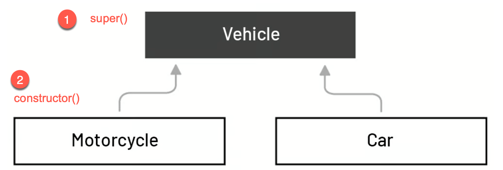

<style>
    .columns {
    display: flex;
  }
  .column {
    flex: 1;
    padding: 10px;
  }
  .column.large{
    flex: 2;
  }
  .small-font {
    font-size: 0.8em;
  }

  section > header,
section > footer {
  position: absolute;
  left: auto;
  right: 90px;
  height: 20px;
}

header {
  top: 30px;
}

footer {
  bottom: 30px;
}

</style>

# 第7章 類別、原型與繼承

## 涵蓋主題

- 物件與類別
- 繼承
- 原型與原型鏈


## 物件回顧

### 建立物件

- 物件包含屬性與方法。
- 使用物件字面值建立物件。

範例: 建立一個 `dog` 物件，包含屬性 `name` 和 `age`，以及方法 `bark`。

```javascript
const dog = {
  name: '小狗',
  age: 3,
  bark: function() {
    console.log('汪汪');
  }
};
```


### 存取物件的屬性與方法

- 使用點運算子 `.` 或方括號運算子 `[ ]` 存取屬性與方法。

```javascript
// 取得屬性
console.log(dog.name); // 小狗
console.log(dog['age']); // 3
// 呼叫方法
dog.bark(); // 汪汪
```


### 新增、刪除與檢查屬性

物件的屬性是動態的，可以在執行過程中新增或刪除。

範例: 新增與刪除 `dog` 物件的屬性。

```javascript
// 新增屬性
dog.color = '棕色';
console.log(dog.color); // 棕色
// 刪除屬性
delete dog.color;
console.log(dog.color); // undefined
```

### 檢查屬性是否存在

- 存取屬性時，如果屬性不存在，會回傳 `undefined`。
- 使用 `in` 運算子或 `hasOwnProperty` 方法檢查屬性是否存在。


範例: 檢查 `dog` 物件是否有 `name` 屬性。

```javascript
console.log('name' in dog); // true
console.log(dog.hasOwnProperty('name')); // true
```

## 類別與物件

### 使用類別建立物件

- 類別是建立物件的藍圖。
  - 物件是類別的實例。
  - 使用類別定義物件的屬性與方法。
  - 使用 `class` 關鍵字定義類別 (ES6)。

### 使用類別建構子建立物件

每個類別必須有一個建構子方法來初始化物件。
- 建構子方法是一個特殊的方法，用於初始化物件。
- 建構子方法沒有回傳值。

```javascript
class 類別名稱 {
  constructor(參數) {
    // 初始化物件
  }
}
```

### 使用 `new` 關鍵字建立物件

使用 `new` 關鍵字與類別名稱呼叫建構子方法。

```javascript
const 物件 = new 類別名稱(參數);
```

### 範例: 建立類別與物件

範例: 建立一個 `Dog` 類別，包含屬性 `name` 和 `age`，以及方法 `bark`。

```javascript
class Dog {
  constructor(name, age) {
    this.name = name;
    this.age = age;
  }

  bark() {
    console.log('汪汪');
  }
}
```

---

使用 `new` 關鍵字與類別名稱建立物件。

```javascript
// 1. Create a new object. 2. Initialize the object by calling the constructor. 
// 3. Assign the object to the variable dog.
const dog = new Dog('小狗', 3);
console.log(dog.name); // 小狗
console.log(dog.age); // 3
dog.bark(); // 汪汪
```

---


### 類別、物件與方法的命名慣例

**最佳實踐**: 類別、物件與方法名稱的命名慣例：
- 類別名稱: 應為名詞，採用混合大小寫，每個內部單字的首字母大寫。
    - 例如: Dog, ImageSprite
- 物件名稱: 應為名詞，採用混合大小寫，首字母小寫，每個內部單字的首字母大寫。
    - 例如: dog, imageSprite
- 方法名稱: 應為動詞，採用混合大小寫，首字母小寫，每個內部單字的首字母大寫。
    - 例如: run(); runFast(); getBackground();

    ### 私有屬性、設值器 (setters) 與取值器 (getters)

    #### 為什麼使用私有屬性？
    
    - **封裝**: 隱藏類別的實作細節。
        - 防止直接存取屬性。
    - 在存取屬性時可以加入驗證或邏輯。

#### 如何將屬性設為私有？

    - 使用 `#` 符號將屬性標註為私有。
    - 必須在類別中宣告私有屬性。
      - 公開(public)屬性則不需要宣告。

    範例: 將 `Dog` 類別的 `name` 和 `age` 屬性設為私有。

    ```javascript
    class Dog {
            #name;
            #age;
            constructor(name, age) {
                    // 直接存取私有屬性
                    this.#name = name;
                    this.#age = age;
                    this.bark = function() {
                            console.log('汪汪');
                    };
            }
    }
    ```

    #### 如何存取私有屬性？使用設值器 (Getter) 與存取器 (Setter)

    為私有屬性新增設值器與存取器方法。
    - 使用 `get` 和 `set` 關鍵字定義取值器與存取器方法。

    ```javascript
    class Dog {
            #name;
            #age;
            constructor(name, age) {...}
            // 取值器方法
            get name(){
                    return this.#name;
            }
            // 設值器方法
            set name(name){
                    this.#name = name;
            }
    }
    ```

#### 在設值器方法中加入驗證邏輯

    - 並在建構子中使用設值器方法初始化私有屬性。
    - 可以在設值器方法中加入驗證邏輯。

    ```javascript
    class Dog {
            #name;
            #age;
            constructor(name, age) {...}
            ...
            set age(age){
                    // 驗證 age 不為負數
                    age = age < 0 ? 0 : age;
                    console.log('年齡小於 0，設為 0。');
                    this.#age = age;
            }
    }
    ```
    ### 使用取值器與設值器方法存取私有屬性

    使用它們就像使用公開屬性一樣。
    - 不需要使用 `()` 呼叫取值器方法。
    - 使用賦值運算子 `=` 呼叫設值器方法。
    - 當存取屬性時，取值器與設值器方法會自動被呼叫。

    ```javascript
    const dog = new Dog('Dogy-Dogy', -1);
    console.log(dog.name); // Dogy-Dogy
    console.log(dog.age); // 0
    // 透過設值器方法設定名稱。
    dog.name = 'Dogy'; // 自動呼叫設值器方法
    console.log(dog.name); // Dogy; 自動呼叫取值器方法
    ```

### Quick Practice 

- 建立一個 `Car` 類別，包含屬性 `currentSpeed` 以及方法 `move()`。
- 將 `currentSpeed` 設為私有屬性，並使用設值器與取值器方法存取它。
- `currentSpeed` 的設值器方法必須驗證速度不為負數, 且最大值為 200。
- `move(speed)` 方法會更新 `currentSpeed` 的值為 `speed` 的值，並印出 `移動中，速度: speed km/h`。

<details>
<summary>解答</summary>

```javascript
class Car {
  #currentSpeed;
  constructor(currentSpeed) {
    this.currentSpeed = currentSpeed;
  }

  set currentSpeed(speed) {
    if (speed < 0) {
      console.log("速度不能為負數，設為 0。");
      speed = 0;
    } else if (speed > 200) {
      console.log("速度超過最大值 200，設為 200。");
      speed = 200;
    }
    this.#currentSpeed = speed;
  }

  get currentSpeed() {
    return this.#currentSpeed;
  }

  move() {
    console.log("移動中，速度:", this.currentSpeed, "km/h");
  }
}
```

</details>


## 繼承

- 繼承是一種從現有類別 (父類別) 建立新類別 (子類別) 的機制。
- 父類別表示子類別的通用屬性與方法。
  - 例如: 摩托車是一種車輛，因此摩托車繼承車輛的屬性與方法。
  - 車輛是父類別，摩托車是子類別。




### 繼承父類別

- 繼承父類別表示子類別擁有父類別的所有屬性與方法。
    - 此外，子類別可以新增自己的屬性與方法。
- 例如: 所有車輛都有共同的屬性與方法
    - 屬性: 顏色 (color)、當前速度 (current speed)、最大速度 (max speed)
    - 方法: 移動 (move)、加速 (accelerate)
- 摩托車, 也是一種車子, 有額外的屬性與方法
    - 屬性: 燃料 (fuel)
    - 方法: 單輪行駛 (wheelie)

### 建立子物件的過程

- 子類別使用 `extends` 關鍵字指定父類別。
- 子類別必須呼叫父類別的建構子 (`super()`) 來初始化父類別的屬性。
- 子類別再初始化自己的特有的屬性。

### 範例: 建立 `Vehicle` 類別與 `Motorcycle` 子類別

S1: 建立 `Vehicle` 類別，包含屬性 `color`、`currentSpeed`、`maxSpeed` 以及方法 `move()`。

```javascript
class Vehicle {
  constructor(color, currentSpeed, maxSpeed) {
    this.color = color;
    this.currentSpeed = currentSpeed;
    this.maxSpeed = maxSpeed;
  }

  move() {
    console.log("移動中，速度:", this.currentSpeed, "km/h");
  }
}
```

---

S2: 建立 `Motorcycle` 類別，繼承 `Vehicle` 類別，並新增屬性 `fuel` 與方法 `doWheelie()`。


撰寫 `Motorcycle` 的建構子 (Constructor):

1. 呼叫 `super()` 來初始化父類別的屬性 (子類別的責任)。
2. 初始化子類別的額外屬性。
3. 加入子類別的特有方法。

```javascript
class Motorcycle extends Vehicle {
  constructor(color, currentSpeed, maxSpeed, fuel) {
    // 呼叫父類別的建構子
    super(color, currentSpeed, maxSpeed);
    // 初始化子類別的屬性
    this.fuel = fuel;
  }

  doWheelie() {
    console.log("單輪行駛");
  }
}
```

參考 [ex_07_inheritance.js](http://lecture_notes/ch7/ex_07_inheritance.js) 獲取完整程式碼。

---

S4. 實體化 `Motorcycle` 類別，並使用 `move()` 與 `doWheelie()` 方法。

```javascript
let motor = new Motorcycle("紅色", 0, 200, "汽油");
console.log(motor.color); // 紅色
motor.accelerate(50); // 移動中，速度: 50 km/h
motor.move(); // 移動中，速度: 50 km/h
motor.doWheelie(); // 單輪行駛
```

## 實驗01: 建立一個從 Animal 類別繼承的 Rabbit 類別

[Lab01](lab_07_01.md)


## 原型與原型鏈 (Prototypes and Prototype Chain)

### 原型

- JavaScript 並不像 Java 等基於類別的語言那樣擁有類別。
- JavaScript 使用**物件**來實現繼承。
- 作為建立其他物件藍圖的物件稱為 **原型**。

### 範例: 檢示物件的原型。

打開瀏覽器的主控台，然後執行以下步驟：
1. 將 `Vehicle` 類別的定義複製到主控台中，以建立 `Vehicle` 類別。
2. 將 `Motorcycle` 類別的定義複製到主控台中，以建立 `Motorcycle` 類別。
3. 建立一個 `Motorcycle` 物件：`let motor1 = new Motorcycle('red', 0, 200, 'gasoline');`
4. 在主控台中輸入 `motor1`，以顯示該車輛物件。


---

- `motor1` 物件是一個 `Motorcycle` 原型的物件 (階層結構的第一層)。
- `motor1` 物件有四個屬性：`color`、`currentSpeed`、`maxSpeed` 和 `fuel`。
- `[[Prototype]]` 屬性表示 `motor1` 物件的父物件及其原型方法(Prototype methods)。
  - `motor1` 沒有其它的原型方法，除了建構子方法。
- `Vehicle` 是 `Motorcycle` 物件的父物件。
- `[[]]` 表示這是一個隱藏且內部的屬性，無法直接存取。

---


### 取得物件的原型

使用 `__proto__` 屬性或 Object 的原型方法 `Object.getPrototypeOf()` 來存取 `[[Prototype]]` 屬性。

範例: 取得 `motor1` 物件的 `[[Prototype]]` 屬性。

```javascript
console.log(motor1.__proto__); // 或
console.log(Object.getPrototypeOf(motor1));
```

### Quick Question

- `Vehicle` 物件的父物件是什麼？
- `Object` 物件的父物件是什麼？

<details>
<summary>解答</summary>

- `Vehicle` 物件的父物件是 `Object` 物件。
- `Object` 物件的父物件是 `null`。
- `Object` 物件是 JavaScript 中所有物件的根物件。
- `Object` 物件的 `[[Prototype]]` 屬性指向 `null`。

</details>


### 原型鏈 (Prototype Chain)

- JavaScript 使用原型鏈來實現繼承。
- 每個物件都有一個 `[[Prototype]]` 屬性，指向其原型物件。
- 形成一個物件鏈，稱為 **原型鏈**。
- 最頂層的原型是 `Object`，其 `[[Prototype]]` 指向 `null`。

`motor1` 物件的原型鏈如下：

```
motor1 -> Motorcycle.prototype -> Vehicle.prototype -> Object.prototype -> null
```

### 在原型鏈中尋找屬性或方法

- 當存取物件的屬性或方法時，JavaScript 會先在物件本身尋找。
- 如果找不到，則會在原型鏈中尋找。
  - 如果在原型鏈中找到，則會回傳該屬性或方法。
  - 如果在原型鏈中找不到，則會回傳 `undefined`。


### Quick Question

```js
let motor1 = new Motorcycle('red', 0, 200, 'gasoline');
motor1.move();
```

請問 `motor1.move()` 會呼叫那個原型的 `move()` 方法？


```javascript
class Vehicle {
  constructor(color, currentSpeed, maxSpeed) {
   ...
  }
  move() {...}
}
```

```javascript
class Motorcycle extends Vehicle {
  constructor(color, currentSpeed, maxSpeed, fuel) {
    super(...);
    ...
  }
  doWheelie() { ...}
}
```

### 使用原型鏈的優點

- 讓物件共享屬性與方法，節省記憶體空間。
- 讓物件動態地新增屬性與方法。

### 節省記憶體空間

- 當多個物件共享相同的屬性或方法時，JavaScript 只會在原型鏈中儲存一份。
- 範例: 兩隻狗 Daisy 和 Jack 共享相同的方法 `bark()`，但擁有不同的屬性值。


### 動態新增屬性與方法

- 可以在物件原型鏈中動態地新增屬性與方法。
- 只要是屬於這個原型的物件，都可以使用新增的屬性與方法。

### 範例: 在 `Vehicle` 原型中新增 `stop()` 方法
例如，我們在 `Vehicle` 原型中新增一個方法 `turbo()`，該原型是 `Motorcycle` 原型的父原型。
- 這將使所有 `Motorcycle` 的物件都擁有 `turbo()` 方法。

```javascript
let motor1 = new Motorcycle("red", 10, 200, "gasoline");
let motor2 = new Motorcycle("blue", 40, 120, "diesel");

//Get the prototype of the motor1 object
let motorcyclePrototype = Object.getPrototypeOf(motor1);
// get the prototype of the motorcyclePrototype object, which is the Vehicle object
let vehiclePrototype = Object.getPrototypeOf(motorcyclePrototype);
// add the turbo() method to the Vehicle object
vehiclePrototype.turbo = function(){
     console.log("Turbo() in Vehicle prototype");
    this.currentSpeed *= 2;
};
```

---

- 現在所有 `motor1` 和 `motor2` 物件都可以使用 `turbo()` 方法。

`motor1` 和 `motor2` 物件的原型鏈如下：

```
motor1 -> Motorcycle.prototype -> Vehicle.prototype -> Object.prototype -> null
motor2 / 
```

---

```javascript
console.log("motor1 current speed: ", motor1.currentSpeed); 
motor1.turbo();
console.log("motor1 speed after turning on turbo: ",motor1.currentSpeed);

console.log("motor2 current speed: ", motor2.currentSpeed); 
motor2.turbo();
console.log("motor2 speed after turing on turbo: ",motor2.currentSpeed);
```

---

輸出結果:

```
motor1 current speed:  10
Turbo() in Vehicle prototype
motor1 speed after turning on turbo:  20
motor2 current speed:  40
Turbo() in Vehicle prototype
motor2 speed after turning on turbo:  80
```

See [ex_07_prototype_add_method.js](./ex_07_prototype_add_method.js) for the complete code.

### 小結


1. 相同原型的物件共享相同的方法，但擁有各自的屬性值。
2. JavaScript 可以在執行期間向原型物件新增方法，以擴展物件的行為，為開發者提供更大靈活性。


## 總結

- **物件與類別**: 類別是建立物件的藍圖。
- **繼承**: 子類別繼承父類別的屬性與方法。
- **原型與原型鏈**: JavaScript 使用原型實現繼承，形成原型鏈。
  - 加入方法到原型鏈中後，所有物件都可以使用這些方法


<script>
    const h2s = document.querySelectorAll('h2');
    h2s.forEach(function(h2, idx){
        h2.innerHTML = `<span class="small-font">${idx + 1}</span> ${h2.innerHTML}`
    })
</script>
