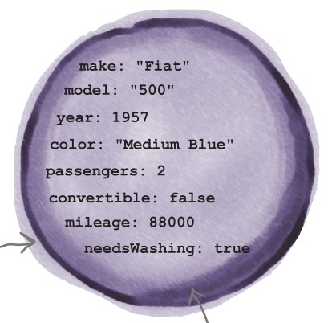

<style>
    .columns {
    display: flex;
  }
  .column {
    flex: 1;
    padding: 10px;
  }
  .column.large{
    flex: 2;
  }
  .small-font {
    font-size: 0.8em;
  }

  section > header,
section > footer {
  position: absolute;
  left: auto;
  right: 90px;
  height: 20px;
}

header {
  top: 30px;
}

footer {
  bottom: 30px;
}

</style>

# 第7章 類別、原型與繼承: <br/> Part 1: 物件

## 課程大綱

- 瞭解物件的概念
- 使用物件字面語法(object literal)和建構子(object constructor)來建立物件
- 存取與修改物件屬性
- 建立物件陣列
- 巢狀物件與陣列

## 物件 (Objects)

物件是一種包含**屬性**與**方法**的集合的資料結構。
- 屬性: 鍵值對 (key-value pair)。
- 方法: 可以存取物件屬性以執行任務的函式。

物件是現實世界實體的抽象化。
- 可用於在程式中建模現實世界的實體。

物件可以從另一個物件繼承屬性與方法以擴展其功能。
- 使開發者更容易維護與擴展程式碼。


### 範例: 動物 、狗 、與貓  的物件階層結構

- 狗 (Dog) 和貓 (Cat) 繼承自動物 (Animal) 物件的屬性與方法。

<!--  -->


<div class="small-font">

<!-- Fig Source: [Object-Oriented JavaScript Inheritance](https://desalasworks.com/article/object-oriented-javascript-inheritance/) -->

See more about objects in the MDN web docs: [JavaScript object basics - Learn web development | MDN](https://developer.mozilla.org/en-US/docs/Learn/JavaScript/Objects/Basics)

</div>


## 建立物件的方式

### 建立物件的三種方式

在 JavaScript 中，有三種方式可以建立物件：
- 物件字面語法 (object literal)，
- 物件建構子 (object constructor)，以及
- `Object.create()` 方法 (本章未涵蓋)。

## 物件字面語法 (object literal)
使用物件字面語法 `{}` 以宣告的方式建立物件。
- 缺點：一次只能建立一個物件。

### 範例：使用物件字面語法建立 FIAT 500 車輛物件


<div class="columns">
<div>

1. 現實世界中的 FIAT 500：



</div>
<div>

2. 找出 FIAT 500 的屬性與方法, 將其抽象化為物件。
- 屬性:
  - 製造商 (maker), 型號 (model), 年份 (year), 顏色 (color), 乘客數量 (passengers), 里程數 (mileage)
- 方法:
  - 向前行駛 (drive_forward), 向後行駛 (drive_backward)

</div>
</div>


<!-- Fig source: [1] -->

---

<!-- Fig source: [1] -->

3. 使用物件字面語法建立 FIAT 500 車輛物件。

```javascript
let fiat500 = {
  // properties
  maker: 'Fiat', // key: value
  model: '500',
  year: 1957,
  color: 'Blue',
  passengers: 2,
  mileage: 88000,
  // methods
  // key with an anonymous function
  drive_forward: function(distance_miles) {
    console.log('Driving forward');
    // use the "this" keyword to refer to the object itself
    this.mileage += distance_miles;  
  }, // key: function() { method body } or function object

  // named function 
  drive_backward() {
    console.log('Driving backward');
  }
}
```

---

在上述的物件字面語法中：
- 屬性是以冒號 `:` 分隔的 鍵-值 對。
- 方法是以冒號 `:` 分隔的 鍵-函式 對。
  - 也可以使用命名函式來定義方法。
- `this` 關鍵字用於指向物件本身，以存取物件的屬性與方法。

## 物件建構子：用於建立多個物件的模板

物件字面語法適合用於建立單一物件。

限制：
- 當需要建立多個具有相同屬性與方法的物件時，容易出錯。
  - 必須為每個物件重複撰寫相同的屬性與方法。

使用物件建構子來從物件模板（類別）建立**多個物件**。

物件建構子是一個用於初始化物件屬性的函式。

在 ES6 中，使用 `class` 關鍵字來定義物件建構子。

### 範例：使用 ES6 定義 FIAT500 類別

```javascript
class FIAT500 {
  // 建構子函式
  constructor(maker, model, year, color, passengers, mileage) {
    this.maker = maker; // 為物件新增屬性
    this.model = model;
    this.year = year;
    this.color = color;
    this.passengers = passengers;
    this.mileage = mileage;
  }
  // 方法：命名函式
  drive_forward(distance_miles) {
    console.log('向前行駛');
    this.mileage += distance_miles;
  }
  drive_backward() {
    console.log('向後行駛');
  }
}
```

在上述程式碼中：
- `constructor` 函式用於初始化物件的屬性。
- 可透建構子函式的參數來初始化物件屬性。
- 在建構子函式中，使用 `this` 關鍵字來指向物件本身。
- 使用點運算子 `.` 存取物件的屬性與方法。
- 定義的方法可以直接在類別內部作為命名函式。

### 快速練習

- 定義一個 `Car` 類別，並新增以下屬性與方法：
  - 屬性：`brand`、`model`、`year`、`color`
  - 方法：
  - `start()`: 在控制台輸出 "Car started."
  - `stop()`: 在控制台輸出 "Car stopped."
  - `info()`: 在控制台輸出車輛的品牌、型號、年份與顏色。
- 使用 Class 語法
  

<details>
<summary>點擊查看答案</summary>

```javascript
class Car {
  constructor(brand, model, year, color) {
    this.brand = brand;
    this.model = model;
    this.year = year;
    this.color = color;
  }
  start() {
    console.log('Car started.');
  }
  stop() {
    console.log('Car stopped.');
  }
  info() {
    console.log(`Brand: ${this.brand}, Model: ${this.model}, Year: ${this.year}, Color: ${this.color}`);
  }
}
```

</details>

### 建立類別的步驟：總結


1. 使用 `class` 關鍵字定義類別。
2. 定義 `constructor` 函式以初始化物件的屬性。
  - 所有必要的屬性都在建構子函式中定義。
3. 定義類別的方法。
  - 方法可以是命名函式或匿名函式。


## 使用類別建構子建立物件

使用類別定義，我們可以透過 `new` 關鍵字建立多個相同類別的物件。

範例：建立 myFiat500 和 yourFIAT500 物件。

```javascript
let myFiat = new FIAT500('Fiat', '500', 1957, 'Blue', 2, 6000);
let yourFiat = new FIAT500('Fiat', '500', 1957, 'Red', 2, 80000);
```

注意：
- 還有其他建立物件的方法，例如 `Object.create()` 方法。
- 將在第7章討論 `prototype` 概念後再介紹這些方法。
- 更多關於類別的資訊請參考 [使用類別 - JavaScript | MDN](https://developer.mozilla.org/en-US/docs/Web/JavaScript/Guide/Using_classes)


## 物件的屬性的存取與修改

### 存取物件屬性

使用點運算子 `.` 或方括號 `[]` 來存取物件的屬性（或鍵名）。

範例：記錄 `myFiat` 物件的里程屬性。

```javascript
console.log(myFiat.mileage);  // 6000
// or 
console.log(myFiat['mileage']);  
```

### 新增物件的屬性

JavaScript 物件是動態的。
- 物件建立後，還可新增、刪除和更新屬性（或方法）。


當你指定一個**新的鍵值對**，如果該物件中不存在，JavaScript 將會將新屬性添加到該物件中。


### 範例: 動態新增屬性到物件

- 新增 `fuel` 屬性到 `myFiat` 物件中。
```javascript
myFiat.fuel = 'gasoline';   // 新增一個屬性
console.log(myFiat.fuel);  // gasoline
```

- 新增 `origin` 屬性到 `fruit` 陣列物件中。
   
```js
let fruit = ['apple', 'banana', 'orange'];
fruit['origin'] = ['Taiwan', 'USA', 'Japan'];
// fruit.origin = ['Taiwan', 'USA', 'Japan']; 也可寫成這樣
```

### 移除物件的屬性

使用 `delete` 運算子來移除物件的屬性。

```javascript
delete myFiat.fuel;  // 移除 fuel 屬性
console.log(myFiat);  // 物件中沒有 fuel 屬性。
```

<!-- Output:
```js
FIAT500 {
  maker: 'Fiat',
  model: '500',
  year: 1957,
  color: 'Blue',
  passengers: 2,
  mileage: 88100 
}
``` -->

### 快速練習

1. 建立 Cat 類別並建立一個名為 `myCat` 的貓物件，具有以下屬性：
- name: "Fluffy"
- age: 3
- color: "white"
- breed: "Persian"
  
2. 顯示 `myCat` 物件的所有屬性值。提示: 使用 for-in 迴圈。

3. 新增 `weight` 屬性到 `myCat` 物件中，並將其值設為 4.5。

<details>
<summary>點擊以查看答案</summary>

```javascript
class Cat {
  constructor(name, age, color, breed) {
    this.name = name;
    this.age = age;
    this.color = color;
    this.breed = breed;
  }
}
// 建立 myCat 物件

let myCat = new Cat('Fluffy', 3, 'white', 'Persian');
// 顯示 myCat 物件的所有屬性值
for (let key in myCat) {
  console.log(`${key}: ${myCat[key]}`);
}
// 新增 weight 屬性
myCat.weight = 4.5;
console.log(myCat.weight);  // 4.5
```
</details>

## 物件與陣列的操作

### 物件的陣列

處理物件陣列是 JavaScript 程式設計中的常見任務。

典型情境:
- 查詢具有相同 class 名稱的 HTML 元素物件(HTMLElement objects) 並將它們存儲為物件陣列。
- 當在頁面上點擊按上傳檔案時, 取得多個 File 物件 並將它們存儲為物件陣列。

### 情境：建立物件陣列

範例: 建立 `cars` 陣列，包含 2 個 FIAT500 物件。

<div class="columns">
<div class="column">

使用物件字面語法建立 FIAT500 物件陣列：
  
```javascript
let cars = [{
    maker: 'Fiat', 
    model: '500',
    year: 1957,
    color: 'Blue',
    passengers: 2,
    mileage: 6000
  },
  {
    maker: 'Fiat',
    ...
  }
];
```
</div>
<div class="column">

或者, 使用類別建構子建立 FIAT500 物件陣列：

```javascript
let cars = [new FIAT500('Fiat', '500', 1957, 'Blue', 2, 6000),
            new FIAT500('Fiat', '500', 1957, 'Red', 2, 80000)];
```
</div>
</div>


### 情境: 處理 HTMLElement Objects 陣列 

在底下的 HTML 文件中，為每個 radio button 新增一個 click 事件監聽器。
- 頁面上有三個 radio button，分別為 Huey、Dewey 和 Louie。

當 radio button 被點擊時，顯示 radio button 的值。

將值顯示在 `<p>` 元素中，其 id 為 `display`。


---

<div class="columns">
  <div class="column large">

```html
<fieldset>
        <legend>Select a maintenance drone:</legend>
      
        <div>
          <input type="radio" id="huey" name="drone" value="huey" checked />
          <label for="huey">Huey</label>
        </div>
      
        <div>
          <input type="radio" id="dewey" name="drone" value="dewey" />
          <label for="dewey">Dewey</label>
        </div>
      
        <div>
          <input type="radio" id="louie" name="drone" value="louie" />
          <label for="louie">Louie</label>
        </div>
      </fieldset>
    <div>
       Your selection: <p id="display"></p>
    </div>
```
  </div>

  <div class="column">
    
    
  </div>
</div>


---

做法:
- 首先, 取得所有 radio button 元素並存入陣列中。
  - 使用 `document.getElementsByName()` 方法取得 radio button 元素。
  - 回傳的資料型態: NodeList。
- 然後, 迭代陣列並為每個 radio button 新增 click 事件監聽器。
  - 監聽器函式取得 radio button 的值並顯示在 `<p>` 元素中。
    - 使用 `e.target.value` 取得 radio button 的值。

---

```javascript
let drones = document.getElementsByName('drone');

// NodeList(3) [input#huey, input#dewey, input#louie], an array of input elements
console.log(drones);  

// iterate the array
drones.forEach( drone => {
    // add a click event listener to each radio button
    drone.addEventListener('click', function(e){
        // get the radio button's value
        let value = e.target.value;
        // show the value in the <p> element
        document.getElementById('display').textContent = value;
    });
})
```

See full code in the [ex_07_array_of_objects.html](ex_07_array_of_objects.html) file.

---

注意事項：
- 這不是處理單選按鈕選擇的最佳方式。
- 更簡潔的做法: 將點擊事件監聽器新增到單選按鈕的父元素
  - 因為事件可以從單選按鈕 浮升 到父元素，讓我們在父元素上處理事件。

### 有陣列屬性的物件
可以將陣列作為物件的屬性。

範例：建立一個 `myFiat` 物件，並將 `gear` 屬性設為包含以下值的陣列：1, 2, 3, 4, 5 和 R。

```javascript
let myFiat = {
  maker: 'Fiat',
  model: '500',
  year: 1957,
  color: 'Blue',
  passengers: 2,
  mileage: 6000,
  gear: [1, 2, 3, 4, 5, 'R']
}
```

要顯示 `myFiat` 物件的第一個檔位值：

```javascript
console.log(myFiat.gear[0]);  // 1
```


### 巢狀物件 (Nested objects)

物件也可以是屬性值
- 這樣會產生巢狀物件 (nested object) 的結構。
- 用來描述物件間 has-a 的關係。


範例：建立 `myFiat` 物件，並將 `engine` 屬性設為物件。`engine` 物件具有 `cylinder` 和 `power` 屬性。
- `myFiat` 物件有一個 `engine` 屬性，該屬性是一個物件。

---


<div class="columns">
  <div class="column large">

```javascript
let myFiat = {
    maker: 'Fiat',
    model: '500',
    year: 1957,
    color: 'Blue',
    passengers: 2,
    mileage: 6000,
    engine: {
        cylinder: 4,
        power: 22,
        // engine's method
        turbo(){
            console.log('Turbo is on' + this.power * 1.2);
        }
    }
}
```

  </div>

  <div class="column">

  
  
  </div>

</div>

---

建構出來的 `myFiat` 物件如下：


##  總結


- 建立物件的三種方式: 物件字面語法 (object literal)、物件建構子 (object constructor)、`Object.create()` 方法。
- 物件的屬性的存取與修改: 使用點運算子 `.` 或方括號 `[]` 來存取物件的屬性（或鍵名）。
- `this` 關鍵字用於指向物件本身，以存取物件的屬性與方法。
- 物件與陣列的操作: 物件陣列、物件有陣列屬性、巢狀物件。

## References 

[1] Eric T. Freeman and Elisabeth Robson, 2014. Head First JavaScript Programming: A Brain-Friendly Guide, O'Reilly Media


<script src="../h2_numbering.js">
</script>


  
