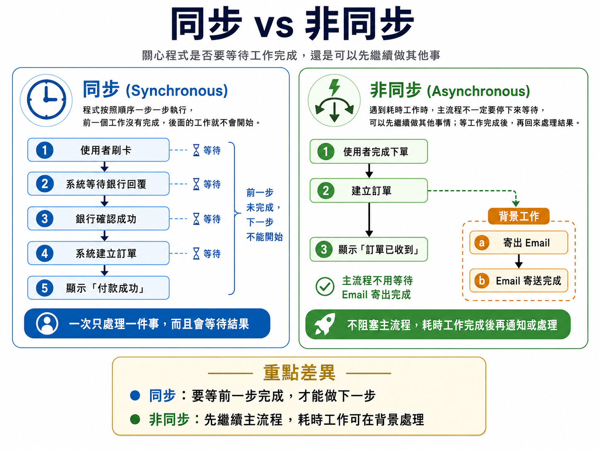
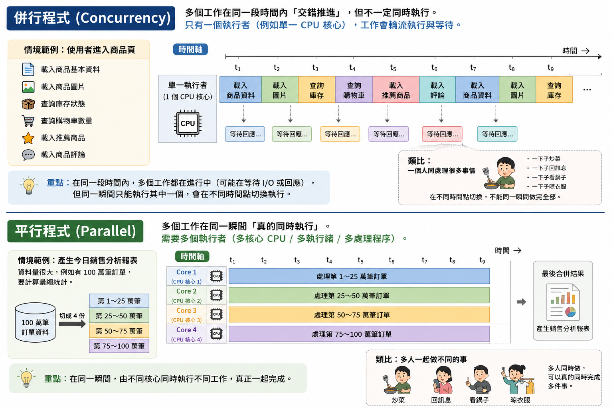
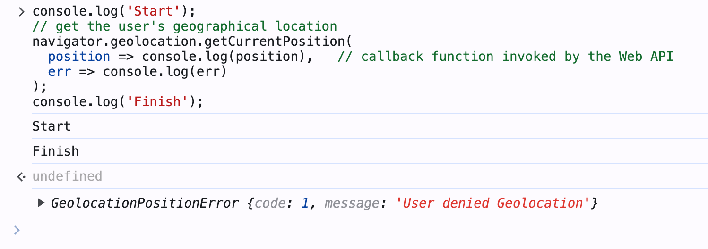
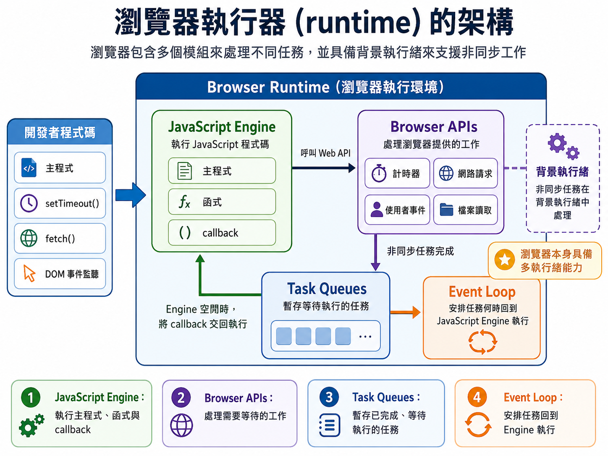
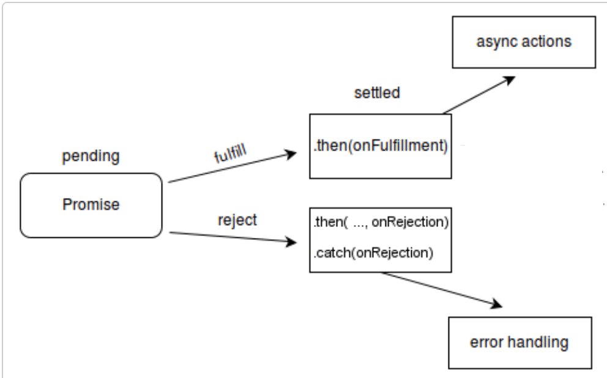
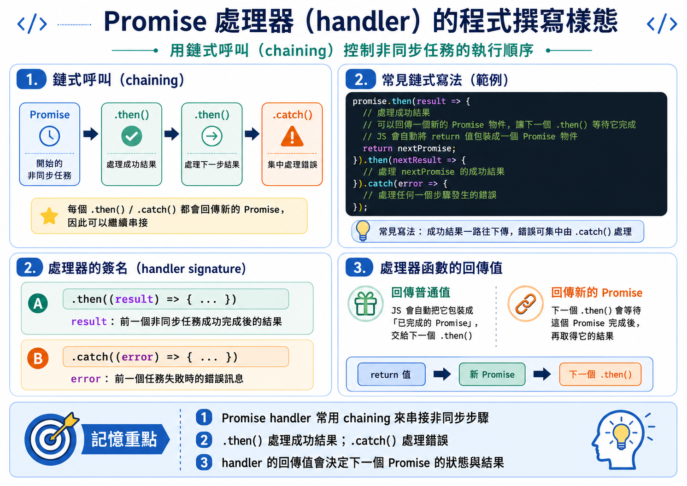
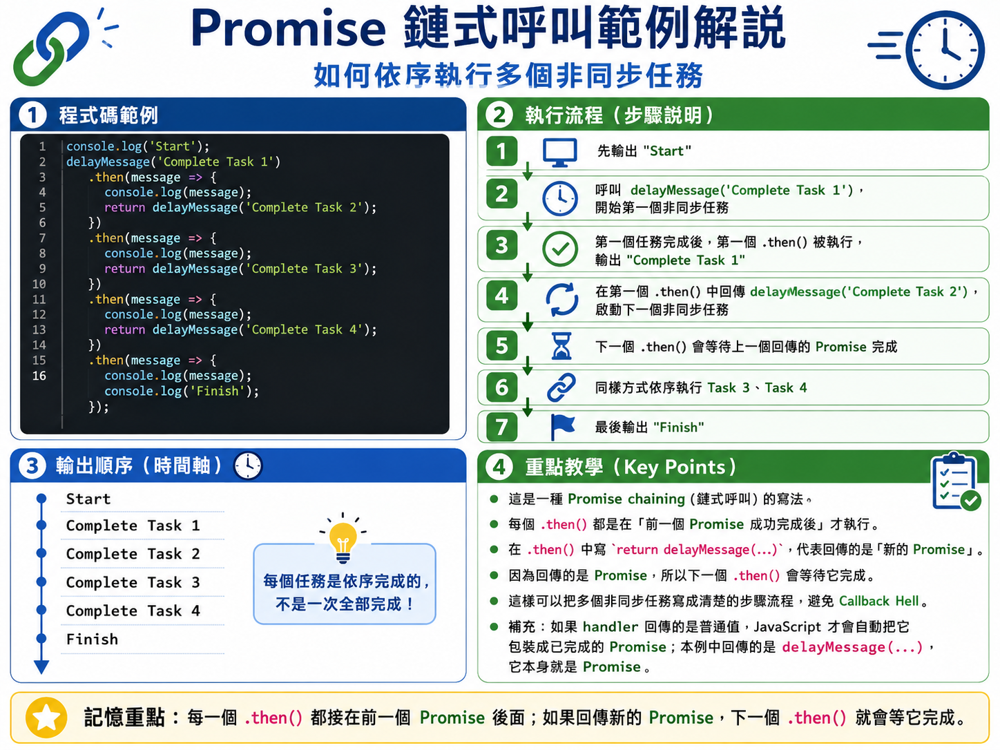

# Chapter A1 非同步程式設計

## 同步 vs 非同步、

關心程式是否要等待工作完成，還是可以先繼續做其他事。

### 同步(synchronous)程式

程式會按照順序一步一步執行，前一個工作沒有完成，後面的工作就不會開始。

Example:

使用者按下「確認付款」後，系統必須先確認付款結果，才能繼續建立訂單。

```
使用者刷卡
→ 系統等待銀行回覆
→ 銀行確認成功
→ 系統建立訂單
→ 顯示「付款成功」
```

在前一步還沒完成前，下一步不能開始。例如還沒確認庫存，就不能先建立訂單。

重點概念: **一次只處理一件事，而且會等待結果。**


### 非同步程式（Asynchronous Programming）

非同步指的是：遇到耗時工作時，程式不一定要停下來等它完成，可以先繼續做其他事情。等耗時工作完成後
再回來處理它的結果。

電子商務情境：使用者完成下單後，網站先立即顯示「訂單已收到」，不同等 Email 寄出。

如果是同步程式:

```
使用者完成下單 -> 系統 Email 寄出完成 -> 顯示「訂單已收到」 -> 完成下單
```

如果是非同步程式:

```
使用者完成下單 → 建立訂單 → 顯示訂單已收到 (主程式)
                         ↓
                   背景寄出 Email
```

主流程不用一直停在那裡等待信件寄出或外部系統回應。等這些耗時工作完成後，再更新狀態或通知使用者。

重點概念: **不阻塞主流程，耗時工作完成後再通知或回來處理。**



## 併行(concurrency) vs 平行(parallel)程式

- 同步／非同步主要描述「程式遇到工作時，要不要等待」。

- 併行／平行主要描述「多個工作如何被處理」。
  - 併行強調多個工作在同一段時間內交錯推進；平行則強調多個工作在同一時間點真的同時執行。

### 併行程式（Concurrent Programming）

併行指的是：在同一段時間內，**有多個工作都在進行中**，但不一定真的同時執行。
系統只有一個 worker（例如一個 CPU 核心），所以這些工作會輪流切換執行。

Example:

使用者打開某個商品頁時，系統可能同時處理多件事,例如載入商品基本資料、載入商品圖片、查詢庫存狀態、查詢購物車數量、載入推薦商品和載入商品評論等。

這些任務不一定要一個完成後才做下一個。它們可以在同一段時間內被啟動、等待、回應與更新畫面。

```
使用者進入商品頁
  ↓
  ├─ 載入商品基本資料 ──→ 更新商品名稱與價格
  ├─ 載入商品圖片     ──→ 顯示圖片
  ├─ 查詢庫存狀態     ──→ 顯示「尚有庫存」
  ├─ 查詢購物車數量   ──→ 更新購物車圖示
```


這些事情在「時間上重疊」，所以是併行。
- 只有一個人，所以在同一瞬間只能做一件事，但在不同的時間點切換工作。
  - 沒有執行的工作會等待，直到輪到它時，才會「繼續」執行。

重點概念: **多個工作在同一段時間內交錯推進，但不一定同時執行。**


### 平行程式（Parallel Programming）

多個工作真的在同一時間被執行，通常需要多核心 CPU、多執行緒(thread)、多處理程序(process)。

Example: 

假設電商系統要產生一份「今日銷售分析報表」，資料量很大，例如有 100 萬筆訂單。

如果使用單核心、單一工作流程，可能是：

```
CPU Core 1：
處理第 1 筆訂單
↓
處理第 2 筆訂單
↓
處理第 3 筆訂單
↓
……
↓
處理第 100 萬筆訂單
```

如果改成平行程式，可以把 100 萬筆訂單切成多份，交給同一台電腦中的不同 CPU 核心同時處理。

如這台電腦有 4 個 CPU 核心：

```
同一台電腦內：

Core 1：處理第 1～25 萬筆訂單
Core 2：處理第 25～50 萬筆訂單
Core 3：處理第 50～75 萬筆訂單
Core 4：處理第 75～100 萬筆訂單
```

這些工作不是輪流切換，而是在同一瞬間由不同資源真正一起執行。

重點概念: **多個工作在同一瞬間真的同時執行。**



| 概念                        | 核心意義                                         | 主要關心的問題              | 電子商務情境例子                                         | 是否等待？ | 是否真的同時執行？ | 關鍵判斷                 |
| ------------------------- | -------------------------------------------- | -------------------- | ------------------------------------------------ | ----- | --------- | -------------------- |
| **同步程式**<br>Synchronous   | 程式按照順序一步一步執行，前一步完成後，下一步才開始。                  | 目前工作完成前，後面的工作能不能繼續？  | 使用者刷卡後，系統必須等待銀行確認成功，才能建立訂單並顯示「付款成功」。             | 會等待   | 否         | **一件做完，才做下一件。**      |
| **非同步程式**<br>Asynchronous | 遇到耗時工作時，主流程不必停下來等待，可以先繼續執行；等耗時工作完成後，再回來處理結果。 | 耗時工作是否會阻塞主流程？        | 使用者完成下單後，系統先建立訂單並顯示「訂單已收到」，Email 寄送則在背景執行。       | 不一定等待 | 不一定       | **主流程不被耗時工作卡住。**     |
| **併行程式**<br>Concurrent    | 在同一段時間內，有多個工作都在進行中，但不一定真的同時執行。工作可能是交錯推進。     | 多個工作能不能在同一段時間內一起被推進？ | 單一使用者進入商品頁後，系統同時推進多個任務：載入商品資料、圖片、庫存、購物車數量與評論。    | 不一定等待 | 不一定       | **多個工作在同一段時間內交錯進行。** |
| **平行程式**<br>Parallel      | 多個工作在同一時間真的同時執行，通常需要多核心 CPU、多執行緒或多處理程序。      | 多個工作是否真的在同一瞬間執行？     | 同一台電腦用 4 個 CPU 核心，同時計算 100 萬筆訂單的不同區段，最後再合併成銷售報表。 | 不一定等待 | 是         | **多個核心真的同時工作。**      |

## JS 中的非同步程式設計

非同步程式設計: 在不阻塞主執行緒的情況下執行任務的程式設計
- 當主程式遇到需要等待的任務（例如網路請求、檔案讀取、計時器等）時，不會停下來等它完成，
  - 而是繼續執行後面的程式碼，等到等待的任務完成後，再回來處理它的結果。

- 非同步任務(需要等待的任務)會由交給瀏覽器在背景執行。
- JS 引擎會繼續在主執行緒中執行下一個任務。

範例: 取得使用者裝置的地理位置

```javascript
console.log('Start');
// 取得使用者的地理位置
navigator.geolocation.getCurrentPosition(
  position => console.log(position),   // 由 Web API 呼叫的 callback function
  err => console.log(err)
);
console.log('Finish');
```

當你在瀏覽器中執行上述程式碼時，會看到以下輸出：

```
Start
Finish
// 使用者的地理位置或錯誤訊息
```

當 `navigator.geolocation.getCurrentPosition` 在背景由**瀏覽器執行**時，**JS 引擎**會繼續在主執行緒中執行下一個任務。

因此，`console.log('Finish')` 會在 `getCurrentPosition` 的 callback function 被呼叫之前執行。




## 非同步程式是由誰執行的？

從前述範例引出一個有趣的問題：
- 取得使用者地理位置的非同步任務是由誰執行的？
- 是 **JS 引擎**還是**瀏覽器**？

### JS 引擎與瀏覽器環境的分工

分工方式:
- JS 執行 JavaScript 程式碼
  - 執行函式、變數運算、物件操作、執行 callback function 等等。
- 瀏覽器環境 提供 非同步功能與排程
  - setTimeout、網路請求、DOM 事件、計時器、事件佇列等。

### 瀏覽器執行器(runtime)的架構

瀏覽器內部包含多個模組來處理不同的任務。
- 瀏覽器本身具備多執行緒的能力。

開發者透過 呼叫 Web API（例如 setTimeout、fetch、DOM 事件等）來啟動非同步任務，這些任務會在瀏覽器的背景執行緒中處理。


| 模組                    | 主要角色              | 在非同步程式中的功能                                                 |
| --------------------- | ----------------- | ---------------------------------------------------------- |
| **JavaScript Engine** | 執行 JavaScript 程式碼 | 負責執行主程式、函式、callback，以及非同步任務完成後要執行的後續程式碼。                   |
| **Browser APIs**      | 處理瀏覽器提供的工作        | 負責處理需要等待的工作，例如計時器、網路請求、使用者事件、檔案讀取等。                        |
| **Task Queues**       | 暫存等待執行的任務         | 當非同步任務完成後，後續要執行的工作會先被放入佇列等待。                               |
| **Event Loop**        | 安排任務執行順序          | 檢查 JavaScript Engine 是否空閒，並把佇列中的任務交回 JavaScript Engine 執行。 |

在瀏覽器中執行 JavaScript 時，Browser Runtime 不只有 JavaScript Engine。
- JavaScript Engine 負責執行 JavaScript 程式碼；
- Browser APIs 負責處理瀏覽器提供的工作，例如網路請求、計時器與使用者事件。
- Task Queues: 當這些非同步工作完成後，後續要執行的任務會先進入 Task Queues，
- Event Loop: 再由 Event Loop 判斷 JavaScript Engine 是否空閒，並安排任務回到 JavaScript Engine 執行。




## 非同步程式設計（Asynchronous Programming）

JS 中，撰寫非同步程式碼有三種方式：
- 回呼函式（Callbacks）
- 承諾物件（Promises）
- async/await 關鍵字

這三種方式皆有其優缺點，適用於不同的情境。

## 回呼函式（Callbacks）

callback 適合用在「事件通知」或「簡單回呼」

### 情境一：事件驅動

非同步動作: 當使用者未來某個時間點點擊按鈕時，請執行這個函式。

點擊按鈕後顯示訊息：

```javascript
// 取得按鈕元素
const button = document.querySelector('button');
// 為按鈕添加點擊事件的回呼函式
button.addEventListener('click', () => {
  alert('按鈕被點擊了！');
});
```


### 情境二：簡單回呼

計時器

非同步動作: 時間到了，請執行這個函式。

```js
console.log('Hi there!'); 
setTimeout(function() {
  console.log("等待已過三秒，執行完成");
}, 3000);
console.log('Please wait'); 
```

上述程式碼的輸出為：

```
Hi there!
Please wait
// 三秒後
等待已過三秒，執行完成
```

### 回呼地獄（Callback Hell）: 回呼函式的限制

當你想用回呼函式**依序**執行多個非同步任務時，你的程式碼變成「多層巢狀」的結構，這就是所謂的「回呼地獄」。

例如有以下多個非同步任務，需要依序執行：
- 每秒輸出一次訊息，持續四秒

```
Start -> Task 1 (等待 1 秒，輸出訊息) 
        -> Task 2 (等待 1 秒，輸出訊息) 
            -> Task 3 (等待 1 秒，輸出訊息) 
                -> Task 4 (等待 1 秒，輸出訊息) -> Finish
```

使用回呼函式實現 (examples/ex_A1_03.js)：

```javascript
console.log('Start');
setTimeout(() => {
    // Task 1 的 callback fun
    console.log('Complete Task 1');
    // 在 Task 1 的 callback 中啟動 Task 2
    setTimeout(() => {
        // Task 2 的 callback function
        console.log('Complete Task 2');
        // 在 Task 2 的 callback 中啟動 Task 3
        setTimeout(() => {
            // Task 3 的 callback function
            console.log('Complete Task 3');
            // 在 Task 3 的 callback 中啟動 Task 4
            setTimeout(() => {
                console.log('Complete Task 4');
                console.log('Finish');
            }, 1000);
        }, 1000);
    }, 1000);
}, 1000);
```

輸出結果:

```
'Start'
'Complete Task 1'
'Complete Task 2'
'Complete Task 3'
'Complete Task 4'
'Finish'
```

### Callback Hell 造成維護上的問題

| 問題         | 說明                         |
| ---------- | -------------------------- |
| **巢狀太深**   | 程式不斷往右縮排，閱讀困難。             |
| **流程不清楚**  | 很難一眼看出主要流程是什麼。             |
| **維護困難**   | 要新增、刪除或調整步驟時，容易牽動很多層。      |
| **可讀性降低**  | 程式碼結構不像「步驟流程」，而像「層層包住的迷宮」。 |
| **錯誤處理分散** | 每一層 callback 都可能要處理錯誤。     |


### Lab 

[理解 JavaScript 中的 Callback Hell](labs/lab_01.md)


## 承諾物件（Promises）

### 為什麼需要 Promises (承諾物件)？

當我們要依序執行多個非同步任務時，更佳的方案是使用 Promises
- Promises 可以讓我們把非同步任務的邏輯寫得更清晰、更接近「步驟流程」的結構。
- 避免回呼地獄的問題

### 如何使用 Promises 執行非同步任務？

在 JavaScript 中，Promise 是用來表示「某個非同步工作未來會完成或失敗」的物件


#### 沒有 「點餐號碼牌」  的點餐流程

Promise 的概念可以用「餐廳點餐」的流程來說明：

假設你在餐廳點餐:

如果沒有「點餐號碼牌」，你的流程可能是：

```
我站在櫃台前
一直等店員查完
查完後才繼續做其他事
```

#### 使用「點餐號碼牌」 後的點餐流程

使用「點餐號碼牌」，你的流程變成:

```
我向店員點餐
↓
店員給我一張號碼牌 (Promise)
↓
我不用站在櫃台前乾等
↓
我可以先去找座位、滑手機、聊天
↓
餐點做好後，店員叫號
↓
我再回來拿餐
```

#### Browser 執行非同步任務的流程

對應到 JavaScript 的執行:

```
主程式呼叫非同步 API
   ↓
瀏覽器接手執行需要等待的工作
   ↓
API 先回傳 Promise 給主程式
   ↓
主程式不等待真正結果，繼續往下執行
   ↓
瀏覽器完成非同步工作
   ↓
非同步工作會設定 Promise 物件的狀態
Promise 物件內存放「執行結果或錯誤」
   ↓
瀏覽器安排「處理結果或錯誤的程式」放入「等待執行的佇列」
   ↓
JS Engine 自 「等待執行的佇列」 取得「處理結果或錯誤的程式」，並執行它

```

重點: 
> Promise 代表未來結果；主程式不等待；結果完成後，再安排處理結果或錯誤的程式執行。

### Promise 物件的狀態

一個 Promise 物件有以下幾種可能狀態：

- 等待中（Pending）：Promise 物件的初始狀態。
  - 表示非同步任務尚未完成。
- 已定案（Settled）：Promise 物件已經被完成或拒絕。
  - 已完成（Fulfilled）：Promise 物件被完成（resolved）。
    - 表示非同步任務已成功完成。
  - 已拒絕（Rejected）：Promise 物件被拒絕。
    - 表示非同步任務失敗。



可以依照 Promise 物件的狀態來決定要執行的處理函數(callback function)
- 使用 Promise 物件的 `.then()` 方法來註冊「成功完成」的處理函數。
- 使用 `.catch()` 方法來註冊「失敗」的處理函數

## 使用 Promise 執行非同步任務

典型情境：載入商品資料

使用者進入某個商品頁時，網頁需要向伺服器取得商品名稱、價格與庫存狀態

我們使用 `fetch` API 來執行網路請求

`fetch` 會回傳一個 Promise 物件，代表未來會完成的網路請求結果。
我們要使用 `.then()` 來註冊處理成功結果的函式，使用 `.catch()` 來註冊處理錯誤的函式。

使用 JSONPlaceholder 模擬 API 伺服器，取得商品資料：

```javascript
// examples/ex_A1_04.js

console.log("開始載入商品頁");

// 使用 fetch() 向伺服器請求商品資料
// fetch() 會回傳一個 Promise 物件，代表未來會完成的網路請求結果
const productPromise = fetch("https://jsonplaceholder.typicode.com/posts/1");

// 註冊處理成功結果的函式，使用 .then() 方法
// 註冊處理錯誤的函式，使用 .catch() 方法
productPromise
  // 取得 伺服器回傳的 Response 物件，並轉換成 JSON 格式，回傳結果 （這也是一個非同步任務，會回傳一個新的 Promise 物件）
  .then(response => response.json())
  // 取得轉換後的商品資料，再印出來
  .then(productData => {
    console.log("商品資料載入成功");
    console.log(productData);
  })
  // 如果在任何一個步驟發生錯誤，會被 .catch() 捕捉到
  .catch(error => {
    console.log("商品資料載入失敗");
    console.log(error);
  });

console.log("fetch() 已經被呼叫");
console.log("主程式繼續執行，不等待商品資料回來");
console.log("商品頁其他內容繼續載入");
```

可能的輸出結果：

```
開始載入商品頁
fetch() 已經被呼叫
主程式繼續執行，不等待商品資料回來
商品頁其他內容繼續載入
// 商品資料載入成功
{
  userId: 1,
  id: 1,
  title: "sunt aut facere repellat provident occaecati excepturi optio reprehenderit",
  body: "quia et suscipit\nsuscipit recusandae consequuntur expedita et cum..."
}
```

程式碼在 [examples/ex_A1_04.js](examples/ex_A1_04.js) 中可以直接執行，觀察輸出結果。

#### Fetch API 補充

使用 [Fetch API](https://developer.mozilla.org/en-US/docs/Web/API/Fetch_API) 來取得本地或遠端資源。
- 例如：從一個 URL 取得資料。

- `request` 物件代表資源請求。
- `response` 物件代表對請求的回應。
- `headers` 物件代表請求或回應的 HTTP 標頭。


### Promise 處理器(handler) 的程式撰寫樣態

由上述的範例可以看到，使用 Promise 的處理器(handler) 的程式撰寫樣態通常是用「鏈式呼叫（chaining）」的方式來控制非同步任務的執行順序。

- promise 物件的 `.then()` 方法會回傳一個新的 Promise 物件，讓我們可以繼續使用 `.then()` 來註冊下個要依序執行的處理函式
- promise 物件的 `.catch()` 方法也會回傳一個新的 Promise 物件，讓我們可以繼續使用 `.then()` 來註冊後續的處理函式，或是使用 `.catch()` 來註冊錯誤處理函式。

樣態如下：

```javascript
promise.then(result => {
  // 處理成功結果
  // 可以回傳一個新的 Promise 物件，讓下一個 .then() 等待它完成
  // JS 會自動將 return 值包裝成一個 Promise 物件
  return nextPromise; 
}).then(nextResult => {
  // 處理 nextPromise 的成功結果
}).catch(error => {
  // 處理任何一個步驟發生的錯誤
});
```

**處理器的簽名與回傳值**

處理器函數的簽名通常是 `(result) => { ... }`，其中 `result` 是前一個非同步任務完成後的結果。
- 在 `.then()` 中，`result` 是前一個任務成功完成的結果。
- 在 `.catch()` 中，`error` 是前一個任務失敗的錯誤訊息。


處理器函數的回傳值:
- 如果回傳一個普通值，JS 會自動將它包裝成一個已完成的 Promise 物件。
- 也可以自己建立並回傳一個新的 Promise 物件，讓下一個 `.then()` 等待它完成。




### 將函數變成非同步函數

一般我們自己寫的函數預設是同步的

要將函數變成非同步函數，該函數需要建立並回傳一個 Promise 物件，代表這個函數內部會有非同步任務，並且在未來某個時間點完成或失敗。

這個非同步函數的樣態如下：

```javascript
function myAsyncFunction() {
    return new Promise(
        // 這裡的函式稱為「執行器函式（executor function）」，它會在 Promise 物件被建立時立即執行
        (resolve, reject) => {
            // 在這裡執行非同步任務，例如 setTimeout、fetch、或其他需要等待的工作
            // 當非同步任務成功完成時，呼叫 resolve(result) 來設定 Promise 為已完成狀態，並傳遞結果
            // 當非同步任務失敗時，呼叫 reject(error) 來設定 Promise 為已拒絕狀態，並傳遞錯誤訊息
    });
```

重點: 非同步函數必須回傳一個 Promise 物件，讓呼叫者可以使用 `.then()` 和 `.catch()` 來註冊處理成功或失敗的函式.

### 建立 Promise 物件

要建立一個 Promise 物件，我們可以使用 `new Promise()` 的語法，以呼叫建構子來建立一個新的 Promise 物件。

Promise 建構子接受一個函式作為參數，這個函式稱為「執行器函式（executor function）」，它會在 Promise 物件被建立時立即執行。

此執行器函式接受兩個參數，分別是 `resolve` 和 `reject` 這兩個函式，分別用來設定 Promise 的狀態為「已完成」或「已拒絕」。
- 當執行器的非同步任務成功完成時，呼叫 `resolve(result)` 來設定 Promise 為已完成狀態，並傳遞結果。
  - 不是用 `return`，而是呼叫 `resolve()` 來設定 Promise 的狀態。
- 若非同步任務失敗，呼叫 `reject(error)` 來設定 Promise 為已拒絕狀態，並傳遞錯誤訊息。

注意:
- `resolve` 和 `reject` 的函數實體由 JavaScript 引擎注入，我們不需要自己定義它們的行為，只要呼叫它們即可

### 撰寫你的第一個非同步函數: 自訂一個 timeout 函式

設計一個 `delayMessage` 函式，接受一個訊息參數，在延遲 1 秒後，回傳這個訊息。

可以在外部先寫 executor function 的內容：

```javascript
function delayMsgExecutor(resolve, reject) {
    setTimeout(() => {
        resolve("這是延遲 1 秒後的訊息");
    }, 1000);
}
```

再寫我們的非同步函式，回傳一個 Promise 物件：

```javascript
function delayMessage() {
    return new Promise(delayMsgExecutor);
}
```

如果此 executor function 沒有需要被重複使用的情況，可以用 arrow function 直接寫在 Promise 建構子裡：

```javascript

function delayMessage(myMessage) {
    return new Promise((resolve, reject) => {
        setTimeout(() => {
            // 不是用 return，而是呼叫 resolve() 來設定 Promise 為已完成狀態，並傳遞結果
            // 使用 lexical scope 的特性，myMessage 會被封閉在這個函式的作用域中，所以可以直接使用
            resolve(myMessage);
        }, 1000);
    });
}
```

### 執行 delayMessage 函式，觀察輸出結果

```javascript
console.log("1. 呼叫 delayMessage 函式，等待 1 秒後會得到訊息");
delayMessage("2. 這是自訂的延遲訊息")
  .then(message => {
    console.log(message);
  });
console.log("3. 主程式繼續執行，不等待 delayMessage 的結果");
```

輸出結果：

```
1. 呼叫 delayMessage 函式，等待 1 秒後會得到訊息
3. 主程式繼續執行，不等待 delayMessage 的結果
// 一秒後
2. 這是自訂的延遲訊息
```

完整程式碼在 [examples/ex_A1_05.js](examples/ex_A1_05.js) 中可以直接執行，觀察輸出結果。

### Promise 的執行程序

執行程序:
1. JS 的主程式在進到 Promise constructor 的時候, 會立即執行 executor function 的每一行程式碼，直到整個 executor function 執行完畢為止。
2. 遇到 `resolve()` 或 `reject()` 的呼叫，會設定 Promise 物件的狀態，並將後續要執行的處理函式放入「等待執行的佇列」。
3. 接著 JS Engine 會繼續執行 executor function 中剩下的程式碼，直到整個 executor function 執行完畢為止。

觀察以下程式碼的執行順序：

```javascript
console.log('1');
let promise = new Promise((resolve, reject) => {
    // JS 主程式立即執行這裡的程式碼，直到整個 executor function 執行完畢為止
    console.log('2');
    // 呼叫 resolve() 來設定 Promise 為已完成狀態，並傳遞結果
    // JS 主程式不會被停下來
    resolve('Promise resolved');
    // 再接著執行這裡的程式碼
    console.log('3');
});


// 註冊處理 Promise 結果的處理器
promise.then(result => {
    console.log('4');
    console.log(result);
});

console.log('5');
```

執行結果：

```
'1'
'2'
'3'
'5'
'4'
'Promise resolved'
```

完整程式碼在 [examples/ex_A1_06.js](examples/ex_A1_06.js) 中可以直接執行，觀察輸出結果。

### 使用 Promise 來避免回呼地獄

使用 Promise 的鏈式呼叫（chaining）來依序執行多個非同步任務，避免回呼地獄的問題。

鏈式呼叫（chaining）的語意是「前一個任務完成後，才執行下一個任務」，這樣就不會出現多層巢狀的結構。
- 也更接近「步驟流程」的結構，讓程式碼更清晰易讀。

#### 修改前

每秒輸出一次訊息，持續四秒


```javascript
console.log('Start');
setTimeout(() => {
    // Task 1 的 callback fun
    console.log('Complete Task 1');
    // 在 Task 1 的 callback 中啟動 Task 2
    setTimeout(() => {
        // Task 2 的 callback function
        console.log('Complete Task 2');
        // 在 Task 2 的 callback 中啟動 Task 3
        setTimeout(() => {
            // Task 3 的 callback function
            console.log('Complete Task 3');
            // 在 Task 3 的 callback 中啟動 Task 4
            setTimeout(() => {
                console.log('Complete Task 4');
                console.log('Finish');
            }, 1000);
        }, 1000);
    }, 1000);
}, 1000);
```

#### 修改後

1. 先自定一個 `delayMessage` 非同步函式，回傳一個 Promise 物件，代表在延遲 1 秒後會完成的非同步任務。

```js
function delayMessage(myMessage) {
    return new Promise((resolve, reject) => {
        setTimeout(() => {
            // 不是用 return，而是呼叫 resolve() 來設定 Promise 為已完成狀態，並傳遞結果
            // 使用 lexical scope 的特性，myMessage 會被封閉在這個函式的作用域中，所以可以直接使用
            resolve(myMessage);
        }, 1000);
    });
}
```

2. 使用 `delayMessage` 函式來依序執行四個非同步任務，用鏈式呼叫的方式來註冊處每個非同步任務完成後要執行的函式。

```javascript
console.log('Start');
delayMessage('Complete Task 1')
    .then(message => {
        console.log(message);
        // JS 會自動將這裡回傳的值包裝成一個已完成的 Promise 物件，讓下一個 .then() 可以繼續註冊處理函式
        // 我們不同自己寫 return new Promise(...)
        return delayMessage('Complete Task 2');
    })
    .then(message => {
        console.log(message);
        return delayMessage('Complete Task 3');
    })
    .then(message => {
        console.log(message);
        return delayMessage('Complete Task 4');     
    })
    .then(message => {
        console.log(message);
        console.log('Finish');
    });
```

輸出結果：

```'Start'
'Complete Task 1'
'Complete Task 2'
'Complete Task 3'
'Complete Task 4'   
'Finish'
```




