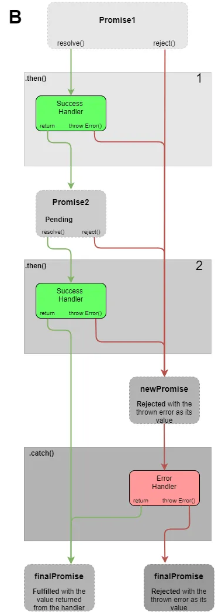
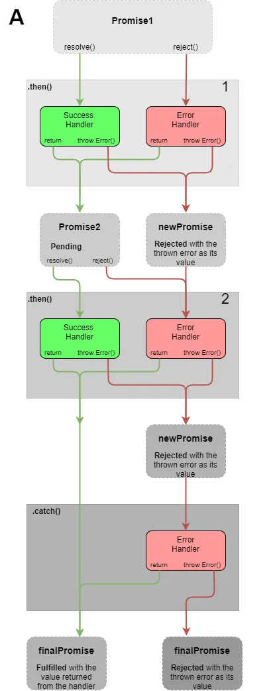
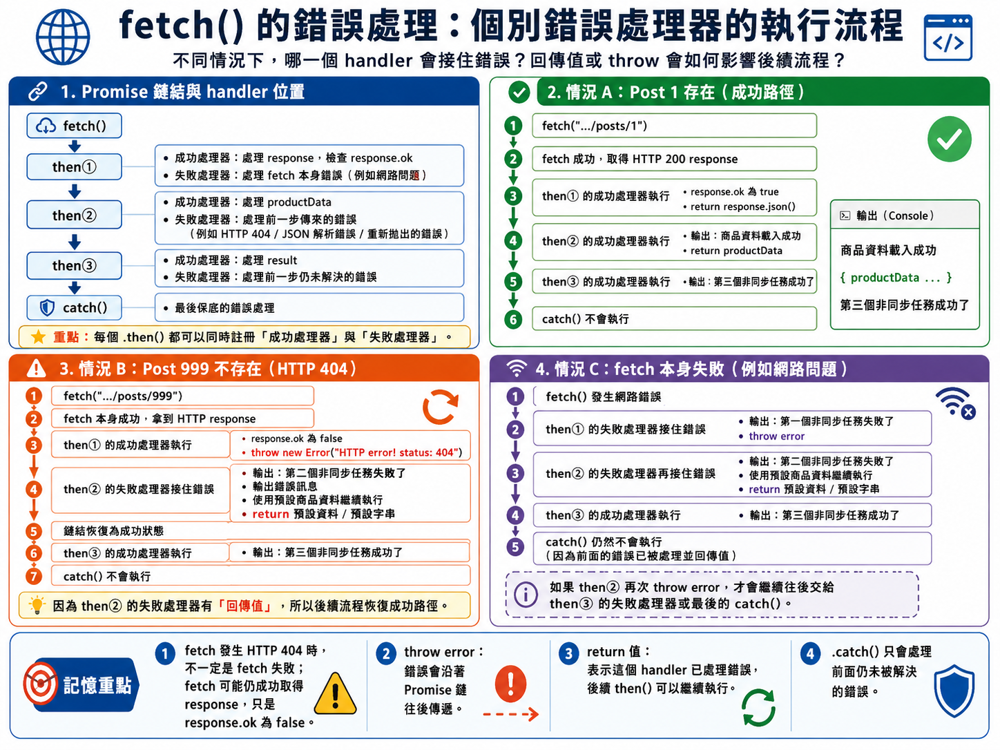

# Chapter A1 非同步程式設計 - Part 1 補充


## Promise 程式下的錯誤處理

### 錯誤處理的位置

使用 Promise 可以用來控制非同步任務的執行順序
撰寫出來的程序更接近「步驟流程」的結構，而不是巢狀結構。

在非同步程式中，發生錯誤時無法使用傳統的 try/catch 來捕捉錯誤
- 因為錯誤發生在非同步任務中，已經不在原本的執行上下文中，所以 try/catch 無法捕捉到。

Promise 提供了 `.catch()` 方法來註冊錯誤處理函式，當非同步任務發生錯誤時，會自動跳到最近的 `.catch()` 來執行錯誤處理。


這引發了一個重要的問題：**錯誤處理的位置**
當有多個非同步任務時，
- 我們應該在每個任務的 Promise 物件上註冊 `.catch()` 來處理錯誤？
- 還是只在最後一個任務的 Promise 物件上註冊 `.catch()` 來統一處理所有錯誤？

### 二種錯誤處理策略

JavaScript 的 鏈式呼叫（chaining）提供了兩種錯誤處理策略：

- 模式 A：個別處理 - 每個 Promise 物件註冊自己的錯誤處理器。
- 模式 B：集中處理 - 所有 Promise 物件只在最後一個註冊一個錯誤處理器，統一處理所有錯誤。

### 模式 B：集中處理

特點：
- 只要有一個 Promise 被拒絕，整個鏈式呼叫會直接跳到 `catch`。
- 整個鏈式呼叫中，只有最後一個 Promise 物件註冊錯誤處理器。

程式碼樣態如下：

```javascript
promiseObject
    .then(onFulfilled_callback1)
    .then(onFulfilled_callback2)
    ...
    .catch(onRejected_callback);
```

- 被拒絕的 Promise 會直接進入 `catch` 方法。
- `then` 方法中的錯誤處理器會被略過。



### 範例: fetch() 的錯誤處理 - 單一錯誤處理器


使用 `fetch` API 來取得商品資料，並在 `.catch()` 中處理可能發生的錯誤。

`fetch()` 的執行過程(多個依序執行的非同步任務)：
1. 使用 `fetch()` 向伺服器請求商品資料，回傳一個 Promise 物件 (非同步任務)
2. 將 response 物件轉換成 JSON 格式的資料(非同步任務) 
3. 再將轉換後的商品資料印出來

```javascript
fetch("https://jsonplaceholder.typicode.com/posts/1")
  .then(response => response.json())
  .then(productData => {
    console.log("商品資料載入成功");
    console.log(productData);
  })
  .catch(error => {
    console.log("商品資料載入失敗");
    console.log(error);
  });
```

只要有一個非同步任務失敗，整個鏈式呼叫就會直接跳到 `.catch()` 來處理錯誤。


### 模式 A：獨立處理

特點：
- 每個 Promise 物件註冊自己的錯誤處理器。
- 執行過程中，當某個 Promise 被拒絕時，會先執行該 Promise 物件上的 `catch` 方法來處理錯誤。
- 如果該 `catch` 方法成功處理了錯誤，整個鏈式呼叫會繼續往下執行下一個 `then` 方法。
- 如果該 `catch` 方法無法處理錯誤，或是再次拋出錯誤，整個鏈式呼叫會直接跳到下一個 `catch` 方法來處理錯誤。
- 最後一個 `catch` 方法可以作為整個鏈式呼叫的最後一道防線，來捕捉所有未被前面 `catch` 處理的錯誤。

程式碼樣態如下：

```javascript
promiseObject
    .then(onFulfilled_callback1, onRejected_callback1)
    .then(onFulfilled_callback2, onRejected_callback2)
    ...
    .catch(onRejected_callbackN);
```




### 範例: fetch() 的錯誤處理 - 個別錯誤處理器

可改寫前面的 `fetch` 範例，讓每個非同步任務都註冊自己的錯誤處理器：

```javascript
fetch("https://jsonplaceholder.typicode.com/posts/999")
    // 處理 HTTP 回應狀態碼
  .then(response => {  
        if (!response.ok) {
            // 如果 HTTP 狀態碼不是 200-299，則視為錯誤
            throw new Error(`HTTP error! status: ${response.status}`);
        } else {
            return response.json();
        }
    }, error => {
        // 處理 fetch 本身的錯誤，例如網路問題
        console.log("第一個非同步任務失敗了, 可能是網路問題");
        console.log(error);
        // 如果錯誤無法處理，可以再次拋出錯誤，讓下一個 catch 來處理
        // 此 error 會被包裝成一個被拒絕的 Promise 物件，直接跳到下一個 catch
        throw error;
    })
    // 取得 JSON 資料後的處理
    .then(productData => {
        console.log("商品資料載入成功");
        console.log(productData);
        return productData;
    }, error => {
        // 處理前一個 then 中的錯誤，例如 JSON 解析錯誤
        console.log("第二個非同步任務失敗了, 可能是 JSON 解析錯誤");
        console.log(error);
        // 如果錯誤無法處理，可以再次拋出錯誤，讓下一個 catch 來處理
        // throw error;
        // 如果錯誤已經處理完畢，不需要再拋出錯誤，可以直接 return 一個值，讓後續的 then 繼續執行
        console.log("使用預設的商品資料繼續執行");
        const defaultProductData = { id: 0, title: "Default Product", body: "This is default product data." };
        return `Default product data for error: ${defaultProductData}`;
    })
    .then(result => {
        console.log("第三個非同步任務成功了");
        console.log(result);
    }, error => {
        // 處理前一個 then 中的錯誤
        // 如前一個 then 中的錯誤已經被處理完畢，不會再進入這個 error handler
        console.log("第三個非同步任務失敗了");
        console.log(error);
    })
    .catch(error => {
        console.log("商品資料載入失敗");
        console.log(error);
  });
```

完整程式碼在 [examples/ex_A1_07.js](examples/ex_A1_07.js) 中可以直接執行，觀察輸出結果。

若 Post 999 不存在，fetch 的結果為 HTTP 404 錯誤，會被第二個錯誤處理器捕捉到，輸出：

```
第二個非同步任務失敗了, 可能是 JSON 解析錯誤'
Error { stack: 'Error: HTTP error! status: 404...}
'使用預設的商品資料繼續執行'
'第三個非同步任務成功了'
'Default product data for error: [object Object]'
則會觸發第一個錯誤處理器，輸出：
```

若 Post 1 存在，則會成功取得資料，輸出：

```
'商品資料載入成功'
{ userId: 1, id: 1, title: 'sunt aut facere ...', body: 'quia et suscipit ... (length: 158)' }
'第三個非同步任務成功了'
{ userId: 1, id: 1, title: 'sunt aut facere ...', body: 'quia et suscipit ... (length: 158)' }
```




### 錯誤處理策略的選擇

有兩個模式:
- 模式 A：個別處理 - 每個 Promise 物件註冊自己的錯誤處理器。
- 模式 B：集中處理 - 所有 Promise 物件只在最後一個註冊一個錯誤處理器，統一處理所有錯誤。

這兩個模式核心差異在於「容錯能力」與「錯誤隔離度」

- 「容錯能力」: 模式 A 的容錯能力較 B 高，因為每個非同步任務都有自己的錯誤處理器，可以針對不同的錯誤情況做不同的處理。
- 「錯誤隔離度」: 模式 A 的錯誤隔離度較 B 高，因為每個非同步任務的錯誤處理器只會處理該任務的錯誤，不會影響到其他任務的執行。

快速決策矩陣: 

|特性 / 需求 | 模式 A：個別處理模式  | B：集中處理
|---|---|---
| 非同步任務間關係 | 各自獨立，互不干涉 | 環環相扣，牽一髮動全身
| 當其中一個失敗時其他任務繼續執行 | 整個流程立刻中斷 | 
| 程式碼維護性 | 較為冗長，每個請求都要寫 catch |  乾淨俐落，邏輯集中在一個區塊