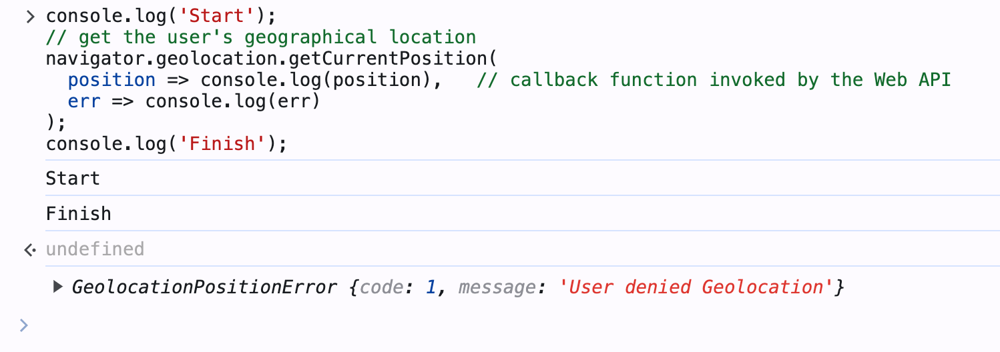
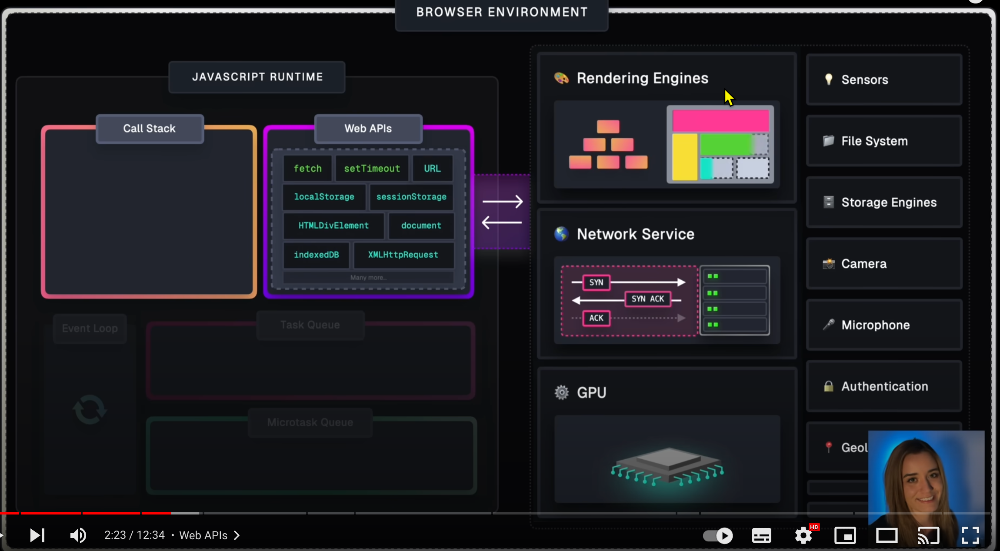
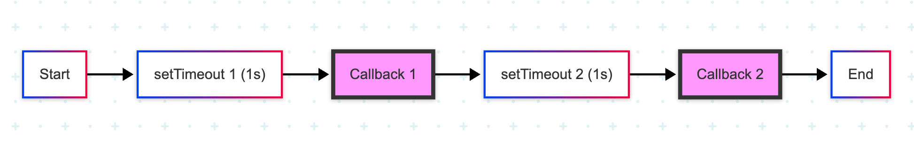
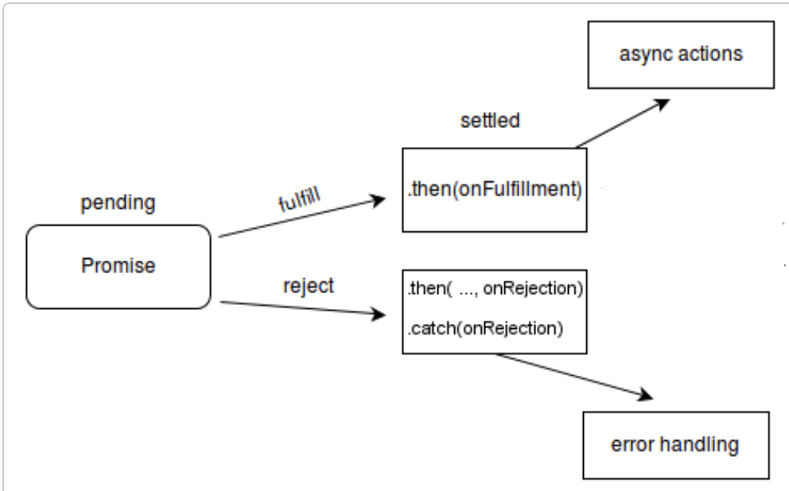
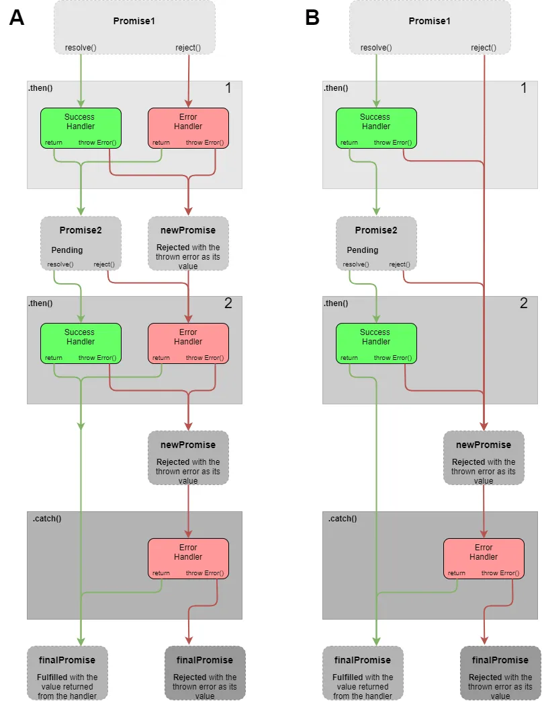

<style>
    .columns {
    display: flex;
  }
  .column {
    flex: 1;
    padding: 10px;
  }
  .column.large{
    flex: 2;
  }
  .small-font {
    font-size: 0.8em;
  }

  section > header,
section > footer {
  position: absolute;
  left: auto;
  right: 90px;
  height: 20px;
}

header {
  top: 30px;
}

footer {
  bottom: 30px;
}
</style>

# Chapter A1 併行程式設計(非同步程式設計) 

## 介紹併行

### 併行（Concurrency）

併行是指「同時」或「平行」發生多件事情。

JavaScript 是單執行緒（single-threaded）語言，一次只能執行一個任務。

透過在任務間快速切換，雖然本質上是單執行緒，卻能營造出併行的錯覺。
- 例如：要求瀏覽器取得使用者的地理位置，同時繼續在主執行緒中輸出訊息。
### 非同步程式設計（Asynchronous Programming）在 JavaScript

非同步程式設計是一種允許程式在不阻塞主執行緒的情況下執行任務的程式設計範式。
- 程式可以在等待非同步任務完成的同時，繼續執行其他任務。

- 非同步任務會由瀏覽器在背景執行。
- JS 引擎會繼續在主執行緒中執行下一個任務。
### Example A1-1: Getting the User's Geographical Location

以下為非同步程式設計的範例：取得使用者的地理位置。
```javascript
console.log('Start');
// 取得使用者的地理位置
navigator.geolocation.getCurrentPosition(
  position => console.log(position),   // 由 Web API 呼叫的 callback function
  err => console.log(err)
);
console.log('Finish');
```

---

當你在瀏覽器中執行上述程式碼時，會看到以下輸出：

```
Start
Finish
// 使用者的地理位置或錯誤訊息
```

當 `navigator.geolocation.getCurrentPosition` 在背景執行時，JS 引擎會繼續在主執行緒中執行下一個任務。



## JS 引擎與瀏覽器

從前述範例引出一個有趣的問題：
- 取得使用者地理位置的任務是由誰執行的？
- 是 JS 引擎還是瀏覽器？

### JS 引擎與瀏覽器是兩個不同的執行環境

瀏覽器內部包含多個引擎來處理不同的任務。
JavaScript 引擎透過 Web API 使用其他引擎所提供的服務。



<!-- 圖片來源: https://www.youtube.com/watch?v=eiC58R16hb8 -->

---

瀏覽器本身具備多執行緒的能力。

重要觀念：
- JS 引擎與瀏覽器是兩個不同的執行環境。

## 非同步程式設計（Asynchronous Programming）

在 JavaScript 中，併行是透過非同步程式設計來實現的。

撰寫非同步程式碼有三種方式：
- 回呼函式（Callbacks）
- 承諾物件（Promises）
- async/await 關鍵字

接下來將分別介紹這三種方式。

## 回呼函式（Callbacks）

回呼函式是作為參數傳遞給其他函式的函式。
- 它們會被其他函式在適當時機呼叫。

一個典型的回呼函式應用: `setTimeout` 函式。
- `setTimeout` 是瀏覽器提供的 Web API。

### 範例 A1-2：使用 `setTimeout` 延遲執行函式

當 `setTimeout` 在瀏覽器背景執行時，JS 引擎會繼續在主執行緒執行下一個任務：

```javascript
console.log('Hi there!'); 
function greeting(waitTimeSeconds) {
  console.log(`Sorry for the wait ${waitTimeSeconds} seconds.`)
}
setTimeout(greeting, 2000, 2); // 非同步呼叫；2 秒後執行 greeting 函式
console.log('Please wait'); 
```

上述程式碼的輸出為：
```
Hi there!
Please wait
Sorry for the wait 2 seconds.
```

### 回呼地獄（Callback Hell）

當你想用回呼函式依序執行多個非同步任務時，必須將回呼函式層層巢狀。
- 第一個回呼函式呼叫第二個回呼函式。
  - 第二個回呼函式再呼叫第三個回呼函式。
  - 依此類推...



巢狀的回呼函式會導致所謂的 **回呼地獄（callback hell）** 問題。
- 使程式碼**難以閱讀與維護**。

### 範例 A1-3：每秒輸出一次訊息，持續四秒

```javascript
// ex_13_03.js
setTimeout(() => { // 第一層回呼
  console.log('First timeout');
  setTimeout(() => { // 第二層回呼
    console.log('Second timeout');
    setTimeout(() => { // 第三層回呼
      console.log('Third timeout');
      setTimeout(() => { // 第四層回呼
        console.log('Fourth timeout');
        // 如有需要可繼續巢狀
      }, 1000);
    }, 1000);
  }, 1000);
}, 1000);
```

---

上述程式碼的輸出為：
```
First timeout
Second timeout
Third timeout
Fourth timeout
```

為了避免回呼地獄，可以使用 Promise 或 Async/Await（後續會介紹）。

## Lab A1-1

[Lab: Understanding Callback Hell in JavaScript](lab_01.md)

## Promises

### 為什麼需要 Promise？

Promise 提供比回呼函式（callback）更好的非同步處理方式，
- 可以避免「回呼地獄」（callback hell）問題，使程式碼更易讀、易維護。

### Promise 的運作方式

一個非同步函式在完成任務時會回傳一個 **Promise** 物件。
- （或說該非同步函式「解決」任務並回傳 Promise 物件作為結果）
- 這個 Promise 物件會被放到 JS 引擎中的 **Microtask Queue（微任務佇列）**。
- **JS 引擎** 會在適當時機執行與該 Promise 物件相關聯的回呼函式。

### 使用 Promise 物件

一個 Promise 物件有以下幾種可能狀態：
- 等待中（Pending）
- 已定案（Settled）
  - 已完成（Fulfilled）或已拒絕（Rejected）



---

- 等待中（Pending）：Promise 物件的初始狀態。
  - 表示非同步任務尚未完成。
- 已定案（Settled）：Promise 物件已經被完成或拒絕。
  - 已完成（Fulfilled）：Promise 物件被完成（resolved）。
    - 表示非同步任務已成功完成。
  - 已拒絕（Rejected）：Promise 物件被拒絕。
    - 表示非同步任務失敗。

<!-- 資料來源: [Promise - JavaScript | MDN](https://developer.mozilla.org/en-US/docs/Web/JavaScript/Reference/Global_Objects/Promise#constructor) -->

## 使用 Promise 撰寫非同步函式的範例模式

1. 建立一個回傳新 Promise 物件的函式。
2. 將執行器（executor）函式作為 `Promise` 建構子的參數傳入。
  - 當 JS 引擎建立新的 Promise 物件時，會呼叫這個執行器函式。

---

3. 執行器函式有兩個參數：`resolve` 和 `reject`。
  - `resolve` 是用來讓 promise 物件進入已完成（fulfilled）狀態的函式。
  - `reject` 是用來讓 promise 物件進入已拒絕（rejected）狀態的函式。

```js
function asyncOperation() {
   return new Promise((resolve, reject) => {
      // 執行非同步任務的程式碼

      // 呼叫 resolve(value) 讓 promise 物件進入 fulfilled 狀態
      // 呼叫 reject(reason) 讓 promise 物件進入 rejected 狀態
   });
}
```

---

4. 呼叫 `resolve(value)` 讓 promise 物件進入 fulfilled 狀態。
  - `value` 可以是另一個 promise 物件。
  - 呼叫後，promise 狀態會變成 fulfilled。
5. 呼叫 `reject(reason)` 讓 promise 物件進入 rejected 狀態。
  - `reason` 通常是一個錯誤物件。
  - 呼叫後，promise 狀態會變成 rejected。

### 範例：自訂一個 timeout 函式

你也可以用這個模式將非 promise 函式包裝成 promise 版本：

```javascript
function startTimeouts(msg) {
   return new Promise((resolve, reject) => {
      setTimeout(() => {
        console.log(msg);
        resolve();
      },  1000);
   });
}
```

## 如何處理回傳的 Promise：Promise 處理器

- 非同步函式會回傳一個 Promise 物件。
- 我們需要註冊（Promise）處理器來處理已定案（resolved 或 rejected）的 Promise。

### 註冊已完成與已拒絕的處理器

已完成（Fulfilled）處理器：
- 使用 Promise 物件的 [`then` 方法](https://developer.mozilla.org/en-US/docs/Web/JavaScript/Reference/Global_Objects/Promise/then) 來註冊已完成時的處理函式。

```javascript
promiseObject.then(onFulfilled_callback);
```

已拒絕（Rejected）處理器：
- 使用 Promise 物件的 [`catch` 方法](https://developer.mozilla.org/en-US/docs/Web/JavaScript/Reference/Global_Objects/Promise/catch) 來註冊已拒絕時的處理函式。

```javascript
promiseObject.catch(onRejected_callback);
```

### 範例 A1-4：註冊 callback 處理已完成的 Promise

```javascript
let fulfilledPromise = startTimeouts(2);
fulfilledPromise.then(() => startTimeouts('Second timeout'))
```

或合併成一行：

```js
startTimeouts(2).then(() => startTimeouts('Second timeout'))
```

注意：`startTimeouts` 函式需包在 lambda 函式中。

### 範例 A1-X-1：使用 Promise 物件改寫巢狀回呼

```javascript
startTimeouts(2)
  // 回傳一個 promise 物件
  .then(() => startTimeouts('First timeout')) 
  // 再回傳另一個 promise 物件
  .then(() => startTimeouts('Second timeout')) 
  .catch(error => console.error('發生錯誤:', error));
```

### Lab A1-2

[Lab: 使用 Promise 物件改寫 Lab A1-1 的程式碼](lab_13_02A.md)

## 使用瀏覽器的 API

### Fetch API

使用 [Fetch API](https://developer.mozilla.org/en-US/docs/Web/API/Fetch_API) 來取得本地或遠端資源。
- 例如：從一個 URL 取得資料。

- `request` 物件代表資源請求。
- `response` 物件代表對請求的回應。
- `headers` 物件代表請求或回應的 HTTP 標頭。

### `fetch()` 函式語法

`fetch()` 是由瀏覽器執行，不是 JS 引擎執行。

`fetch()` 函式的語法如下：

```javascript
fetch(url)
fetch(url, options)
```
- `url` 是要取得資源的網址。
- `options` 是可選的物件，包含請求選項（如 method、headers、body 等）。

回傳值：
  - `fetch()` 會回傳一個 Promise 物件，該物件 resolve 為 `response` 物件。

### 範例 A1-5：使用 `fetch()` Web API 從 URL 取得資料

<!-- ex_13_04.js -->

`fetch()` 會回傳一個 Promise 物件。

我們可以用 Promise 物件的 `then` 和 `catch` 方法註冊處理函式。

```javascript
fetch(url)
        // 從 resolved 的 promise 物件取得 response 物件
        .then(response => { 
            console.log("第一個 fetch() promise 的處理器")
            if (!response.ok) {
                throw new Error('Network response was not ok');
            }
            // response.text() 是非同步函式，回傳一個 promise
            // resolve 後取得 response body
            return response.text();
        })
```

---

接續上一個 `then` 方法：
```javascript
        // 從 promise 物件取得 response body
        .then(data => {
            console.log("第二個 response.text() promise 的處理器");
            // data 就是回應的內容
            console.log('取得的資料:', data);
        })
        // 捕捉 promise 物件的錯誤
        .catch(error => {
            console.error('取得資料時發生錯誤:', error);
        });
```
<!-- ---

第一個處理器檢查回應狀態。

第二個處理器讀取回應主體內容。

第三個處理器在 promise 被拒絕時，將錯誤訊息輸出到主控台。 -->


---

請用網址 `https://jsonplaceholder.typicode.com/posts/1` 測試你的程式。

上述程式會將該網址的回應內容輸出到主控台。

```
Fetching data from https://jsonplaceholder.typicode.com/posts/1
Please wait for the data to be fetched...
第一個 fetch() promise 的處理器
第二個 response.json() promise 的處理器
取得的資料: {
  userId: 1,
  id: 1,
  title: 'sunt aut facere repellat provident occaecati excepturi optio reprehenderit',
  body: 'quia et suscipit\n' +
    'suscipit recusandae consequuntur expedita et cum\n' +
    'reprehenderit molestiae ut ut quas totam\n' +
    'nostrum rerum est autem sunt rem eveniet architecto'
}
```

## Lab A1-3: 

[Fetch data from a URL and show the first N characters of the response body](lab_13_03.md)


## Promise 鏈式呼叫（Chain Promises）

Promise 物件是**可鏈式（thenable）**的物件
- 每個 Promise 物件都有 `then` 方法，且 `then` 方法會回傳新的 Promise 物件。
- 因此可以將多個 `then` 方法串接（chaining），形成非同步任務的流程控制。
  - 可以將每個 `then` 看作是對前一個 Promise 結果的處理。

### Promise 鏈式呼叫的兩種常見模式

- 模式 A：每個 Promise 物件分開處理錯誤。
- 模式 B：所有 Promise 物件共用一個錯誤處理器。

### 模式 A：每個 Promise 物件分開處理錯誤

特點：
- 即使某個 Promise 物件被拒絕（rejected），仍會依序執行所有 `then` 方法。

```javascript
promiseObject
    .then(onFulfilled_callback1, onRejected_callback1)
    .then(onFulfilled_callback2, onRejected_callback2)
    ...
    .catch(onRejected_callbackN);
```

---



---

- 被拒絕的 Promise 會由 `then` 方法中的 `onRejected_callback` 處理。
  - 若要繼續鏈式呼叫，必須回傳一個已解決（resolved）的 Promise。
- `catch` 方法會處理所有未被 `then` 處理的 rejected Promise，是最後一道防線。

### 範例 A1-X-2：每個 Promise 物件分開處理錯誤

假設有三個非同步函式：`firstTask`、`secondTask`、`thirdTask`。
其中 `secondTask` 會回傳 rejected 的 Promise。
我們希望依序執行三個任務，並分別處理錯誤。

---

```js
firstTask()
    .then(result => secondTask(result), 
        () => {
            console.log('Error in second task');
        })  // 匿名函式需回傳一個 promise
    .then(result => thirdTask(result), error => {
        console.log('Error:', error);
        // 回傳 resolved promise 以繼續鏈式呼叫
        return Promise.resolve(error + 1);
    })
    .then(result => {
        console.log('All tasks completed, final result:', result);
    }, error =>{
        console.log('Error in third task', error);
    })
    .catch(error => {
        console.error('Final catch:', error);
    });
```

---

上述程式碼的輸出為：
```
'First task: resolved.'
'Second task: rejected'
[ 'Error in second task:', 2 ]
[ 'The last then, final result:', 3 ]
```

參考範例：[promise_chain_pattern_A.js](promise_chain_pattern_A.js)


### 模式 B：所有 Promise 物件共用一個錯誤處理器

特點：只要有一個 Promise 被拒絕，整個鏈式呼叫會直接跳到 `catch`。

```javascript
promiseObject
    .then(onFulfilled_callback1)
    .then(onFulfilled_callback2)
    ...
    .catch(onRejected_callback);
```

- 被拒絕的 Promise 會直接進入 `catch` 方法。
- `then` 方法中的錯誤處理器會被略過。

---


<!-- 圖片來源: [JavaScript Promise Chaining — Basics](https://levelup.gitconnected.com/javascript-promise-chaining-basics-e2618c5e74a9) -->


### 範例 A1-X-3：所有 Promise 物件共用一個錯誤處理器

假設有三個非同步函式：`firstTask`、`secondTask`、`thirdTask`。
其中 `secondTask` 會回傳 rejected 的 Promise。

```js
firstTask()
    .then(result => secondTask(result))
    .then(result => thirdTask(result))
    .then(result => {
        console.log('The last then. final result:', result);
    })
    .catch( error => {
        console.error('Final catch:', error);
    });
```

上述程式碼的輸出為：
```
'First task: resolved.'
'Second task: rejected'
[ 'Final catch:', 2 ]
```

參考範例：[promise_chain_pattern_B.js](promise_chain_pattern_B.js)


## 摘要

- JavaScript 是單執行緒語言，但透過非同步程式設計實現併行。
- 非同步程式設計允許任務在不阻塞主執行緒的情況下執行。
- 回呼函式（Callback）是處理非同步任務的基本方式，但容易產生「回呼地獄」問題。
- Promise 提供更簡潔、易於管理的非同步處理方式，可避免回呼地獄。
- Promise 物件有三種狀態：等待中（pending）、已完成（fulfilled）、已拒絕（rejected）。

---

- 使用 `then` 和 `catch` 方法分別處理已完成與已拒絕的 Promise。
- Promise 可鏈式呼叫，方便控制非同步任務的執行順序，並有不同的錯誤處理模式。
- Fetch API 是現代與遠端資源互動的方式，並回傳 Promise 物件。
- 理解 JS 引擎與瀏覽器環境的差異，有助於正確撰寫非同步程式碼。
- 善用 Promise 及鏈式呼叫能提升非同步 JavaScript 程式碼的可讀性與維護性。

# References 

1. [Promise() constructor - JavaScript | MDN](https://developer.mozilla.org/en-US/docs/Web/JavaScript/Reference/Global_Objects/Promise/Promise)

2. [async function - JavaScript | MDN](https://developer.mozilla.org/en-US/docs/Web/JavaScript/Reference/Statements/async_function)

<script>
    // add the following script at the end of your marp slide file.
    const h2s = document.querySelectorAll('h2');
    h2s.forEach(function(h2, idx){
        h2.innerHTML = `<span class="small-font">${idx + 1}</span> ${h2.innerHTML}`
    })
</script>

<!-- Add this anywhere in your Markdown file -->
<script type="module">
  import mermaid from 'https://cdnjs.cloudflare.com/ajax/libs/mermaid/10.4.0/mermaid.min.js';
  mermaid.initialize({ startOnLoad: true });
</script>