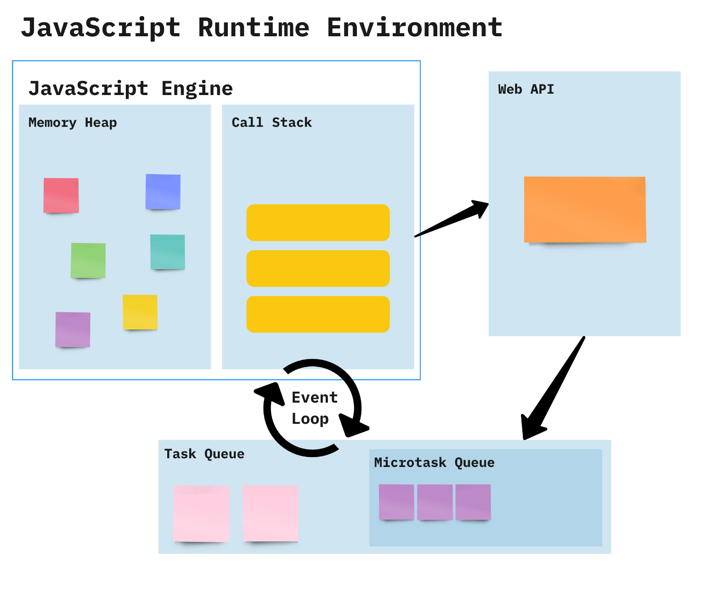
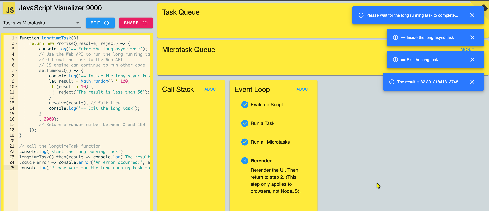

<style>
    .columns {
    display: flex;
  }
  .column {
    flex: 1;
    padding: 10px;
  }
  .column.large{
    flex: 2;
  }
  .small-font {
    font-size: 0.8em;
  }

  section > header,
section > footer {
  position: absolute;
  left: auto;
  right: 90px;
  height: 20px;
}

header {
  top: 30px;
}

footer {
  bottom: 30px;
}
</style>

# Chapter A1 Concurrency Part 2

## 大綱

- 將非非同步函式轉換為非同步函式
- async 與 await 關鍵字
- JS 執行環境中的 Event Loop 並行模型


## 使用 Promise 物件將同步函式轉換為非同步函式

使用 `Promise` 物件來包裝你的非非同步函式。

建立 Promise 物件的步驟：
1. 透過呼叫 `Promise` 建構子建立一個新的 Promise 物件。
2. 傳遞一個執行器（executor）函式作為建構子的參數，可以是箭頭函式或具名函式。
3. 將你的同步函式放入執行器函式中。

```javascript
function executor(resolve, reject) {
  // 執行你的非非同步程式碼
  // 呼叫 resolve(value) 來讓 promise 物件變為 fulfilled 狀態
  // 或呼叫 reject(error) 來產生 rejected 狀態的 promise
}
```

---

重要事項：
- 執行器函式仍然在 JS 引擎的主執行緒上執行，並非真正的非同步程式碼。
- 只有計時器（timer-based）、I/O 任務，以及 Web API 任務才會在瀏覽器中以多執行緒的方式執行。
- `resolve` 和 `reject` 函式屬於微任務（micro-task），會被放入 Micro-task Queue。

   
### 範例 A1-6：將同步函式包裝成回傳 Promise 物件的非同步任務

假設我們有一個需要花費較長時間才能完成的函式：

```javascript
/**
 * 長時間運算的任務。
 * @returns 
 */
function longtimeTask() {
  console.log('== Enter the long task');
  let i = 0;
  while (i < 10000) {
    i++;
  }
  console.log('== Exit the long task');
  // 回傳 0~100 之間的隨機數
  return Math.random() * 100;
}
```

--- 

以非同步方式執行 `longtimeTask` 函式：
- 將同步函式放入 Promise 物件的執行器函式中執行。

```js
console.log('Start the long running task');

// 使用 Promise 物件執行長時間任務
// 當 promise 被建立時，長時間任務就會開始執行
const longtimeTaskPromise = new Promise((resolve, reject) => {
    const result = longtimeTask();
    if (result < 50) {
        reject('The result is less than 50');
    }
    // 任務完成
    // 將結果放入 Micro-task Queue
    resolve(result); 
});
```

---

- 傳遞給 `then` 方法的函式會在 Promise 物件被 resolve 時執行。

```js
// 取得長時間任務的結果
longtimeTaskPromise
    .then(result => console.log('The result is', result))
    .catch(error => console.error('An error occurred:', error));

console.log('Please wait for the long running task to complete...');
```

---

上述程式碼的輸出為：

```
Start the long running task (主執行緒)
== Enter the long task (執行器函式)
== Exit the long task (執行器函式)
Please wait for the long running task to complete... (主執行緒)
The result is 61.054982580283635 (then callback function)
```

<!-- readFile() using the Promise object (assignment) -->

你可能會對以下關於 Promise 的文章有興趣：
[JavaScript Visualized: Promises & Async/Await](https://medium.com/@lydiahallie/javascript-visualized-promises-async-await-a3f1aad8a943)

## 將同步函式包裝在 async 函式中

你也可以將同步函式包裝在一個回傳 Promise 物件的 async 函式中。

```javascript
function myAsyncFunction() {
  return new Promise((resolve, reject) => {
    // 執行非同步任務的程式碼
    // 呼叫 resolve(value) 來讓 promise 物件變為 fulfilled 狀態
    // 呼叫 reject(reason) 來讓 promise 物件變為 rejected 狀態
  });
}
```

### 範例 A1-7：重寫 `longtimeTask` 函式，將其包裝在 async 函式中

這個範例將 Example A1-6 的 `longtimeTask` 函式重寫，使其回傳 Promise 物件。

```javascript
function async_longtimeTask(){
  return new Promise((resolve, reject) => {
    const result = longtimeTask();
    if (result < 50) {
      reject('The result is less than 50');
    } else {
      resolve(result); // fulfilled 
    }
  });
}
```
---

以非同步方式呼叫 `longtimeTask` 函式：

```javascript
// 呼叫 longtimeTask 函式
console.log('Start the long running task');

async_longtimeTask()
  .then(result => console.log('The result is', result))
  .catch(error => console.error('An error occurred:', error));

console.log('Please wait for the long running task to complete...');    
```

---
上述程式碼的可能輸出為：

```
'Start the long running task'
'== Enter the long task'
'== Exit the long task'
'Please wait for the long running task to complete...'
The result is 15.919520883194348
```

### **常見誤解**：

將 `longtimeTask` 同步函式包裝在 async 函式中，是否就能讓它變成非同步執行？

答案：**不能**。

原因：
- 雖然回傳了 Promise 物件，但 `longtimeTask` 函式本身並沒有非同步執行。
- **它仍然在 JS 引擎中執行，而不是在 Web API。**
- 因為 JS 引擎是單執行緒，這個迴圈會阻塞其他任務的執行，直到函式結束。

---

- 若要真正讓任務非同步執行，必須**將任務交給 Web API（或瀏覽器）**。
- 可以將 `while` 迴圈改為使用 `setTimeout`（Web API）來達到非同步執行效果。
- 參考 [ex_13_07_1.js](./ex_13_07_1.js) 了解如何將任務交給 Web API 執行。

## Async 與 Await

使用 Promise 物件時，如果有多個非同步任務需要依序執行，仍可能造成冗長的 Promise 鏈。

使用 **async/await** 語法可以避免冗長的 Promise 鏈，讓非同步程式碼看起來像同步程式碼。

async/await 是 Promise 物件的語法糖。

### async 與 await 關鍵字的使用規則

- 使用 `async` 關鍵字將函式定義為 async 函式。
  - async 函式可以是具名函式、箭頭函式、物件方法或類別方法。
- async 函式**總是**隱式回傳一個 Promise 物件。
  - JS 會自動將回傳值包裝成 Promise 物件。
- 使用 `await` 關鍵字等待 async 函式回傳的 Promise 物件被 resolve。
- 注意：`await` 關鍵字只能在 async 函式**內部**使用。

### 定義 async 函式的範例

使用 `async` 關鍵字定義 async 函式：

```javascript
async function myAsyncFunction() {
    // 執行非同步任務的程式碼
    // 回傳值會自動包裝成 Promise 物件
    // async 函式中丟出的錯誤會自動包裝成 rejected 狀態的 Promise 物件
}
```

注意事項：
- 回傳值自動包裝成 Promise 物件。
- async 函式中丟出的錯誤自動包裝成 rejected 狀態的 Promise 物件。
- 不需要在 async 函式中明確呼叫 `resolve` 或 `reject`。

### 呼叫 async 函式並等待結果的範例

在 async 函式內使用 `await` 關鍵字等待 Promise 物件 resolve：

```javascript
async function caller() {
    // 呼叫 async 函式
    const result = await myAsyncFunction();
    // 使用 Promise 物件的結果
}
```

### 關於 async/await 的趣味圖

每個人都變成 Tinky Winky（紫色天線寶寶），當最後一個人碰到他（async 函式）時。
- await 必須用在 async 函式內。


<!-- src: https://miro.medium.com/v2/resize:fit:1400/format:webp/0*-sXUj7txIyw9LX_F -->

### 範例 A1-8：用 async/await 語法重寫範例 A1-6

```javascript
// 呼叫 longtimeTask 函式
console.log('Start the long running task');
// 使用 IIFE 立即呼叫 async 函式
(async () => {
    let result = await longtimeTask();
    console.log('The result is: ', result);
})()
console.log('Please wait for the long running task to complete...');  
```

---

上述程式碼的輸出為：

```
Start the long running task
== Enter the long task
== Exit the long task
Please wait for the long running task to complete...
The result is:  15.919520883194348
```

### 範例 A1-9：下列程式碼有什麼錯誤？

```javascript
// 呼叫 longtimeTask 函式
console.log('Start the long running task');

let result = await longtimeTask();
console.log('The result is', result);
console.log('Please wait for the long running task to complete...');    
```

---

上述程式碼會拋出語法錯誤，因為 `await` 只能用在 async 函式內。

```
SyntaxError: await is only valid in async functions and the top level bodies of modules
```

修正方式：
- 定義具名 async 函式包住程式碼並呼叫，或
- 使用 IIFE 包住程式碼，或
- 使用 Promise 物件的 `then` 方法。

### 範例 A1-10：用具名 async 函式修正範例 A1-9 的程式碼

```javascript
console.log('Start the long running task');
// 定義具名 async 函式
async function runLongTimeTask(){
    try{
        let result = await longtimeTask();
        console.log('The result is', result);
    } catch(error){
        console.error('An error occurred:', error);
    }
}
// 呼叫 longtimeTask 函式
runLongTimeTask();
runLongTimeTask();
runLongTimeTask();
runLongTimeTask();
console.log('Please wait for the long running task to complete...');    
```
---

輸出：
```
'Start the long running task'
'== Enter the long task'
'== Exit the long task'
'== Enter the long task'
'== Exit the long task'
'== Enter the long task'
'== Exit the long task'
'== Enter the long task'
'== Exit the long task'
'Please wait for the long running task to complete...'
[ 'The result is', 54.37531724398479 ]
[ 'The result is', 22.829382717193592 ]
[ 'The result is', 67.3674835459125 ]
[ 'The result is', 74.8877783165409 ]
```

## 在 async 函式中處理錯誤

你可以使用 `try...catch` 區塊來處理 async 函式中的錯誤。
- 當帶有 `await` 關鍵字的語句所等待的 promise 被拒絕（rejected）時，會拋出錯誤。

常見寫法：

```js
async function async_fun1() {
  try {
    // 可能會拋出錯誤的 async 函式
    const result = await async_fun2();
    ...
  } catch (error) {
    // 捕捉並處理錯誤
    console.error('發生錯誤:', error);
  }
}
```

### 範例 A1-12：使用 try...catch 區塊處理 async 函式中的錯誤

```javascript
async function myAsyncFunction() {
  try {
    // 執行非同步任務的程式碼
    const result = await longtimeTask();
    console.log('The result is', result);
  } catch (error) {
    console.error('發生錯誤:', error);
  }
}
```

## 使用 async 函式搭配 Promise 的 `then` 方法

你可以將 async 函式與 Promise 物件的 `then` 方法一起使用，
- 因為 async 函式**總是**回傳一個 Promise 物件。

### async 函式的回傳值

async 函式總是回傳一個 Promise 物件。

如果 async 函式的回傳值不是明確的 promise，JS 會自動將其包裝成 promise。

例如，以下程式碼：

```javascript   
async function myAsyncFunction() {
  return 'Hello World';
}
```

等同於：

```javascript
function myAsyncFunction() {
  return Promise.resolve('Hello World');
}
```

### 使用 `then` 方法搭配 async 函式

你可以直接用 Promise 物件的 `then` 方法來處理 async 函式的結果，
- 如果你不想使用 `await` 關鍵字，
  - 或不想再建立另一個 async 函式來呼叫 async 函式。
- 請記得 async 函式總是回傳 Promise 物件。

```javascript
myAsyncFunction().then(value => console.log(value));
```

完整程式碼請參考 [ex_13_async_then.js](ex_13_async_then.js)。

## EVENT LOOP concurrency model in JS runtime environment

-  JavaScript is a single-threaded language
  -  JS 一次只能執行一個任務
  - 這裡的「執行緒」指的是一條執行路徑

  - 為了處理非同步任務，JS 採用 **EVENT LOOP** 並行模型。

  ### Event Loop 並行模型

  

  ### JS 引擎與 Web API 的互動
  瀏覽器是多執行緒環境。
  - Web API 是瀏覽器提供的一組 API
  - 由 Web API 啟動的任務會在背景執行（不在 JS 引擎內）。

  JS 引擎是單執行緒環境。
  - JS 引擎一次只能執行一個任務。
  - JS 引擎透過 **Event Loop** 與 Web API 互動。

  ### JS 執行環境的結構

  JS 執行環境包含以下元件：
  -  Call Stack（呼叫堆疊）：LIFO，存放 JS 引擎要執行的程式碼

  有兩個佇列用來存放待執行的非同步任務：
  -  Micro-task Queue（微任務佇列）：存放 **promise-based function**（promise handler）
    -  Micro-task 優先於 Macro-task 執行
    -  代表「需要立即完成但屬於非同步」的任務
  -  Macro-task Queue（巨任務佇列，也稱 Callback/Task Queue）：存放 **由 Web API 觸發的 callback function**
    -  這些任務是交給 Web API 執行的

### Event Loop 的運作方式

  -  Event Loop：持續檢查 Call Stack 和 Callback Queue 的一個循環

  1. 先執行 Call Stack 中的任務
    -  JS 引擎會先執行 Call Stack 裡的任務

  2. 接著將 Micro-task Queue 的任務移到 Call Stack
    - 只有當 Call Stack 為空時，Event Loop 才會將 Micro-task Queue 的任務移到 Call Stack
    - **所有** Micro-task Queue 的任務都會在 Call Stack 為空時一次移入
    - Micro-task 優先於 Macro-task
    - Micro-task Queue 存放 promise handler

  ---

  3. 再將 Macro-task Queue 的任務移到 Call Stack
    - 如果 Micro-task Queue 沒有任務，Event Loop 才會將 Macro-task Queue 的任務移到 Call Stack
    - 每次 Event Loop tick 只移動 **一個** Macro-task
    - Macro-task Queue 存放計時器任務（setTimeout、setInterval）、I/O 任務（如 fetch、XMLHttpRequest）及交給 Web API 執行的任務

  <!-- 圖片來源: [JavaScript Runtime Environment: Web API, Task Queue and Event Loop](https://slawinski.dev/blog/javascript-runtime-environment-web-api-task-queue-and-event-loop/) -->

  ### 範例 A1-11：用 JavaScript Visualizer 9000 視覺化 Example A1-7 的執行過程

  [JS Visualizer 9000 - 互動式 JavaScript 執行模型視覺化工具](https://www.jsv9000.app/)

  

  注意：JS Visualizer 9000 不支援 async/await 語法。

## 影片與互動工具：幫助你理解 JS 執行模型

  [Lydia Hallie, 2024. JavaScript Visualized - Event Loop, Web APIs, (Micro)task Queue](https://www.youtube.com/watch?v=eiC58R16hb8)

[JS Visualizer 9000 - An interactive JavaScript runtime model visualizer.](https://www.jsv9000.app/)
### 範例：分析 async 程式碼

下列程式碼的輸出為何？

```js
console.log('1');

Promise.resolve().then(() => {
  console.log('2');
  Promise.resolve().then(() => {
    console.log('3');
  });
});

Promise.resolve().then(() => {
  console.log('4');
});

console.log('5');
```

---

<details>
<summary>答案</summary>

1. 第一個 `console.log('1')` 先執行，輸出 `1`。
2. 第一個 `Promise.resolve()` 執行，第一個 `then` 回呼加入 Micro-task Queue。
3. 第二個 `Promise.resolve()` 執行，第二個 `then` 回呼加入 Micro-task Queue。
4. 第二個 `console.log('5')` 執行，輸出 `5`。

5. Call Stack 清空後，開始依序執行 Micro-task Queue 的任務。
6. 第一個 `then` 回呼執行，輸出 `2`。
7. 第三個 `Promise.resolve()` 執行，第三個 `then` 回呼加入 Micro-task Queue。


8. 第二個 `then` 回呼執行，輸出 `4`。
9. Micro-task Queue 尚未清空，第三個 `then` 回呼移入 Call Stack。
10. 第三個 `then` 回呼執行，輸出 `3`。
11. Micro-task Queue 與 Call Stack 均清空，Event Loop 結束。
12. 最終輸出為：`1 5 2 4 3`。

</details>

## 總結

- JavaScript 是單執行緒語言，但透過 Event Loop 處理並行。
- 非非同步函式可用 Promise 包裝成非同步，但仍在主執行緒執行，除非交給 Web API。
- `async`/`await` 是 Promise 的語法糖，讓非同步程式碼更易讀。
- async 函式總是回傳 Promise，`await` 只能用在 async 函式內。
- Event Loop 決定同步程式、micro-task（Promise handler）、macro-task（Web API callback）的執行順序。

---

- Micro-task 優先於 macro-task，Call Stack 清空時會先執行所有 micro-task。
- 理解 Call Stack、Micro-task Queue、Macro-task Queue 與 Web API 的互動，有助於寫出高效的非同步 JavaScript 程式。

<script src="../h2_numbering.js"></script>

