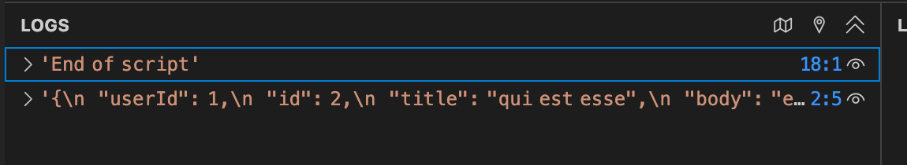

# 實驗：從 URL 擷取資料並顯示回應主體的前 N 個字元

## 指示
1. 撰寫一個函式 `displayData`，將給定字串的前 N 個字元輸出到主控台。
2. 使用 `fetch()` 從網址 "https://jsonplaceholder.typicode.com/posts/2" 取得資料。
    - 註冊 `displayData` 函式作為成功狀態的處理器。
    - 註冊一個箭頭函式，當發生錯誤時將錯誤訊息輸出到主控台，作為失敗狀態的處理器。

步驟 1：撰寫函式 `displayData`，將給定字串的前 N 個字元輸出到主控台。

```javascript
function displayData(data, n) {
     console.log(data.slice(0, n));
}
```

步驟 2：使用 `fetch()` 從網址 "https://jsonplaceholder.typicode.com/posts/2" 取得資料。

```javascript
fetch("https://jsonplaceholder.typicode.com/posts/2")
     .then(response => {
          // 處理回應
     })
     .catch(error => {
          console.log(error.message);
     });
```

步驟 3：在 resolve 處理器中加入 `displayData` 函式。

```javascript
fetch("https://jsonplaceholder.typicode.com/posts/2")
     .then(response => {
          // 取得回應主體為文字
          // 回傳一個 promise，解析後得到回應主體
          return response.text();
     })
     .then(data => {
          displayData(data, 100);
     })
     .catch(error => {
          console.log(error.message);
     });
```

步驟 4：執行程式碼，在主控台查看輸出結果。


