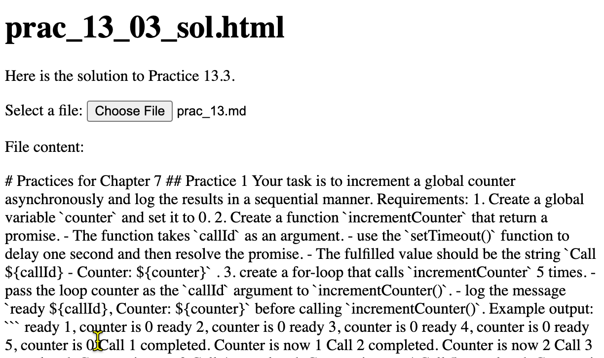

# A1 章練習題

## 練習 1

你的任務是要非同步地增加一個全域計數器，並依序記錄結果。

需求：
1. 建立一個全域變數 `counter` 並設為 0。
2. 建立一個函式 `increaseCounter`，回傳一個 promise。
  - 此函式接受 `callId` 作為參數。
  - 使用 `setTimeout()` 函式延遲一秒後 resolve 該 promise。
  - fulfilled 的值應為字串 `Call ${callId} - Counter: ${counter}`。
3. 用 for 迴圈呼叫 `increaseCounter` 5 次。
  - 傳遞迴圈計數器作為 `callId` 參數給 `increaseCounter()`。
  - 在呼叫 `increaseCounter()` 前，記錄訊息 `ready ${callId}, Counter: ${counter}`。

範例輸出：
```
ready 1, counter is 0
ready 2, counter is 0
ready 3, counter is 0
ready 4, counter is 0
ready 5, counter is 0
Call 1 completed. Counter is now 1
Call 2 completed. Counter is now 2
Call 3 completed. Counter is now 3
Call 4 completed. Counter is now 4
Call 5 completed. Counter is now 5
```

## 練習 2

建立一個 for 迴圈，從網址 `"https://jsonplaceholder.typicode.com/posts/{id}"` 取得資料，其中 `{id}` 是從 1 到 5 的迴圈計數器。

將回應主體讀取為 JSON 值。
在控制台輸出取得的 JSON 值。
你必須使用 **async/await** 語法來取得資料。

範例輸出：

```
Fetching data from https://jsonplaceholder.typicode.com/posts/1
Fetching data from https://jsonplaceholder.typicode.com/posts/2
Fetching data from https://jsonplaceholder.typicode.com/posts/3
Fetching data from https://jsonplaceholder.typicode.com/posts/4
Fetching data from https://jsonplaceholder.typicode.com/posts/5

{
  userId: 1,
  id: 1,
  title: 'sunt aut facere repellat provident occaecati excepturi optio reprehenderit',
  body: 'quia et suscipit\n' +
   'suscipit recusandae consequuntur expedita et cum\n' +
   'reprehenderit molestiae ut ut quas totam\n' +
   'nostrum rerum est autem sunt rem eveniet architecto'
}
{
  userId: 1,
  id: 2,
  title: 'qui est esse',
  body: 'est rerum tempore vitae\n' +
   'sequi sint nihil reprehenderit dolor beatae ea dolores neque\n' +
   'fugiat blanditiis voluptate porro vel nihil molestiae ut reiciendis\n' +
   'qui aperiam non debitis possimus qui neque nisi nulla'
}
{
  userId: 1,
  id: 3,
  title: 'ea molestias quasi exercitationem repellat qui ipsa sit aut',
  body: 'et iusto sed quo iure\n' +
   'voluptatem occaecati omnis eligendi aut ad\n' +
   'voluptatem doloribus vel accusantium quis pariatur\n' +
   'molestiae porro eius odio et labore et velit aut'
}
{
  userId: 1,
  id: 5,
  title: 'nesciunt quas odio',
  body: 'repudiandae veniam quaerat sunt sed\n' +
   'alias aut fugiat sit autem sed est\n' +
   'voluptatem omnis possimus esse voluptatibus quis\n' +
   'est aut tenetur dolor neque'
}
{
  userId: 1,
  id: 4,
  title: 'eum et est occaecati',
  body: 'ullam et saepe reiciendis voluptatem adipisci\n' +
   'sit amet autem assumenda provident rerum culpa\n' +
   'quis hic commodi nesciunt rem tenetur doloremque ipsam iure\n' +
   'quis sunt voluptatem rerum illo velit'
}
```

## 練習 3

你的任務是選擇一個本地檔案，讀取檔案內容，並將內容顯示在 HTML 頁面上。

### 背景知識

HTML5 的檔案輸入元素允許使用者從裝置選擇檔案。

該元素的 `files` 屬性包含使用者所選的 `File` 物件清單。

可用 `name` 屬性取得 `File` 物件的檔名。

有了檔名後，你可以使用 [`FileReader` 物件](https://developer.mozilla.org/zh-TW/docs/Web/API/FileReader) 來讀取檔案內容。

使用 `FileReader` 物件的 `readAsText()` 方法可將檔案內容讀取為文字。
此方法為非同步操作。你必須監聽 [`load` 與 `error` 事件](https://developer.mozilla.org/zh-TW/docs/Web/API/FileReader#events) 來處理非同步操作。

當 `readAsText()` 方法完成檔案讀取時，會觸發 `load` 事件。檔案內容可從 `FileReader` 物件的 `result` 屬性取得。如果讀取過程發生錯誤，則會觸發 `error` 事件。


### 需求

1. 建立一個 HTML 檔案輸入元素並給予特定 id。
2. 建立一個具有特定 id 的 `p` 元素來顯示檔案內容。
3. 建立一個函式 `readFileAsync(file)`，接受一個 `File` 物件作為參數並回傳一個 Promise 物件，該 Promise 會 resolve 檔案內容。
  - 在函式中，建立一個 FileReader 物件來讀取檔案內容。
  - 註冊 `load` 事件監聽器於 FileReader 物件上。當事件觸發時，以檔案內容（`fileReader.result`） resolve 該 promise。
  - 註冊 `error` 事件監聽器於 FileReader 物件上。當事件觸發時，以錯誤訊息 reject 該 promise。
4. 在檔案輸入元素上註冊 `change` 事件監聽器。事件監聽器應呼叫 `readFileAsync` 函式並將所選檔案內容顯示於 `div` 元素中。



